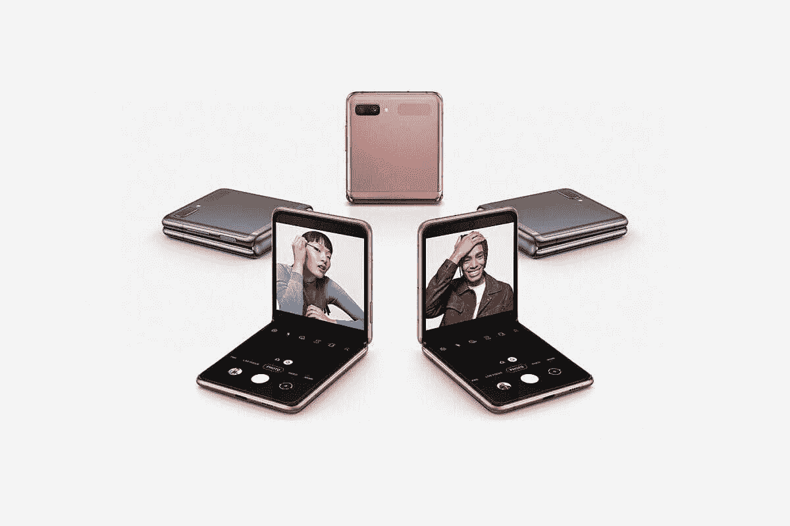

# 三星 Galaxy Z Flip 3:定价、发布日期和可用性

> 原文：<https://www.xda-developers.com/samsung-galaxy-z-flip-3-pricing-release-date-availability/>

三星发布了最新的可折叠手机，Galaxy Z Fold 3 和 T2 Galaxy Z Flip 3，所以如果你正在寻找一款拥有尖端技术的高端智能手机，你不能错过这两个选项。有了 Galaxy Z Fold 3，你可以得到一个可以折叠成手机的平板电脑，而有了 Galaxy Z Flip 3，你可以得到一个翻盖外形，折叠时的高度是普通智能手机的一半。如果你正在寻找更实惠的 Galaxy Z Flip 3 来体验可折叠技术，这里是它可以购买的时间和地点。

\ r \ nht TPS://www . YouTube . com/watch？v=17idEjfuI9M\r\n

## 定价

先把价格说清楚。Galaxy Z Flip 3 的基本 128GB 版本零售价为 999 美元。这大大低于最初的 Galaxy Z Flip 和 Galaxy Z Flip 5G，使其成为你可以买到的最实惠的可折叠手机之一。希望有了这个价格标签，更多的人会倾向于购买可折叠手机。虽然它无论如何都不便宜，但它牢牢占据了其他旗舰手机的领地。

查看下表，了解美国、英国、欧洲和印度的完整定价详情。

| 

没有。

 | 

不同的

 | 

美利坚合众国

 | 

英国

 | 

欧洲

 | 

印度

 |
| --- | --- | --- | --- | --- | --- |
| **1。** | 8GB+128GB | $999 | £949 | €1,059 |  |
| **2。** | 8GB+256GB | $1,049 | £999 | €1,109 |  |

## 发布日期和可用性

即将上市，消费者可以在 2021 年 8 月 11 日至 8 月 26 日之间预订 Galaxy Z Flip 3。如果你通过三星网站或商店三星应用程序预订手机，你可以获得一些额外的好处，如价值 150 美元的三星信用，可用于购买配件，如 [Galaxy Watch 4](https://www.xda-developers.com/samsung-galaxy-watch-4/) ，甚至是手机外壳。如果您选择 3 年期 Samsung Care+计划，您将获得第一年的免费服务以及接下来两年的额外折扣。

**[三星 Galaxy Z Flip 3 上手:首款具有主流诉求的可折叠](https://www.xda-developers.com/samsung-galaxy-z-flip-3-hands-on/)**

通过三星网站购买也可以选择以旧换新。三星给你提供了在 8 月 26 日之前以旧换新的选择，这看起来很疯狂。你能得到的总积分是 500 美元。考虑到符合条件的折价物，那些寻求融资的人可以在 36 个月内每月获得低至 13 美元的付款。

 <picture></picture> 

Samsung Galaxy Z Flip 3

三星 Galaxy Z Flip 3 是最新的折叠式翻盖手机，采用了新的内部结构和更大的翻盖显示屏。

如果你已经预订了 Galaxy Z Fold 3，你可以期待这款设备从 8 月 27 日起开始发货。我们在一个地方收集了所有最好的 Galaxy Z Flip 3 交易，如果你打算购买这款手机，可以帮助你节省一些钱。一旦你得到了它，你可能还会考虑[得到一个盒子](https://www.xda-developers.com/best-samsung-galaxy-z-flip-3-cases/)来保护你昂贵的设备。