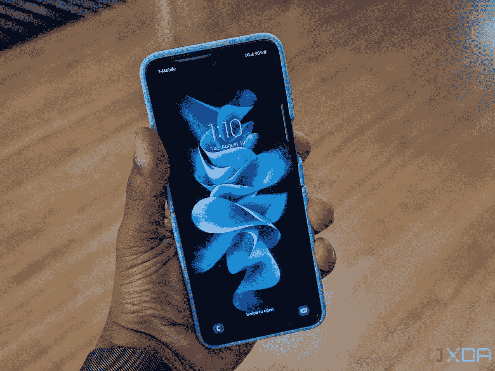
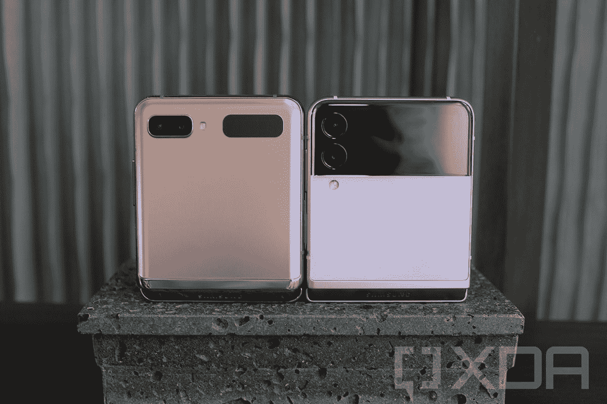

# 三星 Galaxy Z Flip 3 评测:太好了，我买了两个

> 原文：<https://www.xda-developers.com/samsung-galaxy-z-flip-3-review/>

当三星在 2019 年推出最初的 Galaxy Fold back 时，我立即爱上了它。它重新定义了我对智能手机和技术的整个看法。除了平板手机，最初的 Fold 表明手机可以有更多功能，一年后，Galaxy Z Fold 2 跟随这一趋势进行了一系列升级。

与此同时，三星推出了可以说是其最重要的可折叠手机。最初的 Galaxy Z Flip 预示着 Galaxy Z foldables 品牌的推出，这一改进的铰链是在 [Galaxy Z Fold 3](https://www.xda-developers.com/samsung-galaxy-z-fold-3/) 和 [Galaxy Z Flip 3](https://www.xda-developers.com/samsung-galaxy-z-flip-3/) 上发现的隐藏铰链的祖先，以及可折叠不仅仅是高级用户的想法；普通用户也可以使用它们。

Galaxy Z Flip 3 有一些受欢迎的改进。然而，最大的改进不是硬件或软件，而是价格。当一部手机尽管有一些缺点，却得到普遍的好评时，很明显它是赢家。这就是你用 Galaxy Z Flip 3 得到的:一款 999 美元的产品，是有史以来最令人愉快的手机之一，也是一款改变人们对你正在购买的手机感知价值的预期的智能手机。这就是为什么 Galaxy Z Flip 3 是每个人都应该考虑购买的手机，以及它可能不适合你的几个原因。

 <picture></picture> 

Samsung Galaxy Z Flip 3

Galaxy Z Flip 3 是第一款感觉像是为主流市场制造的可折叠手机。它的起价为 999 美元，重新定义了人们对所有智能手机的期望，而且还有很多进一步降价的优惠。这是一次非常棒的经历，我最终为自己买了两个，并计划为我的母亲和妹妹再买两个。

*欢迎使用我们新的综述格式，我们在首页展示主要结论，并在后续页面的各个部分进行深入探讨。我用了 Galaxy Z Flip 3 两个多星期，因为三星发来了一份评测样品。它运行在 AT & T 网络上，在我的使用区域有一些信号强度问题，可能会影响电池寿命。*

* * *

这是我们的 Galaxy Z Flip 3 评测的第 1 页。您可以使用下面的链接导航到本评论的其他部分:

## 三星 Galaxy Z Fold 3 规格

### 三星 Galaxy Z Fold 3:规格

| 

规格

 | 

三星 Galaxy Z Fold 3

 |
| --- | --- |
| **构建** | 

*   康宁大猩猩玻璃 Victus 在外部屏幕和背板
*   装甲铝框架
*   IPX8 防水性

 |
| **尺寸&重量** | 

*   折叠后:67.1 x 158.2 x 16 ~ 14.4mm 毫米
*   展开后:128.1 x 158.2 x 6.4mm 毫米
*   271 克

 |
| **显示** | 

*   外部显示器:
    *   6.2 英寸高清+动态 AMOLED 2X
    *   2268 x 832387 PPI
    *   120Hz 自适应刷新率

*   内部显示屏:
    *   7.6 英寸 QXGA+动态 AMOLED 2X
    *   2208 x 1786374 PPI
    *   120Hz 自适应刷新率

 |
| **SoC** | 

*   高通骁龙 888
    *   1 个 Kryo 680(基于 ARM Cortex X1)Prime core @ 2.84 GHz
    *   3 个 Kryo 680(基于 ARM Cortex A78)性能内核@ 2.4GHz
    *   4 个 Kryo 680(基于 ARM Cortex A55)高效内核@ 1.8GHz

*   Adreno 660 GPU

 |
| **内存&存储** | 

*   12GB 内存
*   256/512GB UFS 3.1 存储

 |
| **电池&充电** | 

*   4，400 毫安时双芯电池
*   25W 快充支持
*   10W 无线充电支持
*   4.5W 反向无线充电
*   不含充电器

 |
| **安全** | 

*   侧装式指纹传感器
*   人工智能人脸识别

 |
| **后置摄像头** | 

*   主要:1200 万像素，f/1.8，双像素自动对焦，OIS
*   超宽:12MP，f/2.2，123 FoV
*   长焦:12MP，f/2.4，PDAF，双 OIS，2 倍光学变焦，10 倍数码变焦

 |
| **前置摄像头** | 

*   外部摄像头:10MP，f/2.2
*   内置摄像头:400 万像素，f/1.8，显示屏下传感器

 |
| **端口** | USB 类型-C |
| **音频** | 

*   立体声扬声器
*   杜比大气

 |
| **连通性** | 

*   4X4 MIMO，7CA，LAA，LTE 类别 20
*   SA/NSA 5G (Sub6/mmWave)
*   Wi-Fi 6E
*   蓝牙 5.2
*   国家足球联盟

 |
| **软件** | 一个基于 Android 11 的 UI |
| **其他功能** | S Pen 折叠版/S Pen Pro 支持 |
| **颜色** | 

*   幻影黑
*   幻影绿
*   幻影银

 |

## Galaxy Z Flip 3 回顾总结:为什么我买了两个

Galaxy Z Flip 3 的真正魅力不在于硬件或软件，而在于价格。三星已经设法给你提供了你想要的主流旗舰机的所有实用硬件，包括骁龙 888 处理器，120 赫兹的手机刷新率，以及两个非常强大的摄像头。但他们也增加了折叠显示屏，并将价格保持在 1000 美元以下。更不用说，这是现在的 IPX8 防水，这意味着它可以承受短暂的倾盆大雨。

[sc name = " pull-quote-right " quote = " Galaxy Z Flip 3 证明可折叠产品已经为主流产品做好了准备"]999 美元的起价意味着 Galaxy Z Flip 3 可以以不太吓人的价格为普通智能手机买家带来酷元素。三位数的价格标签意味着后付费计划可以负担得起，甚至你可以直接购买。然而，这还不是全部——还有许多进一步降价的优惠。以其全部要价，它值得考虑，但如果你能通过以旧换新或其他优惠获得折扣，它比美国大多数其他低价设备都好。

以 T-Mobile 在预购阶段的以旧换新交易为例。我在亚马逊上花了 180 美元买了一台翻新的 Galaxy S9，作为一个新系列的一部分，我用 Galaxy Z Flip 3 的价格标签换了 1000 美元。或者美国电话电报公司直接通过三星推出的促销活动，基本上是在符合条件的以旧换新活动中，Fold 3 或 Flip 3 可以优惠 1000 美元。此外，三星允许您以旧换新最多 4 部手机，虽然每增加一部以旧换新，价值和符合条件的设备列表都会变小，但您最终仍可以节省 1000 美元。三星正在投入资金，使 Galaxy Z Flip 3 具有财务吸引力，并在所有营销渠道大力推广它，这可能被证明是使可折叠手机成为主流的成功战略。

这当然不是完美的手机，但 Galaxy Z Flip 3 证明了可折叠手机已经为主流市场做好了准备。对于大多数用户来说，它有足够的光泽成为一部伟大的日常手机，它的缺点大多可以通过软件来修复。最重要的是，这是一个令人信服的全要价，但今年的优惠是如此之好，它使这款手机绝对便宜。

事实上，这款手机太好了，我在使用它的 4 天内就下了预购订单。将近两个星期后，我屈服了，又预定了一份奶油，因为这些优惠太诱人了，我想在它们之间交替。我原本预计我现在会对 Galaxy Z Flip 3 感到厌倦，尽管这种可能性仍然很小，但我预计这是一款我会用来阅读电子书、在社交晚会上外出以及在我通常不处于工作模式时使用的手机。并不是说它不能满足我的工作需求，而是我更喜欢有单独的工作设备，如果工作效率是你的必备条件，Galaxy Z Fold 3 是一个更好的购买选择。

显然，我绝对喜欢这款手机，它非常适合我的需求，但你应该买 Galaxy Z Flip 3 吗？这才是真题，答案是有也有没有，下面总结一下是否适合自己。

### 您应该购买 Galaxy Z Flip 3，如果…

有许多类型的人会喜欢 Galaxy Z Flip 3。如果你注重时尚，发现手机太大，但仍然想要一个大显示屏，如果你想要一个轻便，便于携带，有点独特的东西，这款手机是一个完美的选择。

你也应该购买 Galaxy Z Flip 3，如果…

你想鹤立鸡群

如果你和我一样，想要打破僵局或鹤立鸡群，请购买 Galaxy Z Flip 3。它保证会让每个人都谈论它，特别是在未来一两年内，直到可折叠手机达到与传统玻璃板智能手机相当的真正推出速度。有一系列的颜色——我喜欢淡紫色的，粉色的看起来也很棒——它实际上是穿着一双古怪的鞋子、一件明亮的衬衫或留着独特发型的数字版本；最终，这些都是为了帮助你脱颖而出。

你拍了很多自拍

如果你爱自拍，你一定会喜欢 Galaxy Z Flip 3。说真的，自拍是如此有趣，Galaxy Z Flip 3 几乎鼓励你拍更多。此外，您还可以使用全套相机功能来拍摄自拍照片或视频，从而在大多数光线条件下都能拍出更好的自拍。

**你是一个有影响力的人**

如果你是一个数字影响者，你会讨厌被称为数字影响者，但 Galaxy Z Flip 3 对你来说是一个很好的设备。如果你喜欢拍很多照片或视频在社交上分享，或者记录很多 vlogs，这是你应该购买的手机。三星的视频实力在这里很强，你将拥有全套的视频功能，包括 HDR、4k@30fps 和人像视频，同时还拥有一部可以吸引人们对你和你的工作的注意的手机。

### 你不应该购买 Galaxy Z Flip 3，如果…

也就是说，Galaxy Z Flip 3 对一些人来说并不是完美的手机。如果你的主要关注点是生产力，你不欣赏相机，或者你看不到尺寸变化的巨大好处，你可能不会从 Galaxy Z Flip 3 中获得足够的好处。

您也不应该购买 Galaxy Z Flip 3，如果…

电池寿命对您至关重要

如果你需要全天有保证的电池寿命，又不能插电充电，那就跳过 Galaxy Z Flip 3 吧。几乎可以肯定的是，电池对你来说不够好，但如果你能够携带便携式充电器或在办公桌前呆足够长的时间，以便可以根据需要充电，你应该考虑它。快速充电选项也是有限的，所以要记住这些。

你的相机的变焦能力对你来说很重要

如果你拍摄了很多变焦照片，无论是数码照片(还是最有可能的长焦照片)，那么你可能也应该跳过 Galaxy Z Flip 3。数码变焦不是最好的，没有专用的长焦镜头，你可能会感到沮丧。不过，请确保变焦是你必须具备的功能，因为 Galaxy Z Flip 3 上的宽相机和超宽相机可以拍摄出出色的照片。

你想要一部功能过剩的智能手机

Galaxy Z Flip 3 专注于实用性，而不是为了钱而包装最过分的功能。如果你需要*智能手机里所有的东西和杂物*，这款翻盖手机不适合你。

* * *

## 三星 Galaxy Z Flip 3 发布日期和定价

在这篇评论中，我会提到一个非常重要的数字:999 美元。这是 Galaxy Z Flip 3 体验最吸引人的地方之一，也是主流可折叠手机首次定价低于 1000 美元。按全价计算，这是一笔很划算的买卖，但如果像现在这样大幅度打折，那就绝对划算了。

有两种型号的 Galaxy Z Flip 3 可供选择:一种是 128GB 的存储空间，起价为 999 美元，另一种是 256GB 的存储空间，价格高出 50 美元。预购阶段，三星在大力推广更高存储版本；如果您预购，您将获得 150 美元的即时三星信用，并可以使用其中的一部分免费升级到更高的存储版本。

许多科技爱好者都能回忆起科技历史上的特定转折点，这一代可折叠手机感觉就像一个转折点。特别是 Galaxy Z Flip 3，感觉它可能会产生与 Galaxy S3 相同的影响。这是三星在该系列中的第三款手机，也是真正刺激了 Galaxy S 系列的增长和随后的主导地位的一款手机。Galaxy Z Flip 3 发挥了它的潜力，在今年我的年度手机竞选中，它远远超过了今年迄今为止的任何其他产品。

 <picture></picture> 

Samsung Galaxy Z Flip 3

Galaxy Z Flip 3 是第一款感觉像是为主流市场制造的可折叠手机。起价 999 美元，它重新定义了所有智能手机的预期，有几个优惠，你可以节省很多！999 美元，这是一个很好的购买，但在更低的价格，这是一个偷窃，将改变你对手机的看法。

现在您已经阅读了摘要，请继续阅读，查看详细的评论。

这是我们详细的 Galaxy Z Flip 3 评测的第 2 页。您可以使用下面框中的链接导航到本评论的其他部分。

## 

## 三星 Galaxy Z Flip 3 设计:重新定义智能手机

*   对折
*   背面为康宁大猩猩玻璃 Victus，内部为可折叠显示屏
*   装甲铝框架

从最初的 Z Flip 时代开始——老实说，从最初的 iPhone 开始——某些手机已经有了吸引眼球的能力。那种让每个人都在说话的电话。Galaxy Z Flip 3 兑现了其令人惊叹的承诺。

Galaxy Z Flip 3 是对话的开始，是破冰者。简而言之，它是让人们谈论的很酷的东西。

在过去的一周里，当我在公共场合使用 Flip 3 时，有很多人接近我。对最初 Flip 的反应通常是，这是新的 RAZR 吗？对于 Galaxy Z Flip 3 来说，它已经变得很容易辨认了。这是对话的开始，是打破僵局的方式，是每个人都有自己的观点或兴趣的事情。简而言之，它是下一代智能手机的原始 iPhone。

在某种程度上，三星已经实现了许多人认为不可能的事情:为下一代重新定义智能手机行业。我们的姐妹网站 Pocketnow 写道[苹果需要在今年推出折叠 iPhone](https://pocketnow.com/apple-is-screwed-if-it-doesnt-announce-a-foldable-this-year)。我会更进一步 Galaxy Z Flip 3 美元的价格意味着它不再足以推出 1000 美元或以上的平板电脑。每家公司要么需要以这个价格提供折叠外形或其他杀手级功能，要么定价低得多。Galaxy Z Flip 3 是一加曾经的旗舰杀手，通过提供令人难以置信的以旧换新交易来推动销售，三星也在利用其市场力量改变智能手机的整体感知价值。

我喜欢最初的 Galaxy Z Flip，但我不喜欢它。我一写完评论，它就被放到了我的抽屉里。在使用 Galaxy Z Flip 3 两周之后，我意识到了一些事情:我不只是*喜欢*它，我 ***喜欢*** 它。我非常喜欢这款手机，我不想使用任何其他旗舰。外形适合一些感觉很自然的使用案例。

我同时使用了 Galaxy Z Fold 3 和 Galaxy Z Flip 3，并且自从它们首次推出以来，我一直将之前的 Galaxy Folds 用作我的第二个日常设备。我真的很喜欢 Fold 系列的内部展示，所以我想这次我自然会更倾向于 Fold first。然而，在 Galaxy Z Flip 3 宣布之前，我与它的短暂时间留下了一个印记，就像我与最初的 Z Flip 的时间一样，我想知道这是否最终是 Z Flip 对大多数人有用的时候。

[sc name = " pull-quote-right " quote = " The Galaxy Z Flip 3 使 iPhone 12 Pro Max 感到无聊"]两个星期后，我几乎完全放弃了我的 iPhone 12 Pro Max，一旦 WhatsApp 让你从 iOS 转移到 Android，我很可能会完全放弃它。如果我真的回到 iPhone 上寻找一些残留的个人数据，我很快就会想回到翻盖手机上。轻巧的性质、纤薄的外形和狭窄的设计使它成为我最喜欢拿着和使用的手机。特别是，Z Flip 3 略显纤薄的特性和轻便的手感带来了出色的手持体验。是 ***那种过瘾的*** 。

然而，最重要的是，打开和关闭 Z Flip 3 有一些非常令人满意的事情。打电话，然后用那种令人满意的声音关上电话，给了我比我想象中更多的快乐。我们在生活中的某个时候都有过翻盖手机的经历——至少像我这样 35 岁左右的人——Z Flip 3 挖掘了最重要的情感——怀旧。最后 Galaxy Z Flip 3 只是让 iPhone 觉得*无聊*。

## 三星 Galaxy Z Flip 3 显示屏:两种截然不同的体验

*   外“盖”显示屏:1.9 英寸 Super AMOLED250 x 512302 PPI
*   内显示屏:6.7 英寸 FHD+动态 AMOLED 2X2640 x 1080425 PPI120Hz 自适应刷新率

在我们深入探讨操作方式与其他智能手机非常相似的主显示屏之前，让我们先来讨论一下翻盖显示屏。坦率地说，第一代 Galaxy Z 翻盖显示屏毫无用处，三星发现自己完全被摩托罗拉 RAZR 展示出来了。今年，封面显示是原来的四倍大，并且变得更加有用。

Galaxy Z Flip 3 可用的小部件包括控制音乐、访问健康、天气等选项。最有用的功能之一是主屏幕左侧的通知面板，与前几年不同，它允许您完整查看所有通知。你不能以任何方式回复，但是能够看到你刚刚收到的完整邮件来决定它是否需要立即回复是非常有用的。您收到的任何其他通知或消息也是如此。这样做的目的是提供足够的信息来决定通知是否需要立即采取进一步的行动。

封面显示的另一个原因可能是许多人喜欢 Galaxy Z Flip 3 的原因是摄像头。当手机关闭时，双击电源按钮，它会进入自拍模式，允许您使用两个主摄像头来自拍，视频，使用所有的相机效果，如人像模式，等等。取景器很小但很有用，虽然需要几次尝试才能找到窍门，但你通常可以拍出好的自拍。偶尔有些会模糊不清，但这是任何手机的情况。要自拍，只需按下任一音量键。

小米在小米 Mi 11 Ultra 上包括后置显示屏时应用了类似的思维过程，但在这个更小的外形上，人体工程学完全不同，让该功能不仅仅是一个噱头。在这篇评论的后面，我们将更深入地探讨相机。

 <picture></picture> 

The Galaxy Z Flip 3 in my favorite case: the Ring Case in Lavender Purple

Galaxy Z Flip 3 的主显示屏就像任何其他三星面板一样:出色的观看体验，鲜明的颜色，令人印象深刻的活力，再加上三星使用的字体，这是我最喜欢的任何手机观看体验之一。在 Galaxy Z Flip 3 上观看任何东西都比在任何其他手机上观看都要愉快得多，包括 iPhone 12 Pro Max。

[sc name = " pull-quote-right " quote = "不仅仅是一部手机，Galaxy Z Flip 3 就像一件艺术品；这是一种声明。”Galaxy Z Flip 3 显示屏尺寸为 6.7 英寸，但感觉比其他类似屏幕尺寸的手机要小，可能是因为机身更窄。它超级亮，峰值亮度达到 1200 尼特，分辨率为 1080x2640 像素。这是 426 ppi 的像素密度，但由于显示屏的质量，实际体验感觉比其他手机更清晰。体验上最大的增加是 120Hz 的刷新率，这使得一切都超级流畅，尽管这对电池寿命确实有影响。

当我在公共场合使用我的可折叠手机时，任何稍微感兴趣的人问我的第一个问题是，你是否真的能看到折痕，以及它是否困扰着我。答案分别是肯定的和否定的。是的，你可以看到它，除非你直视显示器，背景是明亮的，但它不会打扰我。你的眼睛很快学会忽略它，它只是融入其中，除非你从错误的角度看它。

Galaxy Z Flip 3 非常酷，与众不同，令人难忘，新的动物动画每次都给我带来如此多的欢乐。他们可爱，可爱，讨人喜欢。旁边的时钟可以定制八种颜色中的一种，总的来说，它似乎是为派对而设计的。这是对 Galaxy Z Flip 3 整体的一个很好的总结——它不仅仅是一部手机，它被设计成一件声明，就像一件精美的艺术品。

 <picture></picture> 

Galaxy Z Flip 5G vs the new Galaxy Z Flip 3

## 三星 Galaxy Z Flip 3 硬件和性能:最终，一个耐用的可折叠

*   高通骁龙 888
*   8GB 内存
*   128/256GB UFS 3.1 存储
*   IPX8 防水性

Galaxy Z Flip 3 值得购买的最大原因是，三星终于找到了如何制造可折叠防水产品的方法。IPX8 防水功能的增加意味着这款手机现在能够处理任何你可以扔向它的东西。使用了两年的可折叠手机，这是拼图游戏中最后缺少的东西之一。现在，Galaxy Z Flip 3 已经准备好成为你唯一的设备，这是第一代推出以来短短 18 个月内的一个巨大进步，尤其是考虑到疫情的全球影响。

除了由于 IPX8 防水性而增加的耐用性，手机中使用的隐藏式铰链和铝也有所改进。还有大猩猩玻璃 Victus，这是目前广泛用于手机的最坚固的保护玻璃。三星表示，新的铝比以前的手机使用的铝强度高 10%，虽然这些变化是单独的细微变化，但复合效果是显而易见的，因为 Galaxy Z Flip 3 感觉像任何其他智能手机一样光滑。

Galaxy Z Flip 3 给人的感觉和其他智能手机一样精致

在 1000 美元的价格标签上，你会期望最好的硬件，Galaxy Z Flip 3 在这方面提供了大部分。规格表包括所有最新和最棒的处理器，包括骁龙 888 处理器，Adreno 660 GPU，128GB 或 256GB 的存储空间，以及 8GB 的内存(不考虑存储版本)。

后一点可能是唯一让人觉得有问题的地方——有几次感觉手机在努力跟上我对它的要求。我主要把这归因于未优化的应用，因为它发生在某些应用中，如 Asana，但不是在一般的 UX 中。然而，就像任何其他 Android 手机一样，如果你有很多通知，当你向下滑动通知抽屉时，以及当你关闭所有应用程序时，你会注意到动画略有滞后。这些小事情是显而易见的，但最终不会对整体体验产生太大影响。

我已经用 Galaxy Z Flip 3 连接到一对 Galaxy Buds 2 进行了多次通话，这是一种奇妙的体验，可以媲美 iPhone 和 AirPods 之间的协同作用。同样，Galaxy Z Flip 3 本身的通话质量也很好，通话清晰，通话中没有其他人报告麦克风问题。这也感觉像一个普通的电话，使通话愉快，是的，如果你想，你可以关闭电话结束通话。

硬件最终是你在这个价位上对大多数手机的期望。我真的希望三星将内存增加到 12GB，虽然这对于大部分体验来说可能有点过头了，但这将有助于解决一些明显的轻微延迟。继续阅读，在我们的 Galaxy Z Flip 3 评测的最后一页找到关于相机、电池寿命和软件的信息。

 <picture></picture> 

Samsung Galaxy Z Flip 3

Galaxy Z Flip 3 是第一款感觉像是为主流市场制造的可折叠手机。起价 999 美元，它重新定义了所有智能手机的预期，有几个优惠，你可以节省很多！999 美元，这是一个很好的购买，但在更低的价格，这是一个偷窃，将改变你对手机的看法。

使用以下链接浏览本评论的其余部分:

这是我们详细的 Galaxy Z Flip 3 评测的第 3 页。您可以使用下面的链接导航到本评论的其他部分:

当你不自拍的时候——我们之前提到过——你可以打开手机，用两个摄像头拍出精彩的照片。现实情况是，无论是在自拍模式还是其他模式下，你都可以在 Galaxy Z Flip 3 上拍出好照片，这也是购买这种可折叠外形的原因之一。当然，三星本身在其玻璃平板“Ultra”旗舰机上提供了更多功能、更强大的相机设置，但这些过度功能针对的是不同的受众。对于 Z Flip 3 针对的普通用户和用例来说，这款相机相当不错。

在大多数情况下，这绝对是最好的方法，但有一个警告。

在大约 50 张自拍的过程中，大约 10%的照片最终变得模糊不清。当你使用 Galaxy Z Flip 3 时，在按下快门的音量按钮和手机保存照片之间有明显的延迟。昨天，我和一群人拍了一张照片，在看起来很棒的地方进行了检查，然后一分钟左右后，在处理后它变得模糊了。不理想，但不是世界末日，像任何普通手机一样，你需要确保在拍照时保持手机稳定。

 <picture></picture> 

*That* blurry selfie using the Cover Display

我可以看到很多人使用这种外形拍照的第二个用例:手机对折拍照，这样你就可以抓住手机的下半部分。众所周知，婴儿对拍照非常挑剔，尤其是当他们在别人怀里的时候。你可以握住手机的下半部分，靠近拍摄对象，轻松拍照，而不是传统意义上的握持手机。质量没有损失，大多数人绝对会更喜欢这个用例。

谈到相机，三星的一些派对小技巧仍然是我最喜欢使用的东西。Colorpoint 让您无需成为艺术家也能拍摄出有创意的照片并富有艺术感。人像模式和我用过的其他模式一样好。像所有三星手机一样，Galaxy Z Flip 3 相机过饱和了，这可能不是最准确的场景表现，但颜色肯定会流行，这意味着它在视觉上更具吸引力，可能会在社交网站上更好地接受，因为大多数照片都是在社交网站上分享的。

我是不是错过了其他手机的长焦镜头？是的。我希望下一次翻转带来第三个相机，并完善相机体验。但鉴于普通 iPhone 12 是当前 iPhone 一代中最受欢迎的，对许多人来说，缺乏长焦镜头不会成为一个障碍。我更喜欢折叠式还是长焦镜头？理想情况下，我会两者兼得，但在这个价位上，我会选择第三个镜头的外形。尤其是三星令人惊叹的超宽相机一如既往地出色，而且相机整体质量良好！

## 三星 Galaxy Z Flip 3 续航:超长待机，续航能力存疑

*   3300 毫安时双芯电池
*   15W 有线充电
*   10W 无线充电

Galaxy Z Flip 3 体验中仍让我担心的一点是电池寿命。简单来说，我觉得还可以，不算很棒，可能对大多数人来说还不够好。然而，这有一个警告。

在过去的两周内，电池的总寿命一般在 14 至 16 小时左右，实际使用时间约为 3 至 4 小时。由于我在后台运行的手机上添加了更多的应用程序，电池寿命受到了影响。尽管 Galaxy Z Fold 3 和华为的 foldables 等手机即使在大量使用的情况下也通常有一些电池续航时间，但 Galaxy Z Flip 3 没有这样的缓冲。

如果你将 Z Flip 3 作为日常设备使用，你会想在附近放一个充电器

这意味着，如果你打算将 Galaxy Z Flip 3 用作日常司机，那么白天给手机充值是必不可少的。你可以使用便携式充电器——我非常喜欢三星的 10000mAh 无线充电便携式充电器，或者任何支持 15W 充电的壁式充电器。三星自己也在 Z Flip 3 和 Z Fold 3 旁边宣传了一款 25W 的壁式充电器，但前者只能支持 15W 的有线充电，或 10W 的无线充电。手机充电平均需要 90 分钟到两个小时，所以你需要做相应的计划。

然而，我越来越注意到的是，谷歌服务经常出现在电池使用统计的顶部。这可能有很多原因，但我目前的理论是，运营商的选择发挥了很大作用。我一直在美国电话电报公司测试这款 Galaxy Z Flip 3，它在我使用手机的区域有不同程度的信号。在很大程度上，电池寿命是一致的，但在我们办公室附近停电的那一天——以及我在纽约带着手机旅行期间——我注意到电池寿命受到了足够的影响，这需要进一步调查。

我将测试我用威瑞森和 T-mobile 网络购买的另外两款 Galaxy Z Flip 3，看看电池寿命有什么不同。我们知道一些人也购买了 Galaxy Z Flip 3，所以我们将整理我们的体验，并在几周内用我们的发现更新这篇评论。

## 三星 Galaxy Z Flip 3 软件:专为可折叠产品设计的软件

*   一个基于 Android 11 的 UI

与 Galaxy Z Fold 3 不同，Galaxy Z Flip 3 并没有考虑到生产力。这意味着像 DeX 这样的强大功能不可用，但可用的功能表明三星真正了解软件在可折叠方面的作用。

你仍然可以获得每部 Galaxy 手机提供的所有多任务功能，屏幕上的折痕加上折叠的方式，有助于同时运行两个应用程序。与 Z Fold 3 不同，你不能固定 edge 面板，但它确实提供了一种简单的方法来访问你经常使用的应用程序，以及设置成对的应用程序，只需轻轻一点，你就可以在分屏视图中启动这些应用程序。

让体验真正独特的是三星如何寻求使用水平折叠外形。谷歌的一些应用程序，如 YouTube 和 Duo，已经通过新的 Flex 模式进行了优化，因此视频出现在屏幕的上半部分，而控件出现在下半部分。这意味着你可以将铰链用作一个天然的支架，并将 Flip 3 放在一个半折叠的柜台上，同时仍然可以看东西或拍照，而不需要使用屏幕上的小按钮来导航。

三星还与第三方开发商合作，优化顶级应用程序，这意味着我们应该看到更多利用这种外形的应用程序和体验。对于那些工作不太正常的模式——无论是折叠模式还是分屏模式，都有三星实验室。新的实验室功能可以让你强制应用程序在灵活模式下运行，手机在移除覆盖在你正在观看的内容上的控件方面做得相当不错。它并不完美，我也没怎么用过，但拥有这个功能绝对是件好事。还有一个按钮可以切换每个应用程序的分屏和弹出窗口，甚至是那些没有优化的应用程序，这是我第一次启用。

多年来，TouchWiz 被嘲笑为臃肿的 UX，有太多重复的应用程序和毫无意义的噱头。OneUI 绝不是这样的。这是一个精致的平台，是迄今为止我最喜欢的 UX，简单是因为它满足了我内心想要拥有大量控制权的愿望，比任何其他 Android 智能手机都好。如果你喜欢更多的设置，喜欢在使用手机几个月后发现新的小功能和调整的感觉，OneUI 绝对可以满足你。

OneUI 在 foldables 上的体验恰恰表明，三星理解硬件和软件共同创造一种体验的细微差别。十年的 Galaxy Note 系列给了三星迭代和尝试新平台的平台。然而，尽管它在这些手机上很棒，但它似乎是为可折叠产品而生的，OneUI 在可折叠软件体验方面一直领先。

 <picture></picture> 

Samsung Galaxy Z Flip 3

Galaxy Z Flip 3 是第一款感觉像是为主流市场制造的可折叠手机。起价 999 美元，它重新定义了所有智能手机的预期，有几个优惠，你可以节省很多！999 美元，这是一个很好的购买，但在更低的价格，这是一个偷窃，将改变你对手机的看法。