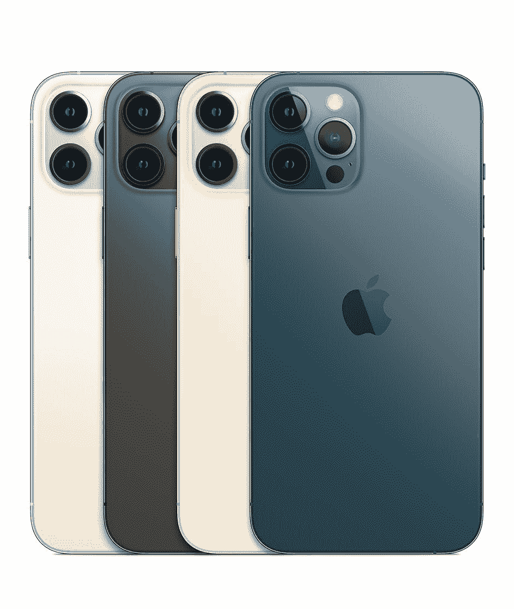

# 三星 Galaxy Z Flip 3 vs 苹果 iPhone 12 Pro Max:选择生态系统

> 原文：<https://www.xda-developers.com/samsung-galaxy-z-flip-3-vs-apple-iphone-12-pro-max/>

三星的 Galaxy Z Flip 3 现已正式发布，这意味着是时候将它与韩国公司的最大竞争对手苹果的顶级设备进行比较了。苹果不生产可折叠手机，所以我们的比较仅限于他们目前最好的设备，iPhone 12 Pro Max。为什么要首先进行比较呢？对于在市场上花费 1000 美元左右的普通用户来说，通过营销和广告了解他们的选择是有意义的。对他们来说，这些选择是有意义的，因此，比较也是有意义的。

显然，这两款智能手机就像来自两个不同的世界。一个是可折叠的；一个不是。一个运行安卓；一个运行 iOS。它们生活在两个完全不同的生态系统中。事实上，在做出购买决定时，你应该考虑你想要生活在什么样的生态系统中。三星和苹果都提供完整的产品系列，包括智能手机、平板电脑、笔记本电脑、智能手表、蓝牙耳机等等。

### 三星 Galaxy Z Flip 3 vs iPhone 12 Pro Max 规格

## 三星 Galaxy Z Flip 3 vs 苹果 iPhone 12 Pro Max:规格

|  | 

三星 Galaxy Z Flip 3

 | 

苹果 iPhone 12 Pro Max

 |
| --- | --- | --- |
| 

处理器

 | 5 纳米 64 位八核处理器(2.84GHz + 2.4GHz + 1.8GHz) | A14 仿生(3.1GHz 双核，1.8GHz 四核) |
| 

显示

 | 主屏幕:6.7 英寸 FHD+动态 AMOLED 2X 显示屏(22:9)Infinity Flex 显示屏 2，640x1，080，425ppi，120Hz 自适应刷新率覆盖屏幕:1.9 英寸 Super AMOLED 显示屏 260x512，302ppi | 6.7 英寸，1，284x2，778，超级视网膜 XDR 有机发光二极管，19.5:9，458ppi |
| 

身体

 | 折叠后:72.2 x 86.4 x 17.1 毫米折叠后:72.2 x 166 x 6.9 毫米重量:183 克 | 160.8 x 78.1 x 7.4 毫米(228 克) |
| 

摄像机

 | 1200 万像素 f/1.8 宽(OIS，双像素 AF)+1200 万像素 f/2.2 超宽前置:100 万像素 f/2.4 | 12MP 宽 f/1.6(双像素 PDAF，传感器偏移稳定)+ 12MP 超宽 f/2.4+12MP 2.5 倍长焦 f/2.2(OIS PDAF)前置:12MP f/2.2 |
| 

电池

 | 3300 毫安时双电池 | 3687 毫安时 |
| 

记忆

 | 8GB 内存、128GB/256GB UFS 3.1 存储 | 6GB 内存和 128GB/256GB/512GB 存储空间 |
| 

抗水性

 | IPX8 | IP68 |
| 

操作系统（Operating System）

 | 安卓 11 | iOS 14 |
| 

颜色；色彩；色调

 | 奶油色、绿色、淡紫色、幻影黑、灰色、白色、粉色 | 银色、石墨色、金色、太平洋蓝 |
| 

价格

 | 起价 1799 美元 | 起价 1099 美元 |

## 设计和展示:Galaxy Z Flip 3 可以折叠，而 iPhone 不能

事实上，这两款设备的关键区别在于，一款可以折叠，另一款则不会。三星 Galaxy Z Flip 系列背后的整个想法是，它可以折叠成更加紧凑和便于携带的东西，而 iPhone 12 Pro Max 是一个标准的矩形平板，没有这样的尝试。事实上，对于很多人来说，iPhone 12 Pro Max 有点太大了，经常可以听到我的同事 Ben 抱怨 Pro Max 上的[糟糕的人体工程学。](https://www.xda-developers.com/iphone-12-pro-max-review/)

还有其他的优势。当然，这两个展品都是有机发光二极管的。三星提供 120 赫兹的刷新率，这意味着你可以获得更流畅的运动和动画。

另一方面，iPhone 12 Pro Max 的显示屏更大，分辨率也更高。两个屏幕的对角线尺寸都是 6.7 英寸，但由于 19.5:9 的纵横比，iPhone 的屏幕比 Galaxy Z Flip 3 的 22:9 显示屏更大。与 425ppi 相比，iPhone 的像素密度仍然更高，为 458ppi。

由于三星 Galaxy Z Flip 3 是一款可折叠设备，因此它在外部确实有一个额外的屏幕，有利于查看时间和通知。值得注意的是，虽然苹果确实有一个大得多的屏幕，而且一直在显眼的地方，但它并不总是亮着的。

Galaxy Z Flip 3 还提供了比 iPhone 12 Pro Max 更有趣的颜色。苹果的“专业”产品没有有趣的颜色，所以只有石墨色、银色、金色和太平洋蓝。如果你想要有趣的颜色，你必须牺牲一些质量。

请注意，iPhone 12 Pro Max 的电池更大，因此电池寿命更长。另一方面，三星 Galaxy Z Flip 3 比 iPhone 12 Pro Max 轻 45g，因此对于那些关注设备便携性的人来说，这种妥协可能是值得的。

## 相机:iPhone 12 Pro Max 击败 Galaxy Z Flip 3

相机不是三星 Galaxy Z Flip 3 的优先选择。事实上，这款设备的外形非常重要。如果你想要一部可以折叠成更小的普通智能手机，这正是三星 Galaxy Z Flip 3 的目的。这并不意味着它有一个糟糕的摄像头，但它更有可能被更传统的智能手机打败。

这两款设备都有 12MP 主传感器，尽管 Galaxy Z Flip 3 上的 f/1.8 光圈比 iPhone 12 Pro Max 上的 f/1.6 光圈小。它们都提供了夜间模式，但我希望 iPhone 能有更好的弱光性能。

它们也都有超宽传感器，iPhone 上的 f/2.4 和 Galaxy 上的 f/2.2。iPhone 12 Pro Max 是唯一一款配有第三个长焦镜头的手机，并且配有 2.5 倍变焦。如果你喜欢无损变焦，这对于 iPhone 来说是一个明显的优势。

老实说，如果你在寻找三星最好的相机，你来错地方了。Galaxy S21 Ultra 是那里的明显赢家，甚至 Galaxy Z Fold 3 也比 Galaxy Z Flip 3 做得更好。东西变得越小，就越难将科技融入其中。这并不意味着 Galaxy Z Flip 3 上的摄像头很差——就其本身而言，它们已经很好了，大多数用户应该对一般的包装感到满意。但如果你特别想展示你的相机技能，iPhone 12 Pro Max 是显而易见的赢家。

三星 Galaxy Z Flip 3 使用高通骁龙 888 处理器，而 iPhone 12 Pro Max 使用苹果定制的 A14 仿生芯片组。这意味着他们也有两个完全不同的 ISP。的确，决定智能手机相机好坏的不仅仅是传感器。图像信号处理器和软件也有很大的不同。

高通 Spectra 580 的许多改进都与三镜头相机有关，例如同时拍摄三张照片的能力。显然，这并不能帮助 Galaxy Z Flip 3。苹果当然开发了自己的 ISP 来直接与传感器一起工作，因为它拥有整个堆栈。这就是它如何能够提出像深度融合这样的酷功能，这是为了改善纹理和细节。

## 结论:购买生态系统

如果你只是买一部手机，仅此而已，那很好。你甚至可能是那种在设备的生命周期中从不购买第一方配件的人。有许多蓝牙耳塞可以与任何设备配合使用，智能手表也是如此。事实上，几乎所有三星的外设都可以在 iPhones 上运行，尽管苹果的很多东西不能在非苹果设备上运行。

让我们看看你买的是什么。

如果你现在正在看手机，你可能还没有想到这一点。这是值得考虑的事情，所以也许值得对智能手表和耳塞等选项做一些简单的研究，看看你喜欢什么。没有人强迫你马上与智能手表配对，但这只是需要考虑的事情。

至于是选择三星还是苹果，还是选择安卓还是 iOS，这个决定并不容易。这在很大程度上取决于个人偏好。就硬件而言，iPhone 12 Pro Max 客观上更好，为什么不应该呢？传统的外形总是更好，因为我们已经知道如何让它变得更好。它有更好的摄像头，更大的电池，更好的屏幕，等等。

另一方面，三星 Galaxy Z Flip 3 折叠起来更紧凑。它更轻，适合更小的空间，而 iPhone 12 Pro Max 实际上相当大。如果你习惯于将手机放在狭小的空间里，那么像 iPhone 12 Pro Max 这样的大设备会显得很突出。Galaxy Z Flip 3 可能就是你需要的那个问题的解决方案。

如果你喜欢 Flip 3，请务必[查看我们的交易综述](https://www.xda-developers.com/best-galaxy-z-flip-3-deals/)。还有很多[的案例要去查](https://www.xda-developers.com/best-galaxy-z-flip-3-cases/)。

 <picture></picture> 

Samsung Galaxy Z Flip 3

三星 Galaxy Z Flip 3 采用翻盖手机外形，并将其提升到一个新的水平。

 <picture></picture> 

iPhone 12 Pro Max

##### 苹果 iPhone 12 Pro Max

iPhone 12 Pro Max 是苹果智能手机家族的旗舰。