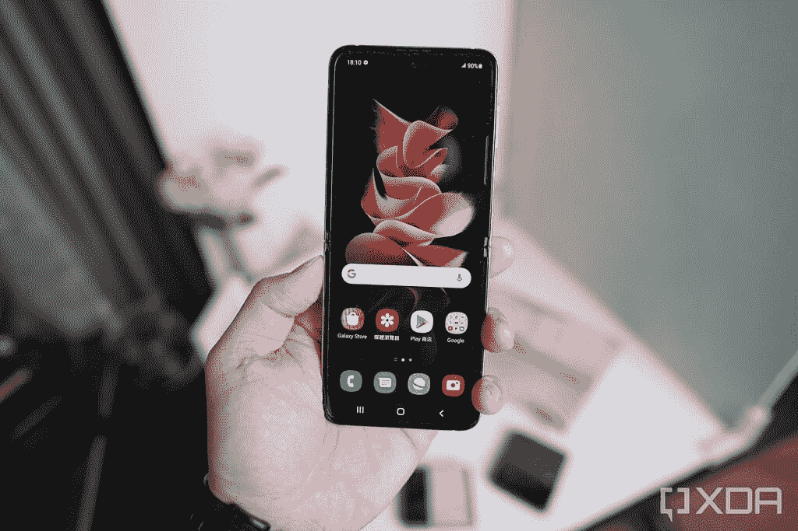
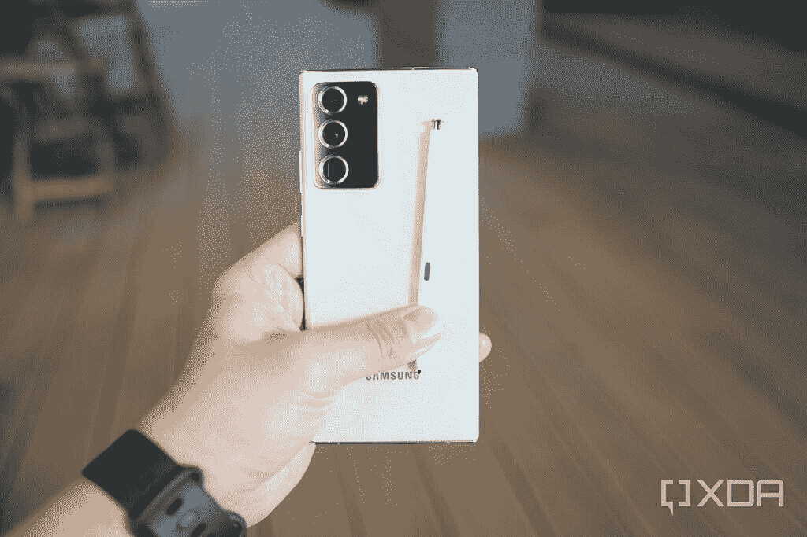
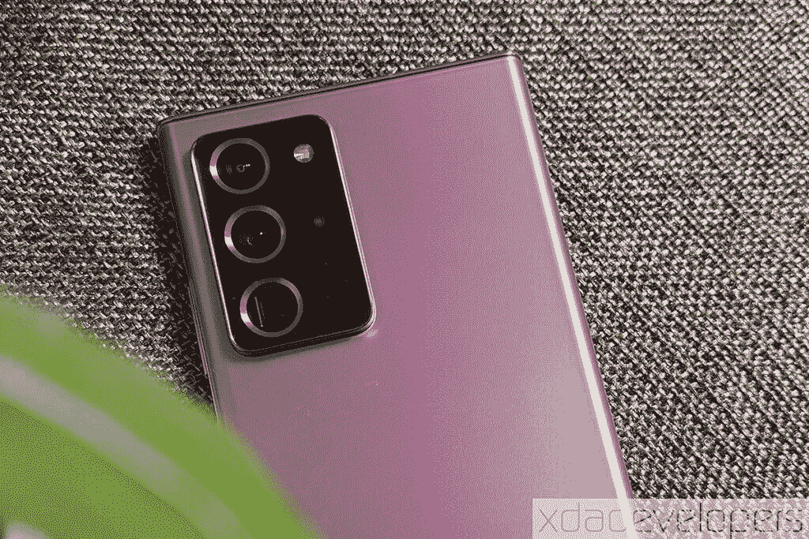
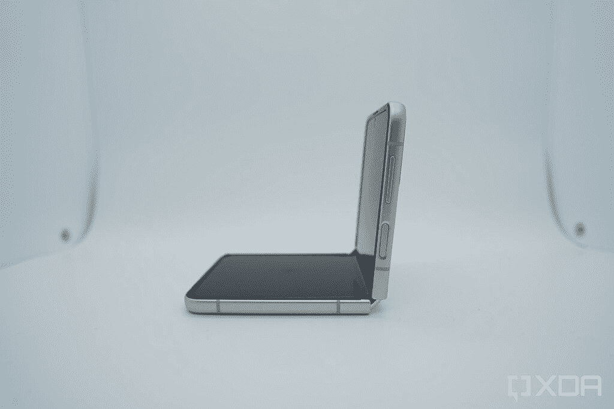
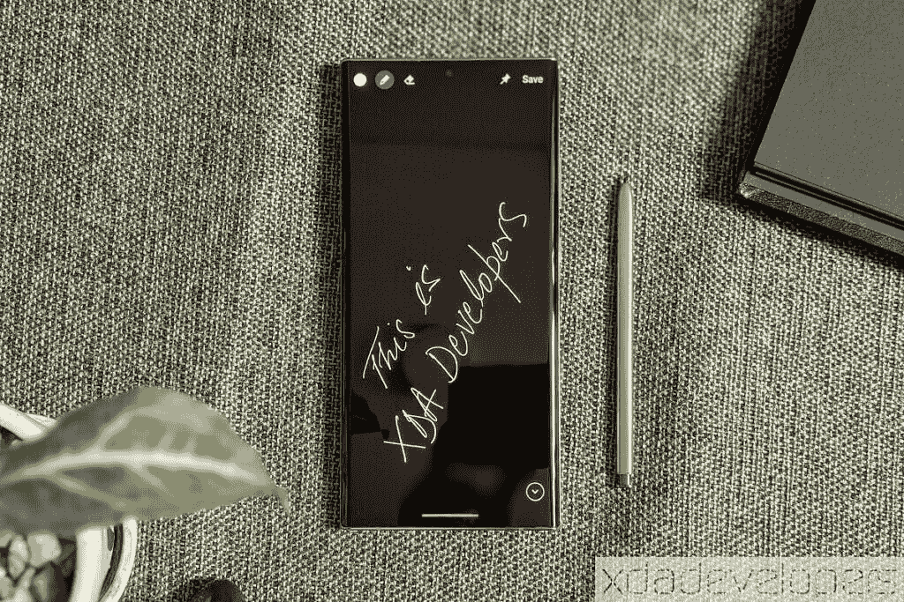
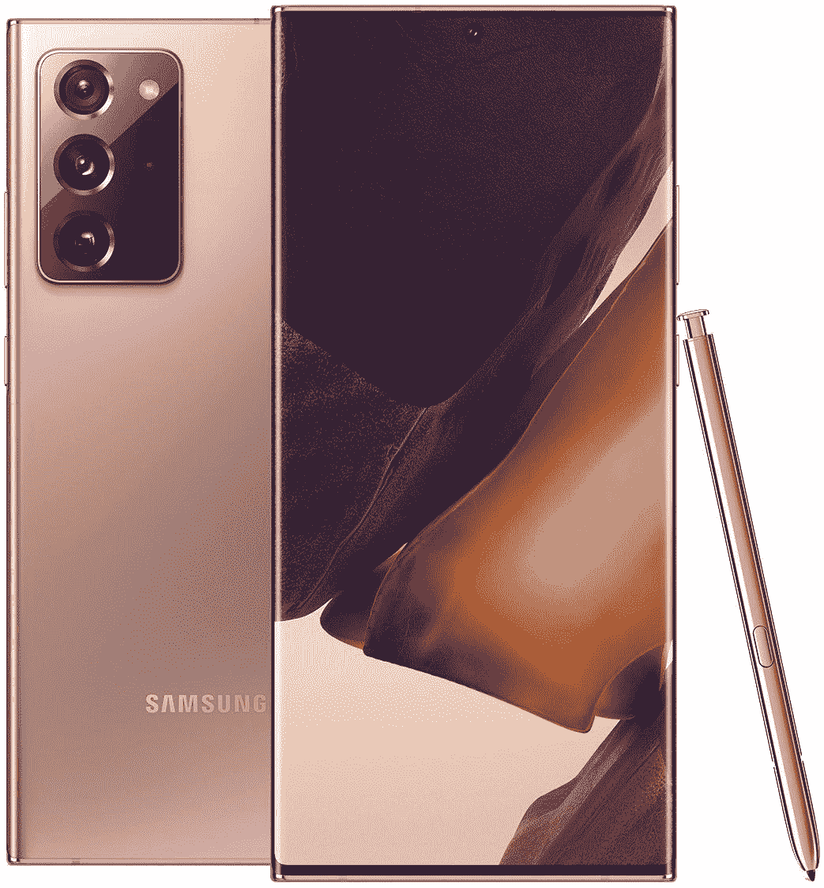

# 三星 Galaxy Z Flip 3 vs Galaxy Note 20 Ultra:该买哪个？

> 原文：<https://www.xda-developers.com/samsung-galaxy-z-flip-3-vs-galaxy-note-20-ultra/>

三星最新的翻盖式可折叠手机 [Galaxy Z Flip 3](https://www.xda-developers.com/samsung-galaxy-z-flip-3/) 已经上市。该公司已经达到了这款智能手机 999 美元起价的里程碑，使其进入主流智能手机价格范围。因此，如果你想买一部新的旗舰级手机，你可能会想知道是选择 Galaxy Z Flip 3 还是选择 Galaxy Note 20 Ultra 这样的传统高端智能手机是明智的。在本文中，我们将对 Galaxy Z Flip 3 和 Galaxy Note 20 Ultra 进行对比，看看这两者中哪一个适合您。

**导航本指南:**

## 三星 Galaxy Z Flip 3 与 Galaxy Note 20 Ultra:规格

| 

规格

 | 

三星 Galaxy Z Flip 3

 | 

三星 Galaxy Note 20 Ultra

 |
| --- | --- | --- |
| **打造** | 

*   背面有康宁大猩猩玻璃 Victus
*   装甲铝框架
*   IPX8 防水性

 | 

*   铝制中框
*   玻璃正面和背面
*   大猩猩玻璃 Victus 正面

 |
| **尺寸&重量** | 

*   折叠后:72.2 x 86.4 x 17.1mm 毫米~ 15.9 毫米
*   展开后:72.2 x 166.0 x 6.9mm 毫米
*   183g

 | 

*   164.8 x 77.2 x 8.1mm 毫米
*   213 克

 |
| **显示** | 

*   外部显示器:
    *   1.9 英寸 Super AMOLED
    *   250 x 512302 PPI
*   内部显示屏:
    *   6.7 英寸 FHD+动态 AMOLED 2X
    *   2640 x 1080425 PPI
    *   120Hz 自适应刷新率

 | 

*   6.9 英寸 QHD+动态 AMOLED 2X 显示屏
*   120Hz 可变刷新率

 |
| **SoC** | 

*   高通骁龙 888
    *   1 个 Kryo 680(基于 ARM Cortex X1)Prime core @ 2.84 GHz
    *   3 个 Kryo 680(基于 ARM Cortex A78)性能内核@ 2.4GHz
    *   4 个 Kryo 680(基于 ARM Cortex A55)高效内核@ 1.8GHz
*   Adreno 660 GPU

 | 

*   **国际:** Exynos 990
    *   2x Exynos M5 @ 2.7GHz
    *   2x Cortex A76 @ 2.5GHz
    *   4x Cortex A55 @ 2GHz
    *   Mali G77MP11 GPU
*   **美国和中国:**高通骁龙 865 以上
    *   1x Cortex A77 @ 3.0GHz
    *   3 个 Cortex A77 @ 2.4GHz
    *   4x Cortex A55 @ 1.8GHz
    *   Adreno 650 GPU

 |
| **闸板&存放** | 

*   8GB 内存
*   128/256GB UFS 3.1 存储

 | 

*   8GB/ 12GB 内存
*   128/256/512GB UFS 3.1 存储

 |
| **电池&充电** | 

*   3300 毫安时双芯电池
*   15W 有线充电
*   10W 无线充电
*   4.5W 反向无线充电

 | 

*   4500 毫安时
*   25W USB 供电 3.0 快充
*   15W 无线充电
*   4.5 反向无线充电

 |
| **安全** | 

*   侧装电容式指纹传感器

 | 

*   超声波显示指纹扫描仪

 |
| **后置摄像头** | 

*   **主** : 12MP 广角，f/1.8，双像素自动对焦，OIS
*   **二级** : 12MP 超广角，f/2.2，123 FoV

 | 

*   **主:** 108MP，广角镜头，f/1.8，1/1.33”，0.8 m，OIS，双像素 PDAF
*   **次要:** 12MP，超广角镜头，f/2.2，1/2.55 寸，1.4 m
*   **第三:** 10MP 潜望镜长焦镜头，f/3.0，240mm，1/3.24″，1.22 m，OIS，5 倍光学变焦

 |
| **前置摄像头** | 10MP f/2.4 | 10MP，f/2.2，1.22 米 |
| **端口** | USB 类型-C | USB 类型-C |
| **音频** | 

*   立体声扬声器
*   杜比大气

 | 

*   立体声扬声器
*   杜比大气

 |
| **连通性** | 

*   4X4 MIMI，7CA，LAA，LTE 类别 20
*   SA/NSA 5G (Sub6/mmWave)
*   无线网络 6
*   蓝牙 5.1
*   国家足球联盟

 | 

*   无线网络 6
*   4X4 MIMI，7CA，LAA，LTE 类别 20
*   SA/NSA 5G (Sub6/mmWave)
*   蓝牙 5.0
*   国家足球联盟

 |
| **软件** | 一个基于 Android 11 的 UI | 一个基于 Android 10 的 UI |
| **颜色** | 

*   幻影黑
*   奶油
*   格林（姓氏）；绿色的
*   淡紫色
*   灰色的
*   怀特（姓氏）
*   粉红色

 | 

*   神秘的青铜
*   神秘的黑色
*   神秘的白色

 |

## 设计和展示

 <picture></picture> 

Samsung Galaxy Z Flip 3

它们的设计是 Galaxy Z Flip 3 和 Galaxy Note 20 Ultra 最显著的区别。虽然 Galaxy Z Flip 3 采用翻盖外形，带有可折叠的主屏幕和额外的覆盖屏幕，但 Galaxy Note 20 Ultra 是一款传统的单屏幕智能手机。

在其展开状态下，Galaxy Z Flip 3 的高度比 Galaxy Note 20 Ultra 多一毫米多一点；否则，可折叠手机比 Note 更轻更薄。此外，它在折叠状态下比 Note 20 Ultra 小得多。

说到显示器规格，Galaxy Z Flip 3 的柔性屏幕尺寸为 6.7 英寸，你会得到一个全高清+分辨率的 AMOLED 面板。副盖屏幕为 1.9 英寸，分辨率为 260 x 512 像素。另一方面，Galaxy Note 20 Ultra 采用了 6.9 英寸的 Quad-HD+ AMOLED 显示屏。Note 20 Ultra 显示屏更大更丰富。

虽然 Galaxy Note 20 Pro Ultra 在显示分辨率方面具有优势，但许多消费者可能会准备为了可折叠的外形而牺牲更高分辨率的屏幕。

## SoC、RAM、存储和 S Pen

 <picture></picture> 

Samsung Galaxy Note 20 Ultra with the S Pen

三星在 Galaxy Z Flip 3 中打包了高通的旗舰产品骁龙 888 (S888) SoC，搭配 8GB 内存和高达 256GB 的板载存储。Galaxy Note 20 Ultra 配备了骁龙 865+ SoC(或国际市场上的 Exynos 990)，比骁龙 888 年长一岁，但仍然相当强大。此外，Galaxy Note 20 Ultra 的 5G 型号和 LTE 型号分别为 12GB 和 8GB，并配有高达 512GB 的板载存储。

Galaxy Z Flip 3 和 Galaxy Note 20 Ultra 的性能不会有太大差异。但 Galaxy Note 20 Ultra 附带了一个你在 Galaxy Z Flip 3 - S 笔支架上不会得到的功能。像所有 Note 系列手机一样，它附带了一支 S Pen，你可以用它来画草图、做注释、记笔记和做其他一些任务。

## 三星 Galaxy Z Flip 3 vs Galaxy Note 20 Ultra:相机

 <picture></picture> 

Samsung Galaxy Z Flip 3

你会在 Galaxy Z Flip 3 上找到两个后置摄像头——一个 12MP 主广角摄像头和一个 12MP 超广角摄像头。船上还有一个 100 万像素的自拍相机。相比之下，Galaxy Note 20 Ultra 配备了 108MP 主广角摄像头、12MP 超广角摄像头和 12MP 长焦摄像头。纸条上还有一张 1000 万的自拍。

众所周知，三星在其旗舰智能手机中配备了高质量的相机，因此您可以从 Galaxy Z Flip 3 和 Galaxy Note 20 Ultra 中获得精彩的照片。但是 Note 20 Ultra 有更多的相机选项，像长焦拍摄器；一些消费者可能会欣赏这一点。

## 电池和连接

 <picture></picture> 

Samsung Galaxy Note 20 Ultra

Galaxy Note 20 Ultra 在电池方面大大击败了 Galaxy Z Flip 3。Note 20 Ultra 有一个 4500 毫安时的电池，而 Z Flip 3 的总容量只有 3300 毫安时。因此，虽然 Note 一次充电可以支持你大约两天，但你只能在可折叠智能手机上获得一天的备份。

就连接选项而言，两款手机几乎处于同一水平。有 5G 支持、Wi-Fi 6 和 NFC。此外，Galaxy Note 20 Ultra 配备了蓝牙 5.0，Galaxy Z Flip 3 配备了蓝牙 5.1。

## 操作系统和 Android 更新

 <picture></picture> 

Samsung Galaxy Z Flip 3

Galaxy Z Flip 3 使用一个 UI 开箱即可运行 Android 11。Galaxy Note 20 Ultra 推出时搭载了 Android 10，但后来收到了 Android 11 更新。此外，三星承诺为两款智能手机提供三年的 Android 更新和四年的安全更新。

Galaxy Note 20 Ultra 作为一款一岁的智能手机，已经收到了第一年的 Android 和安全更新。除此之外，两款手机在软件方面都处于同一水平。

## 三星 Galaxy Z Flip 3 与 Galaxy Note 20 Ultra:定价和颜色选择

 <picture></picture> 

Samsung Galaxy Note 20 Ultra

如前所述，三星 Galaxy Z Flip 3 在美国的起价为 999 美元，而 Note 20 Ultra 的起价为 1200 美元。不过，亚马逊等电子零售商正在以 950 美元左右的价格出售 Note 20 Ultra。

在颜色方面，三星为 Z Flip 3 提供了七种令人兴奋的颜色——奶油色、绿色、淡紫色、幻影黑、灰色、白色和粉色。另一方面，Note 20 Ultra 只能买到三种颜色——神秘的青铜色、神秘的白色和神秘的黑色。

## 结论

作为旗舰级设备，Galaxy Z Flip 3 和 Galaxy Note 20 Ultra 在硬件和软件层面上都做得很好。因此，选择这两个中的一个取决于你选择可折叠设备的意愿。虽然三星每一代都在改进可折叠手机的硬件，但它们仍然比传统手机更精致。

Galaxy Note 20 Ultra 在 S Pen 支持、更大的电池和更高分辨率的屏幕方面也有一些优势。但是如果你想要一个可折叠的设备，除了 S Pen 支持之外，这些都不是问题。对于 S Pen 的支持，三星提供了 Galaxy Z Fold 3。

 <picture></picture> 

Samsung Galaxy Z Flip 3

Galaxy Flip 3 是三星的新款翻盖式可折叠手机。它采用 6.7 英寸 120Hz 柔性屏幕和骁龙 888 SoC。

 <picture></picture> 

Samsung Galaxy Note 20 Ultra

##### 三星 Galaxy Note 20 Ultra

Galaxy Note 20 Ultra 是三星 2020 年的旗舰。即使一年后，它仍然是一款非常强大的智能手机。

这两款手机你打算买哪一款？请在评论区告诉我们。与此同时，如果你正在购买 Galaxy Z Flip 3，请查看我们的 [best Galaxy Z Flip 3 deals](https://www.xda-developers.com/best-galaxy-z-flip-3-deals/) 文章，寻找手机报价。此外，我们还整理了手机的[最佳案例](https://www.xda-developers.com/best-galaxy-z-flip-3-cases/)，帮助你保护手机。