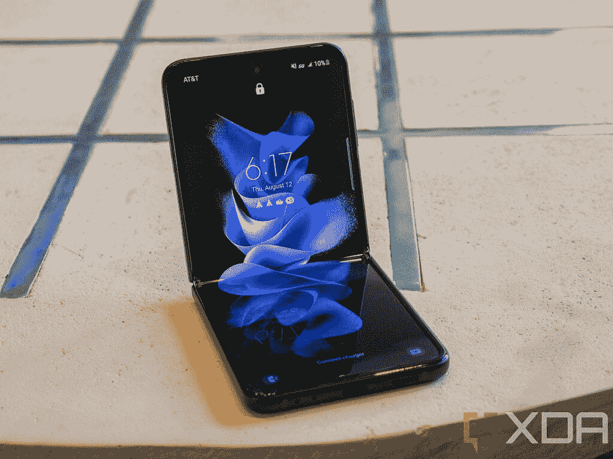
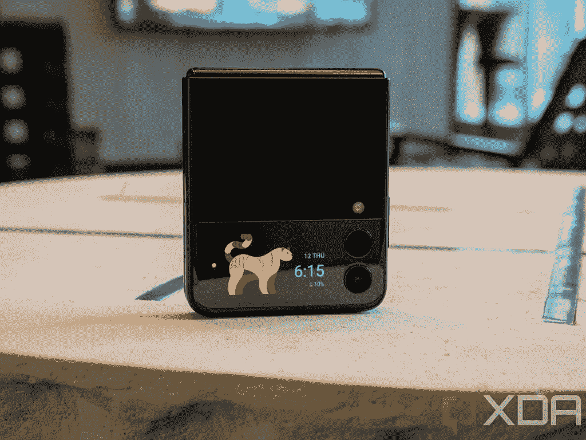
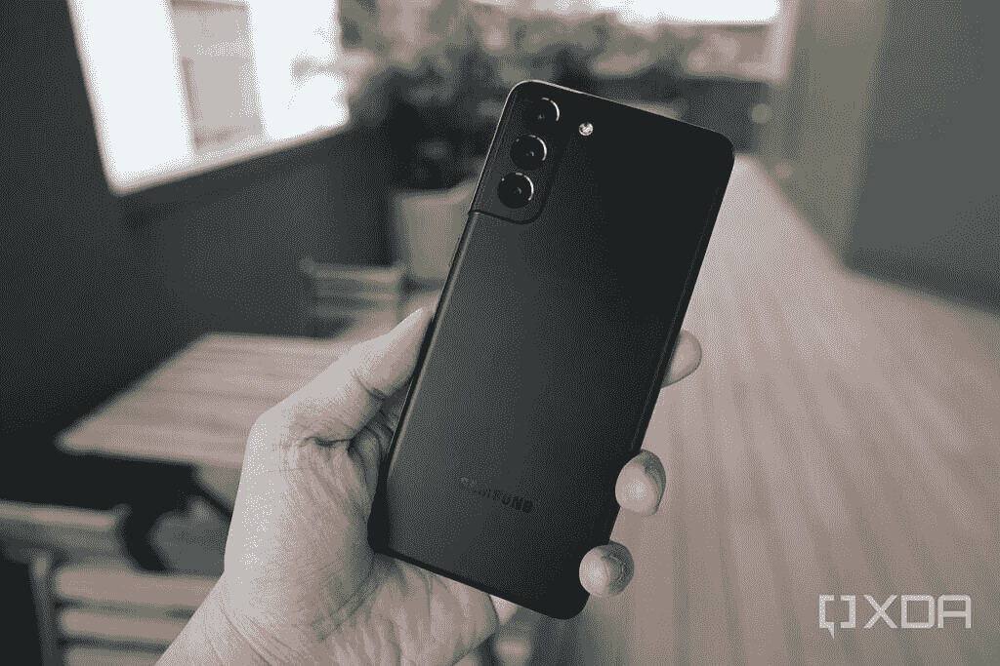
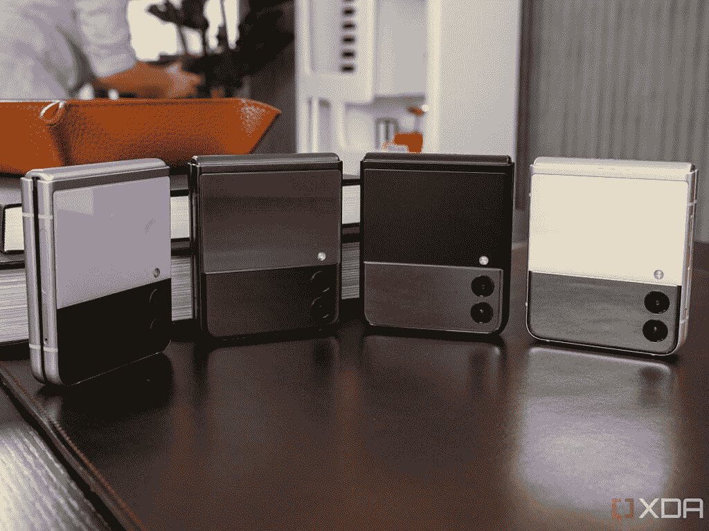

# 三星 Galaxy Z Flip 3 vs Galaxy S21 Plus:该买哪个？

> 原文：<https://www.xda-developers.com/samsung-galaxy-z-flip-3-vs-galaxy-s21-plus/>

三星有两款新的可折叠智能手机——Galaxy Z Fold 3 和 T2 Galaxy Z Flip 3。如果 Galaxy Z Fold 3 的巨大尺寸和整体笨重阻碍了你加入可折叠的行列，你可能会发现 Galaxy Z Flip 3 更受欢迎。在三星的两种可折叠外形中，Galaxy Z Flip 3 最接近传统的手机设计。它看起来类似于老式的翻盖手机，当折叠起来时，它就像地球上几乎所有其他的智能手机一样。由于其顶级的规格，Galaxy Z Flip 3 已经准备好与 Galaxy S21+等常规旗舰产品竞争。但是它能够吗？

**浏览本指南:**

## 三星 Galaxy Z Flip 3 vs Galaxy S21+:规格

| 

规格

 | 

三星 Galaxy Z Flip 3

 | 

三星 Galaxy S21 Plus

 |
| --- | --- | --- |
| **尺寸&重量** | 

*   折叠后:72.2 x 86.4 x 17.1mm 毫米~ 15.9 毫米
*   展开后:72.2 x 166.0 x 6.9mm 毫米
*   183g

 | 

*   161.5 x 75.6 x 7.8mm 毫米
*   202 克

 |
| **显示** | 

*   外部显示器:
    *   1.9 英寸 Super AMOLED
    *   250 x 512302 PPI
*   内部显示屏:
    *   6.7 英寸 FHD+动态 AMOLED 2X
    *   2640 x 1080425 PPI
    *   120Hz 自适应刷新率

 | 

*   6.7 英寸 FHD+动态 AMOLED 2X 显示屏
*   2400 x 1080394PPI
*   120Hz 自适应刷新率

 |
| **SoC** | 

*   高通骁龙 888
    *   1 个 Kryo 680(基于 ARM Cortex X1)Prime core @ 2.84 GHz
    *   3 个 Kryo 680(基于 ARM Cortex A78)性能内核@ 2.4GHz
    *   4 个 Kryo 680(基于 ARM Cortex A55)高效内核@ 1.8GHz
*   Adreno 660 GPU

 | 

*   **国际:** Exynos 2100
    *   1 个 Cortex X1 @ 2.9GHz
    *   3 个 Cortex A78 @ 2.8GHz
    *   4x Cortex A55 @ 2.2GHz
    *   Mali G78MP15 GPU
*   **美国和中国:**高通骁龙 888
    *   1 个 Kryo 680(基于 ARM Cortex X1)Prime core @ 2.84 GHz
    *   3 个 Kryo 680(基于 ARM Cortex A78)性能内核@ 2.4GHz
    *   4 个 Kryo 680(基于 ARM Cortex A55)高效内核@ 1.8GHz
    *   Adreno 660 GPU

 |
| **闸板&存放** | 

*   8GB 内存
*   128/256GB UFS 3.1 存储

 | 

*   8GB
*   128/256 UFS 3.1 存储

 |
| **电池&充电** | 

*   3300 毫安时双芯电池
*   15W 有线充电
*   10W 无线充电
*   4.5W 反向无线充电

 | 

*   4500 毫安时
*   25W USB 供电 3.0 快充
*   10W+无线充电
*   4.5 反向无线充电

 |
| **安全** | 

*   侧装电容式指纹传感器

 | 

*   超声波显示指纹扫描仪

 |
| **后置摄像头** | 

*   **主** : 12MP 广角，f/1.8，双像素自动对焦，OIS
*   **二级** : 12MP 超广角，f/2.2，123 FoV

 | 

*   **主:** 12MP，广角镜头，f/1.8，1.8 m，OIS，双像素自动对焦
*   **次要:** 12MP，超广角镜头，f/2.2，1.4 m
*   **第三:** 64MP 长焦镜头，f/2.0，0.8 m，OIS，3 倍混合光学变焦

 |
| **前置摄像头** | 10MP f/2.4 | 10MP，f/2.2，1.22 米 |
| **端口** | USB 类型-C | USB 类型-C |
| **音频** | 

*   立体声扬声器
*   杜比大气

 | 

*   立体声扬声器
*   杜比大气

 |
| **连通性** | 

*   4X4 MIMI，7CA，LAA，LTE 类别 20
*   SA/NSA 5G (Sub6/mmWave)
*   无线网络 6
*   蓝牙 5.1
*   国家足球联盟

 | 

*   无线网络 6
*   4X4 MIMI，7CA，LAA，LTE 类别 20
*   SA/NSA 5G (Sub6/mmWave)
*   蓝牙 5.0
*   国家足球联盟

 |
| **软件** | 一个基于 Android 11 的 UI | 一个基于 Android 11 的 UI |
| **颜色** | 

*   幻影黑
*   奶油
*   格林（姓氏）；绿色的
*   淡紫色
*   灰色的
*   怀特（姓氏）
*   粉红色

 | 

*   幻影黑
*   幻影银
*   幻影紫

 |

## 设计和展示

 <picture></picture> 

Samsung Galaxy Z Flip 3

Galaxy Z Flip 3 和 Galaxy S21+的设计非常独特，因为它们的外形不同。Galaxy Z Flip 3 有一个可折叠的主显示屏，一个辅助盖屏幕和一个侧装指纹传感器。另一方面，Galaxy S21+配备了一个传统的智能手机屏幕和一个内置指纹传感器。可折叠显示屏还允许 Galaxy Z Flip 3 在折叠时变得相对较小。也就是说，Flip 的柔性屏幕不如 S21+显示屏耐用，后者使用的是康宁的大猩猩玻璃 Victus。

就显示器规格而言，这两款智能手机都有 6.7 英寸全高清+屏幕，刷新率为 120 赫兹。但是它们的分辨率略有不同。S21+的像素为 1080 x 2400，而 Galaxy Z Flip 3 的像素为 1080 x 2640。由于这种分辨率差异，Flip 3 屏幕的每英寸像素(PPI)更多。此外，Flip 3 上的辅助屏幕尺寸为 1.9 英寸，分辨率为 512 x 260 像素。

## SoC、RAM 和存储

 <picture></picture> 

Samsung Galaxy S21 Plus

Galaxy Z Flip 3 和 Galaxy S21+在 SoC、RAM 和存储方面旗鼓相当。在北美，这两款手机都配有高通骁龙 888 芯片，8GB 内存和高达 256GB 的板载存储空间。在 S21+的国际型号上，三星使用 Exynos 2110 芯片，在这种情况下，Galaxy Z Flip 3 在骁龙 888 上的表现更好。

## 三星 Galaxy Z Flip 3 vs Galaxy S21+:相机

镜头前的事情变得有点有趣。在原始相机规格方面，S21+ -的背面有三个相机，一个 12MP 广角自动对焦相机，一个 12MP 定焦超广角相机，一个 64MP 长焦相机，具有相位检测自动对焦和 3 倍混合光学变焦支持。

另一方面，Galaxy Z Flip 3 后置摄像头设置包含一个 12MP 广角摄像头和一个 12MP 超广角摄像头。Flip 3 上没有长焦摄像头。此外，这两款手机都带有一个 10MP 的自拍摄像头。

长焦射手的存在让 Galaxy S21+比 Galaxy Z Flip 3 更有优势。但是，如果长焦对你来说不是一个大问题，两款手机上的其他相机在性能方面不会有很大不同。

## 电池和连接

 <picture></picture> 

Samsung Galaxy Z Flip 3

电池是 Galaxy S21+轻松击败 Galaxy Z Flip 3 的一个领域。翻盖折叠式电池总容量为 3，300 毫安时，而 S21+的电池容量为 4，800 毫安时。有了 Galaxy Z Flip 3 的小电池和 120Hz 显示屏，如果你经常使用主屏，你甚至会很难度过一天。相比之下，Galaxy S21+将轻松度过一天，甚至第二天的很大一部分时间。

Galaxy Z Flip 3 另一个令人失望的地方是缺乏快速有线充电。三星已经在手机上支持仅 15W 的快速充电。另一方面，Galaxy S21+配备了 25W 快速充电，这不是开创性的，但仍然相对更好。因此，如果电池寿命是你的一个大问题，你最好选择 Galaxy S21+而不是 Galaxy Z Flip 3。

在连接方面，这些手机几乎处于同一水平。有 5G、Wi-Fi 6、NFC 和 USB Type-C。在蓝牙方面，Galaxy S21+上有蓝牙 5.0，Galaxy Z Flip 3 上有蓝牙 5.1。

## 操作系统和 Android 更新

 <picture></picture> 

Samsung Galaxy S21 Plus

Galaxy S21+和 Galaxy Z Flip 3 上都有一个 UI 的 Android 11。虽然这两款手机的大部分软件体验是相同的，但该公司增加了一些技巧，以利用 Galaxy Z Flip 3 的柔性屏幕。所有这些功能都是可折叠的特定功能，除了微小的生产改进外，它们没有太大的区别。

三星也将为这两款手机提供相同期限的软件支持。所以总体来说，在软件和更新方面，Galaxy S21+和 Galaxy Z Flip 3 是水平的。

## 三星 Galaxy Z Flip 3 与 Galaxy S21+:定价和颜色选择

 <picture></picture> 

Samsung Galaxy Z Flip 3

三星正在为 Galaxy S21+和 Galaxy Z Flip 3 销售两种存储版本。128GB 的 Flip 3 售价 999.99 美元，256GB 的 Flip 3 售价 1049.99 美元。尽管 Galaxy S21+的上市价格与 Galaxy Z Flip 3 相同，但这款手机的 128GB 版本已经打折至 799.99 美元，256GB 版本为 849.99 美元。

谈到颜色选择，该公司提供了七种令人兴奋的颜色，其中三种是 samsung.com 独有的。S21+只有三种颜色。

## 结论

三星 Galaxy Z Flip 3 令人兴奋。它有几个优势，包括诱人的定价。因此，如果你有预算，并且这款手机的缺点不会影响你的交易，Galaxy Z Flip 3 值得你认真考虑一下。

 <picture></picture> 

Samsung Galaxy Z Flip 3

Galaxy Flip 3 是三星的新款翻盖式可折叠手机。它采用 6.7 英寸 120Hz 柔性屏幕和骁龙 888 SoC。

另一方面，Galaxy S21+是一个更安全的选择，现在比推出时实惠多了。

 <picture></picture> 

Samsung Galaxy S21 Plus

##### 三星 Galaxy S21 Plus

三星 Galaxy S21 Plus 是 2021 年新旗舰系列中的老二，集旗舰 SoC 和高级构建于一身，配有体面的显示屏和摄像头设置。

那么这两款三星智能手机你打算买哪一款呢？请在评论区告诉我们。如果你打算购买 Galaxy Z Flip 3，请查看我们的[最佳交易](https://www.xda-developers.com/best-galaxy-z-flip-3-deals/)和[最佳案例](https://www.xda-developers.com/best-galaxy-z-flip-3-cases/)文章，进一步帮助你购买。