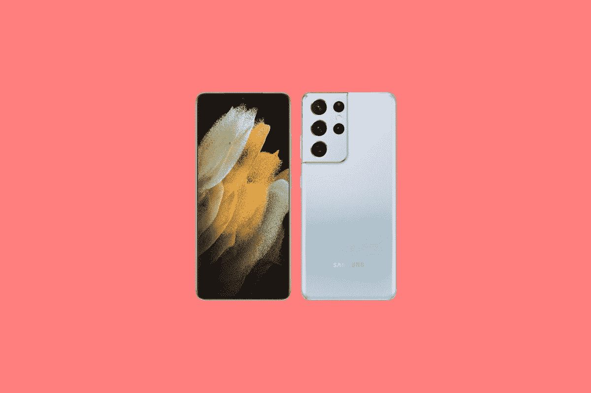

# 三星 Galaxy Z Flip 3 vs Galaxy S21 Ultra:折叠还是不折叠

> 原文：<https://www.xda-developers.com/samsung-galaxy-z-flip-3-vs-galaxy-s21-ultra/>

三星的 [Galaxy Z Flip 3](https://www.xda-developers.com/samsung-galaxy-z-flip-3/) 现已正式发布，如果你打算升级到新的三星手机，你必须做出一些决定。如果你想要最好的，其实有很多选择，包括全新的 [Galaxy Z Fold 3](https://www.xda-developers.com/samsung-galaxy-z-fold-3/) ，Galaxy Z Flip 3，以及 [Galaxy S21 Ultra](https://www.xda-developers.com/samsung-galaxy-s21/) 。你大概能猜到，每一个都有自己独特的优势。消费技术总是如此，没有放之四海而皆准的解决方案。

当你在考虑三星 Galaxy Z Flip 3 与三星 Galaxy S21 Ultra 时，有两个主要的优先事项需要考虑。

*   你想要一部折叠起来更小巧的手机吗？
*   你想要最新最棒的智能手机拍照技术吗？

### 三星 Galaxy Z Flip 3 和 S21 Ultra 规格

## 三星 Galaxy Z Flip 3 与 Galaxy S21 Ultra:规格

|  | 

三星 Galaxy Z Flip 3

 | 

三星 Galaxy S21 Ultra

 |
| --- | --- | --- |
| 

中央处理器

 | 5 纳米 64 位八核处理器(2.84GHz + 2.4GHz + 1.8GHz) | 5 纳米 64 位八核处理器(2.8GHz + 2.4GHz + 1.8GHz) |
| 

身体

 | 折叠后:72.2 x 86.4 x 17.1 毫米折叠后:72.2 x 166 x 6.9 毫米重量:183 克 | 165.1 x 75.6 x 8.9 毫米重量:227 克 |
| 

显示

 | 主屏幕:6.7 英寸 FHD+动态 AMOLED 2X 显示屏(22:9)Infinity Flex 显示屏 2，640x1，080，425ppi，120Hz 自适应刷新率覆盖屏幕:1.9 英寸 Super AMOLED 显示屏 260x512，302ppi | 6.8 英寸四核高清+动态 AMOLED 2XInfinity-O 显示屏(3，200x1，440)，515ppi，120Hz 刷新率 |
| 

照相机

 | 1200 万像素 f/1.8 宽(OIS，双像素 AF)+1200 万像素 f/2.2 超宽前置:100 万像素 f/2.4 | 108MP f/1.8 宽(1/1.33 英寸，OIS PDAF)+12MP f/2.2 超宽(超高速双像素 AF)+10MP f/2.4 3 倍长焦(双像素 AF)+10MP f/4.9 10 倍长焦(双像素 AF)前置:40MP f/2.2 |
| 

记忆

 | 8GB 内存、128GB/256GB UFS 3.1 存储 | 16GB RAM (LPDDR5)带 512GB 内部存储 12GB RAM (LPDDR5)带 256GB 内部存储 12GB RAM (LPDDR5)带 128GB 内部存储 |
| 

电池

 | 3300 毫安时双电池 | 5000 毫安时 |
| 

网络

 | LTE:增强型 4X4 MIMO，7CA，LAA，LTE Cat。205G:非独立(NSA)，独立(SA)，Sub6 / mmWave |
| 

抗水性

 | IPX8 | IP68 |
| 

传感器

 | 电容式指纹传感器(侧面)、加速度计、气压计、陀螺仪传感器、地磁传感器、霍尔传感器(模拟)、接近传感器、光线传感器 | 超声波指纹传感器、加速度计、气压计、陀螺仪传感器、地磁传感器、 霍尔传感器、 接近传感器、 环境光传感器 |
| 

操作系统（Operating System）

 | 安卓 11 |
| 

颜色；色彩；色调

 | 奶油色、绿色、淡紫色、幻影黑、灰色、白色、粉色 | 幻影黑、幻影银、幻影钛、幻影海军、幻影棕 |
| 

价格

 | 起价 999.99 美元 | 起价 1199.99 美元 |

## 三星 Galaxy Z Flip 3 vs Galaxy S21 Ultra:设计和显示

Galaxy Z Flip 3 的关键指标是你可以将其对折，使其更加紧凑。事实上，这就是这个设备的全部意义。最初的 Galaxy Fold 的想法是将一个普通的手机大小的设备展开成更大的东西。有了 Galaxy Z Flip，你可以拿起一个类似大小的设备，将其折叠成更小的东西。

Galaxy Z Flip 3 上的主屏没有变，但外屏变了，而且更大了。外部屏幕现在是 1.9 英寸而不是 1.1 英寸，保持了类似的 302ppi 像素密度。这是为了快速查看时间、通知等。

主屏幕为 6.7 英寸，分辨率为 2，640 x 1，080，长宽比为 22:9。Galaxy S21 Ultra 的屏幕实际上要大得多，为 6.8 英寸，长宽比为 20:9。请记住，屏幕尺寸是按对角线测量的，随着长宽比越来越接近正方形，相同对角线尺寸的表面积就越大。在这种情况下，0.1 英寸的差异比听起来要大得多。

它也有更高的分辨率，达到 3,200 x 1,440，尽管它们都提供 120Hz 的刷新率。S21 Ultra 的像素密度为 515ppi，而 Galaxy Z Flip 3 的像素密度为 425ppi。

在这次对比中看屏幕的时候，Galaxy S21 Ultra 更胜一筹。那也是应该的。当你坚持一个已经使用了 15 年的行业标准——意味着一个矩形设备——就很容易把它的其余部分做到最好。另一方面，Galaxy Z Flip 的外形可能会赢得你的青睐。

让我们也来谈谈设计，因为三星 Galaxy Z Flip 3 更轻，打开后更薄。它的重量为 183 克，比 Galaxy S21 Ultra 轻 44 克。它更轻的事实符合它更紧凑的理念。只是更容易随身携带。虽然 Galaxy S21 Ultra 已经成为市场上最好的智能手机之一，但必须考虑到它相当大、笨重。大多数人认为这对于日常长时间使用是不切实际的。

然而，Galaxy Z Flip 折叠时的厚度为 17.1 毫米，而 Galaxy S21 Ultra 为 8.9 毫米。请记住，Z Fold 3 折叠时的尺寸为 72.2 x 86.4mm 毫米，而 Galaxy S21 Ultra 的尺寸为 165.1 x 75.6mm 毫米。这意味着如果你有更小的口袋或袋子来携带设备，Galaxy Z Flip 3 就是合适的选择。

## 三星 Galaxy Z Flip 3 vs Galaxy S21 Ultra:相机

三星 Galaxy S21 系列的所有产品都非常棒，但有一件事让 Galaxy S21 Ultra 真正脱颖而出，事实上也是市场上的其他产品。我说的是相机。Galaxy S21 Ultra 相机的硬件是周围最好的，不，Galaxy Z Flip 3 甚至没有接近。

但是在我们看规格之前，让我们记住它不应该接近。三星 Galaxy S21 Ultra 相机是我所说的发烧友相机。它是为那些想要最好的东西的人准备的，你不需要为了获得非凡的相机体验而接近它。

三星 Galaxy S21 Ultra 拥有 108MP f/1.8 1/1.33 英寸的主传感器。这已经是最好的了。更大的传感器意味着它可以让大量的光线进入，从而实现出色的弱光性能。最重要的是，108MP 分辨率使用 9:1 像素宁滨，在 12MP 图像中实现更好的低光性能。

这还不是全部，因为它有一个 3 倍和 10 倍的长焦镜头。这么想吧。如果你的相机只有一个镜头，它可以看到一个特定的视野，而这个视野又被分成特定数量的像素。如果你用那个镜头进行数码放大，除了一些软件技巧之外，效果基本上就像你根本没有放大就拍了照片，只是简单地裁剪了一下。

使用专用变焦镜头，你几乎是在使用视野较小但分辨率相似的东西。这允许在这些范围内进行无损缩放。这也带来了其他问题，例如长焦镜头在弱光下工作不太好，因为它在定义上更小，但也有软件技巧。

通过 3 倍变焦和 10 倍变焦镜头，这开辟了许多可能性，其中最少的是 10 倍无损变焦。但是这些镜头可以一起工作来做一些很酷的事情。当然，你走得越高，你看到的损失就越多。这款相机实际上可以放大 100 倍，尽管你可能不想这样使用它。

既然我们已经谈论了 Galaxy S21 Ultra 的功能，我们就来谈谈三星 Galaxy Z Flip 3。它只是有两个 12MP 传感器，其中一个主传感器也有一个 f/1.8 光圈。这是一个很好的相机，虽然更主流。事实上，即使与高端相机相比，仍然没有长焦镜头。如果你正在寻找一款能够完成社交媒体和家庭照片拍摄任务的相机，这款相机将非常适合。但是这里没有太多的空间来玩，因为 Ultra 的铃声和哨声在这里消失了。

最后，它们都有 12MP f/2.2 超宽传感器，似乎一刀切。

## 结论:你应该得到哪一个？

就像我之前说的，这两款手机都有自己的特点。没有简单的、放之四海而皆准的解决方案，我可以说一个比另一个好。但我们又回到了起点。你是在寻找一个可以折叠的屏幕，还是在寻找最新最棒的智能手机相机技术？

三星 Galaxy Z Flip 3 是一款紧凑的设备。如果你正在寻找不占你口袋太多空间的东西，别再找了。事实上，如果你不寻求紧凑的外形，你可能会更喜欢三星 Galaxy Z Fold 3。它还有更漂亮的颜色，包括奶油色、绿色、淡紫色、幻影黑、灰色、白色和粉红色，所以它更有趣。三星 Galaxy S21 Ultra 的主要颜色是幻影黑和幻影银，尽管如果你直接从 Samsung.com 购买，也有一些专属颜色。

 <picture></picture> 

Samsung Galaxy Z Flip 3

三星 Galaxy Z Flip 3 采用翻盖手机外形，并将其提升到一个新的水平。

如果你想要最高端的相机，三星 Galaxy S21 Ultra 确实是你想要的。如果你想要传统的外形而不需要这款相机，你可以选择 S21 或 S21+之类的产品。

 <picture></picture> 

Samsung Galaxy S21 Ultra

三星 Galaxy S21 Ultra 以其相机印章而闻名，但它拥有一切。

就性能而言，这两款设备是一样的。Galaxy S21 Ultra 的价格在技术上比 Galaxy S21 Ultra 高一点，但你通常可以找到与 Galaxy Z Flip 3 差不多的价格。

换句话说，这很简单。你只需要把它分解成你想要的两个关键值指标中的一个。

如果你决定购买三星 Galaxy Z Flip 3，你可以在这里[找到最优惠的价格](https://www.xda-developers.com/best-galaxy-z-flip-3-deals/)，或者在这里[拿起一个箱子](https://www.xda-developers.com/best-galaxy-z-flip-3-cases/)。