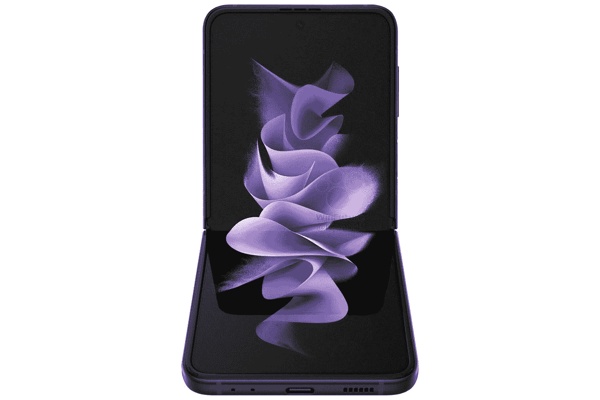
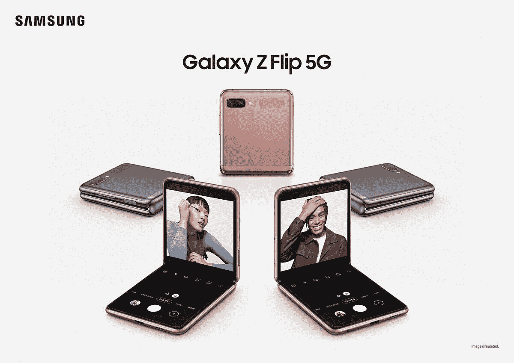

# 三星 Galaxy Z Flip 3 与 Galaxy Z Flip 5G:有意义的改进

> 原文：<https://www.xda-developers.com/samsung-galaxy-z-flip-3-vs-galaxy-z-flip/>

全新的[三星 Galaxy Z Flip 3](https://www.xda-developers.com/samsung-galaxy-z-flip-3/) 正式发布，如果你对折叠翻盖手机领域感到失望(没错；我去了)，你可能想知道它与上一代车型相比如何。这不是那种一个对某些人更好而另一个对其他人更好的比较。显然，Galaxy Flip 3 是更好的产品；事实上，如果新型号不比旧型号更好，这将是三星的一个真正问题。

从名字可以推断，这是第三代机型，第一代是 Galaxy Z Flip，第二代是 Galaxy Z Flip 5G。这些年来改变的事情真的屈指可数。

### 三星 Galaxy Z Flip 3 vs 三星 Galaxy Z Flip 5G 规格

|  | 

三星 Galaxy Z Flip 3

 | 

三星 Galaxy Z Flip 5G

 |
| --- | --- | --- |
| 

中央处理器

 | 5 纳米 64 位八核处理器(2.84GHz + 2.4GHz + 1.8GHz) | 7 纳米 64 位八核处理器(2.95GHz + 2.41GHz + 1.78GHz) |
| 

身体

 | 折叠后:72.2 x 86.4 x 17.1 毫米折叠后:72.2 x 166 x 6.9 毫米重量:183 克 | 折叠后:73.6 x 87.4 x 17.4 毫米折叠后:73.6 x 167.3 x 7.2 毫米重量:183 克 |
| 

显示

 | 主屏幕:6.7 英寸 FHD+动态 AMOLED 2X 显示屏(22:9)Infinity Flex 显示屏 2，640x1，080，425ppi，120Hz 自适应刷新率覆盖屏幕:1.9 英寸 Super AMOLED 显示屏 260x512，303ppi | 主屏幕:6.7 英寸 FHD+动态 AMOLED 2X 显示屏(22:9)Infinity Flex 显示屏 2，640x1，080，425 像素屏幕:1.1 英寸 Super AMOLED 显示屏 112x300，303 像素 |
| 

照相机

 | 1200 万像素 f/1.8 宽(OIS，双像素 AF)+1200 万像素 f/2.2 超宽前置:100 万像素 f/2.4 |
| 

记忆

 | 8GB 内存、128GB/256GB UFS 3.1 存储 | 8GB 内存，256GB UFS 3.1 存储 |
| 

电池

 | 3300 毫安时双电池 |
| 

网络

 | LTE:增强型 4X4 MIMO，7CA，LAA，LTE Cat。205G:非独立(NSA)，独立(SA)，Sub6 / mmWave |
| 

抗水性

 | IPX8 | 没有评级 |
| 

传感器

 | 电容式指纹传感器(侧面)、加速度计、气压计、陀螺仪传感器、地磁传感器、霍尔传感器(模拟)、接近传感器、光线传感器 | 指纹(侧面安装)、加速度计、陀螺仪、接近度、指南针、气压计 |
| 

操作系统（Operating System）

 | 安卓 11 |
| 

颜色；色彩；色调

 | 奶油色、绿色、淡紫色、幻影黑、灰色、白色、粉色 | 神秘的青铜色，神秘的灰色，神秘的白色 |
| 

价格

 | 起价 999.99 美元 | $1,199.99 |

## 设计和显示:三星 Galaxy Z Flip 3 继续发展

虽然三星 Galaxy Z Flip 3 的重量与上一代产品相同，为 183 克，但宽度却减少了 0.3 毫米。事实上，在其他尺寸上，它更紧凑一点，最多 1.4 毫米。换句话说，除非你将这两款手机并排放置，否则你不会看到明显的区别。

虽然有一堆新的颜色，但实际上很重要。广泛的颜色范围意味着它是一个更成熟的产品；这是一个已经证明了自己的产品，它将继续存在。本质上更具实验性的全新产品往往只有一种或两种颜色，因为如果设备失败，这只会使制造过程中的物流更容易。

Galaxy Z Flip 3 有奶油色、绿色、淡紫色、幻影黑、灰色、白色和粉红色，是我们在发布会上看到的任何 Z Flip 颜色的两倍多。三星 Galaxy Z Flip 5G 有神秘的青铜色、神秘的灰色和神秘的白色。更多的选择对每个人来说都更好，特别是因为这款手机是一种时尚。

当你打开任一设备时，主显示屏几乎是相同的，是 6.7 英寸 FHD+ 22:9 折叠有机发光二极管显示屏。一个很大的区别是 Galaxy Z Flip 3 的刷新率为 120Hz，这意味着你将看到更流畅的移动。不过，这一代人的外观有很大不同。

与 Galaxy Z Flip 5G 的 1.1 英寸屏幕相比，三星 Galaxy Z Flip 3 的外部将有 1.9 英寸的 Super AMOLED 显示屏。这个外部屏幕用于显示时间、查看通知等，但更大的屏幕允许使用更多图像。只是更漂亮。

新的三星 Galaxy Z Flip 3 的另一个关键区别是它的 IPX8 等级，所以它非常防水。这是 Galaxy Z Flip 设备首次获得*任何*防水评级，因此这是一件大事。

## 性能:进入骁龙 888

正如你从上面的规格表中看到的，三星通常对其手机中的处理器的实际说法有些模糊。众所周知，那是因为它根据你居住的地方使用不同的芯片组。在美国，你会得到一个高通骁龙处理器。Galaxy Z Flip 3 是旗舰产品骁龙 888，是目前安卓手机中最好的。

这是来自三星 Galaxy Z Flip 5G 中的骁龙 865+。两者都是 5G 芯片组，但骁龙 888 比骁龙 865+跨越了整整一代。值得注意的是，这是整整一代人的飞跃，因为也有增量改进，如骁龙 870。

骁龙 888 拥有全新的第六代高通人工智能引擎，由新的 Hexagon 780 DSP 推动。这与 Adreno 660 GPU 相结合，后者承诺速度快 35%，效率高 20%，CPU 有一个强大的 Cortex-X1 内核。

两台设备上的摄像头是一样的，至少就传感器而言是这样的。骁龙 888 拥有新的 Spectra 580 ISP，比其前身快 35%，每秒捕捉 2.7 千兆像素。它还是一个三 ISP，这意味着你可以同时用三个传感器捕捉图像，尽管这可能对 Galaxy Z Flip 3 不是特别有用，因为它只有两个后置传感器。

像相机一样，这两款设备的电池是相同的，但请记住，电池寿命是另一个会受到芯片组变化影响的因素。

作为消费者，这一切对你意味着什么？老实说，对于绝大多数人来说，可能不多。如果你花 1000 美元买一部手机，显然你想要最好的性能。然而，如果你仍然在使用三星 Galaxy Z Flip 5G，你并不完全缺乏。

## 结论:应该买哪个？

如果你想知道是否应该从三星 Galaxy Z Flip 5G 升级，这取决于你有多想要新的。对大多数人来说，答案可能是否定的。但是这些人现在并没有在研究这个问题。

就像我一开始说的，三星 Galaxy Z Flip 显然是更好的产品。它有更好的处理器，这意味着你更适应未来，它有更多的颜色，它有更大的外部显示器，内部显示器有 120 赫兹的刷新率。

我们没有谈到的一件事是价格。三星 Galaxy Z Flip 3 的售价为 999 美元，对于一款配备可折叠显示屏的手机来说，这确实非常不错。即使三星对上一代机型打折，搭配新款可能也是更好的选择。

 <picture></picture> 

Samsung Galaxy Z Flip 3

三星 Galaxy Z Flip 3 遵循了翻盖手机风格的趋势，但采用了可折叠显示屏。

三星 Galaxy Z Flip 3 也有一些有趣的案例，你可以查看，你也可以[在这里查看我们的交易综述](https://www.xda-developers.com/best-galaxy-z-flip-3-deals/)。

 <picture></picture> 

Samsung Galaxy Z Flip 5G

##### 三星 Galaxy Z Flip 5G

到 2021 年，三星 Galaxy Z Flip 5G 仍然是一款非常棒的翻盖可折叠手机。