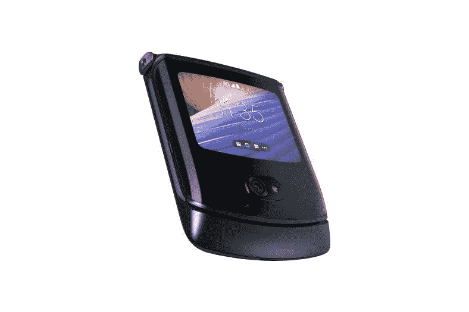

# 三星 Galaxy Z Flip 3 vs 摩托罗拉 RAZR 5G:折叠翻盖手机大战

> 原文：<https://www.xda-developers.com/samsung-galaxy-z-flip-3-vs-motorola-razr-5g/>

有两种折叠智能手机——一种是智能手机大小的设备，可以打开成平板电脑大小的设备，另一种是智能手机大小的设备，可以折叠成更紧凑的东西。如果你在寻找后者，你有两个选择，三星 Galaxy Z Flip 3 和摩托罗拉 RAZR 5G。

虽然外形基本相同，但它们是非常不同的设备。

### 三星 Galaxy Z Flip 3 vs 摩托罗拉 RAZR 5G

|  | 

三星 Galaxy Z Flip 3

 | 

摩托罗拉 RAZR 5G

 |
| --- | --- | --- |
| 

中央处理器

 | 5 纳米 64 位八核处理器(2.84GHz + 2.4GHz + 1.8GHz) | 高通骁龙 765G，Adreno 620 GPU |
| 

身体

 | 折叠后:72.2 x 86.4 x 17.1 毫米折叠后:72.2 x 166 x 6.9 毫米重量:183 克 | 折叠后:72.6 x 91.7 x 16 毫米折叠后:72.6 x 169.2 x 7.9 毫米重量:192 克 |
| 

显示

 | 主屏幕:6.7 英寸 FHD+动态 AMOLED 2X 显示屏(22:9)Infinity Flex 显示屏 2，640x1，080，425ppi，120Hz 自适应刷新率覆盖屏幕:1.9 英寸 Super AMOLED 显示屏 260x512，302ppi | 主屏幕:6.2 英寸 2，142x876 可折叠塑料有机发光二极管，21:9，373 微微屏幕:2.7 英寸 800x600 玻璃有机发光二极管触摸屏，4:3 |
| 

照相机

 | 1200 万像素 f/1.8 宽(OIS，双像素 AF)+1200 万像素 f/2.2 超宽前置:100 万像素 f/2.4 | 4800 万四像素，1200 万输出，f/1.7 (OIS，激光自动对焦)前置:200 万四像素，f/2.2 |
| 

记忆

 | 8GB 内存、128GB/256GB UFS 3.1 存储 | 8GB 内存，256GB 存储空间 |
| 

电池

 | 3300 毫安时双电池 | 2800 毫安时 |
| 

网络

 | LTE:增强型 4X4 MIMO，7CA，LAA，LTE Cat。205G:非独立(NSA)，独立(SA)，Sub6 / mmWave | 5G: NR Sub-6GHz4G: LTE (DL Cat 18) |
| 

抗水性

 | IPX8 | 防水剂 |
| 

传感器

 | 电容式指纹传感器(侧面)、加速度计、气压计、陀螺仪传感器、地磁传感器、霍尔传感器(模拟)、接近传感器、光线传感器 | 加速度计、磁力计(指南针)、陀螺仪、气压计、超声波、接近度、环境光、SAR |
| 

操作系统（Operating System）

 | 安卓 11 | 安卓 10 |
| 

颜色；色彩；色调

 | 奶油色、绿色、淡紫色、幻影黑、灰色、白色、粉色 | 抛光石墨 |
| 

材料

 | 装甲铝 | 7000 系列铝、不锈钢铰链 |
| 

价格

 | 起价 999.99 美元 | $999.99 |

## 设计和展示:三星 Galaxy Z Flip 是 FHD，但摩托罗拉 RAZR 不是

三星 Galaxy Z Flip 3 的主显示屏在各方面都更好。它更大、更高、分辨率更高、像素密度更高。它的分辨率为 2，640 x 1，080，比摩托罗拉的 2，142 x 876 屏幕好得多，后者甚至称不上全高清。

老实说，这并不重要。原因如下。摩托罗拉 RAZR 的设计考虑到了怀旧。这是 2004 年热门翻盖手机的翻拍版，但作为一款可折叠屏幕的智能手机。Galaxy Z Flip 是你想要的，如果你想要一个类似的外形，但实际上是一个高端设备。

RAZR 5G 确实比最初的型号有很多改进。它制作了更耐用的显示屏，将指纹传感器移到了后面，并改进了下巴。

虽然摩托罗拉 RAZR 5G 有抛光石墨、液态汞和腮红金等颜色，但三星提供的种类更多。Galaxy Z Flip 3 有奶油色、绿色、淡紫色、幻影黑、灰色、白色和粉红色。

这还不是全部，因为外面的屏幕是不同的。三星将外部屏幕增加到 1.9 英寸，比上一代机型的 1.1 英寸屏幕有所改进。摩托罗拉在外部配备了一个 2.7 英寸 600 x 800 的屏幕，让你可以做更多的事情。

## 相机、性能和电池寿命:三星 Galaxy Z Flip 3 击败了摩托罗拉 RAZR 5G

这里有一个反复出现的主题，那就是三星 Galaxy Z Flip 3 一直在击败摩托罗拉 RAZR 5G。可能有所不同的一个方面是 RAZR 使用了 48MP f/1.7 主传感器，具有四像素宁滨，以实现更好的弱光性能。Galaxy Z Flip 有一个 12MP f/1.8 传感器，所以虽然两者都产生 12MP 图像，但三星的翻盖手机没有像素宁滨。

另一方面，Galaxy Z Flip 3 有一个用于超宽拍摄的辅助镜头。RAZR 5G 只有一个后置摄像头。事实上，它可能是市场上最贵的单镜头相机。

摩托罗拉 RAZR 5G 无疑是中端产品，而 Galaxy Z Flip 3 则是高端产品。超出了摄像机的范围。摩托罗拉使用的是骁龙 765G 处理器，而三星使用的是高通骁龙 888，所以你会得到很大的性能提升。

三星使用更大的电池，3300 毫安时，而摩托罗拉是 2800 毫安时。这些手机的唯一共同点是它们都是翻盖手机风格的可折叠智能手机。

## 结论:应该买哪个？

这种外形有一些真正的好处。它允许手机适应更小的尺寸，这意味着它占用更少的空间。如果你有放手机的小口袋或小袋子，你就能很好地使用这些设备。

但如果你要在摩托罗拉 RAZR 5G 和三星 Galaxy Z Flip 5G 之间做出选择，答案无疑是三星的解决方案。RAZR 5G 在很大程度上仍然是一款怀旧手机，至少与其主要竞争对手相比是如此。

三星的 Galaxy Z Flip 3 拥有骁龙 888、双后置摄像头、1.9 英寸外部显示屏、6.7 英寸内部显示屏等等。至于折叠翻盖手机的费用，这是你能做的最好的。

在你购买之前，请务必查看我们的三星 Galaxy Z Flip 3 的[交易综述。我们还收集了新病例](https://www.xda-developers.com/best-galaxy-z-flip-3-deals/)的[。](https://www.xda-developers.com/best-galaxy-z-flip-3-cases/)

 <picture></picture> 

Samsung Galaxy Z Flip 3

三星 Galaxy Z Flip 3 采用翻盖手机外形，并将其提升到一个新的水平。

 <picture></picture> 

Motorola RAZR 5G

##### 摩托罗拉 Razr 5G

摩托罗拉 RAZR 5G 是几十年前流行的翻盖手机的回归，但具有可折叠的有机发光二极管屏幕。