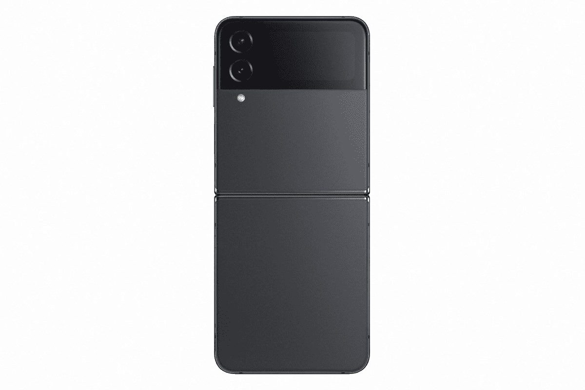
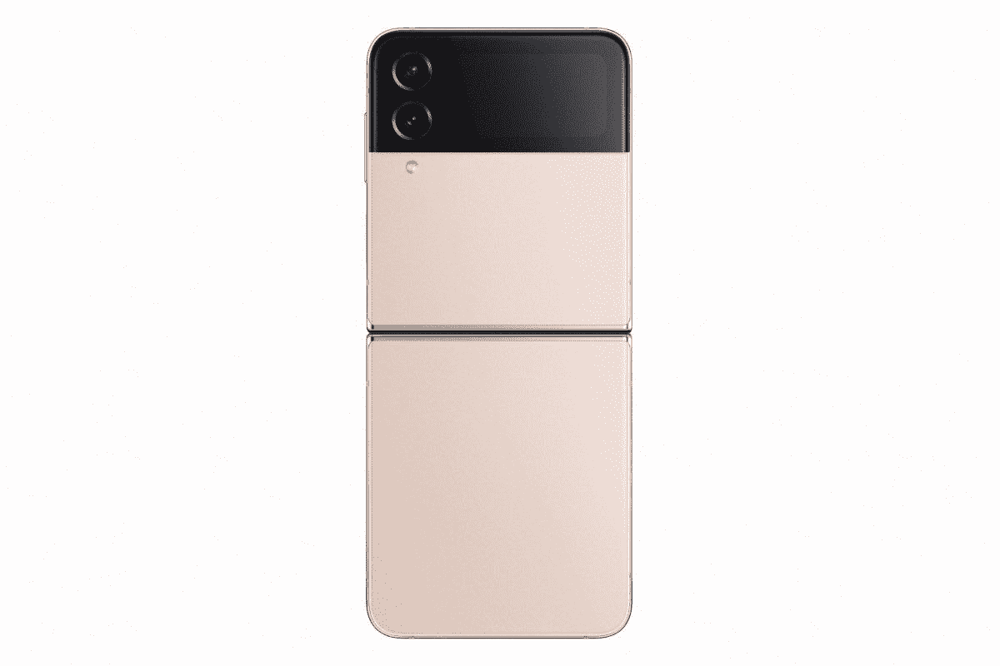
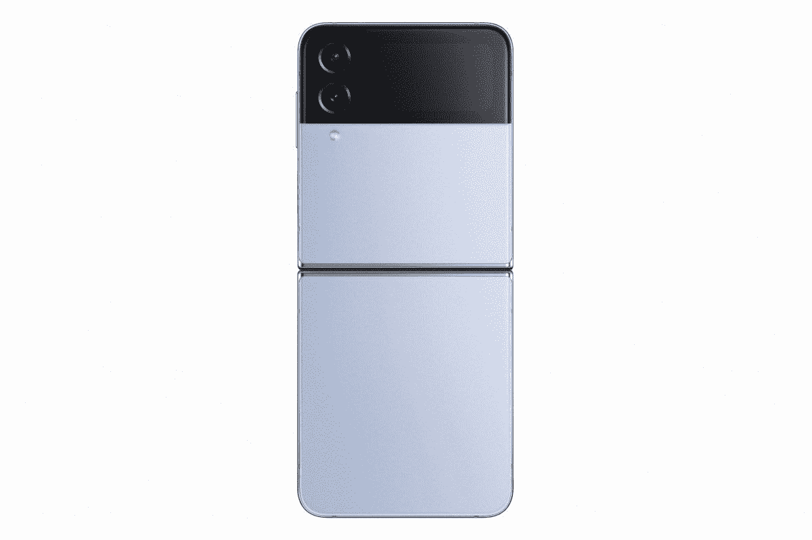

# 三星 Galaxy Z Flip 4 有哪些颜色？

> 原文：<https://www.xda-developers.com/samsung-galaxy-z-flip-4-colors/>

三星 Galaxy Z Flip 4 是三星的新款翻盖式可折叠智能手机，在前代产品的基础上进行了许多改进。新的可折叠更加紧凑，采用了略有不同的铰链设计，显示屏周围的边框更薄。尽管该公司对这款设备做了一些物理上的改变，但我们认为它看起来与 Galaxy Z Flip 3 大致相同。这也意味着 Galaxy Z Flip 4 标榜一种酷的双色调设计，并有一系列不同的配色。你可以买到这种特殊的可折叠石墨，宝来紫，玫瑰金和蓝色。

## 三星 Galaxy Z Flip 4 的所有标准颜色

与 Galaxy Z Flip 3 不同，Galaxy Z Flip 3 在所有零售渠道中有多达 7 种不同的颜色，该公司仅宣布了 Galaxy Z Flip 4 的 4 种颜色。波拉紫色配色——最近宣布为 Galaxy S22 系列的官方色调——现在是 Galaxy Z Flip 4 的标志性颜色。此外，你还可以购买石墨色、玫瑰金和蓝色的 Galaxy Z Flip 4。所有颜色的变体都有双色调饰面和颜色匹配的铝装甲框架，以实现统一的外观和感觉。正如你所见，双色调饰面在石墨变型上更加微妙，但在其他颜色上非常突出。

 <picture></picture> 

Samsung Galaxy Z Flip 4

Galaxy Z Flip 4 的石墨灰色变体看起来就像 Galaxy Z Flip 3 的幻影黑色配色。这将是大多数喜欢基本外观的用户的默认颜色。

 <picture></picture> 

Samsung Galaxy Z Flip 4

三星的新宝来紫色色调是新款 Galaxy Z Flip 4 的标志性颜色。它配有颜色匹配的铝框架，在今年的其他颜色中脱颖而出。

 <picture></picture> 

Samsung Galaxy Z Flip 4

玫瑰金也是 Galaxy Z Flip 4 非常独特的颜色。Galaxy Z Flip 3 的“奶油色”看起来最接近玫瑰金，但它仍然与我们见过的三星产品有很大不同。

 <picture></picture> 

Blue

你还可以拿起 Galaxy Z Flip 4 的当代蓝色饰面，我们认为这是手机最令人兴奋的颜色之一。

你可以随时查看我们的 [Galaxy Z Flip 4 评测](https://www.xda-developers.com/samsung-galaxy-z-flip-4-hands-on/)，看看可折叠手机在营销之外的表现。

## Galaxy Z Flip 4 定制版

除了四种官方颜色，三星还宣布了 Galaxy Z Flip 4 的定制版。你可以从 Samsung.com 定制和购买定制版，它有多达 75 种独特的光泽颜色组合，让你的设备感觉独一无二。作为定制版的一部分，你可以定制前后面板，以及框架和铰链的颜色，让它成为你自己的 Galaxy Z Flip 4。您可以选择黄色、红色、海军蓝、卡其色和白色作为前面板和后面板，同时您可以选择金色、银色和黑色作为框架和铰链颜色。只有黑色的框架和铰链是哑光的，其他部分都是光滑的。

看起来定制版可能没有太多的颜色可供选择，但你可以想出一些很酷的组合，让你的 Galaxy Z Flip 4 比官方色调更好。然而，定制版的可用性必然会因运营商、型号和国家而异，所以最好在您所在国家的三星官方网站上查看是否在您所在的地区有售。

## 结束语

与几乎所有三星旗舰手机一样，Galaxy Z Flip 4 未来也可能获得更多颜色选择。我们还可能会看到手机的一些 Samsung.com 专属颜色，通常与预购清单一起发布。如果你喜欢该公司的整体设计和所有其他改进，那么我们建议你查看我们的 [Galaxy Z Flip 4 交易页面](https://www.xda-developers.com/best-samsung-galaxy-z-flip-4-deals/)，看看在哪里可以在线获得这款手机的最佳价格。我们还收集了一些[最佳 Galaxy Z Flip 4 保护套](https://www.xda-developers.com/best-samsung-galaxy-z-flip-4-cases/)，供您查看，以防您想要为您的设备提供一些保护。