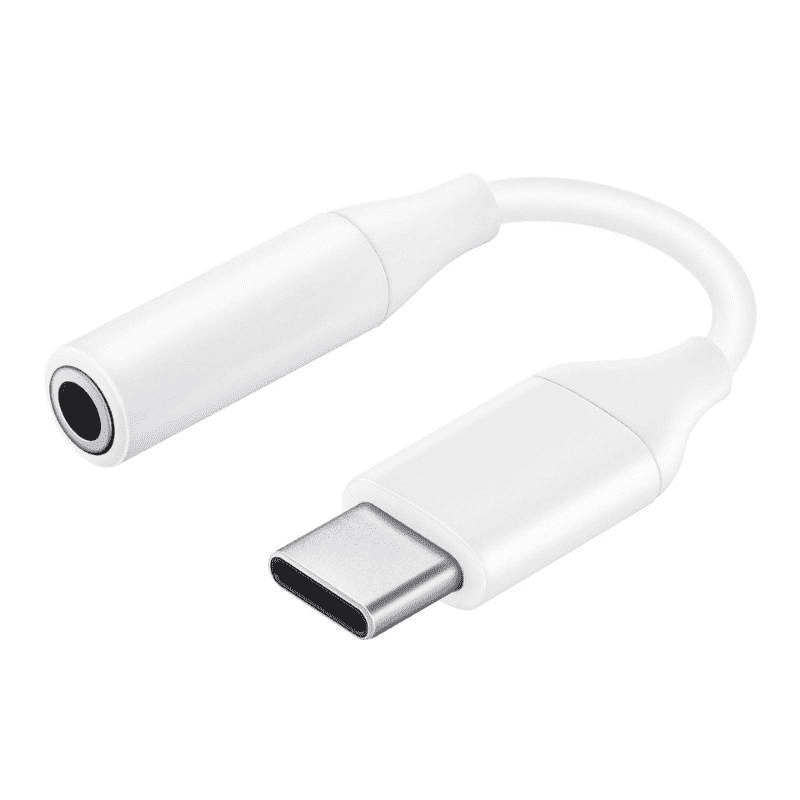

# 三星 Galaxy Z Flip 4 有耳机插孔吗？

> 原文：<https://www.xda-developers.com/samsung-galaxy-z-flip-4-headphone-jack/>

# 三星 Galaxy Z Flip 4 有耳机插孔吗？

如果你打算在 Galaxy Z Flip 4 上使用 3.5 毫米耳机，那么你可能需要一个适配器，因为它没有 3.5 毫米端口。

三星似乎对 [Galaxy Z Flip 4](https://www.xda-developers.com/samsung-galaxy-z-flip-4-hands-on/) 做了很多改进，使其成为去年翻盖可折叠的坚实继任者。Galaxy Z Flip 4 现在更紧凑，显示屏周围的边框更薄，与 Galaxy Z Flip 3 相比也更耐用。它也有一个强大的规格表，有几个新的补充，包括骁龙 8 加第 1 代芯片组，略有改进的摄像头，等等。如果你想买 Galaxy Z Flip 4，你可能会想知道 3.5 毫米耳机插孔是否是其详尽规格表的一部分。毕竟，它看起来确实有很多改进。不过，简而言之，答案是否定的。三星 Galaxy Z Flip 4 没有耳机插孔。

Galaxy Z Flip 4 没有耳机插孔的事实不应该真的令人惊讶，因为该公司已经停止在许多手机上添加该端口。Galaxy Z Flip 4 的整体形状因素可能也是一个巨大的贡献因素，因为这款设备上没有太多的耳机插孔空间。然而，真正的问题是，这款手机的包装盒中也没有 USB Type-C 到 3.5 毫米的适配器，因此除非你单独购买适配器，否则任何 3.5 毫米耳机都没有用。Samsung 出售其适配器，您可以点击以下链接购买:

 <picture></picture> 

Samsung USB-C Headphone jack adapter

##### 三星 USB-C 耳机适配器

使用这个简单的配件将 3.5 毫米耳机连接到您的 Galaxy Z Flip 4 上，以聆听音乐。

如果你不想花钱买适配器，或者不想经历随身携带的麻烦，那么你也可以考虑购买一副无线耳塞。该公司还推出了新的 Galaxy Buds 2 Pro 和新的 foldable，我们认为这值得一试。几乎所有的无线耳塞都可以与 Galaxy Z Flip 4 配合使用，但整体体验可能不会如此无缝。

 <picture></picture> 

Samsung Galaxy Z Flip 4

三星 Galaxy Z Flip 4 和它的前辈一样，没有耳机插孔。你必须依靠一个适配器或者买一副 TWS 耳塞来听音乐。

如果你有兴趣购买 Galaxy Z Flip 4，那么一定要点击上面方框中提到的链接，立即在网上找到它的最佳价格。或者，你可以访问我们的[最佳 Galaxy Z Flip 4 交易](https://www.xda-developers.com/best-samsung-galaxy-z-flip-4-deals/)页面，找出购买它的最佳地点。此外，如果你想保护你的新手机，别忘了看看我们的[最佳 Galaxy Z Flip 4 外壳](https://www.xda-developers.com/best-samsung-galaxy-z-flip-4-cases/)综述。