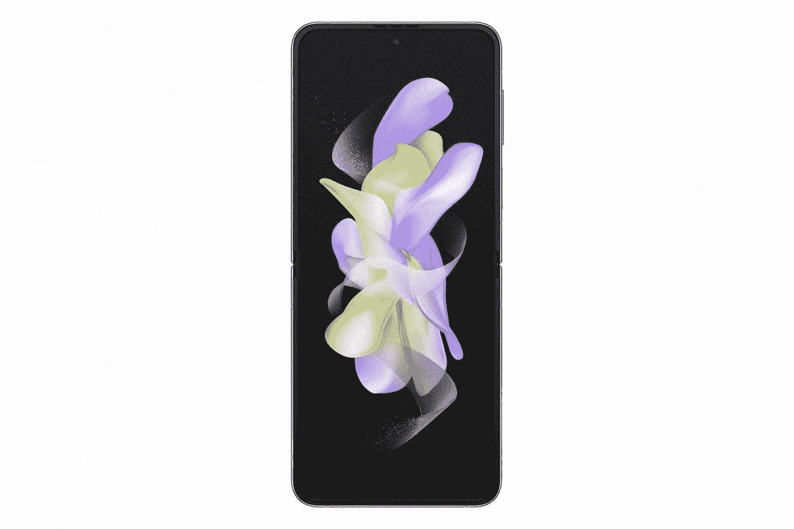

# 三星 Galaxy Z Flip 4 会获得多少软件更新？

> 原文：<https://www.xda-developers.com/samsung-galaxy-z-flip-4-software-updates/>

# 三星 Galaxy Z Flip 4 会获得多少软件更新？

三星 Galaxy Z Flip 4 有资格获得四个主要的 Android OS 更新和长达五年的安全更新。

三星在向其设备推送软件更新时一直非常一致。在软件支持方面，它是一贯表现出可靠性的公司之一。如果你不知道的话，很多三星旗舰设备都有资格获得四个主要的 Android 更新和长达五年的安全更新。这甚至比谷歌对其 Pixel 手机的承诺还要好。有资格获得四个主要 Android 更新的三星设备列表已经非常详尽，该公司还将它的 [Galaxy Z Flip 4](https://www.xda-developers.com/samsung-galaxy-z-flip-4-hands-on/) 添加到该列表中。

没错，三星的新款 Galaxy Z Flip 4 和 Galaxy Z Fold 4 都将获得四年的 Android OS 更新。Galaxy Z Flip 4 开箱即用运行 Android 12，这意味着它将一直支持 Android 16——或者谷歌当时决定称它为什么。当然，这取决于谷歌未来如何进行更新，但这是 Galaxy Z Flip 4 目前的情况。此外，它还将接收未来五年的安全更新，这意味着它将一直覆盖到 2027 年。在任期快结束时，它可能不会经常收到这些安全补丁，但是现在你可以期望每个月都能收到这些安全补丁。

三星一贯证明，在软件更新方面，它是业内最好的，所以你可以期待可折叠产品也会受到同样的对待。这些智能手机在未来将被支持如此长的时间，这一事实也使我们非常容易推荐它们。

 <picture></picture> 

Samsung Galaxy Z Flip 4

Galaxy Z Flip 4 有资格接收四个主要的 Android OS 更新和长达五年的安全更新。

 <picture></picture> 

Samsung Galaxy Z Flip 4

如果你有兴趣购买新的 Galaxy Z Flip 4，那么一定要点击上面方框中的链接，在网上找到它的最佳价格。我们还收集了一些[最好的 Galaxy Z Flip 4 交易](https://www.xda-developers.com/best-samsung-galaxy-z-flip-4-deals/)，你可以探索一下，为你的购买节省一些钱，并为它挥霍一个[最好的案例](https://www.xda-developers.com/best-samsung-galaxy-z-flip-4-cases/)。