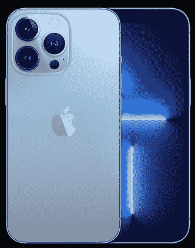

# 三星 Galaxy Z Flip 4 vs 苹果 iPhone 13 Pro Max:买哪个？

> 原文：<https://www.xda-developers.com/samsung-galaxy-z-flip-4-vs-apple-iphone-13-pro-max/>

三星在 2022 年 8 月的 Unpacked 活动中展示了 [Galaxy Z Flip 4](https://www.xda-developers.com/samsung-galaxy-z-flip-4-review/) 。这种装置针对那些既想鱼与熊掌兼得的人。由于它的折叠机制，用户可以享受大屏幕，也可以以紧凑的形式存放。这样，他们就不必为了使用更大的显示屏而牺牲舒适性。另一方面，我们有[iPhone 13 Pro Max](https://www.xda-developers.com/apple-iphone-13-pro-max-review/)——2021 年最高端的苹果手机。它采用了传统的设计，并没有真正包括任何显著的创新旋转。这是三星 Galaxy Z Flip 4 对苹果 iPhone 13 Pro Max——来自竞争公司的两款 6.7 英寸手机之间的战争。

## Galaxy Z Flip 4 vs iPhone 13 Pro Max:规格

|  | 

三星 Galaxy Z Flip 4

 | 

苹果 iPhone 13 Pro Max

 |
| --- | --- | --- |
| **处理器** | 

*   高通 SM8475 骁龙 8 加第 1 代

 |  |
| **正文** | 

*   展开后:165.2 x 71.9 x 6.9 毫米
*   折叠后:84.9 x 71.9 x 15.9-17.1 毫米
*   187 克

 | 

*   160.8 x 78.1 x 7.65 毫米
*   240 克

 |
| **显示** | 

*   主要的
    *   6.7 英寸可折叠动态 AMOLED 2X 显示屏
    *   2640 x 1080 像素分辨率，426 ppi
    *   支持 HDR10+、120Hz 和 1200 尼特最大亮度。

*   封面:
    *   1.9 英寸 Super AMOLED 显示屏
    *   512 x260 像素分辨率

 | 

*   6.7 英寸 Super Retina XDR 显示屏
*   2778 x 1284 像素分辨率，458 ppi
*   支持 HDR、推广技术(120Hz)、True Tone 技术和 1200 尼特最大亮度。

 |
| **摄像机** | 

*   12MP 后置摄像头系统:
    *   宽:1.8 米
    *   超宽:2.2 英寸

*   10MP 前置摄像头:2.4

 | 

*   Pro 12MP 后置摄像头系统:
    *   长焦:1/2.8
    *   宽:1.5 英寸
    *   超宽:1.8 英寸

*   TrueDepth 12MP 前置摄像头:2.2

 |
| **内存** | 

*   128GB/256GB/512GB 固态硬盘
*   8GB 内存

 | 

*   128GB/256GB/512GB/1TB 固态硬盘
*   6GB 内存

 |
| **电池** |  | 

*   长达 95 小时的音频播放

 |
| **连通性** |  |  |
| **阻力** |  |  |
| **安全** |  |  |
| **操作系统** | 

*   一个 UI 4.1.1(基于 Android 12)

 |  |
| **颜色** | 

*   博拉紫
*   石墨
*   金银铜镍装饰合金
*   蓝色

 | 

*   塞拉蓝
*   石墨
*   金色的
*   银
*   阿尔卑斯绿

 |
| **材质** | 

*   超薄玻璃
*   装甲铝

 | 

*   玻璃背面
*   不锈钢框架

 |
| **价格** |  |  |

* * *

## 设计:Galaxy Z Flip 4 有一个转折

在考虑一款新设备时，研究它的构造和设计是必不可少的。毕竟，你不会想随身携带一部易碎的或者看起来很古老的手机。好在三星 Galaxy Z Flip 4 和 iPhone 13 Pro Max 都提供了滑盖机身。它们外观现代，并在建造中提供优质材料。看他们的背部，我们在左上角看到他们的摄像系统。iPhone 的尺寸要大得多，还多了一个镜头。不过，更值得注意的是，三星手机中间有一个铰链。那是因为你可以把手机对折。

在颜色方面，iPhone 13 Pro Max 提供了五种饰面，而 Galaxy Z Flip 4 则提供了四种。不过，更重要的是，三星手机有定制版。这让你可以在不同的部位混合搭配不同的颜色。最终结果可以像你希望的那样独特。最终，如果你厌倦了你最终满足的颜色，你可以[购买 Galaxy Z Flip 4 保护套](https://www.xda-developers.com/best-samsung-galaxy-z-flip-4-cases/)和 [iPhone 13 Pro Max 保护套](https://www.xda-developers.com/best-iphone-13-pro-max-cases/)。

* * *

## 显示器:iPhone 13 Pro Max 无法弯曲(不断裂)

转到显示器上，这两款设备都提供了清晰的 6.7 英寸屏幕，支持 120Hz 刷新率和 HDR 内容。分辨率方面，iPhone 13 Pro Max 的显示屏略清晰——与 Galaxy Z Flip 4 相比。尽管如此，即使你在手机上狂看电视，你也很有可能分辨不出两者的区别。在这个部门，有更重要的东西需要阐明——灵活性。

三星 Galaxy Z Flip 4，顾名思义，拥有可折叠显示屏。这样你就不用去应付口袋里的大手机(那更容易刮花)。你可以把它折叠起来保护主显示屏，缩小到原来的一半大小。更不用说这款三星手机还有一个显示屏，小盖的那种。这样你就可以浏览通知和时间，而不需要打开它。如果您使用高级后置摄像头系统来自拍，也可以将封面屏幕用作相机预览。

* * *

## 性能:A15 仿生更胜一筹，但是真的能看出来吗？

购买新智能手机时，性能是另一个需要考虑的重要因素。你不希望你的设备运行缓慢或落后——尤其是考虑到它的高昂价格。幸运的是，三星 Galaxy Z Flip 4 和苹果 iPhone 13 Pro Max 都是旗舰手机，拥有强大的处理器。A15 Bionic 在 CPU 测试中得分更高，而高通芯片组在游戏/GPU 部门更胜一筹。苹果的芯片获得了更高的总得分。但是，你真的能区分这两者吗？

答案是*不太可能*。这两款手机都应该能够流畅地执行你的日常任务。不过，如果你需要更多存储空间，iPhone 13 Pro Max 提供高达 1TB 的存储空间。另一方面，Galaxy Z Flip 4 的最大内存为 512GB。此外，预计 iPhone 将获得更长时间的软件支持。如果你不关心更新或计划定期升级你的设备，那么你可以安全地[购买 Galaxy Z Flip 4](https://www.xda-developers.com/best-samsung-galaxy-z-flip-4-deals/) 。

* * *

## 相机:iPhone 13 Pro Max 是最大的 Pro

在我们的数字世界中，高分辨率照片和视频非常重要。我们越来越多地在网上记录和发布我们的生活。更清晰的媒体能更好地反映我们发布的时刻和记忆。尽管，即使你不打算在网上发布结果，高质量的视频也是经得起未来考验的。几年后，当你翻看旧照片和视频时，它们越清晰，你就越会珍惜它们。

这一轮苹果赢了。iPhone 13 Pro Max 有长焦后置镜头，Galaxy Z Flip 4 上没有。除此之外，这两款手机都有广角和超广角镜头，它们的规格相似。在前置摄像头部分，iPhone 的凹口容纳了原深感摄像头。它能够 3D 映射您的面部，从而实现 Face ID 认证。三星自拍相机分辨率较低，没有点投影仪。为了认证，你可以在 Galaxy 手机上安装一个侧面安装的指纹扫描仪。因此，如果你严格地寻找更好的相机，绝对[购买 iPhone 13 Pro Max](https://www.xda-developers.com/best-iphone-13-pro-max-deals/) 。

* * *

## 电池:一个给予，另一个拿走

两款手机都有一整天的电池寿命，让我们专注于更重要的方面。从充电端口开始，Galaxy Z Flip 4 配备了卓越的 USB Type-C 端口。与此同时，iPhone 13 Pro Max 获得了专有的 Lightning 端口——苹果自 2012 年以来一直在 iPhone 上使用该端口。两种*都能工作*，但是前者更普遍地被采用和可用。

不过更值得注意的是，Galaxy Z Flip 4 支持反向 Qi 无线充电。因此，你可以在这部三星手机上放置另一部支持 Qi 的手机或配件，以无线方式充电。同时，iPhone 支持 Qi 和 MagSafe 无线充电标准。不过，它不支持反向充电技术。因此，这一轮三星胜出。

* * *

## 一句话:Galaxy Z Flip 4 是更明智的选择

iPhone 13 Pro Max 比 Galaxy Z Flip 4 贵 100 美元——尽管包装的大部分是劣质硬件。我们建议您购买 iPhone 的唯一原因是，处于苹果生态系统中，想要一个专业的相机系统，或者需要一部更经得起未来考验的手机。除此之外，Galaxy Z Flip 4 的价格更便宜，并且包含更多创新产品。尽管花费更少，它肯定更值钱。

*   <picture></picture>

    三星 Galaxy Z Flip 4

    Galaxy Z Flip 4 是一款折叠式翻盖手机，结合了昔日手机的紧凑外形和现代 Android 体验。它还配备了最强大的高通芯片组和尖端的可折叠有机发光二极管技术。

*   <picture></picture>

    iPhone 13 Pro Max

    ##### 苹果 iPhone 13 Pro Max

    iPhone 13 Pro Max 是苹果最顶级的 2021 款 iPhone，配有大而棒的摄像头，一个小凹口，120Hz 显示屏。

你会购买两款 6.7 英寸手机中的哪一款，为什么？请在下面的评论区告诉我们。