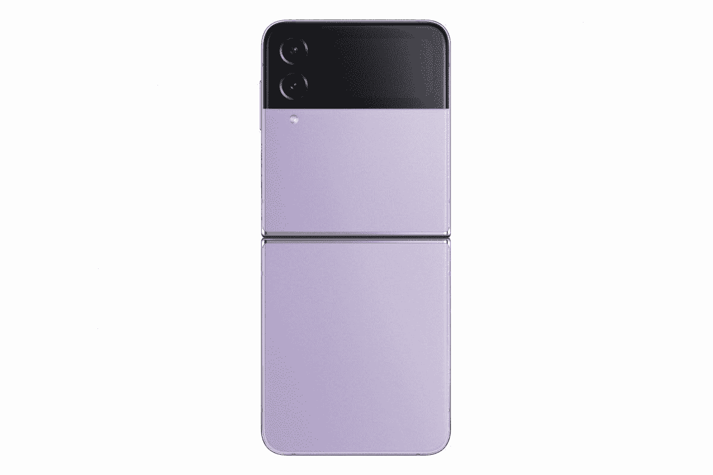

# 三星 Galaxy Z Flip 4 vs 摩托罗拉 Edge (2021):你应该考虑购买哪一款手机？

> 原文：<https://www.xda-developers.com/samsung-galaxy-z-flip-4-vs-motorola-edge-2021/>

毫无疑问，三星的新 [Galaxy Z Flip 4](https://www.xda-developers.com/samsung-galaxy-z-flip-4-review/) 是当今市场上最令人兴奋和有趣的设备之一。新款机型继承了 Galaxy Z Flip 3 的优势，增加了更耐用的显示屏、更快的芯片组、更时尚的设计、更大的电池等等。如果你已经厌倦了标准平板手机，这款手机一定会让你对手机再次感到兴奋。

Galaxy Z Flip 4 是三星有史以来最精致的翻盖手机，虽然它可能没有最好的摄像头或极快的充电速度，但它是最好看的手机之一。但它与更传统的手机相比如何呢？继我们将 Galaxy Z Flip 4 与摩托罗拉 Edge Plus 2022 进行比较之后，我们将它与去年的[摩托罗拉 Edge (2021)](https://www.xda-developers.com/motorola-edge-2021-preview/) 进行比较。让我们找出答案。

**浏览这篇文章:**

## 三星 Galaxy Z Flip 4 与摩托罗拉 Edge (2021 年):规格

| 

**规格**

 | 

**三星 Galaxy Z Flip 4**

 | 

摩托罗拉边缘(2021)

 |
| --- | --- | --- |
| **构建** | 

*   康宁大猩猩玻璃 Victus Plus
*   装甲铝框架
*   IPX8 防水性

 | 

*   玻璃正面(康宁大猩猩玻璃 3)
*   塑料背面
*   塑料框架
*   IP52

 |
| **尺寸&重量** | 

*   折叠后:84.9 x 71.9 x 15.9-17.1 毫米
*   展开后:165.2 x 71.9 x 6.9 毫米
*   187g

 | 

*   163 x 75.9 x 8.79 毫米
*   196 克

 |
| **显示** | 

*   封面展示:
    *   1.9 英寸 Super AMOLED
    *   260 x 512 像素
*   内部显示屏:
    *   6.7 英寸动态 AMOLED 2X
    *   1080 x 2640 (426 PPI)
    *   120Hz 自适应刷新率
    *   1200 尼特

 | 

*   6.8 英寸液晶显示器 2400 x 1080
*   144 赫兹刷新率

 |
| **SoC** | 

*   高通骁龙 8 加第 1 代

 |  |
| **闸板&存放** | 

*   8GB 内存
*   128GB/256GB/512GB UFS 3.1 闪存存储
*   没有 microSD 卡插槽

 | 

*   8GB 内存
*   256GB 闪存存储
*   没有 microSD 卡插槽

 |
| **电池&充电** | 

*   3700 毫安时
*   25W 快充支持
*   15W 无线充电支持
*   4.5W 反向无线充电
*   不含充电器

 | 

*   5000 毫安时
*   30W 有线充电
*   没有无线充电

 |
| **安全** | 侧装式指纹传感器 | 侧装式指纹传感器 |
| **后置摄像头** | 

*   主要:12 兆像素 f/1.8，1.4 微米，OIS
*   中学:12MP 超宽，f/2.2，FOV 123

 | 

*   108 兆像素 f/1.9，0.7 微米，PDAF
*   800 万像素超宽，f/2.2，1.12μm
*   200 万像素(f/2.4，1.75 微米)深

 |
| **前置摄像头** | 10MP，f/2.4，26 毫米(宽) | 32MP f/2.3 |
| **端口** | USB 类型-C | USB 类型-C |
| **音频** | 立体声扬声器 | 单扬声器 |
| **连通性** | 

*   4X4 MIMO，7CA，LAA，LTE 类别 20
*   SA/NSA 5G (Sub6/mmWave)
*   Wi-Fi 6E
*   蓝牙 5.2
*   国家足球联盟

 | 

*   Wi-Fi 802.11 a/b/g/n/ac/ax(双频 2.4/5GHz)
*   蓝牙 5.2
*   GPS、AGPS、LTEPP、SUPL、Glonass、伽利略
*   国家足球联盟

 |
| **软件** | 

*   一个基于 Android 12 的 UI 4.1
*   承诺四次 Android 操作系统升级
*   承诺五年的安全补丁

 |  |

## 设计和展示

设计是 Galaxy Z Flip 4 的主要卖点。Galaxy Z Flip 4 的核心是尖端的折叠技术，这使得它可以折叠成一部微型手机，并翻盖成一部普通大小的手机。这意味着这款手机可以轻松放入口袋，而不会占用太多空间，当你想使用它时，它就成为了一款普通的手机。虽然 Galaxy Z Flip 3 带来了重大的设计变革，但今年，它只是一些较小的改进和完善。Galaxy Z Flip 4 看起来与 Flip 3 一样，只是有一些细微的变化。这款手机变得稍微小了一些，铝侧轨现在变得平坦而光滑，缎面表面意味着这款手机不像它的前辈那样光滑。耐用性也得到了提高，新手机使用了同类最佳的 Gorilla Glas Victus Plus 外壳和 45%更强的内部显示屏。IPX8 防水功能仍然存在，但没有防尘保护。一如既往，你可以选择各种颜色的新翻盖手机:石墨色、宝来紫、玫瑰金和蓝色。还有一个定制版，可以让你随心所欲地混合、搭配和定制外观和感觉。

可以理解的是，摩托罗拉 Edge 2021 不如 Z Flip 4 昂贵，其特点是塑料背面和塑料框架。不过，它确实有防水设计，这意味着它可以承受水花或毛毛雨。在背面，这款手机采用了三后置摄像头设置，而打孔显示屏占据了正面。这款手机只有一种颜色:星云蓝。

在 Galaxy Z Flip 4 上，你有两个显示屏。有一个 6.7 英寸的柔性显示屏，可以对折以节省空间。此外，还有一个 1.9 英寸的外部显示屏，当主显示屏显示时，您可以查看通知和小工具，并访问设置。主显示屏是一个 AMOLED 面板，提供 120Hz 的刷新率和 1200 尼特的峰值亮度。

与此同时，摩托罗拉有一个 6.8 英寸的平板液晶面板，刷新率高达 144 赫兹。如果摩托罗拉把刷新率降低一点，装上 OLED 面板，我们真的会很高兴。但无论如何，LCD 面板质量很高，提供了很好的色彩和亮度。

* * *

## 摄像机

Galaxy Z Flip 4 装有与以前型号相同的相机传感器(12MP 主传感器和 12MP 超宽传感器)，但它们现在配有更亮的镜头和更大的像素尺寸，以获得更好的弱光性能。此外，这款手机还带来了更好的图像稳定，更快的自动对焦，以及 Galaxy S22 系列的 Nightgraphy 功能。至于自拍，内部显示屏上有一个 100 万像素的拍摄器，为了获得更好的效果，你还可以利用盖屏幕上的主摄像头。

摩托罗拉 Edge (2021)提供了一个三摄像头系统，包括一个 108MP 主摄像头，一个 8MP 超宽摄像头和一个 2MP 深度传感器。主摄像头可以以 30fps 的速度拍摄 4K 视频，超级慢动作视频功能可以让您以 960fps 的速度录制视频。

### Galaxy Z Flip 4 相机样品

* * *

## 性能、电池寿命和软件

Galaxy Z Flip 4 由高通最新最棒的[骁龙 8 Plus Gen 1 芯片组](https://www.xda-developers.com/qualcomm-snapdragon-8-plus-gen-1-benchmarks/)驱动，比骁龙 8 Gen 1 的 CPU 速度快 10%，效率高 30%。正如你所料，Galaxy Z Flip 4 在日常活动中的表现就像一个真正的旗舰，无论是打开多个应用程序，滚动长列表，还是打开多个标签浏览。Galaxy Z Flip 4 唯一落后于曲线的领域是游戏。如果你打算在高图形设置下玩几个小时的游戏，比如 Genshin Impact，那么一加 10 Pro 或 ROG 6 Pro 会更好。

摩托罗拉 Edge (2021)采用高通的中端芯片组骁龙 778G。但毫无疑问，骁龙 778G 是一款性能强大的处理器，其 CPU 和 GPU 性能比骁龙 768G 快 40%。当考虑到超快的 144Hz 刷新率和摩托罗拉的接近库存和轻量级软件体验时，这款手机在大多数任务中应该可以快速流畅地执行。

至于存储和内存，Galaxy Z Flip 提供了 8GB 的内存和三种存储选项:128GB、256GB 和 512GB。与此同时，摩托罗拉 Edge (2021)只有一种型号:8GB 内存和 256GB 内存。两款手机都不提供 microSD 扩展。

电池寿命一直是 Flip 系列的一个问题，尽管 Galaxy Z Flip 4 配备了更大的 3700 毫安时电池，但它无法与摩托罗拉 Edge 的 5000 毫安时电池竞争。在适度使用的情况下，您可以使用 Galaxy Z Flip 4 一整天。但如果你是一个重度用户，或者只是想要一个持续一天以上的电池，摩托罗拉 Edge (2021)是你的最佳选择。摩托罗拉 Edge 在充电速度方面也有优势，与 Z Flip 4 的 25W 速度相比，它提供了 30W 的输出。更不用说，摩托罗拉在盒子里包括充电器，而三星没有。

在软件方面，Galaxy Z Flip 4 开箱即可运行 Android 12，而摩托罗拉 Edge (2021)则搭载了接近库存版本的 Android 11。软件支持是另一个主要区别。对于 Flip 4，三星承诺四年的操作系统更新，而摩托罗拉 Edge 2021 可能不会获得超过 Android 12 的更新。

* * *

## Galaxy Z Flip 4 vs 摩托罗拉 Edge (2021):你该买哪个？

三星 Galaxy Z Flip 4 和摩托罗拉 Edge (2021)之间的价格差异很大。Flip 4 售价 999 美元，而摩托罗拉 Edge (2021)的售价为 699 美元，但已经降至 349 美元。然而，三星为 Z Flip 4 提供了一些[疯狂的以旧换新交易，在所有报价之后以类似的价格获得该设备也不是没有听说过。因此，我们确实建议在你以旧换新时，先看看你能得到什么优惠，尤其是因为摩托罗拉没有让以旧换新变得如此简单无缝。](https://www.xda-developers.com/best-samsung-galaxy-z-flip-4-deals/)

 <picture></picture> 

Samsung Galaxy Z Flip 4

Galaxy Z Flip 4 是市场上最时尚的手机之一，配备了 6.7 英寸的柔性显示屏和 1.9 英寸的翻盖显示屏。

如果你想要一部不超过 400 美元的像样的中档手机，有 2 天的电池寿命，大显示屏和功能强大的相机，摩托罗拉 Edge (2021)是完美的选择。对于那些想要一部刷新率超过 120 赫兹的手机的人来说，摩托罗拉 Edge 是你唯一的选择。但请注意，它已经有一年多的历史了，搭载了两代 Android 版本。如果你喜欢拥有你的手机至少两到三年，我们建议看看其他[便宜的安卓手机](https://www.xda-developers.com/best-cheap-android-phones/)。

 <picture></picture> 

Motorola Edge (2021)

##### 摩托罗拉边缘(2021)

摩托罗拉 Edge (2021)提供 6.8 英寸显示屏，刷新率为 144Hz，骁龙 778G 芯片组和 5,000mAh 电池。

另一方面，如果你正在寻找一款小巧、鹤立鸡群的时尚手机，你很难找到比 Galaxy Z Flip 4 更好的选择。它没有最好的摄像头或一流的电池寿命，但这些都是你为了获得最好看的手机而必须做出的牺牲。