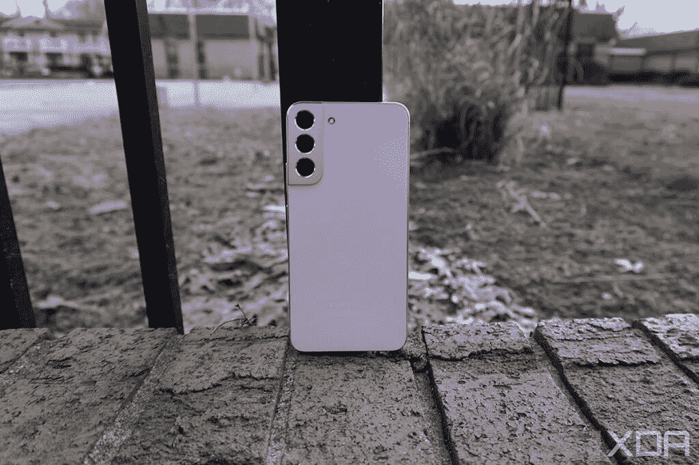
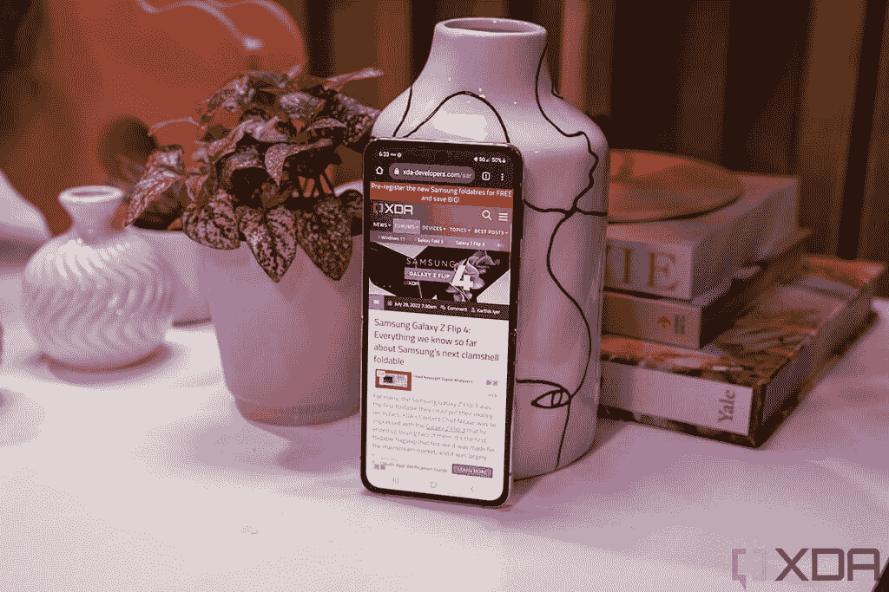
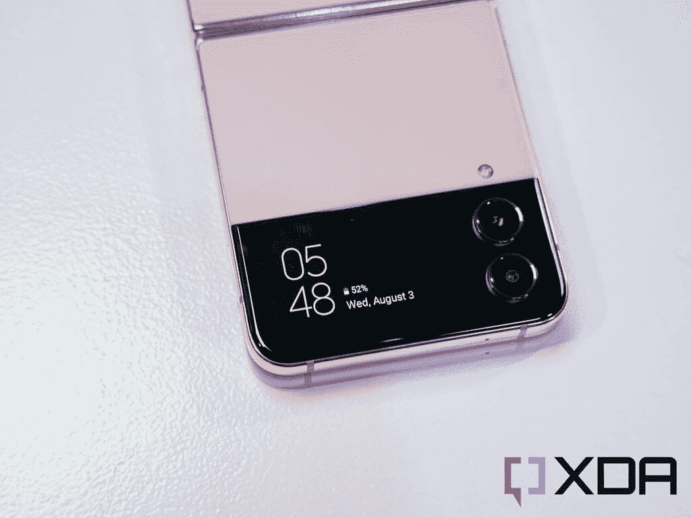
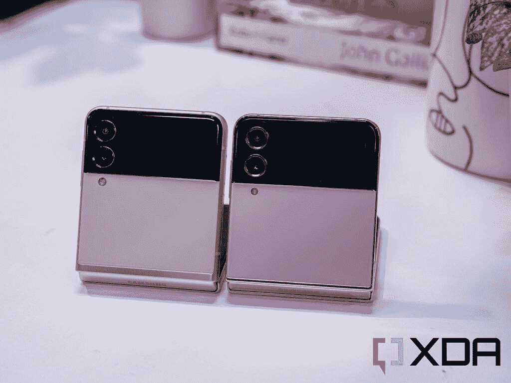

# 三星 Galaxy Z Flip 4 vs 三星 Galaxy S22 Plus:折叠还是不折叠，这是个问题

> 原文：<https://www.xda-developers.com/samsung-galaxy-z-flip-4-vs-samsung-galaxy-s22-plus/>

三星的 Galaxy S 和 Fold 系列可能仍然包含优越的技术，但 Z Flip 系列已经低调成为韩国科技巨头手机家族的突破之星。 [Galaxy Z Flip 3](https://www.xda-developers.com/samsung-galaxy-z-flip-3-review/) 是第一款获得主流销售地位的可折叠手机， [Galaxy Z Flip 4](https://www.xda-developers.com/samsung-galaxy-z-flip-4-hands-on/) 看起来将继续这一势头。翻盖手机赢得消费者的一个主要原因是，它本质上是一款非常好的旗舰手机，可以对折，更容易放入口袋和钱包。虽然将 Z Flip 4 与顶级产品 Galaxy S22 Ultra 进行比较是不公平的，但 Z Flip 4 确实在与三星的基本型号旗舰产品进行比较时表现很好。

让我们来看看 Galaxy Z Flip 4，以及它与三星自己的 [Galaxy S22 Plus](https://www.xda-developers.com/samsung-galaxy-s22-plus-review/) 相比如何。

 <picture></picture> 

Samsung Galaxy Z Flip 4

新的 Galaxy Z Flip 4 采用了绝对令人敬畏的 Z Flip 3，并添加了一点抛光和一个更节能的 SoC，以实现更好的全方位可折叠。

 <picture></picture> 

Samsung Galaxy S22 Plus

##### 三星 Galaxy S22 Plus

三星 Galaxy S22 Plus 拥有大而漂亮的屏幕和一套不错的摄像头，是迄今为止 2022 年最好的旗舰 Android 手机之一。

## 三星 Galaxy S22 Plus vs Galaxy Z Flip 3:规格

| 

**规格**

 | 

**三星 Galaxy S22 Plus**

 | 

**三星 Galaxy Z 翻盖 4**

 |
| --- | --- | --- |
| **构建** | 

*   装甲铝框架
*   康宁大猩猩玻璃 Victus+
*   IP68 防尘防水等级

 | 

*   康宁大猩猩玻璃 Victus
*   装甲铝框架
*   IPX8 防水性

 |
| **尺寸&重量** | 

*   157.4 x 75.8 x 7.6mm 毫米 196 克

 | 

*   折叠后:84.9 x 71.9 x 15.9-17.1 毫米
*   展开后:165.2 x 71.9 x 6.9 毫米
*   187g

 |
| **显示** | 

*   6.6 英寸动态 AMOLED 2X
*   FHD+ (1080 x 2340)
*   10-120 赫兹自适应刷新率
*   1750 尼特

 | 

*   封面展示:
    *   1.9 英寸 Super AMOLED
    *   260 x 512 像素

*   内部显示屏:
    *   6.7 英寸动态 AMOLED 2X
    *   1080 x 2640 (426 PPI)
    *   120Hz 自适应刷新率
    *   1200 尼特

 |
| **SoC** | 

*   高通骁龙 8 代 1
*   Exynos 2200

 | 

*   高通骁龙 8 加第 1 代

 |
| **风筒&储存** |  | 

*   8GB + 128GB
*   8GB + 256GB
*   8GB + 512GB

 |
| **电池&充电** | 

*   4500 毫安时
*   45W 有线快充支持
*   15W 无线充电支持
*   4.5W 反向无线充电
*   不含充电器

 | 

*   3700 毫安时
*   25W 快充支持
*   15W 无线充电支持
*   4.5W 反向无线充电
*   不含充电器

 |
| **安全** | 超声波显示指纹传感器 | 侧装式指纹传感器 |
| **后置摄像头** | 

*   初级:50MP，1.0 米，85 FoV，23 毫米，f/1.8，OIS DPAF
*   超宽:12MP，1.4 米，120 FoV，13 毫米，f/2.2
*   长焦:10MP，1.0 m，36 FoV，69mm，f/2.4，OIS，3 倍光学变焦

 | 

*   主要:12 兆像素 f/1.8，1.4 微米，OIS
*   中学:12MP 超宽，f/2.2，FOV 123

 |
| **前置摄像头** | 10MP，1.22 米，f/2.2，80 FoV | 10MP，f/2.4，26 毫米(宽) |
| **港口** | USB 类型-C | USB 类型-C |
| **音频** |  |  |
| **连通性** | 

*   5G(毫米波/sub6)
*   4G LTE
*   Wi-Fi 6E
*   蓝牙 5.2
*   国家足球联盟

 | 

*   4X4 MIMO，7CA，LAA，LTE 类别 20
*   SA/NSA 5G (Sub6/mmWave)
*   Wi-Fi 6E
*   蓝牙 5.2
*   国家足球联盟

 |
| **软件** | 

*   一个基于 Android 12 的 UI 4.1
*   承诺四次 Android 操作系统升级
*   承诺五年的安全补丁

 | 

*   一个基于 Android 12 的 UI 4.1
*   承诺四次 Android 操作系统升级
*   承诺五年的安全补丁

 |

* * *

## 三星 Galaxy Z Flip 4 vs 三星 Galaxy S22 Plus:硬件和设计

 <picture></picture> 

Galaxy S22 Plus

尽管一个是令人兴奋的可折叠手机，另一个是有点标准的平板手机，但这两款手机实际上有很多共同点，整体用户体验也类似。与 Galaxy Z Fold 手机不同，它有两种形式(手机和平板电脑)，Flip 4 实际上只是一款可以弯曲一半的普通平板手机。考虑到 Galaxy Z Flip 4 和 Galaxy S22 Plus 运行相同的软件，并且屏幕尺寸相似(Flip 4 的屏幕为 6.7 英寸，而 S22 Plus 的屏幕为 6.6 英寸)。这意味着当 Z Flip 4 展开时，它的操作几乎与 Galaxy S22 Plus 完全相同。

 <picture></picture> 

The Galaxy Z Flip 4

Z Flip 4 比 S22 Plus 更薄更轻，但这是因为后者包装了更大的电池和更好的相机系统-稍后会有更多信息。否则，它们都有由大猩猩玻璃和三星所谓的“装甲铝”框架(它只是指经过钢化的铝)制成的背面。显然，显示材料是不同的，S22 Plus 使用典型的玻璃面板，而 Flip 4 使用柔性可弯曲有机发光二极管。

Z Flip 4 作为一款可折叠的，在外面有一块副屏，三星称之为 Cover Display。这个 1.9 英寸的尺寸刚刚够大，可以让 Flip 4 在关闭时做一些智能手机的事情，比如查看通知和控制音乐播放。

 <picture></picture> 

The Flip 4's cover display.

Flip 4 区别于任何其他平板手机的一个技巧是，它可以在折叠时使用，也可以在半开时使用，呈 L 形，三星称之为“灵活模式”。这开辟了一系列使用手机的新方式，包括免提自拍或视频录制。

Galaxy Z Flip 4 是最耐用的可折叠产品之一，具有官方 IPX8 评级，屏幕经过测试可以折叠六位数次而不会损坏。但不管怎么切，Galaxy S22 Plus 就是耐用一点。它的防护等级为 IP68，这意味着它可以防尘防水，而 Flip 4 只能防尘防水。无论三星如何努力加强可折叠有机发光二极管显示屏，坚硬的玻璃屏幕仍然会比柔软的可弯曲屏幕更耐用。

这里先说清楚:我们根本不认为 Flip 4 脆弱，但是理论上的 S22 Plus 可以承受更大的伤害。

### SoC、电池和内存

Galaxy Z Flip 4 运行在[高通骁龙 8 Plus 第 1 代](https://www.xda-developers.com/qualcomm-snapdragon-8-plus-gen-1-benchmarks/)上，而更老的 Galaxy S22 Plus 由[骁龙 8 第 1 代](https://www.xda-developers.com/qualcomm-snapdragon-8-gen-1-benchmarks/)驱动。通常，我不会在意一次小小的年中迭代芯片升级，但今年不同。事实证明，骁龙 8 Plus Gen 1 明显比骁龙 8 Gen 1 更节能。如果这两款手机都有同样大小的电池，Z Flip 4 肯定会有更长的电池寿命。但由于电池容量差异相当大(S22 Plus 为 4,500 mAhZ Flip 4 为 3，700 mAh)，在我们知道哪款手机提供更好的电池寿命之前，还需要做进一步的测试。由于电池的巨大尺寸，Galaxy S22 Plus 的胜算很大；毕竟，它不必为了容纳一个铰链而在内部处理移动部件。

两款手机都配有 8GB 内存。Galaxy S22 Plus 只有两个存储选项:128GB 或 256GB，而 Galaxy Z Flip 4 既有这两个选项，又有一个额外的 512GB 选项。

### 摄像机

由于尺寸限制和更复杂的可折叠结构，Galaxy Z Flip 系列从未配备三星最好的相机系统，今年仍然如此。按照 2022 年的标准，Z Flip 4 中的一对 12MP 拍摄器(覆盖主镜头和超宽镜头)只是不错的相机硬件，绝对不是 Galaxy S22 Plus 的三镜头阵列的水平，该阵列由 50MP 主相机、12MP 超宽镜头和 10MP 长焦镜头组成。S22 Plus 的主摄像头不仅包含更多像素，而且还有一个大图像传感器。长焦变焦镜头默认取 win，考虑到 Z Flip 4 根本没有变焦镜头。

 <picture></picture> 

Galaxy Z Flip 3 and the Galaxy Z Flip 4

但 Galaxy Z Flip 4 的可折叠特性允许以更多方式使用相机。前面提到的 Flex 模式允许 Z Flip 4 充当自己的三脚架，所以你可以自拍，或合影，或延时视频，而不需要将手机支撑在什么东西上。

* * *

## 三星 Galaxy Z Flip 4 vs 三星 Galaxy S22 Plus:软件

当 Galaxy Z Flip 4 完全打开时，其软件体验与 Galaxy S22 Plus 完全相同，因为两款手机都运行 Android 12，顶部是三星的 One UI。三星的 Android 皮肤很直观，有很多定制选项和一套很棒的多任务工具，例如在浮动窗口中打开应用程序的能力。

Galaxy Z Flip 4 确实有额外的软件功能，可以在手机折叠或处于灵活模式时使用。在折叠状态下，你可以用 Flip 4 的主摄像头系统和较小的第二显示屏作为取景器来自拍。当 Flip 4 处于 Flex 模式时，一些应用程序将适应这种形式。例如，在相机应用程序中，取景器将移动到屏幕的上半部分，留下下半部分用于相机控制。一些像 YouTube 这样的第三方应用程序也会以同样的方式运行，将视频移动到屏幕的上半部分，而将下半部分留给评论。

由于 Galaxy S22 Plus 不像 [Galaxy S22 Ultra](https://www.xda-developers.com/samsung-galaxy-s22-ultra-review/) 那样支持 S Pen，它与 Galaxy Z Flip 4 相比并没有任何特别的软件优势。Galaxy Z Flip 4 肯定比 S22 Plus 更有优势，这要归功于只有可折叠手机才能享受的 Flex 模式功能。

* * *

## 三星 Galaxy Z Flip 4 vs 三星 Galaxy S22 Plus:性能

Galaxy Z Flip 4 是一款功能更强的手机，因为它有一个更新的芯片。骁龙 8 Plus Gen 1 在没有节流的情况下更好地处理重负载，所以如果你是一个重度游戏玩家，这一点会很明显。持续的性能是新芯片的亮点，对于这些工作负载，您将消耗更少的电池和产生更少的热量。然而，如果你的智能手机使用的是更随意的任务，如网上冲浪或发短信，那么你将无法注意到这两款手机之间的差异。

你会注意到的是 Galaxy S22 Plus 更好的相机系统。如果你拍摄大量夜间照片或喜欢放大事物，S22 Plus 每次都能拍出出色的照片。

Galaxy S22 Plus 还拥有比 Galaxy Z Flip 4 更响亮、更饱满的扬声器。但后者更轻，可以以笔记本电脑的形状坐在桌子上，因此它可能仍然是一种更方便的移动媒体消费设备。

电池寿命，如前所述，我们还不能给出最终的结论，因为我们还没有足够的时间来研究 Galaxy Z Flip 4。但有了更高效的芯片，Galaxy Z Flip 4 应该可以为除重度用户之外的所有人持续一天。根据我个人的经验，Galaxy S22 Plus 一次充电绝对可以持续一整天 12 到 13 个小时。

* * *

## 三星 Galaxy Z Flip 4 vs 三星 Galaxy S22 Plus:该买哪款手机？

尽管这两款手机的价格完全相同，都是 999.99 美元，但在我看来，这款手机非常简单。你对可折叠手机的想法着迷吗？你是不是经常要在公共场合随便找陌生人给你拍照？你是否觉得现代旗舰手机太大了，装不下？你是否觉得智能手机很无聊，想尝试一些新的东西？如果你对其中任何一个问题的回答是肯定的，那么 Galaxy Z Flip 4 肯定比 Galaxy S22 Plus 更值得考虑。Galaxy Z Flip 4 现在也有大量的[好交易，使用下面产品框中的链接预购 Flip 4 将为您带来超过其他交易高达 200 美元的额外好处，使它成为一笔更好的销售。](https://www.xda-developers.com/best-samsung-galaxy-z-fold-4-deals/)

 <picture></picture> 

Samsung Galaxy Z Flip 4

新的 Galaxy Z Flip 4 采用了绝对令人敬畏的 Z Flip 3，并添加了一点抛光和一个更节能的 SoC，以实现更好的全方位可折叠。

然而，如果你确实关心经常拍摄弱光照片或变焦照片，或者如果你想要一部更耐用的手机，特别是防尘的，或者一部更有信心持续一整天的手机，或者只是不想在每次想使用手机时都展开，那么 Galaxy S22 Plus 是更好的选择。

 <picture></picture> 

Samsung Galaxy S22 Plus

##### 三星 Galaxy S22 Plus

三星 Galaxy S22 Plus 拥有大而漂亮的屏幕和一套不错的摄像头，是迄今为止 2022 年最好的旗舰 Android 手机之一。

我们认为，如果你想买一款新旗舰，这两款手机都不会有问题。但是你必须认真考虑你是否想要可折叠的外形。