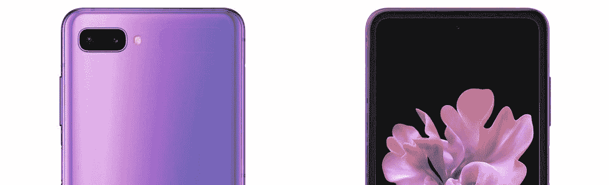

# 我们所知道的关于三星 Galaxy Z Flip 的一切

> 原文：<https://www.xda-developers.com/samsung-galaxy-z-flip-clamshell-foldable-phone-rumors-specs-leaks/>

2019 年，三星、华为和摩托罗拉分别以 Galaxy Fold、Mate X 和摩托罗拉 Razr 推出了可折叠手机。这三款手机都以不同的方式实现了可折叠智能手机的设计，Razr 可以说是最直观的，因为它回归了标志性的翻盖设计。然而，摩托罗拉 Razr 的独特性将是短暂的，因为三星正在准备在一周多一点的时间内推出 Galaxy Z Flip。像摩托罗拉一样，三星正在采用过去的翻盖手机设计，并通过可折叠显示屏和更现代的内部部件和软件来实现现代化。虽然该设备尚未正式推出，但我们已经看到了几个泄漏，广泛记录了设计和规格。由于最近有很多泄露，所以我准备总结一下我所知道的关于三星 Galaxy Z Flip 的一切。

## 三星 Galaxy Z Flip:设计

Galaxy Z Flip 的设计很有趣；它看起来像一个普通的高智能手机，只是垂直对折，不像摩托罗拉 Razr，它是专门设计的，看起来像老式的翻盖手机。该设备的第一张照片于 12 月泄露[，揭示了三星将用于 Galaxy Z Flip 的翻盖设计。展开时，它看起来像 Galaxy S20+,但有更大的挡板。它的显示屏很高，宽高比为 22:9。显示器也将像 Galaxy S20+一样有一个居中的打孔。正如我们之前发现的，这款手机将在正面有一个辅助显示屏。这个前置显示器非常小，不能用于一般的浏览目的。它的尺寸为 1.06 英寸，用于显示时间、日期、电池，可能还有相机取景器。](https://www.xda-developers.com/samsungs-clamshell-folding-phone-leaks-in-multiple-live-images/)

就像现在的 Galaxy Fold 一样，Galaxy Z Flip 折叠起来会有点空隙。不过，这并不是一件坏事。这个间隙是[三星的新“超薄玻璃”](https://www.xda-developers.com/samsung-galaxy-z-flip-specs-rumor/)折叠而不破碎所需要的。缝隙也让手机更容易打开。如果它完全平齐关闭，它将比大多数翻盖手机更难打开。在手机的外面是铝铰链和前后玻璃。

这款手机的铰链不会像 Galaxy Fold 或 Moto Razr 那样工作，相反，它实际上会使用双枢轴铰链锁定不同的位置。你可以将它锁定在 70 到 110 度之间的任何角度。这对于视频通话或视频登录非常有用，因为手机本质上是它自己的支架。当然，它也可以折叠成更小的尺寸。

这里有一个据称是真实世界的视频(发布在一个未公开的 Instagram 账户上，然后被分享到 Twitter 上)，显示了 Galaxy Z Flip 的打开和关闭:

在本周 Roland Quandt 和 Evan Blass 发布的新渲染图中，我们看到了 Galaxy Z 在其全高清荣耀中的翻转。我们可以看到绝对华丽的粉紫色和经典的黑色。从这些渲染图中，我们还可以看到铰链机制以及设备折叠时的外观。它看起来像来自星系褶皱的铰链，但是更小。如果你认为这款手机看起来像一个跨不同轴折叠的 Galaxy Fold，基本上是这样的。 *[SamMobile](https://www.sammobile.com/news/galaxy-fold-2-codenamed-bloom-android-10-some-colors-confirmed)* 也报道了可能会有白色星系 Z 翻转色，但我们还没有看到那个模型的任何证据。

这款设备将拥有指纹扫描仪，尽管它不会在 Infinity Flex 显示屏下。手机右上方会有一个电容式指纹扫描仪。

## 三星 Galaxy Z Flip:显示屏

Galaxy Z Flip 上的显示与 Galaxy Fold 在实际大小、纵横比、折叠轴以及有机发光二极管上的层方面有很大不同。如前所述，显示器的长宽比为 22:9。显示分辨率将为 2636 x 1080 像素。三星正在采用支持 HDR10+的动态 AMOLED 显示屏。这是一个折叠式 Infinity-O 显示器，因为它有一个用于单个相机的打孔。

显示屏将由三星的“超薄玻璃”分层。这基本上是非常薄的玻璃，实际上能够弯曲。Galaxy Z Flip 将是第一款采用超薄玻璃的设备。这种玻璃将被一层柔性聚合物覆盖，就像银河折叠一样。这一额外的塑料层用于保护 Infinity Flex 显示屏和玻璃。这款设备还有一个非常小的前置显示屏，尺寸为 1.06 英寸，分辨率为 300x116 像素。正如我提到的，它只对检查时间、日期和电池状态有用。一些消息来源告诉我们，你也可以将它用作相机取景器。

## 三星 Galaxy Z Flip:相机

Galaxy Z Flip 相机的设置相当不错，尽管它不会像一些人猜测的那样有 108MP 传感器。这将是一个后置/折叠前置的双摄像头设置。将有 2x12MP 摄像机，由一个主广角摄像机和一个辅助超广角摄像机组成。主要的 12MP 广角传感器可能与 Galaxy S20 和 Galaxy S20+的 12MP 传感器相同。它可能是索尼 IMX 555 或三星 ISOCell 等效传感器。我们不知道超宽的实际传感器型号，但我们知道它也是 12MP。

 <picture></picture> 

Images from WinFuture

前置摄像头将是一个 10MP 的索尼 IMX 374。这与 Galaxy S20、Galaxy S10、Galaxy Note 10 和 Galaxy Fold 的 10MP 传感器相同。与 Galaxy S20 不同，它不支持 4K 60fps 视频录制。它将仅限于 4K 30fps 的视频录制，但它会自动对焦。三星将在相机方面做的其他事情是在软件方面。它将能够移动相机的取景器以匹配铰链的位置。基本上，你可以将手机折叠到 100 左右，并将其用作桌子上的支架来录制视频，手机将与之匹配。这也适用于 Google Duo 等应用程序。

## 三星 Galaxy Z Flip:规格

所以对于每一部手机来说，规格都很重要。Galaxy Z Flip 也不例外。手机里的 SoC 是[高通骁龙 855+](https://www.xda-developers.com/qualcomm-snapdragon-855-plus/) 。它可能是一代产品，但它有助于降低价格，并可能有助于延长电池寿命。这是因为这款手机不会有大容量电池。三星附赠 3300 毫安时电池。三星实际上正在采用双电池设置，就像他们对 Galaxy Fold 所做的那样。其中一个电池为 900 毫安时，另一个为 2400 毫安时。两者都将支持无线充电、反向无线充电、15W 有线充电。

这款手机将配备 8GB 的 LPDDR4X 内存。这没有 Galaxy S20 系列或 Galaxy Fold 的内存容量大，但再次强调，这可能是一种削减成本的措施，以便能够让更多人使用手机。三星可能削减成本的另一个领域是存储。它将拥有 256GB 的 UFS 3.0 存储空间，低于 Galaxy Fold 的 512GB 容量。

这款手机展开后不会变小。它有一个 6.7 英寸的 22:9 显示屏。这个很高大上，不过还好，不会在口袋里展开。当展开时，其厚度将在 6.9 毫米和 7.2 毫米之间。折叠时，厚度将在 15.4 毫米至 17.3 毫米之间。与其他可折叠产品不同，Galaxy Z Flip 可以完美折叠。将会有一个间隙，它实际上可能对这个文件夹有用。缝隙是手指打开可折叠显示屏的绝佳位置。

| 

三星 Galaxy Z Flip

 |
| 操作系统（Operating System） | 搭载三星 One UI2 的 Android 10 |
| 中央处理器 | 高通骁龙 855+ 7 纳米 |
| 显示 | 全高清+ (2636 x 1080 像素)，动态 AMOLED 6.7 英寸，始终开启，Infinity-Oext。屏幕 1.06 英寸(300 x 116 像素)，Super AMOLED 始终开启，大猩猩玻璃 6 |
| 储存；储备 | 8 GB RAM，256 GB UFS3.0，直接支持云端口三星云，Google Drive，MS Onedrive(无 micro SD) |
| 后置摄像头 | 12 MP 双像素，光圈 f / 1.8，光圈角度 78 + 12 MP 超广角 f / 2.2，123，闪光灯，HDR 10+，快速启动，可选。图像稳定 |
| 前置摄像头 | 1000 万像素双像素，f / 2.4，80，自动对焦，语音控制 |
| 录像 | UHD 4K 60 fps(主摄像头)，UHD 4K 30 fps(前置)，HDR10 + |
| 视频回放 | 支持的格式:MP4、M4V、3GP、3G2、WMV、AVI、MKV、WBEM |
| 传感器 | 加速度计、气压计、指南针、亮度传感器、接近检测、指纹传感器、陀螺仪 |
| 电池 | 3300 mAh，快充最高 15 瓦，Qi 充电最高 9 瓦 |
| 连通性 | 蓝牙 5.0、USB Type C、NFC、WiFi 6 (2.4 + 5 GHz、WiFi direct、Mirrorlink、Smart View |
| 移动的 | 2G (GPRS / EDGE): GSM850、GSM900、DCS1800、PCS19003G (HSDPA +): B1 (2100)、B2 (1900)、B4 (AWS)、B5 (850)、B8 (900)4G (LTE): B1 ( 2100)、B2 (1900)、B3 (1800)、B4 (AWS)、B5 (850)、B7 (2600)、B8 (900)、B12、B13、B14 |
| 安全性 | 人脸识别、指纹识别器(在侧面)、Knox 3.4.1、安全文件夹 |
| 声音的 | AKG 立体声扬声器，杜比 Atmos，嵌入式 Spotify 应用程序，支持的格式:MP3，M4A，3GA，AAC，OGG，OGA，WAV，WMA，AMR，AWB，FLAC，MID，MIDI，XMF，MXMF，IMY，RTTTL，RTX，OTA，DFF，DSF，DSF，APE |
| 卫星 | GPS，GLONASS，北斗，伽利略 |
| 颜色；色彩；色调 | 黑色、紫色 |
| 规模 | 打开 167.9 x 73.6 x 6.9-7.2 毫米，关闭 167.9 x 73.6 x 15.4-17.3 毫米 |
| 重量 | 183 克 |

## 三星 Galaxy Z Flip:软件

Galaxy Z Flip 上的软件基本上会是基于 Android 10 的 stock One UI 2.1。它将在一个 UI 2.1 中拥有与 Galaxy S20 相同的软件功能，但由于不同的 SOC，一些功能可能会有所限制。我们知道将包括的功能之一是三星正在开发的[新快速分享](https://www.xda-developers.com/quick-share-samsung-alternative-airdrop-galaxy-phones/)服务。

三星正在开发的一些有趣的软件功能是基于翻盖手机的设计。第一个实际上是 2019 年 10 月在 SDC 被戏弄的。这将在相机应用程序和谷歌 Duo 等应用程序中与双枢轴铰链协调工作。另一个铰链功能是旧翻盖手机时代的经典。如果你正在打电话并关闭手机，它将结束通话。我知道这不是一个突破性的功能，但我认为它值得一提。

## 三星 Galaxy Z Flip:上市时间

Galaxy Z Flip 应该很快就会上市。根据我们的一些消息来源，它将在月底前上市。我们的两个消息来源甚至声称它将于 2 月 14 日在美国上市。基本 256GB 型号的零售价应为 1400 美元。它将会有黑色和紫色，我们已经在 *[WinFuture](https://winfuture.de/news,113756.html)* 的渲染中看到过。我们可以确认它将在 AT & T 和 Sprint 上发售，并在发售当天通过三星解锁。虽然我们不能肯定地说，它很可能会从 T-Mobile 和威瑞森以及。

* * *

所有这些都只是传闻和未经证实的报道，直到官方宣布。这款手机将于 2 月 11 日在旧金山举行的[三星 Unpacked 2020 上亮相。我们将在活动中向你们展示这款手机以及 S20 系列的所有内容。如果你有兴趣在活动前了解 Galaxy S20 系列的一切，](https://www.xda-developers.com/samsung-unpacked-2020-promo-galaxy-s20-launch/)[一定要看看我们对这些设备的概述](https://www.xda-developers.com/samsung-galaxy-s20-plus-ultra-5g-leaks-rumors-specs-features/)。此外，查看 XDA 电视 YouTube 频道[获取我们可能发布的任何动手视频。](https://www.youtube.com/user/xdadevelopers/)