# Galaxy Z Fold 1 到 4:三星旗舰可折叠系列的进化

> 原文：<https://www.xda-developers.com/samsung-galaxy-z-fold-1-to-4-evolution/>

[Galaxy Z Fold 4](https://www.xda-developers.com/samsung-galaxy-z-fold-4-hands-on/) 来了，乍一看，似乎和去年的 Galaxy Z Fold 3 没有太大区别。依然是书一样的内可折叠，设计语言和去年的可折叠基本一致。

然而，仔细观察，你可能会发现三星做了一些小改动，进一步微调了其经过测试和验证的可折叠设计。外屏宽一点；铰链没有突出太多，折叠时看起来更加对称和流线型。作为三星追求更紧凑可折叠产品的延续，Galaxy Z Fold 4 比前代产品轻了 8g。

这些改进中的任何一个可以单独被认为是主要的吗？不。但是他们在一起比他们的部分加起来还要多。他们进一步纠正了第一个折叠的许多方面，现在回想起来，看起来相当可笑。

 <picture>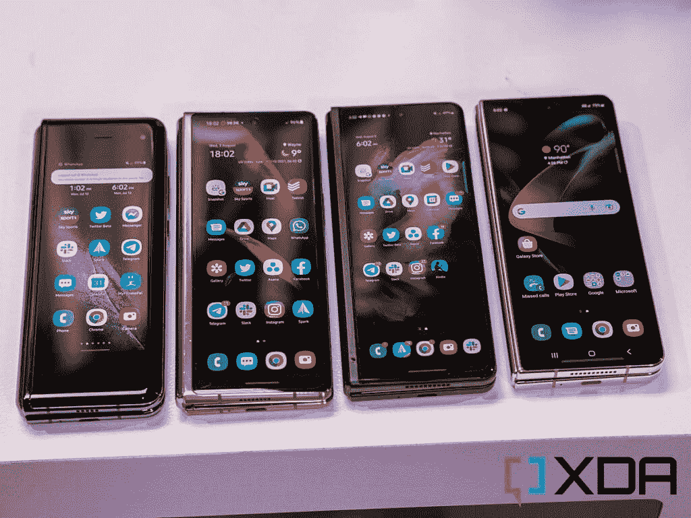</picture> 

All four Galaxy Z Fold devices, from first gen (left) to latest Fold 4 (right).

这些年来，我使用了每一部三星可折叠手机(见鬼，[每一部可折叠手机](https://www.xda-developers.com/best-foldable-phones/)，句号)，值得记录这个系列的演变，因为 Fold 系列从起飞时几乎崩溃和燃烧到现在，显然是移动的前进方向。

 <picture></picture> 

Samsung Galaxy Z Fold 4

三星 Galaxy Z Fold 4 是终极生产力发电站，为高级用户提供更全面的体验。

## 原型

 <picture>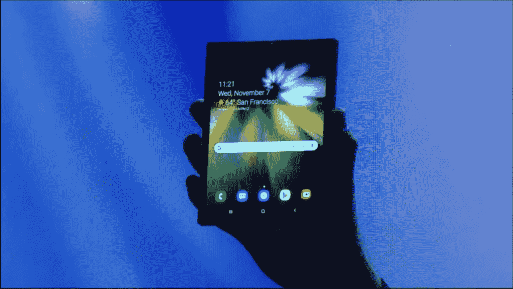</picture> 

The prototype Samsung showed off on stage during the Samsung Developer Conference 2018.

自 2013 年以来，三星一直在研究一款可折叠手机，但直到 2018 年底在该公司的开发者大会上，[功能原型才真正出现](https://www.xda-developers.com/samsung-foldable-phone-infinity-flex/amp/)。那个未命名的原型只在一个灯光昏暗的舞台上远远地展示过，实际上没有媒体得到过它。但即使从远处看，我们也可以看到它显然与 2019 年 4 月首次推出的最终 Galaxy Fold(当时还没有 Z 品牌)采用了相同的设计语言。

* * *

## 三星 Galaxy Fold(版本 1):一个灾难性的开始

 <picture>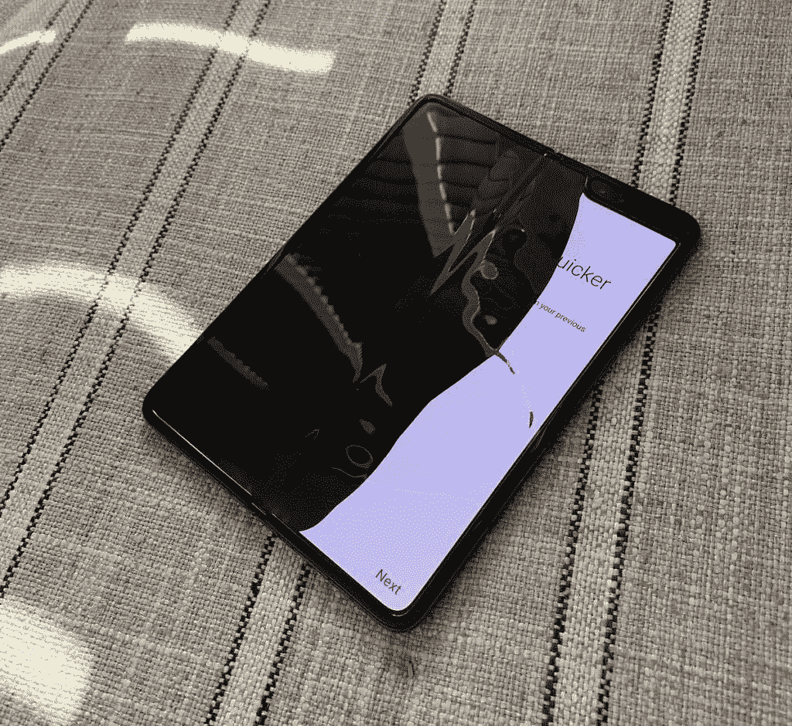</picture> 

A photo shared on Twitter by Bloomberg's Mark Gurman, showing the screen of his review unit malfunctioning.

如果你当时关注手机新闻，你肯定记得最初发布时发生的事情:三星植入评论者的早期 Galaxy Fold 评论单元在使用几天后就开始出现故障。这些问题都与可折叠显示器不同程度地显示坏像素有关。原因多种多样，从评论者不知不觉地移除了不可移除的屏幕保护器，到碎片进入手机的移动部件。无论如何，这对三星来说都是一场公关灾难，这家韩国科技巨头迅速召回了所有审查设备，并推迟了最初计划的 2019 年 4 月 26 日的发布日期。三星最初应该在“几周内”宣布更新的发货日期，但几个月过去了，却没有任何消息。

毫不夸张地说，当时，三星的可折叠愿望似乎在正式开始之前就已经破灭了。

## 银河折叠(版本 2):成功升空

 <picture>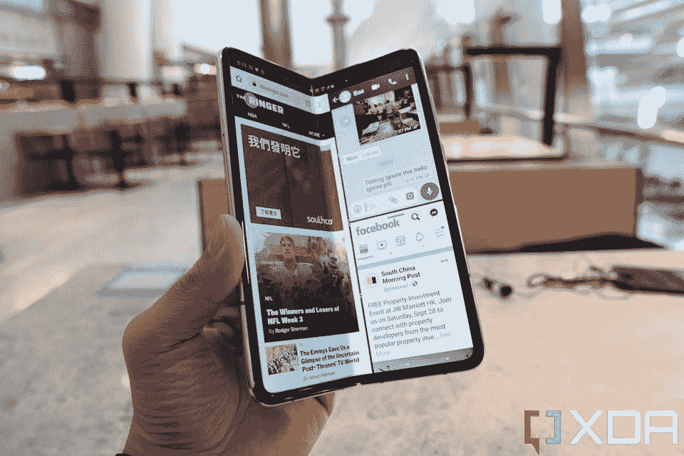</picture> 

The fixed, retail version of the Galaxy Fold.

三个月后，三星终于在 2019 年 7 月宣布，已经确定并修复了问题，Fold 将于 9 月发布。修复措施包括在铰链内插入微型刷子(如小扫帚)，并在折叠点的顶部和底部放置两个塑料盖，以防止碎片进入。不可拆卸的屏幕保护器也被塞进边框，因此用户不会不知不觉地将其剥离。

 <picture>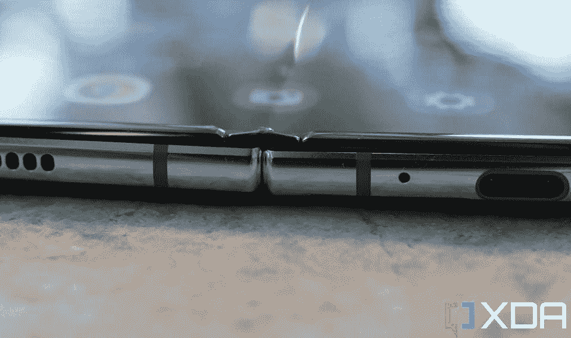</picture> 

The small T-shaped plastic caps that Samsung placed at the top and bottom of the display's folding point.

这些修复听起来无关紧要，也没有唤起科技媒体或任何合理谨慎的消费者的信心。尽管如此，还是有疯狂的小玩意爱好者愿意冒财务风险买一个。我就是其中之一，第一天就以高价从韩国进口了一台。

但三星值得称赞，因为这些修复措施确实奏效了。尽管经过了严格的审查，但在 Galaxy Fold 的整个生命周期中，没有出现广泛的设备故障报告，我在 13 个月的时间里每天都使用我的设备，没有出现任何问题。

 <picture>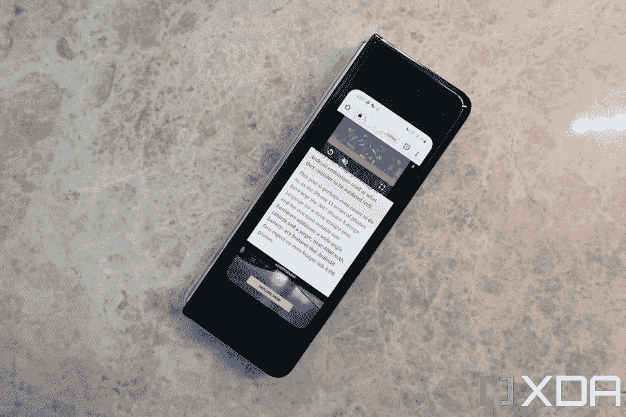</picture> 

The original Samsung Galaxy Fold.

有趣的是，看到我是多么迷恋原来的折叠，因为回头看，这显然是第一代设备缺乏抛光和完善。

你知道当你今天看 90 年代末和 21 世纪初上映的电影时，屏幕上的手机和笔记本电脑与我们今天拥有的小玩意相比看起来绝对笨重和廉价吗？只有四年历史的 Galaxy Fold 已经有了这种感觉，巨大的边框夹住了外部屏幕，一个不雅观且不必要的缺口侵蚀了主屏幕，最糟糕的是，一个脆弱的铰链在中间折叠。

 <picture>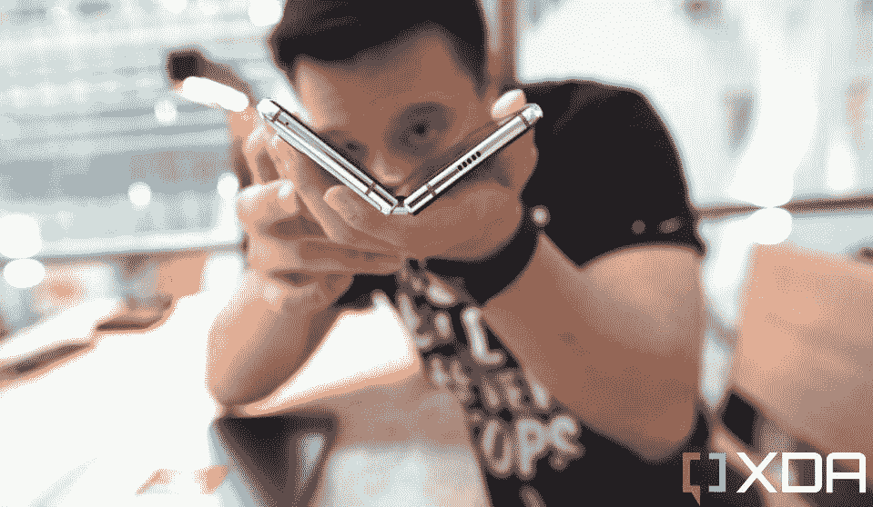</picture> 

The original Galaxy Fold (which I paid $2,700 for) had a hinge that now in hindsight feels so flimsy and cheap.

但 Galaxy Fold 已经有了一个非常正确的东西:内部折叠设计。到 2019 年底，已经有另外两种可折叠产品存在(华为 Mate X 和 Royole FlexPai)，两者都采用了外部折叠，可折叠显示屏以折叠形式包裹在屏幕周围。我也测试了这两款手机，我在现实世界中使用它们从来都不舒服，因为柔软易弯曲的屏幕总是暴露在外。与此同时，Galaxy Fold 感觉更安全，因为折叠时折叠屏幕受到了保护。

 <picture>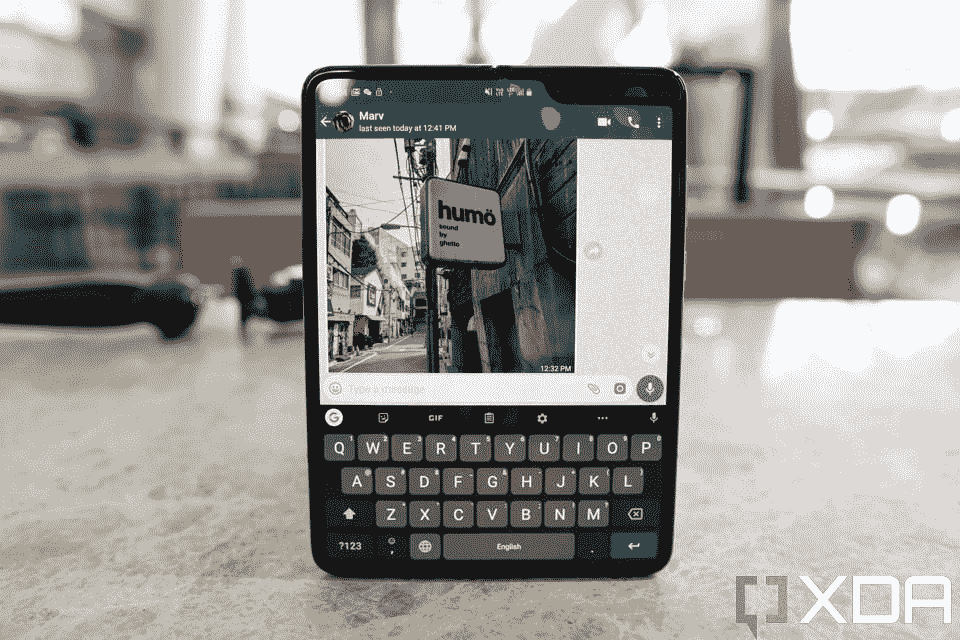</picture> 

The original Fold with a rather large notch in the upper right corner.

即使 Galaxy Fold 价格昂贵，而且事后来看，它的硬件也未经打磨，但它确实兑现了平板电脑可以对折并放入我们口袋的承诺。对于像我这样喜欢在旅途中工作的数字流浪者来说，最初的 Galaxy Fold 绝对值得。从第一天起，我就被可折叠的想法说服了。

* * *

## Galaxy Z Fold 2:近年来手机史上最大的代间跳跃

 <picture>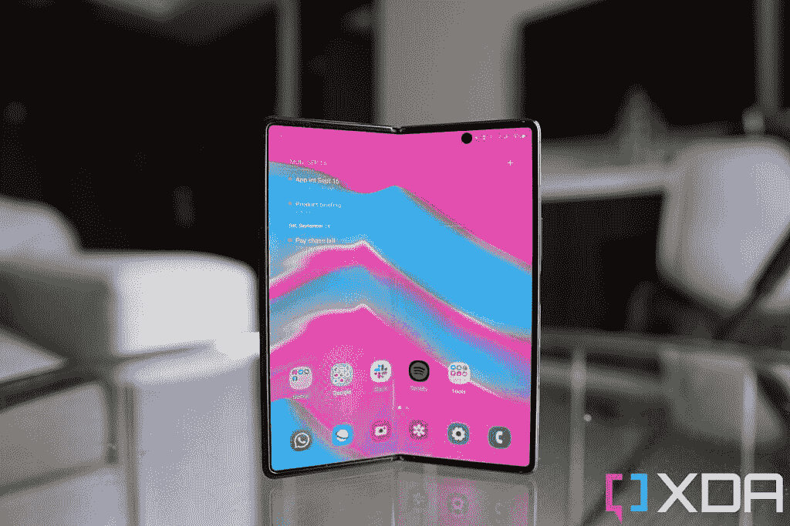</picture> 

The Galaxy Z Fold 2.

如果说消费技术中有一个不断重复出现的主题，那就是第一代尖端新技术通常非常粗糙，而第二代则是我们看到的*更加精致的*产品。即使考虑到这一点，Galaxy Z Fold 2 也绝对让我大吃一惊，它比原来的 Fold 改进了多少。

首先，滑稽局促的外部屏幕不再存在，取而代之的是一个边对边的覆盖显示屏。当然，它有点笨拙地又高又瘦，但仍然比我们以前拥有的更有用。

 <picture>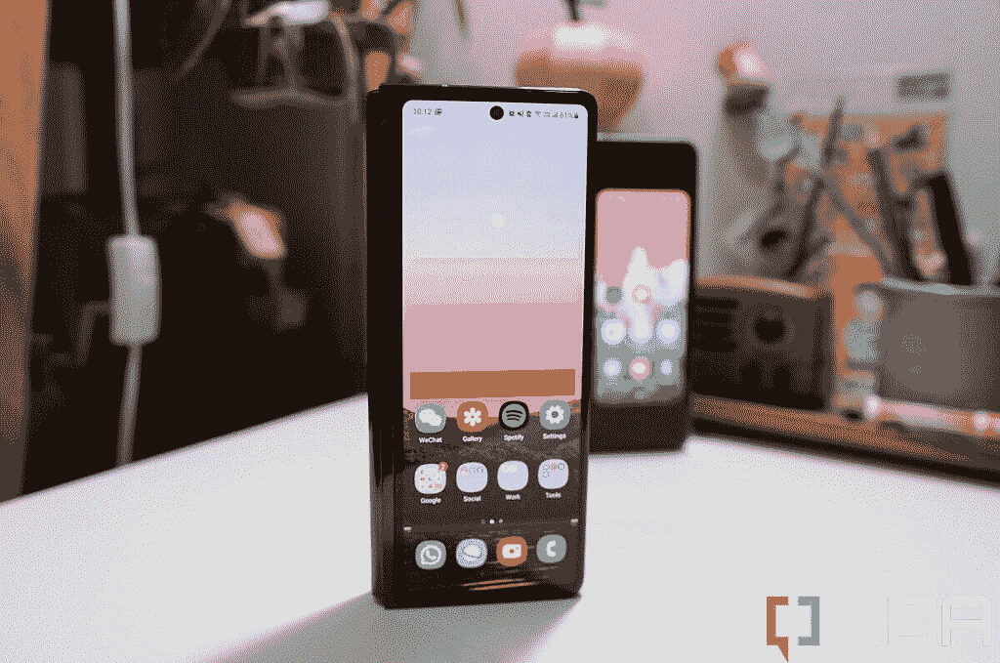</picture> 

The Galaxy Z Fold 2's outside screen is much larger than the original Fold's (back).

主显示屏也摆脱了丑陋的缺口，变成了一个侵入性更小的打孔孔，但最重要的是:铰链得到了显著改善。它感觉更坚固，需要更多的力量来折叠和展开。在一次巧妙的移动中，铰链可以在任何角度保持不动，就像笔记本电脑的铰链一样。三星称之为“灵活模式”，它开辟了无数新的使用案例。

Galaxy Z Fold 2 带来了近年来移动历史上最大的逐代改进。

例如，Z Fold 2 可以充当自己的三脚架，允许相机进行免提自拍、延时视频或视频通话。我有时也把它当作迷你笔记本电脑使用，键盘显示在设备的下半部分。

大的可折叠屏幕也进行了材料升级，现在在顶部使用了一层“超薄玻璃”,比第一个折叠显示屏的柔软、塑料感更像玻璃。

我喜欢三星对其第二代 Fold 所做的每一项改变，除了添加了毫无意义的 Z 品牌。在我看来，Galaxy Fold 和 Galaxy Flip 听起来很干净。再加一个随机字母感觉多此一举。我当时在对 Galaxy Z Fold 2 的评论中写道，我仍然相信这是真的:Z Fold 2 带来了最近移动历史上最大的逐代改进。

* * *

## Galaxy Z Fold 3:让可折叠更加耐用、实用和实惠

 <picture></picture> 

The Galaxy Z Fold 3.

到 2021 年上半年，中国的可折叠场景竞争已经升温，华为和小米推出了可折叠手机。[华为的 Mate X2](https://www.xda-developers.com/huawei-mate-x2-review/) 特别推出了一系列可折叠硬件改进，让 Z Fold 2 看起来有点过时。华为的 foldable 有一个几乎不从侧面伸出的铰链，折叠平整没有缝隙，没有坚硬的显示屏折痕，相机系统采用了 10 倍潜望镜变焦镜头。

每个人都认为三星会将所有这些改进融入到 [Galaxy Z Fold 3](https://www.xda-developers.com/samsung-galaxy-z-fold-3-review/) 中。毕竟，如果华为能做到，三星肯定也能做到。

但这并没有发生。2021 年 8 月发布的 Galaxy Z Fold 3 恢复了与 Galaxy Z Fold 2 基本相同的设计，有明显的屏幕折痕，笨重的铰链和适中的相机硬件，与三星自己的 Galaxy Ultra slab 手机相机相去甚远。所有显示的测量和尺寸都与 Z Fold 2 相同。

 <picture>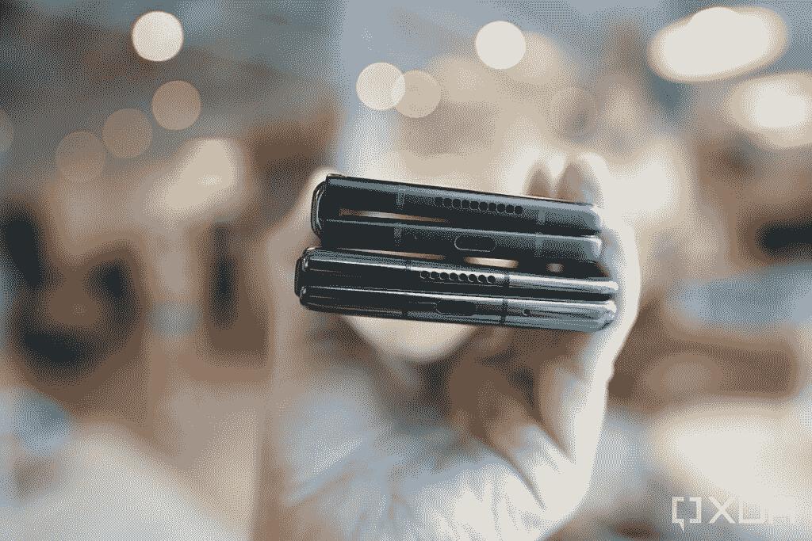</picture> 

Notice the Galaxy Z Fold 3's hinge (top) protrudes from the left side much more than the Huawei Mate X2 hinge (bottom).

除了三星的工程师之外，没有人知道确切的答案，但我的理论是，三星没有将这些折痕和摄像头的改进融入 Z Fold 3，不是因为三星缺乏技术能力，而是因为三星希望让它的可折叠产品更主流:三星没有塞进会增加成本和重量的绝对最新的尖端组件，而是让折叠产品对主流消费者来说更实用:更耐用、更轻、更便宜。

Galaxy Z Fold 3 实现了这三个目标。它和同时推出的 Z Flip 3 是第一款获得官方 ip 防水评级的可折叠手机；它比 Z Fold 2 轻了 10g，其起始零售价格比前两次折叠的 2000 美元价格低了近 200 美元。三星还为 Galaxy Z Fold 3 添加了 S-Pen 支持，为更大的显示屏提供了理由。

 <picture>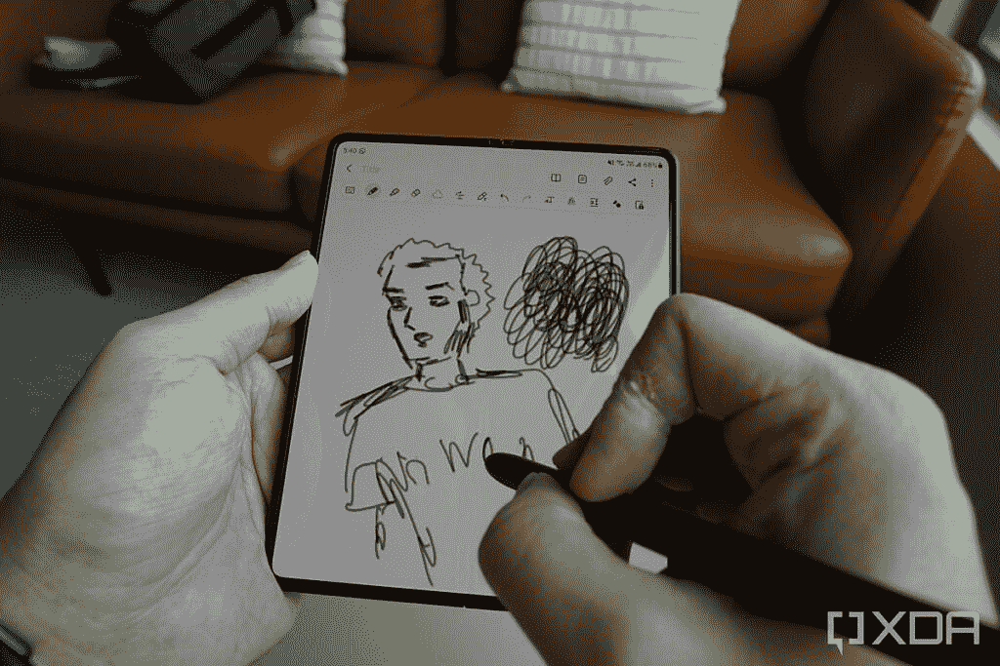</picture> 

Sketching on the Z Fold 3 with the S-Pen Pro.

一个有争议但不一定是改进的变化是主屏幕切换到了显示不足的自拍相机。这使得 Z Fold 3 的主显示屏不间断地出现，至少如果你不太仔细看的话。仔细观察，你会发现屏幕下技术并没有很好地隐藏相机，这款 400 万像素的自拍相机的质量相当平庸。对于想要更高质量自拍的人来说，外面的屏幕上仍然有一个普通的自拍相机。对我来说，这种改变没多大关系，但在当时这是一个有分歧的决定。

 <picture>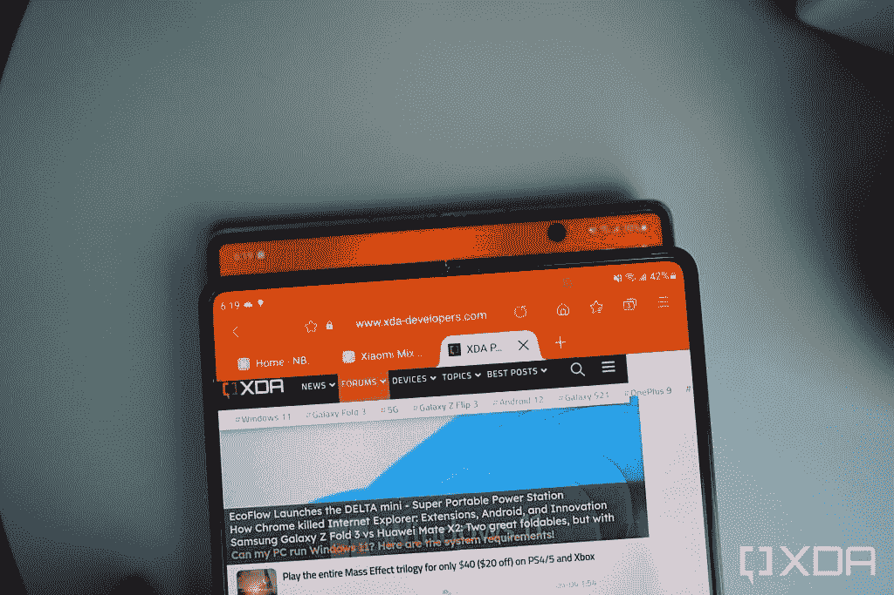</picture> 

The Galaxy Z Fold 3's under-screen selfie camera (compared against the Galaxy Z Fold 2's hole-punch)

对于像我这样真正喜欢抓拍照片的小工具爱好者来说，Galaxy Z Fold 3 的相机感觉过时了，与竞争对手 foldables 提供的相机系统相比，相当缺乏。但我理解三星的决定:如果它将 Galaxy S21 Ultra 的 epic 相机系统塞进 Fold 3，可折叠肯定会更重，成本更高。

* * *

## Galaxy Z Fold 4:向主流的又一次迭代

四年后，我们有了 Galaxy Z Fold 4。如上所述，我们可以看到的改进是微妙的:铰链不再伸出那么多，改善了手感。外盖显示屏也稍微宽了一点(准确地说，宽了 2.7 毫米)，这使得该设备在折叠形式下的长宽比不那么窄(与之前的 24.5:9 相比，现在仅为 23:9)。这个变化很微妙，但确实有所不同，因为我总是发现 Z Fold 2 和 3 折叠时屏幕太窄。

Z Fold 4 的主显示屏据说也比 Z Fold 3 的屏幕强 45%，这要归功于更坚固的薄膜材料以及包含的大猩猩玻璃 Victus Plus。尽管如此，大多数人仍然应该考虑使用外壳来保护手机免受跌落。

 <picture>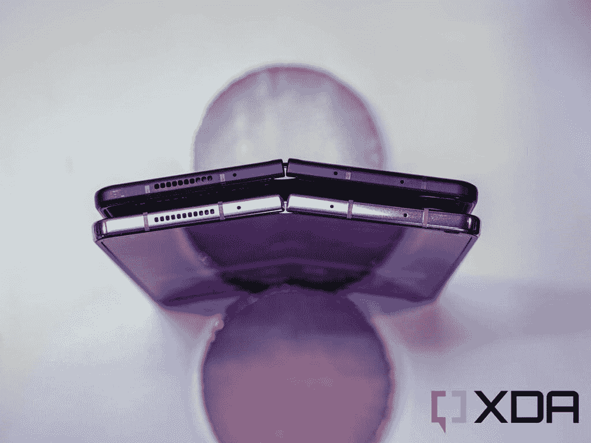</picture> 

The Galaxy Z Fold 4 (bottom) and Z Fold 3 (top)

电池尺寸与去年相同，但新的高通骁龙 8 Plus Gen 1 芯片明显更高效，这应该会给 Z Fold 4 带来比以往更好的电池续航时间。今年也有更快的充电速度，但 Z Fold 4 没有配备充电器，所以你必须自己购买 [Fold 4 充电器](https://www.xda-developers.com/best-samsung-galaxy-z-fold-4-chargers/)。S-Pen 支持也恢复了，尽管手写笔仍然需要单独购买。

三星还升级了 Z Fold 4 的摄像头，配备了 50MP 的主摄像头，分辨率是 Z Fold 3 主摄像头的四倍。这些分辨率用于像素宁滨，这进一步提高了进光能力。图像传感器的尺寸也更大，尽管三星没有说明具体是多大。变焦镜头还增加了 3 倍光学变焦镜头，可能与三星 Galaxy S22 系列手机使用的镜头相同。这比前几年的 2 倍变焦镜头提高了一步。

虽然这些仍然不是三星绝对最好的相机硬件(它缺少 S22 Ultra 中使用的大传感器 108MP 主相机和 10 倍潜望镜变焦镜头)，但这些改进仍然很受欢迎。当然，对于像我这样的小工具爱好者来说，我希望三星能够全力以赴，为 Z Fold 4 提供 S22 Ultra 相机系统，但同样，这将大大增加成本和重量。三星现在的重点显然是让折叠和翻盖系列尽可能吸引大众。这是正确的商业举措。三星的营销团队一直热衷于吹捧去年的 Galaxy Fold 和 Flip 3 系列卖得有多好，我绝对相信他们。有趣的是，我在世界各地的城市里看到*越来越多地*弃牌和翻牌，而不是我前两次弃牌或翻牌。

这有助于 Galaxy Fold 系列在全球舞台上仍然没有真正的竞争对手，因为迄今为止所有其他大屏幕可折叠产品都仅限于中国市场。但即使没有竞争，三星也在改进 Fold 的硬件方面做了出色的工作，解决了最初似乎注定了该产品类别的所有耐用性问题。如果你对你的第一个可折叠手机感兴趣，现在是一个加入的好时机。三星也有很多不错的 [Z Fold 4 优惠](https://www.xda-developers.com/best-samsung-galaxy-z-fold-4-deals/)。

 <picture></picture> 

Samsung Galaxy Z Fold 4

三星 Galaxy Z Fold 4 是终极生产力发电站，为高级用户提供更全面的体验。