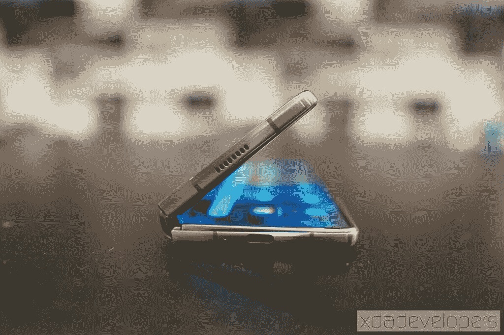
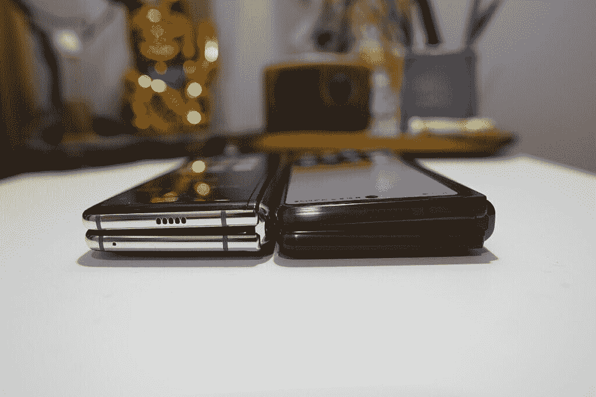
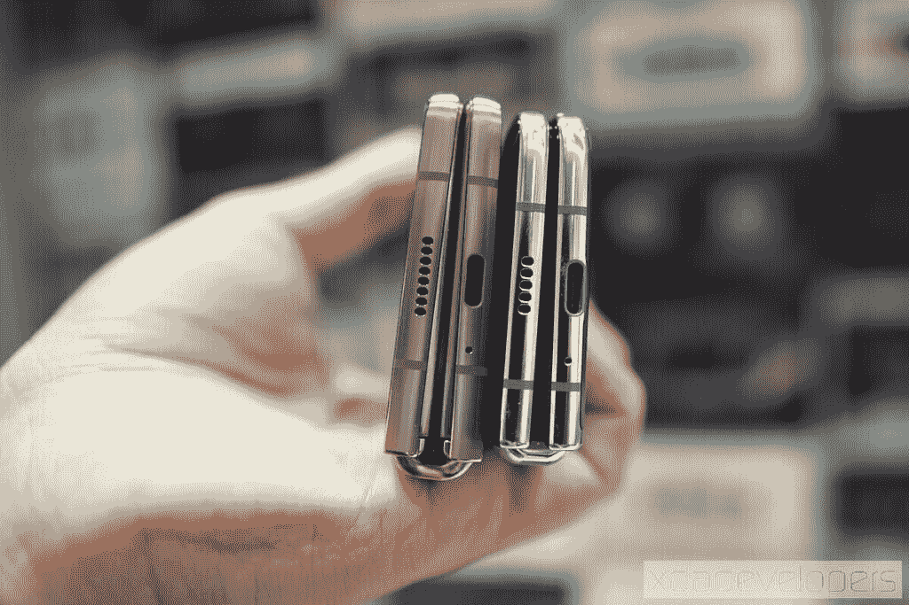
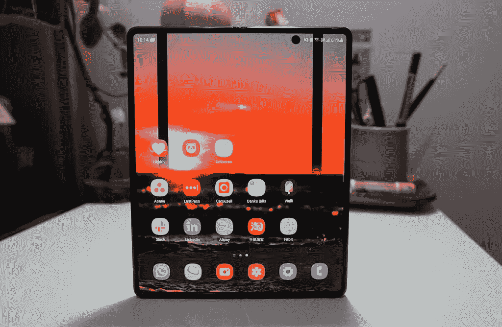
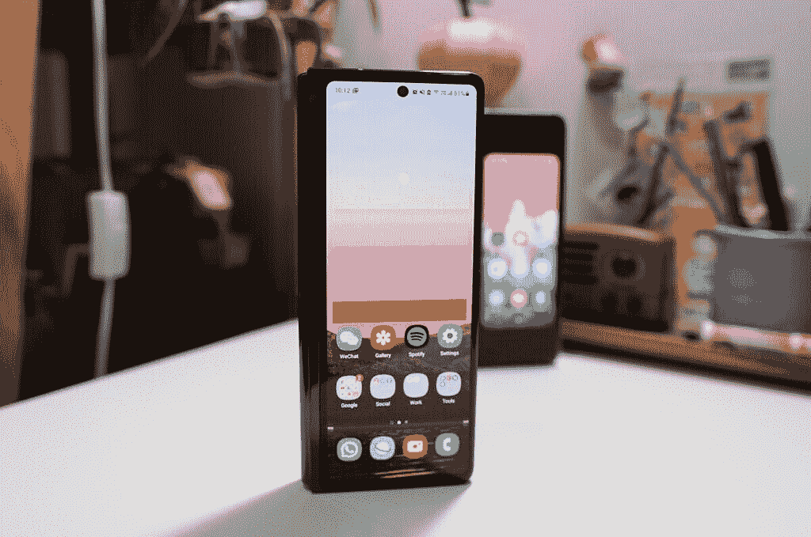
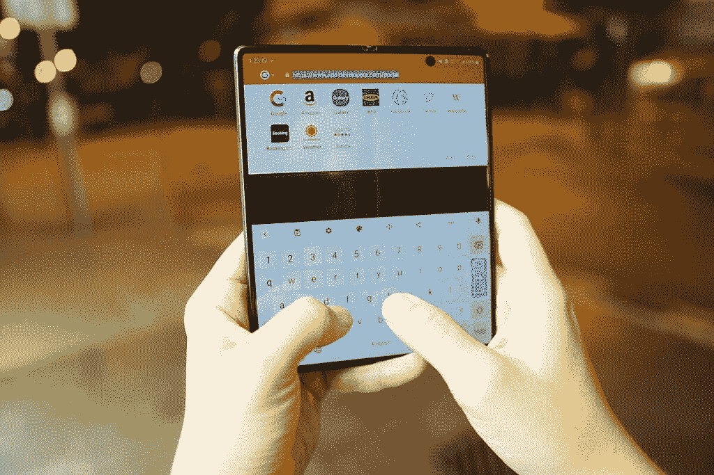
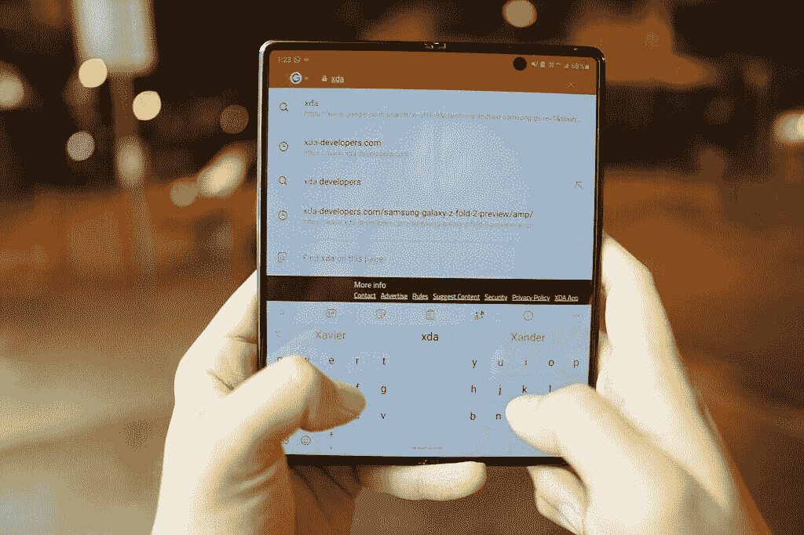
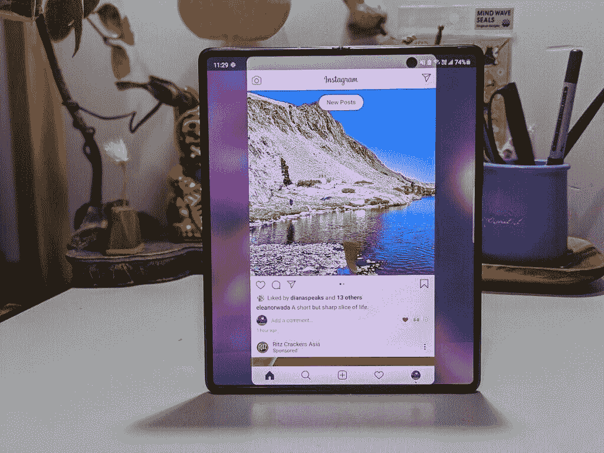
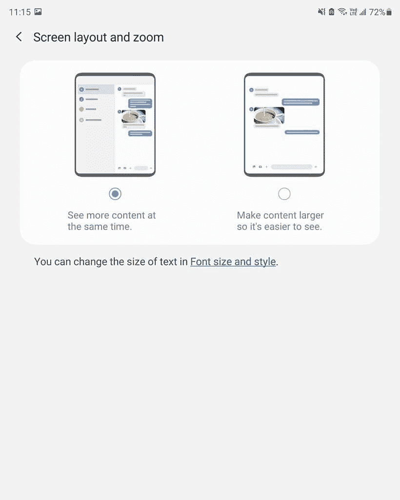
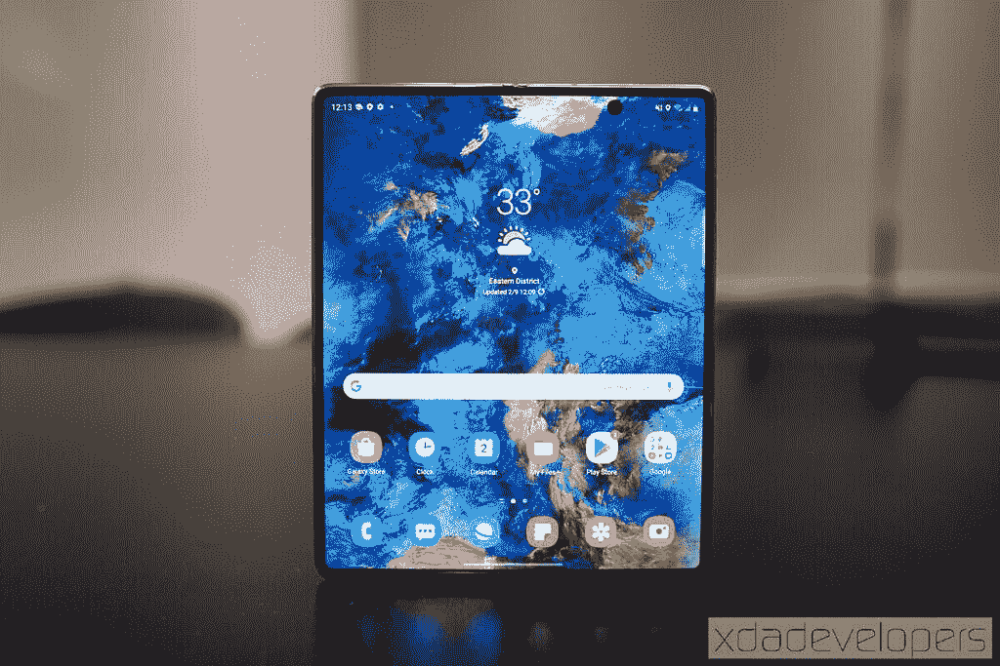

# Galaxy Z Fold 2 正在进行的审查第一天:尖端的未来就在这里！

> 原文：<https://www.xda-developers.com/samsung-galaxy-z-fold-2-ongoing-review-day-one/>

对于消费者来说，购买任何消费电子产品的第一个版本——也就是“第一代”——通常被认为是不明智的。人们相信，等到第二代或第三代，就能得到更精致、更完美的产品。

这一点在你拿起[三星 Galaxy Z Fold 2](https://www.xda-developers.com/samsung-galaxy-z-fold-2/) 的那一刻就很明显。我说的不仅仅是更大的外部“覆盖屏幕”或立即吸引注意力的无凹槽主 7.6 英寸屏幕；但即使只是拿着 Fold 2，你也会觉得它是一个更精致的硬件。拿在手里感觉更致密，更成熟。

Galaxy Z Fold 2 证实了智能手机的尖端未来已经到来。

Galaxy Z Fold 2 比 Fold 1 改进了这么多，这是对我的一个巨大褒奖，因为我不是许多怀疑最初 Galaxy Fold 的人之一；从第一天起，我就被这个想法说服了，我自己掏钱买了一个单元，我从来没有后悔过。对我来说，最初的折叠是一种尖端设备，是未来的暗示。折叠 2 是未来就在眼前证明。

我正在使用 Fold 2 的第一天，这肯定会是很长一段时间——当我将这个审查单元归还给三星时，我已经计划购买自己的产品——下面是我的即时收获。

## 改进的铰链是合法的

如果你以折叠的形式紧紧握住它，最初的星系折叠会因为你握的压力而摇晃。这不是因为一年的磨损；它就像盒子外面的一样。

当时我并没有多想——毕竟，这是一个被弯成两半的平板电脑，所以当然，如果你压进去，会有一点运动，对吗？嗯，Fold 2 没有这个。即使在折叠的形式下，它也像一个坚固的平板，就像华为 Mate XS 一样。

现在打开转轴感觉就像打开笔记本电脑一样，你只需要足够的力来撬开它，但当你停止推动转轴时，它就会保持不动。

在上周的实际操作中，我们讨论了为什么保持不动的铰链是这款设备的理想选择，我们将在接下来的几天里进行更深入的测试，但仅仅几个小时后，我就已经发现它非常有用。例如，我在晚餐时观看了 YouTube 视频，Fold 2 以帐篷模式支撑在桌子上。

## 它既是一部手机，也是一部平板电脑

最初的折叠对我来说总是像一个平板电脑，可以在短时间内伪装成一个小手机。我说“短时间”是因为外盖屏幕太小，你真的不能舒服地在上面打字。所以你会经常想要展开它。

对于 Fold 2，到目前为止，我在折叠状态下使用它的次数几乎与我在展开状态下使用它的次数一样多，这证明了即使在较小的外形尺寸下，该设备也是多么实用。总的来说，它感觉像平板电脑或小手机一样强大。

## 展开形态下的键盘困境

 <picture></picture> 

Gboard doesn't offer a split keyboard option.

Fold 2 有两个安装在盒子外面的键盘:三星自己的键盘和 Swiftkey，由于三星和微软之间的密切合作关系，这里推出了这两个键盘。两者都针对 Fold 2 的平板电脑外形进行了优化，因为它们在展开时会自动切换到分离键盘(在较小的外部屏幕上是标准键盘)。这很好，因为 7.6 英寸的屏幕对大多数人来说有点太宽了，如果键盘没有分开，他们就无法舒适地打字。

 <picture></picture> 

But SwiftKey does let you split for easier thumb typing.

不过我更喜欢用 Gboard(我想很多评测者也有同感)，但是 Gboard 并没有提供拆分键盘选项。这导致我使用折叠形式的 Gboard，但切换到展开形式的 Swiftkey，只是为了利用分离键盘。我希望谷歌会考虑为可折叠设备优化 Gboard，因为它们往往有更大的屏幕。

## 一个用户界面利用更多的屏幕

到目前为止，我用过的大多数应用程序在小屏幕和大屏幕上都运行良好。尤其是 Instagram，已经被“固定”在了更大的屏幕上。在最初的折叠中，Instagram 会拉伸整个画布，由于大屏幕的奇怪纵横比，这意味着 Instagram 故事会在顶部和底部被裁剪。

这个问题现在已经得到了解决，尽管不是以最优雅的方式:Instagram 现在以 16:9 的矩形纵横比在大屏幕上运行，主要的柱状框——屏幕左右两侧的大条——看起来很奇怪。但至少现在你可以看到搞笑故事的全盛时期。

在其他地方，您可以选择在更像平板电脑/电脑的视图中显示内容，在屏幕上显示更多信息，或者只是标准的智能手机视图，但所有内容都在屏幕上显示得更大。Slack、Gmail、Samsung Internet 和 Files 等应用程序都利用了多面板布局的大屏幕。

## Galaxy Z Fold 2 是数字游民的完美设备

Galaxy Z Fold 2 感觉像是为像我这样的人——一个以写作/编辑文字为生的数字流浪者——制造的设备，不喜欢被拴在桌子上。多年来，我一直在寻找周围最轻的笔记本电脑/平板电脑，所有这些都是为了让我能够拥有一台工作机器，无论我在世界上的任何地方，都可以随时随地工作。

然而，无论笔记本电脑变得多轻，它最终还是我必须放在包里携带的第二台机器。Galaxy Z Fold 2 是一款放在我口袋里的设备，必要时可以兼作电脑。我的背包里随时都有一个可折叠键盘。应该是 Z Fold 2 的绝佳伴侣。

在我第一次使用 Galaxy Z Fold 2 整整 24 小时后，请明天与我一起了解更多信息！

### 三星 Galaxy Z Fold 2

有亚马逊商店卡还是更喜欢在亚马逊购物？你现在可以在下周发布之前在亚马逊上预购三星的可折叠手机！神秘青铜和神秘黑色版本都可用，使用亚马逊商店卡，您可以在 12 个月内每月支付 166.67 美元，无需支付任何费用！

**Affiliate Links**

Amazon

[View at Amazon](https://www.amazon.com/Samsung-Factory-Unlocked-Android-Smartphone/dp/B08GL3QYHC/?tag=xda-54u0csh-20&ascsubtag=UUxdaUeUpU29773&asc_refurl=https%3A%2F%2Fwww.xda-developers.com%2Fsamsung-galaxy-z-fold-2-ongoing-review-day-one%2F&asc_campaign=Short-Term)