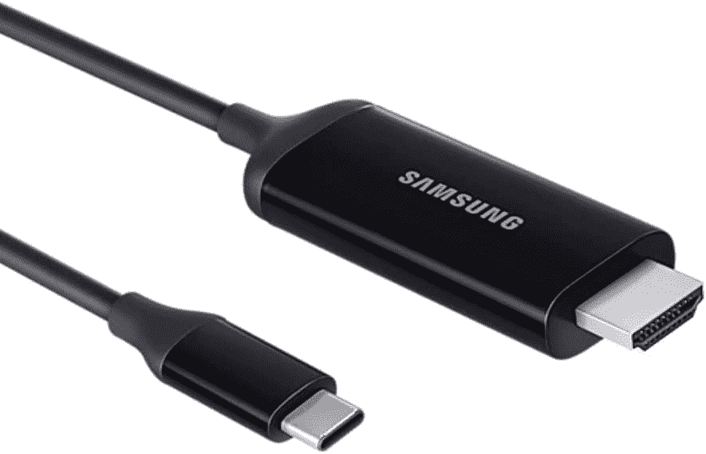
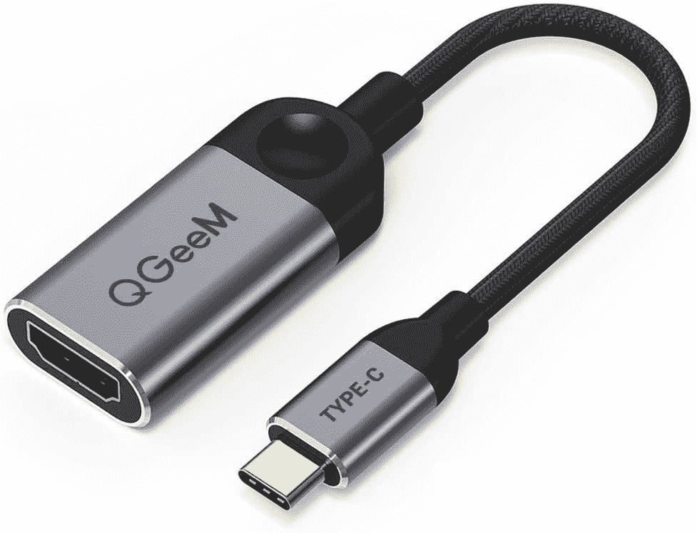
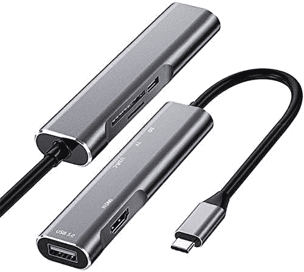

# 三星 Galaxy Z Fold 3 和三星 DeX 配合使用吗？

> 原文：<https://www.xda-developers.com/samsung-galaxy-z-fold-3-dex/>

有了新的 [Galaxy Z Fold 3](https://www.xda-developers.com/samsung-galaxy-z-fold-3/) ，你会得到一部功能强大的智能手机，在你需要的时候它还可以作为平板电脑使用。更大的屏幕当然允许额外的生产力任务，但有时你需要一个桌面界面。幸运的是，Galaxy Z Fold 3 可以通过三星 DeX 提供这一点。在你的新 Galaxy Z Fold 3 上使用 DeX 既快速又简单，还能让你在外接显示器上工作。让我们来谈谈三星 DeX 的工作原理，以及它如何帮助您提高工作效率。

三星 DeX 承诺通过让您将手机或平板电脑转变为 PC，开创一个移动桌面计算的新时代。最精彩的部分？它是免费的。DeX 软件平台内置于许多最新的三星 Galaxy 移动设备中，因此您需要的只是一台显示器、一个 HDMI 适配器和外围设备。如果你有支持 Miracast 的智能电视或显示器，你甚至可以无线使用 DeX。

2017 年初推出的三星 DeX 的第一次迭代需要一个对接配件(DeX Station 或 DeX Pad)来为软件供电和连接外设。随着 2018 年 8 月 Galaxy Note 9 的推出，三星通过引入 DeX HDMI 适配器、电缆和多端口适配器，消除了对这些对接配件的需求。除了所需的电缆，如果你计划带着 Galaxy Z Fold 3 旅行，你可能还想[拿起一个盒子](https://www.xda-developers.com/best-samsung-galaxy-z-fold-3-cases/)。

### 如何使用 DeX 连接您的 Galaxy Z Fold 3

一旦您有了首选电缆或适配器，请按照以下步骤将您的 Galaxy 智能手机或平板电脑连接到您的显示器，并开始使用 DeX:

*   如果您使用的是 DeX 电缆，请将其插入显示器的 HDMI 端口。如果您使用的是多端口适配器，您只需将标准 HDMI 电缆从显示器连接到适配器即可。
*   通过 USB-C 端口将您的设备连接到适配器。启动时，您会在显示器上看到 Samsung DeX 徽标。
*   现在连接你的键盘和鼠标。如果您使用的是 DeX 线缆，您将需要配对蓝牙键盘和鼠标。在您的设备上，打开蓝牙并扫描外围设备。然后按照制造商的说明(通常包括按住蓝牙按钮，让你的键盘或鼠标对你的手机或平板电脑“可见”)。如果您使用多端口适配器，您可以选择通过 USB 3.0 连接。您也可以选择将您的设备用作触摸板，而不是连接鼠标。
*   如果您使用的是多端口适配器，您还可以将设备的充电电缆连接到适配器的 USB-C 端口。如果您使用的是 DeX 电缆，您可以在使用 DeX 时将设备放在无线充电器上以保持充电。

 <picture></picture> 

Samsung USB C to HDMI cable for DeX

##### 用于 DeX 的三星 USB-C 转 HDMI 电缆

这种 USB C 转 HDMI 线是三星官方出售的，是连接显示器时启用 DeX 模式的方式之一。

 <picture></picture> 

QGeeM USB C to HDMI Cable

##### QGeeM USB-C 转 HDMI 电缆

如果你只是想在不花太多钱的情况下尝试三星 DeX，这种 USB C 到 HDMI 电缆是一种廉价的替代选择。

 <picture></picture> 

Samsung USB C to HDMI cable for DeX

##### 用于 DeX 的三星 USB-C 转 HDMI 电缆

如果你正在寻找连接多个配件到你的手机，这是一个很好的多端口适配器让你开始。

您还可以无线连接到任何支持 Miracast 的电视或 PC。这是在商务会议上共享 Powerpoint 或 Excel 文档的理想解决方案。总的来说，DeX 提供了使用新 Galaxy Z Fold 3 完成实际工作的多功能性。如果你还在考虑购买三星最新的可折叠手机，现在就来看看我们的[最佳交易清单](https://www.xda-developers.com/best-galaxy-z-fold-3-deals/)。