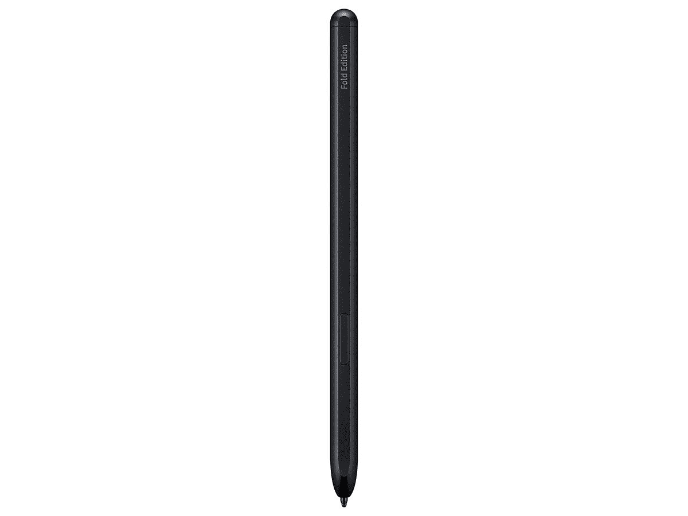
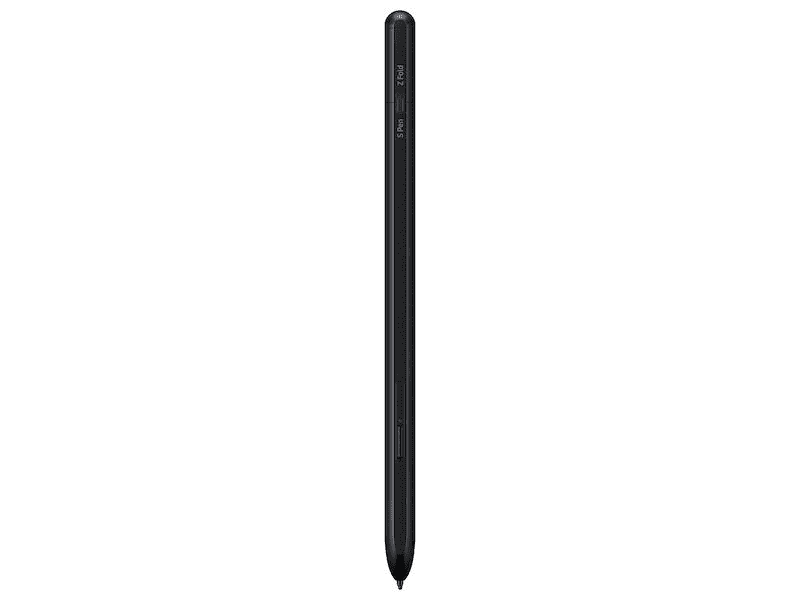

# 三星 Galaxy Z Fold 3 有 S 笔槽吗？

> 原文：<https://www.xda-developers.com/samsung-galaxy-z-fold-3-s-pen-slot/>

如果你一直在等待三星最新的可折叠手机，它们现在终于出来了。如果你想要一个可折叠的平板电脑或者想要一个小的翻盖设备，你可以拿起[Galaxy Z Fold 3](https://www.xda-developers.com/samsung-galaxy-z-fold-3/),[Galaxy Z Flip 3](https://www.xda-developers.com/samsung-galaxy-z-flip-3/)可能适合你。由于这两款可折叠手机都是三星最新的高端旗舰产品，它们都拥有顶级的规格和功能。事实上，三星甚至放弃了 Note 系列手机，转而采用 Galaxy Z Fold 3，如果更多人适应可折叠的外形，这可能是一个很好的举措。

由于 Galaxy Note 系列已经不复存在，三星不得不在 Note 系列中加入一项功能，以取悦从该系列转向 Galaxy Z Fold 3 的消费者，那就是支持 S Pen。S Pen 一直是 Note 系列的标志性配件，可以在不使用时塞进手机机箱。这使得它非常方便随身携带，因为你可以使用 S Pen 快速记录笔记或在手机上涂鸦，完成后，你可以将它插回手机，而不用担心丢失。

然而，通过 Galaxy Z Fold 3，三星不会将 S Pen 与手机本身捆绑在一起。这是一个单独的配件，你需要购买，因此，手机上没有**S 笔槽**来存放手写笔。你要么单独携带它，要么购买三星出售的[专用翻盖外壳](https://shop-links.co/1749353889535005180?u1=9b2533ab-b2d7-4695-8742-0c008a3b363e)，以便将 S Pen 与 Galaxy Z Fold 3 一起存放。

Galaxy Z Fold 3 有两种 S Pen 选项可供选择——S Pen Fold Edition 和 [S Pen Pro](https://www.xda-developers.com/samsung-s-pen-pro/) 。这个箱子只能装较小的折叠版钢笔。如果你买的是 S Pen Pro，除了把它单独放在口袋或背包里，你别无选择。

三星无法在 Galaxy Z Fold 3 上为 S Pen 安装插槽是可以理解的。制造可折叠手机已经是一项工程挑战。此外，手机已经很厚了，增加一个 S Pen 插槽只会让它更厚。S Pen Pro 甚至比另一款 S Pen 更长更厚，因此考虑到它也比折叠长度更长，这将是一个更大的挑战。希望在未来几代可折叠手机中，三星找到了一种将普通 S Pen 集成到手机本身的方法，就像 Note 系列一样。

 <picture></picture> 

S Pen Fold Edition

##### 三星钢笔折叠版

这是 Galaxy Z Fold 3 的标准 S Pen Fold 版。如果您打算将 S Pen 仅与 Z Fold 3 一起使用，请获取此信息。

 <picture></picture> 

Samsung S Pen Pro

##### 三星 S Pen Pro

S Pen Pro 可以让你在 Galaxy Z Fold 3 的大显示屏上做笔记和涂鸦，这使它成为 Galaxy Note 系列的完美替代品。

 <picture></picture> 

Samsung Galaxy Z Fold 3

##### 三星 Galaxy Z Fold 3

Galaxy Z Fold 3 无疑是迄今为止最好的可折叠手机之一。它有一个显示摄像头，并支持 S Pen。

如果你打算从三星获得最新的高级可折叠手机，你可以查看一下[最佳 Galaxy Z Fold 3 交易](https://www.xda-developers.com/best-galaxy-z-fold-3-deals/)以及一些[最佳手机案例](https://www.xda-developers.com/best-samsung-galaxy-z-fold-3-cases/)，以保护你的投资。