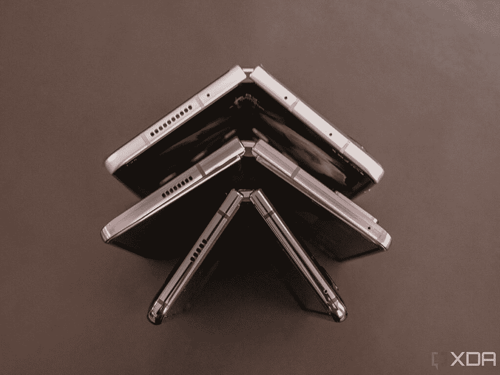
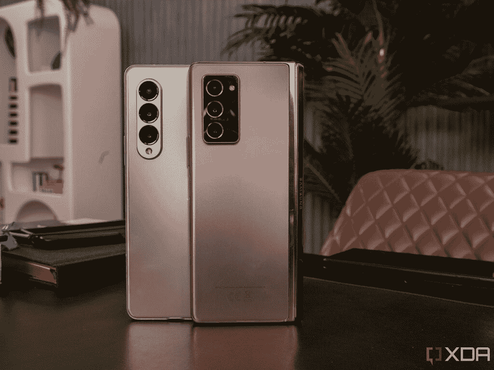

# 三星 Galaxy Z Fold 3 vs Galaxy Fold:可折叠已经走了多远？

> 原文：<https://www.xda-developers.com/samsung-galaxy-z-fold-3-vs-galaxy-fold/>

三星推出了其第三代可折叠智能手机 [Galaxy Z Fold 3](https://www.xda-developers.com/samsung-galaxy-z-fold-3/) ，该阵容已经走过了漫长的道路。当最初的三星 Galaxy Fold 首次发货时，屏幕开始出现问题。这家韩国公司不得不在发货前从头开始做进一步的改进。

它远不是你今天看到的成熟产品。事实上，三星 Galaxy Z Fold 3 将成为目前市场上[最好的可折叠手机之一。这就是第一的好处。](https://www.xda-developers.com/best-foldable-phones/)

### 三星 Galaxy Z Fold 3 vs 三星 Galaxy Fold 规格

|  | 

三星 Galaxy Z Fold 3

 | 

三星 Galaxy 折叠

 |
| --- | --- | --- |
| 

处理器

 | 5 纳米 64 位八核处理器(2.84GHz + 2.4GHz + 1.8GHz) | 7 纳米 64 位八核处理器(2.84GHz + 2.41GHz + 1.78GHz) |
| 

显示

 | 覆盖屏幕:6.2 英寸高清+动态 AMOLED 2X 显示屏 24.5:9 宽高比 2268 x 832，387 ppi120Hz 刷新率内部屏幕:7.6 英寸 QXGA+动态 AMOLED 2X 显示屏，22.5:18 宽高比，2208 x 1768，374ppi，120Hz | 盖板屏幕:4.6 英寸高清+ Super AMOLED 显示屏(21:9)，720x1680，399 PPI 内部屏幕:7.3 英寸 QXGA+动态 AMOLED 显示屏(4.2:3)，Infinity Flex 显示屏(2152x1536)，362ppi |
| 

身体

 | 折叠后:67.1 x 158.2 x 毫米折叠后:128.1 x 158.2 x 毫米重量:271 克 | 折叠时:62.8 x 160.9 x 17.1 毫米(转轴)-15.7 毫米(下垂)展开时:117.9 x 160.9 x 7.6 毫米(框架)-6.9 毫米(屏幕)重量:276 克 |
| 

摄像机

 | 主:12MP 宽 f/1.8(双像素 AF，OIS) + 12MP 超宽 f/2.2 + 12MP 2x 长焦前置:10MP f/2.2 + 4MP f/1.8 | 主:12MP 宽 f/1.5 (OIS，超高速双像素)+ 16MP 超宽 f/2.2 + 12MP 2x 长焦(PDAF OIS)前置:10MP f/2.2 + 8MP RGB 深度摄像头 |
| 

电池

 | 4400 毫安时 | 4G 型号:4,380mAh5G 型号:4,235mAh |
| 

记忆

 | 12GB 内存和 256/512GB UFS 3.1 存储 | 12GB 内存和 512GB 内部存储 |
| 

抗水性

 | IPX8 | 未评级 |
| 

网络

 | LTE:增强型 4X4 MIMO，7CA，LAA，LTE Cat。205G:非独立(NSA)，独立(SA)，Sub6 / mmWave | LTE 型号:增强型 2X2 MIMO，6CA，LAA，LTE cat . 18 高达 1.2Gbps 下载/高达 150Mbps 上传 5G 型号:非独立(NSA)，Sub6 |
| 

操作系统（Operating System）

 | 安卓 11 | 搭载安卓 9 |
| 

颜色；色彩；色调

 | 幻影黑，幻影绿，幻影银 | 太空银，宇宙黑 |
| 

价格

 | 起价 1799 美元 | 发布时 1，980 美元 |

## 设计和显示:三星 Galaxy Z Fold 3 非常精致

正如我所说，最初的三星 Galaxy Fold 是一场灾难，并被推迟了几个月，因为三星正在为第二次修订改善其耐用性。现在，当你今天购买一台 Galaxy Z Fold 3 时，你不会怀疑屏幕是否会在一周内坏掉。我们不用再问这个问题了。如果你想知道从那时到现在有什么巨大的改变，那就是它。

 <picture></picture> 

Galaxy Fold vs Z Fold 2 vs Galaxy Z Fold 3

从实际设计来看，三星 Galaxy Z Fold 3 更薄、更小、更轻，尽管不是很多。你必须把它们并排放在一起，才能看出机箱本身的区别。Z Fold 3 仅轻 5g，折叠时薄 1.1mm(展开时 1.2mm)。短了 1.7mm，折叠起来宽了 4.3mm。

内部屏幕更大一些，为 7.6 英寸，而不是 7.3 英寸。Z Fold 3 的长宽比也更大，所以它明显更大。现在的刷新率是 120 赫兹，使得运动和动画更加流畅。

今年机型的一大变化是 S Pen 支持。三星 Galaxy Z Fold 3 和 S Pen 拥有一个迷你平板电脑大小的大屏幕，这似乎是为彼此而生的，为记笔记或画画提供了一种简单易用的方式。不过，需要一些时间来让这支笔适合更柔和的显示，所以你必须要么买 S Pen(折叠版)，要么买 S Pen Pro 。

显示屏的另一个重大变化是外部/覆盖显示屏，即折叠时您可以看到的显示屏。现在它的屏幕为 6.2 英寸，宽高比为 24.5:9，相比之下，最初的 Galaxy Fold 屏幕为 4.6 英寸，宽高比为 21:9。这个屏幕将永远是你与设备的第一次交互，虽然我们喜欢谈论大的内部折叠屏幕，但外部屏幕将是你在任何时候使用它而不打开它时看到的屏幕。

三星 Galaxy Z Fold 3 有新的颜色，如幻影黑、幻影银和幻影绿，前两种颜色已经在 Galaxy S21 Ultra 上出现过。你还记得幻影黑吧？这是该公司详细介绍其如何推出现有最常见的智能手机颜色——黑色。值得注意的是，最初的银河折叠只有太空银和宇宙黑。更多的颜色是一个更成熟产品的标志，因为它不再是实验性的，三星知道它需要什么样的供应。

## 摄像头、性能和电池:所有的渐进改进

正如您从上面的规格表中看到的，这些部门的大部分改进都是您所期望的。事实上，当涉及到可折叠显示屏的设备时，重要的是，你猜对了，折叠显示屏。

相机更新是相当渐进的，与 Galaxy 系列的其他产品保持同步。主传感器的分辨率仍然是 12MP，但更大，在弱光下应该更好。这是关于你对两代 Galaxy 相机的期望。仍然有一个超宽传感器和一个 2 倍变焦镜头。

 <picture></picture> 

Galaxy Z Fold 2 and Galaxy Z Fold 3

电池现在是 4，400mAh，比三星 Galaxy Fold 4G 型号的 4，380 mAh 稍大一点。当然，三星 Galaxy Z Fold 3 现在有 5G 了，这在两年前只是一个选项。现在，每部骁龙 888 智能手机都配有骁龙 X60 5G 调制解调器。

说到骁龙 888，它有一个巨大的性能提升。请记住，Galaxy Fold 配备了骁龙 855，所以就像手机之间有两代人一样，芯片组之间也有两代人。骁龙 888 拥有新的 Cortex-X1 内核，功能强大，并配有 Adreno 660 GPU。您可以将它与第六代高通人工智能引擎的 Hexagon 780 结合使用。除了巨大的性能提升，还有 Spectra 580 ISP，这是高通芯片组中的第一个三 ISP。这意味着 ISP 可以同时处理来自三个传感器的照片。

但是，所有这些都是渐进的。两代人的旅程与许多其他设备几乎相同。相机跟上了现代设备，电池大小几乎相同，如果不是稍微大一点的话，使用的芯片组就是这一代的芯片组。

## 结论:三星的 Galaxy Z Fold 阵容到底走了多远？

这些年来，大多数变化都是适度的、渐进的。这并不奇怪；欢迎来到智能手机的世界。几年来，可折叠设备代表了我们在一段时间内看到的智能手机领域最令人兴奋的变化。在其他地方，我们只是有一个长方形的平板，每年我们都有更好的显示器，更好的摄像头，更好的性能，更好的电池寿命，等等。

但是既然这是第三代可折叠屏幕设备，现在怎么办？事实上，是时候进行这些渐进的改变了。明确地说，增量变化是奇妙的；它们只是没那么令人兴奋。

重温我最初的观点，最大的变化是这是一个成熟的产品。在最初的 Galaxy Fold 在评论者手中分崩离析后，即使它被修复，我也不会买它。这不再是个问题了。可折叠的有机发光二极管屏幕技术，曾经是一个令人担忧的原因，现在经过测试，是真实的。如果你现在浪费了几千美元，你可以购买三星 Galaxy Z Fold 3，这是一个很大的区别。

 <picture></picture> 

Pre-order the Samsung Galaxy Z Fold 3

##### 三星 Galaxy Z Fold 3

三星 Galaxy Z Fold 3 是这家韩国公司的旗舰可折叠智能手机，现在具有 IPX8 等级和 120Hz 显示屏