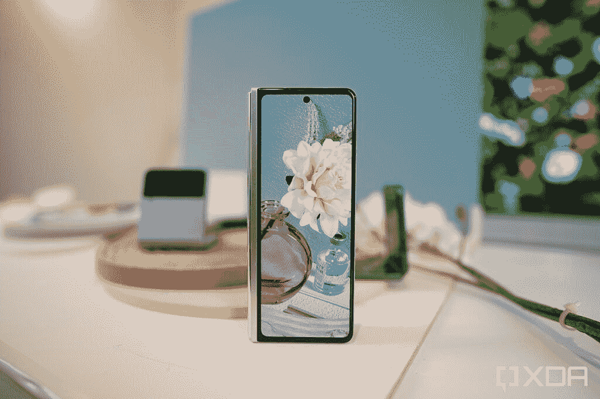
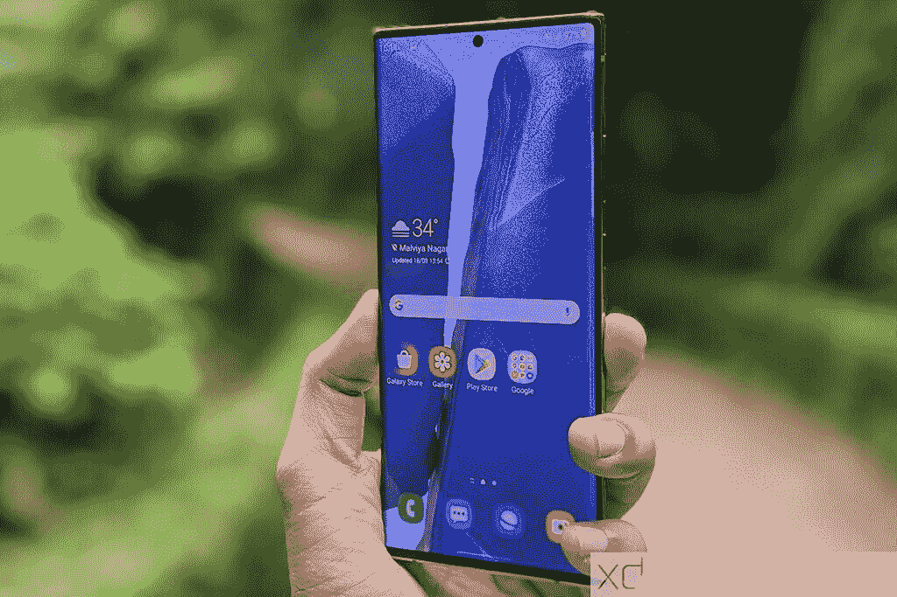
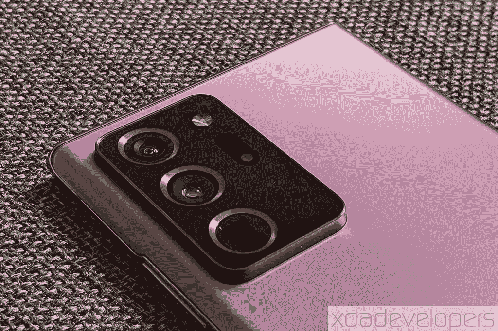
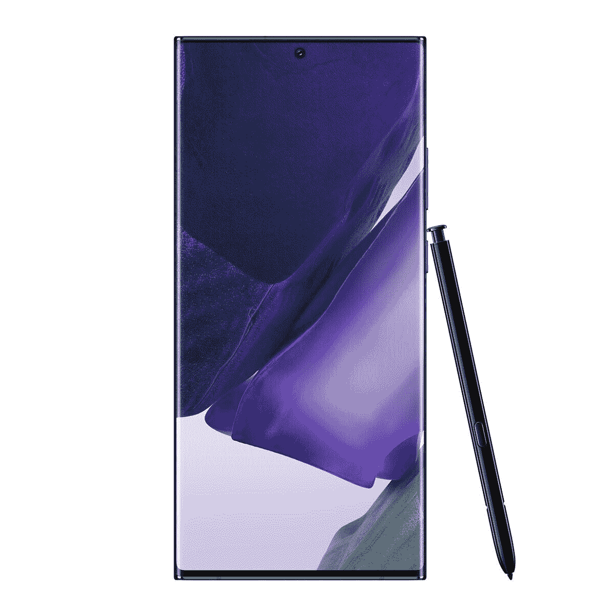

# 三星 Galaxy Z Fold 3 vs Note 20 Ultra:你该买哪个

> 原文：<https://www.xda-developers.com/samsung-galaxy-z-fold-3-vs-galaxy-note-20-ultra/>

Galaxy Z Fold 3 是三星 Fold 系列中最新的智能手机。它也是第一个支持 S Pen 的可折叠产品。因此，如果你打算升级，并想知道是选择传统智能手机的形式 [Galaxy Note 20 Ultra](https://www.xda-developers.com/samsung-galaxy-note-20-ultra-review-exynos/) 还是投入可折叠手机的世界，我们可以帮助你。在本文中，我们将比较 Galaxy Z Fold 3 和 Galaxy Note 20 Ultra，看看这两者对您来说更有意义。

**浏览本指南:**

## 三星 Galaxy Z Fold 3 vs Galaxy Note 20 Ultra:规格

| 规范 | 三星 Galaxy Z Fold 3 | 三星 Galaxy Note 20 Ultra |
| --- | --- | --- |
| **构建** | 

*   装甲铝框架和铰链
*   Gorilla Glass Victus 屏幕盖、后盖

 | 

*   铝制中框
*   玻璃正面和背面
*   大猩猩玻璃 Victus 正面

 |
| **尺寸&重量** | 

*   7.1 x 158.2 x 16.00 毫米(折叠)
*   128.1 x 158.2 x 6.4 毫米(展开)
*   271 克

 | 

*   164.8 x 77.2 x 8.1mm 毫米
*   213 克

 |
| **显示** | 

*   7.6 英寸 QXGA+动态 AMOLED 2X 柔性显示屏
*   120Hz 可变刷新率
*   22.5:18 宽高比
*   6.2 英寸高清+动态 AMOLED 2X 翻盖显示屏，24.5:9 宽高比，120 赫兹刷新率

 | 

*   6.9 英寸 QHD+动态 AMOLED 2X 显示屏
*   120Hz 可变刷新率

 |
| **SoC** | 

*   高通骁龙 888 足球俱乐部

 | 

*   **国际:** Exynos 990
*   美国和中国:高通骁龙 865+

 |
| **RAM &存储选项** | 

*   12GB + 256GB
*   12GB + 512GB

 | 

*   12GB + 128GB
*   12GB + 256GB
*   12GB + 512GB

 |
| **电池&充电** | 

*   4400 毫安时双电池
*   25W USB 供电 3.0 快充
*   10W 无线充电
*   4.5 反向无线充电
*   大多数地区包装盒中没有充电器

 | 

*   4500 毫安时
*   25W USB 供电 3.0 快充
*   15W 无线充电
*   4.5 反向无线充电

 |
| **安全** | 电源按钮上的电容指纹扫描仪 | 超声波显示指纹扫描仪 |
| **后置摄像头** | 

*   **主:** 12MP，广角镜头，f/1.8，1.8 m，OIS，双像素自动对焦
*   **次要:** 12MP，超广角镜头，f/2.2，1.12 m
*   **第三:** 12MP，长焦镜头，f/2.4，2 倍变焦，1 米，OIS PDAF

 | 

*   **主:** 108MP，广角镜头，f/1.8，1/1.33”，0.8 m，OIS，双像素 PDAF
*   **次要:** 12MP，超广角镜头，f/2.2，1/2.55 寸，1.4 m
*   **第三:** 10MP 潜望镜长焦镜头，f/3.0，240mm，1/3.24″，1.22 m，OIS，5 倍光学变焦

 |
| **前置摄像头** | 

*   **盖屏:** 10MP，f/2.2，1.22 m
*   **主屏** : 4MP，欠显，f/1.8，2 m

 | 10MP，f/2.2，1.22 米 |
| **端口** | USB 类型-C | USB 类型-C |
| **连通性** | 

*   蓝牙 5.1
*   国家足球联盟
*   Wi-Fi 6
*   5G

 | 

*   蓝牙 5.0
*   无线网络 6
*   5G
*   国家足球联盟

 |
| **软件** | 基于 Android 11 的三星 One UI | 基于 Android 10 的三星 One UI 2.5 |
| **其他特征** | 

*   IPX8
*   S-Pen 支持(单独购买)

 | 

*   IP68
*   S-Pen 支持(包括在内)

 |
| **定价** | 起价 1799 美元 | 起价 1199 美元 |

* * *

## 设计和展示

 <picture></picture> 

Samsung Galaxy Z Fold 3

正如你所料，Galaxy Z Fold 3 和 Galaxy Note 20 Ultra 的设计有着巨大的差异。有了 Galaxy Z Fold 3，你可以获得一个折叠式外形，带有两个显示屏——内部是一个柔性屏幕，外部是一个常规的覆盖屏幕。封面是为了减少你打开主屏幕的次数。

三星在 Z Fold 3 的框架和铰链中使用了一种名为 Armor Aluminum 的新材料，以增加其耐用性。此外，保护膜层增强了柔性显示器。最后，Gorilla Glass Victus 正在保护智能手机的覆盖屏幕和后盖。Victus 比 Gorilla Glass 6 坚固 50%。

三星在自拍相机的覆盖屏幕上使用打孔切口，而另一个自拍相机则使用屏幕下相机技术隐藏在主显示器后面。

另一方面，Galaxy Note 20 Ultra 采用了传统的智能手机外形。它还为自拍相机使用了打孔切口。它的结构很坚固，这款手机给人的感觉像是一款高端旗舰设备。

在显示屏方面，Galaxy Z Fold 3 配备了 7.6 英寸 QXGA+ (2208 x 1768 像素)柔性 AMOLED 屏幕和 6.2 英寸高清+ (2268 x 832 像素)AMOLED 屏幕。Galaxy Note 20 Ultra 采用了 6.9 英寸 Quad-HD+ (3088 x 1440 像素)AMOLED 屏幕。

总体而言，在设计和显示方面，尽管三星有许多创新，但任何可折叠智能手机都仍然是比传统智能手机更脆弱的设备，尤其是其柔性屏幕。因此，如果你想要一部坚固耐用、能够应对偶尔事故的手机，Note 20 Ultra 更有意义。但如果你能管理一个精致的设备，Z Fold 3 将让你体验智能手机的未来。

* * *

## SoC、RAM、存储和 S Pen

 <picture></picture> 

Galaxy Note 20 Ultra with the S Pen

三星在 Galaxy Z Fold 3 中使用了高通的旗舰产品骁龙 888 SoC，加上 12GB 的内存和高达 512GB 的 UFS 3.1 存储。2020 年宣布的 Galaxy Note 20 Ultra 配有骁龙 865+ SoC(国际型号为 Exynos 990)，配有 12GB 内存和高达 512GB 的板载存储。手机上还有一个 microSD 卡插槽。

尽管 Galaxy Z Fold 3 配备了一款新处理器，但这款可折叠智能手机的性能与 Galaxy Note 20 Ultra 之间不会有太大差异，因为骁龙 865+是高通 2020 年的旗舰 SoC，Exynos 990 是三星的旗舰 SoC。

Galaxy Note 20 Ultra 和 Galaxy Z Fold 3 都可以使用 S Pen。但是，虽然你可以获得 Galaxy Note 20 Ultra 的捆绑 S Pen 以及一个插槽，但你必须购买 S Pen Fold Edition 或 [S Pen Pro](https://www.xda-developers.com/samsung-s-pen-pro/) 才能与 Galaxy Z Fold 3 配合使用。Galaxy Z Fold 3 中没有任何 S Pen 型号的插槽，但你可以购买一个特殊的外壳，并留出空间来存放它。S Pen Pro 是一款功能更丰富的 S Pen，也可以与 Galaxy Note 20 Ultra 配合使用。

总的来说，Galaxy Fold 3 在这一细分市场上与 Galaxy Note 20 Ultra 相比没有任何明显的优势。

* * *

## 三星 Galaxy Z Fold 3 vs Galaxy Note 20 Ultra:相机

 <picture></picture> 

Samsung Galaxy Z Fold 3

三星以在其旗舰智能手机中放置出色的摄像头而闻名，Galaxy Note 20 Ultra 和 Galaxy Z Fold 3 也是如此。因此，虽然你应该可以从两款智能手机上获得精彩的照片，但两款手机的原始相机规格存在一些差异。新的 Galaxy Z Fold 3 采用了三重后置摄像头设置，包括 12MP 超广角摄像头、12MP 主广角摄像头和 12MP 长焦摄像头。手机上有两个自拍器，一个 4MP 摄像头放在主屏幕下，另一个 10MP 放在盖屏幕上。

另一方面，Galaxy Note 20 Ultra 具有 108MP 主广角拍摄装置、12MP 超广角拍摄装置和 12MP 长焦相机。你还可以在手机上获得一个 10MP 的自拍相机。

* * *

## 电池和连接

 <picture></picture> 

Samsung galaxy note 20 Ultra

Galaxy Note 20 Ultra 凭借其更大的 4,500mAh 电池在电池部门具有明显的优势。Galaxy Z Fold 3 的电池容量为 4,400mAh。虽然这两款手机的电池大小没有太大差异，但当你在折叠模式下使用手机时，Galaxy Z Fold 3 的电池必须为更大的屏幕供电。因此，虽然 Galaxy Note 20 Ultra 在适度使用的情况下可以持续两天，但 Galaxy Z Fold 3 只能给你一天多的电池寿命。

两款手机的连接选项都相当强大。你可以获得 5G 支持(在 5G 模式下，毫米波和 6GHz 以下)，Wi-Fi 6 和 NFC。

因此，如果你担心电池寿命，你最好选择 Galaxy Note 20 Ultra。但 Galaxy Z Fold 3 的电池寿命也不算太差。

* * *

## 操作系统和 Android 更新

 <picture></picture> 

Samsung Galaxy Z Fold 3

Galaxy Z Fold 3 开箱即可在 Android 11 上运行，具有一个用户界面和可折叠屏幕的软件增强功能。Galaxy Note 20 Ultra 与 Android 10 一起推出，但后来收到了 Android 11 更新。三星承诺为 Galaxy Z Fold 3 提供三年的 Android 更新，与 Galaxy Note 20 Ultra 相同，但鉴于 Note 是一年前推出的，它已经进行了一次重大更新。

在安全更新方面，Galaxy Note 20 Ultra 将在 2024 年前获得安全更新，而 Galaxy Z Fold 3 将在 2025 年前获得安全补丁。

* * *

## 三星 Galaxy Z Fold 3 与 Galaxy Note 20 Ultra 5G:定价和颜色选择

 <picture></picture> 

Galaxy Note 20 Ultra

三星在美国销售的 Galaxy Z Fold 3 起价为 1799 美元，而你可以在亚马逊等地方以低至 950 美元的价格购买 Galaxy Note 20 Ultra 的基本型号。Galaxy Note 20 Ultra 的官方基价目前为 1200 美元。

你可以购买三种颜色的 Galaxy Z Fold 3——幻影黑、幻影绿和幻影银。Galaxy Note 20 Ultra 也有三种颜色可供选择——神秘黑色、神秘白色和神秘青铜色。

* * *

## 结论

 <picture></picture> 

Samsung Galaxy Z Fold 3

由于这两款设备的外形不同，Galaxy Note 20 Ultra 和 Galaxy Z Fold 3 之间没有直接的比较。所以你必须决定你是否准备好迎接这个可折叠的世界。Galaxy Z Fold 3 是一款比最初的 Fold 精致得多的产品，但它的价格标签仍然让许多人买不起。

 <picture></picture> 

Samsung Galaxy Z Fold 3

##### 三星 Galaxy Z Fold 3

Galaxy Z Fold 3 是三星最新的旗舰可折叠智能手机。它由高通骁龙 888 SoC 驱动，运行在 Android 11 上，只有一个用户界面。

如果你有多余的钱，并且渴望使用智能手机创新的巅峰，Z Fold 3 就是为你准备的。但如果你对处理相对精致的硬件感到不舒服，并且有预算问题，Note 20 Ultra 尽管已经一年了，但仍然是一款很棒的硬件。

 <picture></picture> 

Samsung Galaxy Note 20 Ultra 5G

##### 三星 Galaxy Note 20 Ultra

Galaxy Note 20 Ultra 是三星 2020 年的旗舰。即使一年后，它仍然是一款非常强大的智能手机。

* * *

这两款手机你打算买哪一款？请在评论区告诉我们。同时，如果你确实打算购买 Fold 3，请查看我们的 [best Galaxy Z Fold 3 deals](https://www.xda-developers.com/best-galaxy-z-fold-3-deals/) 文章，在手机上找到一些优惠。我们还为智能手机挑选了[最佳案例](https://www.xda-developers.com/best-samsung-galaxy-z-fold-3-cases/)，帮助你保护它。