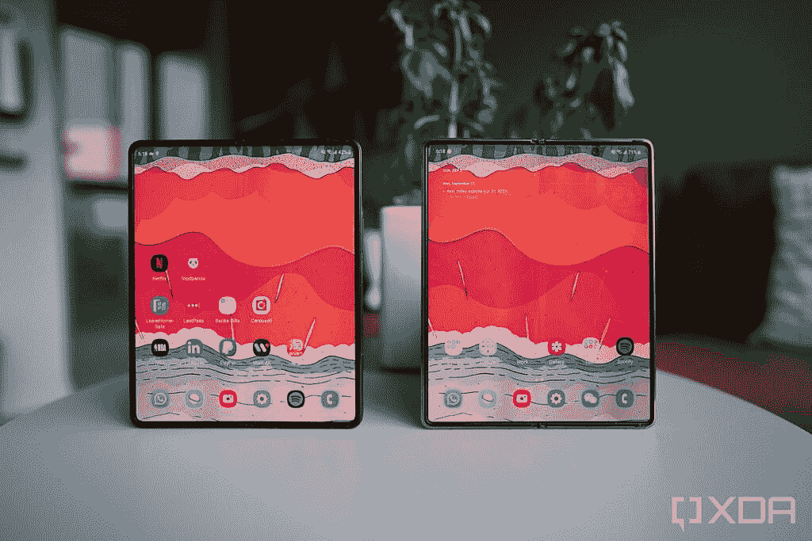
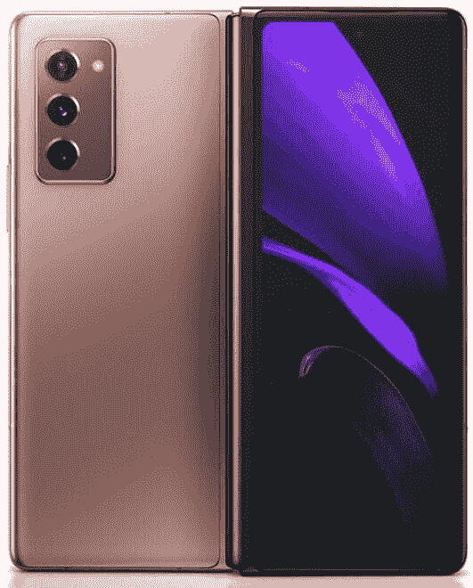

# 三星 Galaxy Z Fold 3 vs Galaxy Z Fold 2:实用改进

> 原文：<https://www.xda-developers.com/samsung-galaxy-z-fold-3-vs-galaxy-z-fold-2/>

纵观最近的智能手机历史，你很难找到一款手机比上一代手机有如此大的改进，就像三星 Galaxy Z Fold 2 从最初的 Fold 升级而来一样。事实上，我个人认为 Galaxy Z Fold 2 带来了智能手机历史上最大的逐代硬件改进之一。 [Galaxy Z Fold 2](https://www.xda-developers.com/samsung-galaxy-z-fold-2/) 采用了更耐用、更实用的铰链设计；一个大得多的外部“掩护屏幕”，让原作看起来像个笑话；更干净、更新更快、中断更少的内部屏幕。 [Galaxy Z Fold 3](https://www.xda-developers.com/samsung-galaxy-z-fold-3/) ，乍一看和触摸起来，并没有给上一代带来那么大的飞跃。

\ r \ nht TPS://www . YouTube . com/watch？v=17idEjfuI9M\r\n

Galaxy Z Fold 3 使用了几乎相同的相机系统，具有相同的屏幕尺寸，铰链感觉几乎相同，其两个自拍相机中的一个实际上在百万像素数量方面有所下降。

这并不意味着三星今年懈怠了。这家韩国科技巨头也对 Galaxy Z Fold 3 进行了切实的改进。这一次，它们并没有立即引起人们的注意，因为这些升级专注于提高实用性，让 Galaxy Z Fold 3 对更多人来说更加可用和平易近人。

 <picture></picture> 

Galaxy Z Fold 3 (left) and Galaxy Z Fold 2 (right)

### 三星 Galaxy Z Fold 3 和 Galaxy Z Fold 2:规格

## 三星 Galaxy Z Fold 3 和 Galaxy Z Fold 2:规格

|  | 

三星 Galaxy Z Fold 3

 | 

三星 Galaxy Z Fold 2

 |
| --- | --- | --- |
| 

中央处理器

 | 骁龙 888 | 骁龙 865+ |
| 

尺寸和重量

 | 折叠后:158.2 x 67.1 x 毫米折叠后:158.2 x 128.1 x 毫米重量:271 克 | 折叠后:159.2 x 68 x 16.8 毫米折叠后:159.2 x 128.2 x 6.9 毫米重量:283 克 |
| 

显示

 | 主屏幕:

*   7.6 英寸 QXGA+ Dynamic -AMOLED 2X 显示屏
*   22.5:18 宽高比
*   2208 x 1768
*   120 赫兹

覆盖屏幕:

*   6.2 英寸高清+动态 AMOLED 2X 显示屏
*   24.5:9 宽高比
*   2268 x 832
*   120 赫兹

 | 主屏幕:

*   7.6 英寸 AMOLED 2X 显示屏
*   22.5:18 宽高比
*   2208 x 1768
*   120 赫兹

覆盖屏幕:

*   6.2 英寸高清+动态 AMOLED 2X 显示屏
*   24.5:9 宽高比
*   2268 x 832
*   60Hz

 |
| 

照相机

 | 

*   12MP 超宽，f/2.2 超宽，FoV 123 度
*   12MP 宽，f/1.8，双像素自动对焦，OIS
*   12MP 远距，2 倍光学变焦，10 倍数码变焦

 | 

*   12MP 超宽，f/2.2 超宽，FoV 123 度
*   12MP 宽，f/1.8，双像素自动对焦，OIS
*   12MP 远摄，2 倍光学变焦，10 倍数码变焦

 |
| 

记忆

 | 12GB 内存、256GB/512GB UFS 3.1 存储 | 12GB 内存、256GB/512GB UFS 3.1 存储 |
| 

电池

 | 4400 毫安时双电池 | 4500 毫安时 |
| 

网络

 | LTE:增强型 4X4 MIMO，7CA，LAA，LTE Cat。205G:非独立(NSA)，独立(SA)，Sub6 / mmWave |
| 

抗水性

 | IPX8 | 没有人 |
| 

传感器

 | 电容式指纹传感器(侧面)、加速度计、气压计、陀螺仪传感器、地磁传感器、霍尔传感器(模拟)、接近传感器、光传感器、用于手写笔输入的 Wacom 层 | 电容式指纹传感器(侧面)、加速度计、气压计、陀螺仪传感器、地磁传感器、霍尔传感器(模拟)、接近传感器、光线传感器 |
| 

操作系统（Operating System）

 | 安卓 11 |
| 

颜色；色彩；色调

 | 幻影黑，幻影绿，幻影银 | 神秘的黑色，神秘的青铜色 |
| 

价格

 | 起价 1799.99 美元 | 起价 1999.99 美元 |

***关于本文:**我测试了三星提供的 Galaxy Z Fold 3 的一个评测单元，以及大约一年前我自己购买的 Galaxy Z Fold 2 的一个零售单元。三星在这篇文章中没有投入。*

## Galaxy Z Fold 3 vs Galaxy Z Fold 2:有何不同？

从远处看 Galaxy Z Fold 3 和 Galaxy Z Fold 2，除了不同的颜色，很难发现其他差异。这两款手机在折叠和展开时的尺寸相似，尽管 Galaxy Z Fold 3 在所有三个维度(高、宽、厚)上都比它小一根头发，也轻了 12g。说实话，除非你主动同时或背靠背拿着这两款手机，否则你不会真的注意到 Galaxy Z Fold 3 略小的外形。

尽管如此，这是*朝着正确方向的进步。*任何时候，只要手机制造商能够在不损失屏幕空间、规格或功能的情况下减轻重量和尺寸，那就太棒了。

Galaxy Z Fold 3 还获得了骁龙 888 的年度处理器提升，并且在内部屏幕上有一个新的屏幕下自拍相机。前者是必要的补充，但后者是分裂性的，因为三星的屏幕下摄像头技术有点半生不熟。相机本身只是一个 400 万像素的拍摄者，显示器上应该“覆盖”相机的部分具有这种奇怪的网状外观，非常明显。相比小米在 [Mix 4](https://www.xda-developers.com/xiaomi-mix-4-hands-on/) 上实现同样的技术，这感觉落后了两代。

 <picture></picture> 

The Galaxy Z Fold 3's "under-screen" camera on top, and the Galaxy Z Fold 2's traditional hole-punch selfie camera bottom

Galaxy Z Fold 3 增加了 IPX8 防水功能(前者没有)，以及 S-Pen 支持，尽管你需要购买一个专门为 Galaxy Z Fold 3 设计的新 S-Pen。Galaxy Z Fold 3 的铝位据说也比以前更坚固。Galaxy Z Fold 3 应该比 Galaxy Z Fold 2 更耐用，以及在它之前的任何其他可折叠产品。

Galaxy Z Fold 3 的外部“封面显示器”的刷新率也增加了一倍，达到 120Hz。老实说，如果三星没有做出这一改变(或者至少给我们提供了仅关闭盖子显示屏上 120Hz 的选项)，我会很好，因为 Galaxy Z Fold 3 的电池寿命比 Galaxy Z Fold 2 略差。在一个使用量很大的日子，比如周日在镇上逛 14 个小时，Galaxy Z Fold 3 会在第 11 或 12 个小时耗尽电量。Galaxy Z Fold 2 在我使用的一年中，通常至少可以运行 12 到 13 个小时。请记住，我是一个非常严重的用户。对大多数人来说，Galaxy Z Fold 3 的电池寿命应该足够长，他们不必担心在结束一天的工作之前找到充电器。

虽然增加了 S-Pen 支持、IPX8 和一个更新的高通 SoC 都是受欢迎的新功能，但对我个人来说受益最大的两个最大的改进是新的屏幕保护膜，感觉更像玻璃，而不是去年的塑料薄膜，Galaxy Z Fold 3 的铰链角区域在折叠时没有 Galaxy Z Fold 2 的那么尖锐。后一个问题在我的整个使用年中都困扰着我，因为手机的角只是以一种不舒服的方式戳着我的手掌。

[sc name = " pull-quote-right " quote = " Galaxy Z Fold 3 应该比 Galaxy Z Fold 2 以及之前的任何其他可折叠手机都更耐用。"]

## Galaxy Z Fold 3 vs Galaxy Z Fold 2:基本相同的是什么？

除了可以使用 S-Pen(需要单独购买)之外，使用 Galaxy Z Fold 3 的感觉与使用 Galaxy Z Fold 2 非常相似。只有当你主动握住两部手机来“感受重量”时，手机的重量才会变轻

一个几乎相同的地方是主要的相机硬件。Galaxy Z Fold 3 带回了与 Galaxy Z Fold 2 相同的三摄像头系统。在很大程度上，Galaxy Z Fold 3 拍摄的照片看起来与 Galaxy Z Fold 2 相同。

然而，Galaxy Z Fold 3 的外屏幕 10MP 自拍相机比 Galaxy Z Fold 2 的相同 10MP 自拍相机始终产生更好的颜色。

尽管如此，按照 2021 年的标准，Galaxy Z Fold 3 的相机只是“相当不错”。它远远落后于任何 2021 年的高端平板旗舰产品，如小米 Mi 11 Ultra，华为 P50 Pro 或三星 Galaxy S21 Ultra。这些玻璃板可以产生更清晰的变焦照片，主相机有更多的自然散景和更多的光线。

## 结论:Galaxy Z Fold 3 经过了精炼和打磨，但 Galaxy Z Fold 2 用户无需升级

我可以自信地说，Galaxy Z Fold 3 是一款改变你使用手机方式的令人敬畏的设备——因为我也可以对 Galaxy Z Fold 2 说同样的话，Galaxy Z Fold 3 是一款更加完美、精致的升级产品。

对于那些有兴趣尝试大尺寸可折叠手机和没有手机的人来说，Galaxy Z Fold 3 是显而易见的。这是目前最全面、最完美的可折叠设备。如果你已经拥有了原来的 Fold，我会说升级也是一个很容易的选择，因为 Galaxy Z Fold 3 会感觉像是从第一个 Galaxy Fold 的巨大飞跃。

但是如果你已经拥有了 Galaxy Z Fold 2 呢？然后我会说，如果你需要防水或使用 S-Pen(或者如果你有可支配收入或有一个很棒的以旧换新优惠)，你应该升级。否则，如果你知道你很少接触水，也不需要手写笔，我不确定 Galaxy Z Fold 3 是否带来了足够的差异来证明升级的合理性。相机性能大多相同——事实上，内置自拍相机*更差*。电池寿命更差。虽然骁龙 888 在理论上很棒，但除非你是一个重度游戏玩家，否则你不会看到它和支持 Galaxy Z Fold 2 的骁龙 865+有太大区别。

 <picture></picture> 

Samsung Galaxy Z Fold 3

##### 三星 Galaxy Z Fold 3

Z Fold 3 并没有比 Z Fold 2 立即带来令人瞠目结舌的改进，但它确实带来了非常实用的改进，例如防水和 S-Pen 支持。再加上比之前折的便宜，那就是赢了。

否则，Galaxy Z Fold 2 仍然是一款非常好的手机，即使在 2021 年夏天也是最好的可折叠手机之一，仍然会给你带来令人敬畏的口袋平板电脑体验。

 <picture></picture> 

Samsung Galaxy Z Fold 2

##### 三星 Galaxy Z Fold 2

即使在近一年的时间里，Galaxy Z Fold 2 仍然是一个很好的选择。如果你不需要防水和 S-Pen 支持，也许你买 Z Fold 2 会更好。