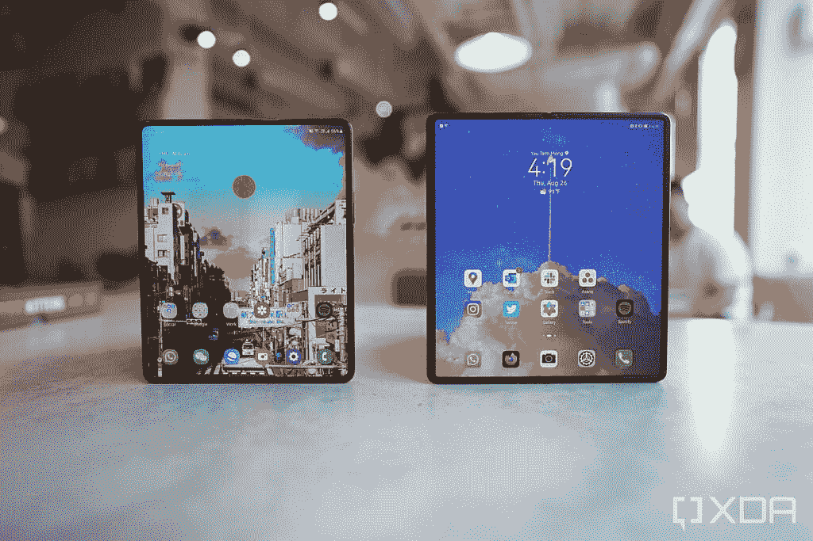
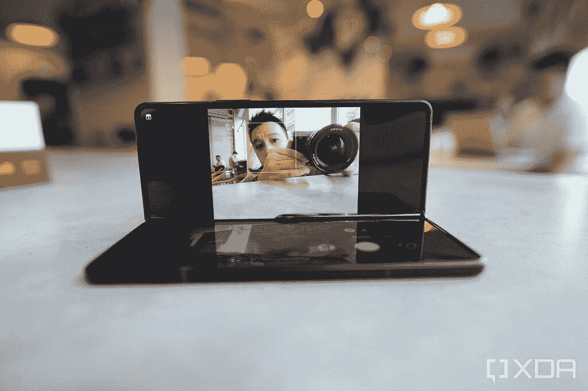
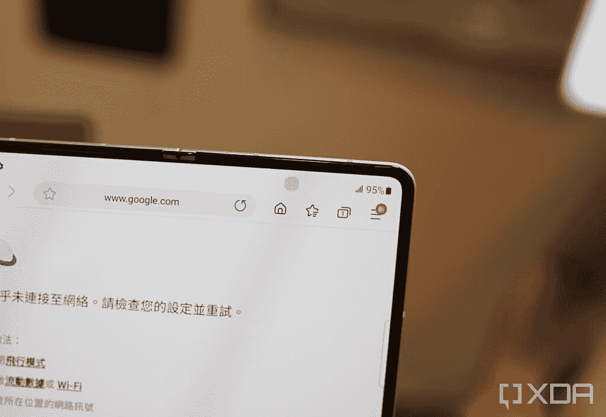

# 三星 Galaxy Z Fold 3 vs 华为 Mate X2:尖端可折叠

> 原文：<https://www.xda-developers.com/samsung-galaxy-z-fold-3-vs-huawei-mate-x2/>

对于世界上大多数人来说，全新的三星 Galaxy Z Fold 3 无疑是目前最前沿的可折叠手机。但对于那些生活在 mainland China 的人，或者进口手机的爱好者(比如我自己)，这个头衔还有另一个竞争者——[华为 Mate X2。](https://www.xda-developers.com/huawei-mate-x2-review/)我对两款手机都进行了广泛的测试，每一款都有自己的优缺点。两个可折叠的交易打击左和右，但哪一个总的来说赢了？

 <picture></picture> 

Galaxy Z Fold 3 (left), Mate X2 (right)

### 三星 Galaxy Z Fold 3 vs 华为 Mate X2 规格

## 三星 Galaxy Z Fold 3 vs 华为 Mate X2:规格

|  | 

三星 Galaxy Z Fold 3

 | 

华为 Mate X2

 |
| --- | --- | --- |
| 

中央处理器

 | 骁龙 888 | 麒麟 9000 |
| 

尺寸和重量

 | 折叠后:158.2 x 67.1 x 毫米折叠后:158.2 x 128.1 x 毫米重量:271 克 | 折叠后:161.8 x 74.6 x 14.7 毫米折叠后:161.8 x 145.8 x 8.2 毫米重量:295 克 |
| 

显示

 | 主屏幕:

*   7.6 英寸 QXGA+ Dynamic -AMOLED 2X 显示屏
*   22.5:18 宽高比
*   2208 x 1768
*   120 赫兹

覆盖屏幕:

*   6.2 英寸高清+动态 AMOLED 2X 显示屏
*   24.5:9 宽高比
*   2268 x 832
*   120 赫兹

 | 主屏幕:

*   8.0 英寸 AMOLED
*   10.15:9 宽高比
*   2200 x 2480
*   90Hz

覆盖屏幕:

*   6.5 英寸 AMOLED
*   21:9 宽高比
*   1160 x 2700
*   90Hz

 |
| 

照相机

 | 

*   12MP 超宽，f/2.2 超宽，FoV 123 度
*   12MP 宽，f/1.8，双像素自动对焦，OIS
*   12MP 远摄，2 倍光学变焦，10 倍数码变焦
*   10MP 自拍相机(覆盖屏幕)
*   400 万像素自拍相机(屏幕下)

 | 

*   16MP 超宽
*   50MP 宽，f/1.9，OIS
*   12MP 远摄，2 倍光学变焦
*   50MP 潜望镜，10 倍光学变焦
*   1600 万像素自拍相机(覆盖屏幕)

 |
| 

记忆

 | 12GB 内存、256GB/512GB UFS 3.1 存储 | 8GB 内存、256GB/512GB UFS 3.1 存储 |
| 

电池

 | 4400 毫安时双电池 | 4500 毫安时 |
| 

网络

 | LTE:增强型 4X4 MIMO，7CA，LAA，LTE Cat。205G:非独立(NSA)，独立(SA)，Sub6 / mmWave |
| 

抗水性

 | IPX8 | 没有人 |
| 

传感器

 | 电容式指纹传感器(侧面)、加速度计、气压计、陀螺仪传感器、地磁传感器、霍尔传感器(模拟)、接近传感器、光传感器、用于手写笔输入的 Wacom 层 | 电容式指纹传感器(侧面)、加速度计、气压计、陀螺仪传感器、地磁传感器、霍尔传感器(模拟)、接近传感器、光线传感器 |
| 

操作系统（Operating System）

 | 安卓 11 |
| 

颜色；色彩；色调

 | 幻影黑，幻影绿，幻影银 | 黑色、白色、浅蓝色、玫瑰金 |
| 

价格

 | 起价 1799.99 美元 | 起价 2799 美元(从中国价格换算) |

## 三星 Galaxy Z Fold 3 vs 华为 Mate X2:打造与设计

Galaxy Z Fold 3 和华为 Mate X2 都采用了相同的双屏、书本式折叠式外形。额外加分的是三星开创了这种外形，华为最初走的是另一条路(单屏幕折叠)，然后又回到了这种外形。

然而，从视觉/手感的角度来看，华为 Mate X2 可以说具有更精致的整体形式。首先，Mate X2 的折叠几乎完全平坦，而 Galaxy Z Fold 3 仍然有一点间隙。在翻盖显示屏上，Galaxy Z Fold 3 上包括铰链在内的左边框区域更厚且不对称，而 Mate X2 在翻盖显示屏上的左边框更薄，虽然仍然不等于其他三个边框，但尺寸仍然更接近右边框。

与 Galaxy Z Fold 3 相比，Mate X2 的屏幕折痕也更难看到和感觉到

最后，Mate X2 设法将一个顶级旗舰级的 10 倍潜望镜变焦镜头塞进了机身，而 Galaxy Z Fold 3 显然仍然有一个折衷的相机系统，具有相对较弱的 2 倍长焦变焦。

但当谈到实用性时，Galaxy Z Fold 3 以压倒性优势获胜。它的防水等级为 IPX8，而 Mate X2 没有官方的防水等级。Galaxy Z Fold 3 还有一种新的薄膜材料，感觉更像玻璃，而不是 Mate X2 屏幕的塑料感。Galaxy Z Fold 3 还支持 S-Pen 手写笔，尽管那是单独购买的。

虽然 Galaxy Z Fold 3 没有完全折叠平整，但这可能是因为三星的铰链更实用。它可以在几乎任何角度锁定在中间折叠的位置，允许手机的一半基本上独立直立，进行免提自拍或视频通话。配偶 X2 没有这样的锦囊妙计。Galaxy Z Fold 3 也比 Mate X2 的 295 克轻 271 克，但后者更薄，为 14.7 毫米至 16 毫米。

 <picture></picture> 

The Galaxy Z Fold 3 make hands-free selfies or video calls easy

## 三星 Galaxy Z Fold 3 vs 华为 Mate X2:屏幕

Galaxy Z Fold 3 和 Mate X2 的显示屏在高度上大致相似，但华为的显示屏在水平方向上更宽。这在折叠时尤其明显，因为 Galaxy Z Fold 3 的 6.2 英寸，25:9 的纵横比使其外形类似于糖果棒或电视遥控器，而 Mate X2 的 6.5 英寸，21:9 的纵横比感觉更接近典型的平板智能手机。

如果我们严格地谈论折叠外形，我更喜欢 Mate X2 的长宽比，因为 Z Fold 3 的覆盖屏幕仍然感觉有点局促。然而，我听说其他评论家为三星的设计提出了很好的论点。Galaxy Z Fold 3 折叠时是一部轻松的单手手机，展开时是一部双手手机；Mate X2 没有明显的区别，因为即使在折叠的形式下，它也可能太大了，无法单手使用。我可以看到为什么这对人们有吸引力，因为 Galaxy Z Fold 3 在同一台设备中有两种不同的使用风格。但不可否认的事实是，我在 Galaxy Z Fold 3 折叠时比 Mate X2 折叠时输入的错别字更多。

打开两部手机，你会看到华丽的大屏幕。Mate X2 的内部 8 英寸面板完全不受干扰，因为华为已经完全省略了设备内部的自拍摄像头。Z Fold 3 有一个，但它是新生的屏幕下技术，这意味着摄像头在屏幕下面。然而，它并不是完全不可见的，因为覆盖相机的像素往往会闪烁一种网状图案，这种图案可以说比打孔相机更令人分心。

 <picture></picture> 

Galaxy Z Fold 3's under-screen camera when not in use

说到显示流畅性，Galaxy Z Fold 3 的 120Hz 双屏明显比 Mate X2 的 90Hz(也是双屏)更流畅，但我发现 120Hz 真的损害了 Galaxy Z Fold 3 的电池寿命，因为它不仅比 Mate X2 的短，也比去年的 Galaxy Z Fold 2 短。

## 摄像机

Mate X2 的相机硬件在技术上更令人印象深刻，其主要的 50MP 相机基本上与华为 2020 平板旗舰机使用的相机相同，具有 1/1.28 英寸的大传感器。然后是前面提到的 10 倍潜望镜变焦镜头，它的两侧是一个更短的 12MP 3x 倍远摄变焦镜头。还有一个带自动对焦的 16MP 超宽相机。与此同时，Galaxy Z Fold 3 拥有一个三重 12MP 阵列，与 Z Fold 2 几乎没有变化，这意味着它甚至不如去年的标准 Galaxy S20 相机。

是的，在变焦镜头中，队友 X2 用 Galaxy Z Fold 3 拖地。

但令人惊讶的是，在其他使用主镜头或超宽镜头的照片和视频中，Galaxy Z Fold 3 保持得很好。我仍然认为 Mate X2 的色彩和图像清晰度略好，但 Galaxy Z Fold 3 让它比它有任何权利更接近。这表明软件和 ISP 在决定手机照片的质量上扮演着和硬件一样重要的角色。

## 最后的想法

Galaxy Z Fold 3 运行的是 Android 11，上面安装了三星的 OneUI，而 Mate X2 在 Android 10 版本上安装了 EMUI，但后来已经更新到鸿蒙系统 2.0。尽管更名，但 Mate X2 的表现仍然像一部安卓手机，只是不能运行谷歌移动服务。软件对两者都很直观，具有易于使用的多任务模式，如分屏和浮动应用程序窗口。

我确实认为 Galaxy Z Fold 3 对生产力任务更有用，因为它支持 S-Pen，能够进行免提视频通话，能够在整个系统范围内调整应用程序的纵横比，并能够强制任何应用程序分屏或在浮动窗口中运行。然而，我认为鸿蒙系统的分屏动作更容易实现。

最终，我意识到很难对这两款手机进行直接比较，原因有几个:Mate X2 只在中国官方销售，定价比 Galaxy Z Fold 3 高 1000 美元，不能运行谷歌移动服务。对于大多数读者来说，这篇文章只是比较两种最好的可折叠手机硬件的一个练习，而不是真正的购买指南，因为一种手机比另一种手机更具主流吸引力。

 <picture></picture> 

Samsung Galaxy Z Fold 3

##### 三星 Galaxy Z Fold 3

三星 Galaxy Z Fold 3 是目前最完美的可折叠手机。

我真的很想知道，在华为不受美国政府制裁的另一个世界里，在华为成功进入美国市场并获准正常运营的现实中，华为 Mate X2 是否会给三星带来足够的压力，推动更多的相机创新？我不认为 Galaxy Z Fold 3 拥有像样的相机硬件是因为缺乏技术知识，而是为了满足更低的价格点的有意识的决定。

我认为大多数消费者会说三星通过 Galaxy Z Fold 3 做出了正确的举动，旨在实现实际改进和价格下降，而不是追求过分的规格。