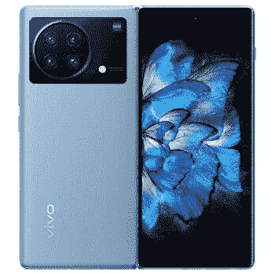
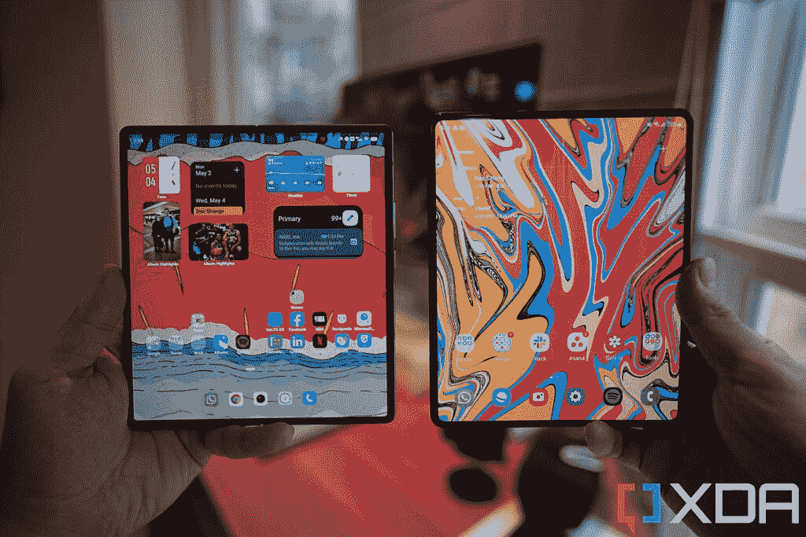

# 三星 Galaxy Z Fold 3 vs Vivo X Fold:最好的可折叠硬件还是出众的可折叠软件？

> 原文：<https://www.xda-developers.com/samsung-galaxy-z-fold-3-vs-vivo-x-fold/>

每一款新发布的可折叠手机都应该并将与三星最新的可折叠手机进行比较。三星是产品类别的先驱和鼻祖，对于世界上大多数人来说，三星的可折叠产品仍然是他们唯一可以访问的可折叠产品。最新的挑战者是 [Vivo X Fold](https://www.xda-developers.com/vivo-x-fold-hands-on/) ，它带来了由[华为的 Mate X2](https://www.xda-developers.com/huawei-mate-x2-review/) 首先引入的许多相同的可折叠硬件突破，此外它还获得了 Vivo 出人意料的令人印象深刻的相机系统和谷歌移动服务支持。Vivo 的可折叠产品与三星的 Galaxy Z Fold 3 相比如何？

 <picture></picture> 

Samsung Galaxy Z Fold 3

##### 三星 Galaxy Z Fold 3

作为最容易获得的大屏幕可折叠手机，三星的 Galaxy Z Fold 3 拥有许多竞争对手没有的内置优势——但尽管如此，三星仍然是默认选择，因为 Galaxy Z Fold 3 仍然是世界上最完美的全方位可折叠手机。

 <picture></picture> 

Vivo X Fold

##### Vivo X 折叠

三星宝座的最新挑战者带来了一个近乎旗舰的相机系统、显示指纹扫描仪和一个无褶皱的大屏幕。

 <picture></picture> 

Vivo X Fold (left) and Galaxy Z Fold 3 (right)

## 三星 Galaxy Z Fold 3 和 Vivo X Fold:规格

|  | 

三星 Galaxy Z Fold 3

 | 

Vivo X 折叠

 |
| --- | --- | --- |
| 

中央处理器

 | 骁龙 888 | 骁龙 8 代 1 |
| 

尺寸和重量

 | 

*   折叠后:158.2 x 67.1 x 16.0mm 毫米
*   展开后:158.2 x 128.1 x 6.4mm 毫米
*   重量:271 克

 | 

*   折叠后:162.01 毫米 x 74.5 毫米 x 14.6 毫米
*   展开后:162.01 毫米 x 144.87mm 毫米 x 7.4mm 毫米
*   重量:311 克

 |
| 

显示

 | 内部显示屏:

*   7.6 英寸 QXGA+ Dynamic -AMOLED 2X 显示屏
*   22.5:18 宽高比
*   2208 x 1768
*   120 赫兹

封面展示:

*   6.2 英寸高清+动态 AMOLED 2X 显示屏
*   24.5:9 宽高比
*   2268 x 832
*   120 赫兹

 | 内部显示屏:

*   8.03 英寸 AMOLED 三星 E5
*   LTPO
*   2K (2200 x 1800)
*   120Hz 自适应刷新率
*   HDR10+
*   肖特 UTG

封面展示:

*   6.53 英寸 AMOLED 三星 E5
*   FHD+
*   120 赫兹刷新率
*   HDR10+

 |
| 

照相机

 | 

*   12MP 超宽，f/2.2 超宽，FoV 123 度
*   12MP 宽，f/1.8，双像素自动对焦，OIS
*   12MP 远摄，2 倍光学变焦，10 倍数码变焦
*   10MP 前置自拍相机
*   400 万像素前置屏下自拍相机

 | 

*   50MP 宽，f/1.75
*   48MP 超宽
*   1200 万像素人像相机
*   带 5 倍光学变焦的 800 万像素望远镜摄像头

 |
| 

记忆

 | 12GB 内存、256GB/512GB UFS 3.1 存储 | 12GB 内存、256GB/512GB UFS 3.1 存储 |
| 

电池

 | 4400 毫安时双电池 | 4600 毫安时 |
| 

网络

 | LTE:增强型 4X4 MIMO，7CA，LAA，LTE Cat。205 克 |
| 

抗水性

 | IPX8 | 没有人 |
| 

传感器

 | 电容式指纹传感器(侧面)、加速度计、气压计、陀螺仪传感器、地磁传感器、霍尔传感器(模拟)、接近传感器、光传感器、用于手写笔输入的 Wacom 层 | 超声波显示指纹扫描仪(两个，每个屏幕一个)、加速度计、气压计、陀螺仪传感器、地磁传感器、霍尔传感器(模拟)、接近传感器、光传感器 |
| 

操作系统（Operating System）

 | 安卓 12 |
| 

颜色；色彩；色调

 | 幻影黑，幻影绿，幻影银 | 蓝色、灰色(纯素皮革) |
| 

价格

 | 起价 1799 美元 | 起价 8，999 元人民币(约 1，360 美元) |

***关于这个对比:**这个对比是在测试了三星港行过去八个月提供的一个 Galaxy Z Fold 3 和我过去一周一直在用的一个自购的 Vivo X Fold 之后写的。这两家公司在这篇文章中都没有任何投入。*

* * *

## 三星 Galaxy Z Fold 3 vs Vivo X Fold:设计和硬件

Vivo X Fold 遵循最初的 Galaxy Fold(在三星决定在品牌中添加一个随机的 Z 之前)首先建立的相同的内部折叠设计理念，Vivo X Fold 和 Galaxy Z Fold 3 的工作方式基本相同:两者都是迷你平板电脑，可以像书一样折叠，成为类似手机的外形。这些品牌在屏幕尺寸和长宽比上有所不同。三星的 Galaxy Z Fold 3 采用了 7.6 英寸的屏幕，长宽比为 11.2:9，这意味着屏幕是一个直立的矩形——高度大于宽度。Vivo 的主屏幕是一个更大的 8 英寸面板，虽然仍然略高于其宽度，但更接近于方形。三星的大屏幕在技术上是不间断的，因为三星采用了屏下相机技术，可以看到自拍相机放在屏幕下面。Vivo 的 X Fold 使用传统的打孔器，所以你可以随时看到孔

当折叠时，Galaxy Z Fold 3 从左到右变得异常狭窄，呈现出类似于电视遥控器或糖果棒的形状。与此同时，Vivo X Fold 的形状非常类似于折叠形式的普通平板智能手机。因为 Vivo X Fold 有更大的外形和更先进的相机系统，所以它在 311g 到 271g 之间显得有点重。我必须说，几天后我已经习惯了 X Fold 的重量，但最初的 24 小时左右有点令人震惊，因为我的手腕在握着手机时感觉到了额外的重量。三星的 foldable 使用了传统的大猩猩玻璃 5 背面，而 Vivo 的 X Fold 采用了纯素皮革表面。我将在文章后面的专用相机系统中讨论相机系统。

就我个人而言，我更喜欢 Vivo 的长宽比，因为我发现三星较窄的外部屏幕有点局促，无法打字。然而，我听到同行们说他们更喜欢三星的做法，因为 Galaxy Z Fold 3 在折叠时是一款更容易的“单手手机”。我也明白这一点，所以这归结为偏好。

电话确实交易客观明确的胜利。Galaxy Z Fold 3 拥有官方 IP 防水等级，屏幕支持三星的 S-Pen 手写笔。另一方面，Vivo 的显示屏有明显不太明显的折痕(通过视觉和触觉)，铰链折叠完全平坦，而不是留有间隙。

Vivo 的显示指纹扫描仪比任何东西都灵活，因为我没有看到侧装扫描仪的太多现实世界的好处

Vivo X Fold 还内置了一个显示指纹扫描仪——这是第一个这样做的可折叠设备——而 Galaxy Z Fold 3 则使用了一个嵌入电源按钮的侧装指纹扫描仪。老实说，这比什么都重要，因为我没有感觉到与电容式侧装扫描仪相比，显示器内扫描仪的实际好处。让我越来越恼火的是三星显示屏上的折痕。如果我直视显示器，这并不明显，但我总能感觉到，尤其是当我使用 S-Pen 时。

自 Galaxy Z Fold 3 于 2021 年在 H2 问世以来，与 Vivo X Fold 的更新的骁龙 8 Gen 1 相比，它使用的是更老的芯片高通骁龙 888。但是除了基准数据，很难区分这两种 SOC 在现实世界中的使用情况。

* * *

## 三星 Galaxy Z Fold 3 vs Vivo X Fold:相机

作为一个喜欢拍摄大量街头摄影的人，我对 Galaxy Z Fold 3 最大的抱怨是它的相机系统:三星使用的三重 12MP 系统是过时的硬件，无法与三星在其平板旗舰中使用的光学系统相匹配。上两款 Galaxy Ultra 相机的每一个标志性功能——用于广角镜头的大型图像传感器和可以捕捉 10 倍光学镜头的潜望镜变焦镜头——都在三星的可折叠手机中缺失。事实上，从硬件来看，Galaxy Z Fold 3 的相机系统与两年前的 Galaxy S20 标准版(非 Ultra)不相上下。

与此同时，Vivo 的 X Fold 带来了一个几乎与其旗舰产品 X70 Pro Plus 不相上下的相机系统

与此同时，Vivo 的 X Fold 带来了一个几乎与其旗舰产品 [X70 Pro Plus](https://www.xda-developers.com/vivo-x70-pro-plus-first-impressions/) 不相上下的相机系统，由一个四镜头系统和两个变焦镜头组成，包括一个 5 倍潜望镜变焦镜头。

### 主摄像机

在良好的照明条件下，如果你只是拍照上传到社交媒体，Galaxy Z Fold 3 的主摄像头实际上与 Vivo 的主摄像头保持良好的对比。

但如果你移动到弱光或逆光等具有挑战性的条件下，那么 Vivo 卓越的相机硬件和出色的 HDR 就发挥作用了。

### 超宽

质量差距在这里扩大。Galaxy Z Fold 3 的超宽并不是 2022 年的旗舰品质——它有一个微小的传感器，产生的图像在边缘的细节上明显柔和，还有轻微的桶形失真。Vivo 的超宽也能更好地处理 HDR。

如果你看看上面这组照片中的路面，你可以看到三星的图像已经失去了水泥地面的大部分纹理。画面左边缘的建筑也是脏乱差。

如果你放大照片，你可以看到三星的超宽图像在细节上非常柔和。

 <picture></picture> 

100% crops, Galaxy Z Fold 3 (left) and X Fold (right).

### 一款云视频会议软件

这只是在 2 倍变焦范围的竞赛，因为两款手机都有专用的 2 倍长焦镜头；任何超过 5 倍或 10 倍(这是 Galaxy Z Fold 3 的最大变焦距离)，对 Vivo 来说都是一个明显的胜利，因为 X Fold 有一个潜望镜变焦摄像头。

两款手机都做了一些后期编辑:三星应用了大量的数字锐化，而 Vivo 则放大了对比度，因此红色更深。

上面三星的 5x 镜头已经失去了草的所有质感，你其实可以在 Vivo 的 5x 镜头里看清基座上的刻字。

### 自拍相机

两款手机都有两个自拍摄像头——每个屏幕一个。三星采取了一种不同寻常的方法，将内置自拍相机(在主屏幕上)放在显示屏下方。屏幕下技术目前仍处于起步阶段，三星的产品显然是第一代产品。Galaxy Z Fold 3 中的屏幕下自拍摄像头是一个微不足道的 400 万像素摄像头，覆盖摄像头的屏幕部分实际上看起来并不无缝。这意味着 Galaxy Z Fold 3 的内置自拍相机会产生非常柔和、模糊的图像。

老实说，这对我来说根本不是问题。第一，因为我个人不喜欢自拍，第二，外面的屏幕上有一个更传统的自拍相机。三星的想法似乎是优先考虑主屏幕沉浸而不是自拍相机——我同意这一点。

移动到外面的主自拍相机，两个相机泵出同等质量的图像。我的肤色在 Vivo 的自拍中更准确，值得一提。

### 录像

在我看来，视频表演是一种虚拟的束缚。这两款手机的主摄像头和超宽摄像头都可以拍摄 4K/30fps 的视频，具有出色的曝光和电子图像稳定功能。白天，边走边说的镜头很流畅；在晚上，EIS 显然受到了冲击，但两者都仍然很好，足够接近旗舰 Android 视频稳定标准。我注意到三星对音频应用了明显的噪音消除，这在香港对我有利，因为这个城市充满了不健康的街道噪音。尽管如此，我的声音在三星的镜头中听起来有点微弱。夜间的超宽镜头对两款手机都有柔和的细节，但 Vivo 的 X Fold 表现稍好。

Vivo 的 X Fold 也可以用主摄像头拍摄 8K 的视频片段，但是我不在乎 2022 年用 8K 拍摄，说实话你们大部分人也不应该。

我认为尽管三星 Galaxy Z Fold 3 的主摄像头和 2 倍变焦与 Vivo 的摄像头相比表现惊人，但整体而言更好的摄像头系统显然是 Vivo X Fold。超宽相机和任何超过 5 倍变焦的照片之间的质量差异令人震惊。

* * *

## 三星 Galaxy Z Fold 3 vs Vivo X Fold:软件

两款手机都运行 Android 12，每个品牌的 Android 皮肤都在上面 Galaxy Z Fold 3 的用户界面是一个，X Fold 的用户界面是 OriginOS。大多数读者应该熟悉一个用户界面。如果你不知道，OneUI 是一个相对干净和最小的 Android 皮肤，不会妨碍谷歌的 Android 普通版本。在通过用户界面导航方面，三星唯一真正偏离股票 Android 的是一个用户界面的应用程序托盘水平循环而不是垂直循环，以及偶尔提醒使用 Bixby 或 Samsung Pay(这两者都可以被禁用，所以它们永远不会碍事，不像苹果，苹果的 iOS 大约每周都会提示你注册 Apple Pay)。

另一方面，Vivo 的 OriginOS 是对 Android 的重大背离。这是一个夸夸其谈的用户界面，充满了沉重的动画，大小不一的巨型窗口部件(看起来有点类似于 iOS 的窗口部件)，以及一堆偏离大多数西方用户习惯的 Android 的东西。例如，默认情况下没有应用托盘；相反，向上滑动会带来一个托盘，里面放着 OriginOS 的巨型互动部件，Vivo 称之为纳米套件。同样，默认情况下，通知面板与控制开关是分开的。好消息是，如果你愿意，你可以取消这两个改变，恢复到更像 Android 的设置。

有很多手势，比如从屏幕的一边滑动来快速启动应用程序；从屏幕的底部角落滑动，快速启动支付宝或微信支付的二维码扫描仪(在中国，你用这两个应用中的任何一个支付几乎所有东西)；使用三指滑动抓取屏幕截图或启动分屏模式。

三星的 One UI 比 Vivo 的 OriginOS 更适合可折叠手机

虽然我个人喜欢 OriginOS(以及在较小程度上，MIUI)等丰富多彩、动画丰富的用户界面，并发现 OneUI 的动画有点普通和无聊，但毫无疑问，三星的 Android 皮肤对我来说更好，我认为大多数西方用户都是如此。我对 Vivo 的 OriginOS 最大的不满是它不能很好地处理多任务。例如，虽然 OriginOS 可以在一个小的浮动窗口中启动一些应用程序，但似乎只有 Vivo 的第一方应用程序或一些受欢迎的中国应用程序可以做到这一点。Chrome、Slack、Twitter、YouTube 和 WhatsApp 都不能以浮动形式缩小。需要说明的是，在三星的 OneUI 中，这些相同的应用程序可以缩小成浮动窗口。

所以在 Vivo X Fold 上，我唯一能在 Slack、YouTube、Chrome 等应用上做的多任务处理就是分屏。即使这样也是有所妥协的:Vivo X Fold 只会垂直拆分应用程序(从中间向下一条线)。对于 YouTube 这样的视频应用，垂直拆分没有意义，因为水平拆分对视频更好。三星的 Z Fold 3 让我可以选择垂直或水平分屏；Vivo 的 X 折没有。

一些读者可能认为我不公平，期待一款只适用于中国的手机能够完全支持在中国没有广泛使用的应用，如 WhatsApp、YouTube 或 Chrome。但 OPPO 的 Find N 也是专为中国发布的，在浮动窗口模式下运行这些相同的应用程序时没有这样的问题。ColorOS 也让我选择分屏的方式，就像 OneUI 一样。这里的问题不是 region，而是 Vivo，它的软件一直很霸道，以至于破坏了基本的 Android 功能。直到 2020 年左右，FunTouch (Vivo 的全球 Android 皮肤)一直是这种情况，那时 FunTouch 终于变得足够完美，让我不再讨厌它。

还有无数其他的小事情，比如支持三星 Flex 模式的应用比 Vivo 的版本更多，或者 Vivo 的 OriginOS 为许多应用提供了推送通知，除非你深入到设置中，将应用列入白名单。在目前阶段，三星的 One UI 只是比 Vivo 的 OriginOS 更适合手机，尤其是可折叠手机。

* * *

## 三星 Galaxy Z Fold 3 与 Vivo X Fold:性能和电池寿命

尽管 SoC 有所不同，但我并没有看到这两款设备在速度或移动游戏方面的真正性能差异——然而，我不是一个铁杆移动游戏玩家。在折叠形式下，我更喜欢使用 Vivo X Fold 而不是 Galaxy Z Fold 3，因为更宽的屏幕只会带来更自然的体验。但在展开状态下，Galaxy Z Fold 3 的直立矩形形状更容易单手握持，并能更好地显示应用程序。

尽管 X Fold 的屏幕更大，但大多数视频在两款手机上显示的大小大致相同——X Fold 只是有更大的信箱。不过，我确实认为 X Fold 的扬声器更响亮、更饱满。

两款手机的电池续航时间也大致相同，这意味着两款手机都不是续航猛兽，但可以持续我一整天 12 或 13 个小时——尽管只是勉强。在使用量较少的日子，比如工作日，当我大部分时间都坐在那里盯着笔记本电脑时，手机会在一天结束时剩余 30-40%的电量。

* * *

## 三星 Galaxy Z Fold 3 vs Vivo X Fold:结论

由于 Vivo X Fold 只在中国销售，因此大多数读者需要进口，Galaxy Z Fold 3 显然是市场上新的可折叠产品的更安全的选择。但 Vivo 较低的起始零售价格意味着，即使加上进口手机带来的通常加价，Vivo X Fold 仍比 Galaxy Z Fold 3 便宜一点，因此进口并非完全不现实，特别是对发烧友来说。

虽然与三星的 Galaxy Z Fold 3 相比，我更喜欢 Vivo X Fold 的硬件——我喜欢更宽的外部屏幕、出色的相机系统和无褶皱的主屏幕——但三星的软件目前遥遥领先。OriginOS 的多任务问题尤其让我沮丧。如果我连多任务处理都不能正常进行，那么拥有一个 8 英寸的大屏幕又有什么用呢？

不过，Vivo 创造了一款可折叠手机，这在很大程度上应该归功于它，它实现了三星一直无法也不愿(更有可能是后者)做到的几项硬件壮举:为我们提供了一个近乎旗舰的相机系统，包括一个潜望镜变焦镜头、一个无褶皱显示屏，以及一个几乎不比高端平板旗舰机贵的价位。现在，如果 Vivo 能把它的软件做好，并把这个东西卖到中国以外的地方就好了。

 <picture></picture> 

Samsung Galaxy Z Fold 3

##### 三星 Galaxy Z Fold 3

作为最容易获得的大屏幕可折叠手机，三星的 Galaxy Z Fold 3 拥有许多竞争对手没有的内置优势——但尽管如此，三星仍然是默认选择，因为 Galaxy Z Fold 3 仍然是世界上最完美的全方位可折叠手机。

 <picture></picture> 

Vivo X Fold

##### Vivo X 折叠

三星宝座的最新挑战者带来了一个近乎旗舰的相机系统、显示指纹扫描仪和一个无褶皱的大屏幕。