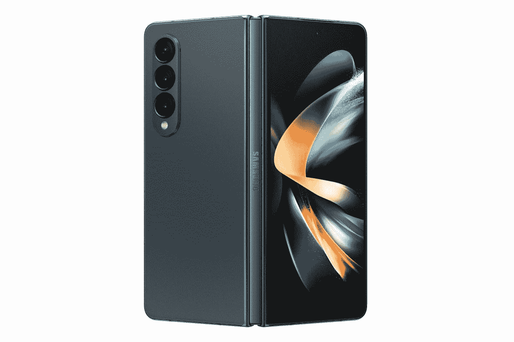

# 三星 Galaxy Z Fold 4 有哪些颜色？

> 原文：<https://www.xda-developers.com/samsung-galaxy-z-fold-4-colors/>

三星 Galaxy Z Fold 4 对其前身进行了大量改进，因此被认为是三星迄今为止最精致的可折叠手机。这一次它最大的升级包括更耐用的不同尺寸的设计和更宽的显示屏。它看起来很像去年的 Galaxy Z Fold 3，但三星做了大量的改变，以提高设备的整体适合度和光洁度。与 Galaxy Z Fold 3 不同，新的可折叠手机有四种颜色——幻影黑、灰绿、米色和 Samsung.com 独有的勃艮第色。

## 三星 Galaxy Z Fold 4 的所有颜色

三星在发布会上提供了三种不同颜色的 Galaxy Z Fold 4。因此，如果你计划在发布会上推出这款新的可折叠手机，那么你可以在幻影黑、灰绿、米色和酒红色之间进行选择。所有这些颜色都配有颜色匹配的框架和铰链设计，使其外观统一。幻影黑色变体经过反复试验，因此是三种颜色中最安全的颜色。它看起来非常类似于去年的幻影黑色 Galaxy Z Fold 3。Samsung.com 独有的勃艮第色也是我们过去见过的。Galaxy Z Fold 4 上的酒红色涂装类似于 Galaxy S22 Ultra 的酒红色。

Galaxy Z Fold 4 系列的新品是米色配色，它以金色的触感为调色板增添了更多温暖。最后，还有灰绿色，这恰好是 Galaxy Z Fold 4 的标志性颜色。它比我们去年为 Galaxy Z Fold 3 获得的幻影绿色涂装要轻得多，所以我们会说它非常不同。事实上，它看起来与我们过去从该品牌看到的任何东西都非常不同，所以这确实是一种展示你的新 Galaxy Z Fold 4 的独特方式。你可以查看我们对 Galaxy Z Fold 4 的[评测，了解更多我们对设计和颜色的想法。](https://www.xda-developers.com/samsung-galaxy-z-fold-4-hands-on/)

*   <picture></picture>

    三星 Galaxy Z Fold 4

    米色是 Galaxy Z Fold 4 首次亮相的新颜色。它为搭配增添了一抹金色，给调色板带来了一点温暖。

*   <picture></picture>

    三星 Galaxy Z Fold 4

    灰绿色是 Galaxy Z Fold 4 的标志性颜色，它看起来与我们过去从该品牌中看到的颜色完全不同。与我们已经拥有的 Galaxy Z Fold 3 的幻影绿色配色相比，它具有更浅的绿色。

*   <picture></picture>

    三星 Galaxy Z Fold 4

    这种特殊的颜色是 Samsung.com 独有的，我们认为它看起来类似于我们今年早些时候看到的 Galaxy S22 Ultra 上的勃艮第色。

Galaxy Z Fold 4 最有趣的一点是，你还可以购买一个配套的 S Pen 手写笔来搭配你的新可折叠手机。该设备本身没有 S Pen 腔来容纳手写笔，所以你必须依靠外壳来代替它。Galaxy Z Fold 4 再次只看到三种颜色有点令人惊讶，但其中至少有两种是我们过去在该系列中没有看到的全新外观。与 Galaxy Z Flip 4 不同，Galaxy Z Fold 4 没有定制版，可以让你用不同的颜色组合定制外观。

三星的新可折叠设备现在可供购买，所以一定要查看我们的 [Galaxy Z Fold 4 交易页面](https://www.xda-developers.com/best-samsung-galaxy-z-fold-4-deals/)看看你是否可以在购买时获得折扣。我们还收集了一些[最佳 Galaxy Z Fold 4 保护套](https://www.xda-developers.com/best-samsung-galaxy-z-fold-4-cases/)和[最佳 Galaxy Z Fold 4 充电器](https://www.xda-developers.com/best-samsung-galaxy-z-fold-4-chargers/)，供您查看，以防您想要挑选一些配件。那么，你打算选择哪种三星 Galaxy Z Fold 4 颜色呢？请在下面的评论中留言告诉我们。