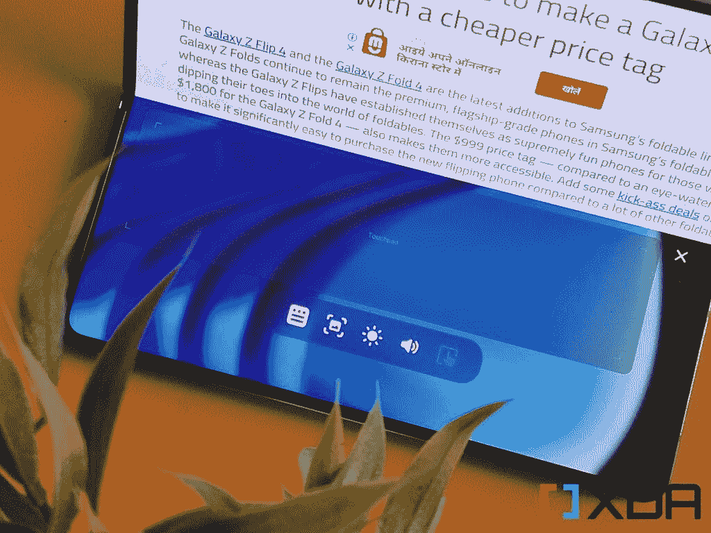
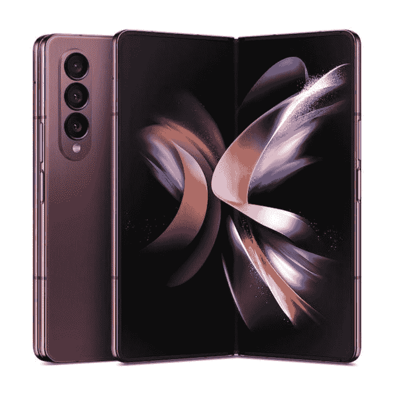

# 如何在 Galaxy Z Fold 4 的超大折叠屏幕上启用和使用“灵活模式”

> 原文：<https://www.xda-developers.com/samsung-galaxy-z-fold-4-flex-mode-walkthrough/>

三星新推出的可折叠产品最引人注目的地方是，它们能够像口袋大小的笔记本一样将中间部分折叠起来。显然，Galaxy Z Fold 4 更适合用作任何类似笔记本的东西。它让你重温早期对上网本和微型笔记本电脑的怀念。三星也付出了更多努力，通过为其 Flex 模式添加一些新功能，使 Galaxy Z Fold 4 看起来像一台传统的笔记本电脑。但是这种伸缩模式到底是什么，如何启用和使用它来充分利用折叠屏幕呢？

## 什么是灵活模式？

灵活模式是 Galaxy Z Fold 4 和 [Galaxy Z Flip 4](https://www.xda-developers.com/samsung-galaxy-z-flip-4-review/) 内置的一项功能。每当你使用手机主屏幕折叠一半时，它就会出现。它基本上利用了三星 foldable 坚固的铰链，并将设备的一半用作主屏幕，而另一半可以用作触控板、键盘，只是为了显示与上半部分正在消费的内容相关的一些重要信息。当你把手机放在一个平面上不用手就能使用时，它就派上用场了。

如果你想知道，灵活模式目前只适用于特定的应用程序。因此，只有少数应用程序能够真正充分利用灵活模式。支持的应用程序，如照相机、画廊和计算器，将自动在显示屏的两半上分发相关信息和屏幕元素。例如，YouTube 也是一个受支持的应用程序，您可以看到显示屏的上半部分用于显示视频本身，而下半部分用于显示其他相关内容，如视频评论、推荐视频等。

另一方面，三星的计算器也在屏幕的下半部分显示更多功能，同时允许你检查我们的输入，并在上半部分显示结果。你也可以在 Galaxy Z Fold 4 上拍摄照片时使用 Flex 模式，它会在底部为你提供相机控制和最后一张图像的预览，同时保持取景器在顶部。其他受支持的应用程序也有类似的布局来显示相关信息。

## 如何启用灵活模式？

Galaxy Z Fold 4 默认情况下会启用这一功能，所以要使用它，你只需将 Z Fold 4 的屏幕折叠一半。此外，请确保您已经禁用了方向锁，否则它将无法工作。您可以通过在通知/快速设置菜单中找到锁图标并确保它被禁用来检查这一点。Flex 模式是 Samsung foldables 独有的，这意味着并非所有应用程序都默认优化为利用它。三星有一个默认支持 Flex 模式的应用程序列表。来，看一看:

*   日历
*   计算器
*   照相机
*   时钟
*   走廊
*   互联网
*   油管（国外视频网站）
*   一款云视频会议软件
*   电话
*   三星免费
*   三星健康
*   三星电视增强版
*   谷歌二重奏

## 如何在不支持的应用上启用灵活模式？

更多的应用程序正在更新，以利用灵活模式，三星表示，随着时间的推移，兼容性将会增加。但是，您可以通过下面提到的几个简单步骤，为手机上的几乎任何应用程序启用灵活模式:

*   打开*设置*页面，寻找名为*高级功能*的选项。
*   在里面，找到*实验室*选项并选择它来查看一系列实验功能。
*   向下滚动到页面底部，选择*灵活模式面板*。
*   在此页面上，您可以选择要在灵活模式下使用的应用旁边的开关来启用它。

一旦完成，你现在应该能够将手机折叠一半，并在任何应用程序上启用灵活模式。你会看到内容移到屏幕的上半部分，而底部会出现一个控制面板。

## 在不受支持的应用程序上使用灵活模式

如果应用程序不正式支持 Flex 模式，您会在显示屏的底部看到一个控制面板。正如你所看到的，这个控制面板有五个按钮，你可以通过点击它们来进行交互。这些按钮的作用如下:

*   **通知:**点击此按钮将拉下通知遮光板，向上滑动即可发回。
*   **截屏:**下一个按钮可以让你抓取截屏，我认为这非常有用，因为当手机放在你面前这样的平面上时，按下电源和音量降低按钮可能会很奇怪。
*   **亮度&音量:**接下来的两个按钮将分别带来亮度和音量滑块。
*   **触摸板:**最后，您有一个触摸板按钮，它可以实现 PC 风格的触摸板和在显示屏上半部分移动的光标。触摸板的控制相当简单——用两个手指滚动、捏放、轻击或双击屏幕上的项目来采取必要的行动。

 <picture></picture> 

The control pad and the touchpad on Galaxy Z Fold 4

灵活模式将为所有不支持的应用程序调出相同的界面。我发现它在谷歌 Chrome 这样的应用中很有用，你可以用光标做各种事情。例如，对于 Twitch 这样的应用来说，这并没有多大作用。我只是觉得盯着一个空的下半部分很奇怪，这个空间可以用来显示实时聊天。对于不受支持的应用程序，缺乏这些功能是可以理解的，但这甚至不是我主要关心的问题。

我个人觉得触摸板有点挑剔。我不喜欢触摸板表面本身很小，而不是让你通过暂时隐藏控制面板来使用整个下半部分作为触摸板。我经常发现自己滚动或试图将光标移出触摸板，却发现自己做错了。

当谈到不支持的应用程序时，使用灵活模式的整体体验对我来说并不令人信服。但这也与 Android 12L 上运行的 OneUI 软件并不完全是光标友好的这一事实有关。也没有办法调整光标本身的灵敏度，我个人认为这会使事情变得更简单和有用。

 <picture></picture> 

Samsung Galaxy Z Fold 4

Galaxy Z Fold 4 的妥协更少，更耐用，总体而言是一款比其前辈好得多的智能手机。

嗯，那个；在新的三星 Galaxy Z Fold 4 上，您可以使用 Flex 模式做任何事情。这可能不是最有用的功能来帮助你充分利用你的 Galaxy Z Fold 4，但在大多数情况下它工作得很好。你有兴趣尝试一下灵活模式吗？请在下面的评论中留言告诉我们。