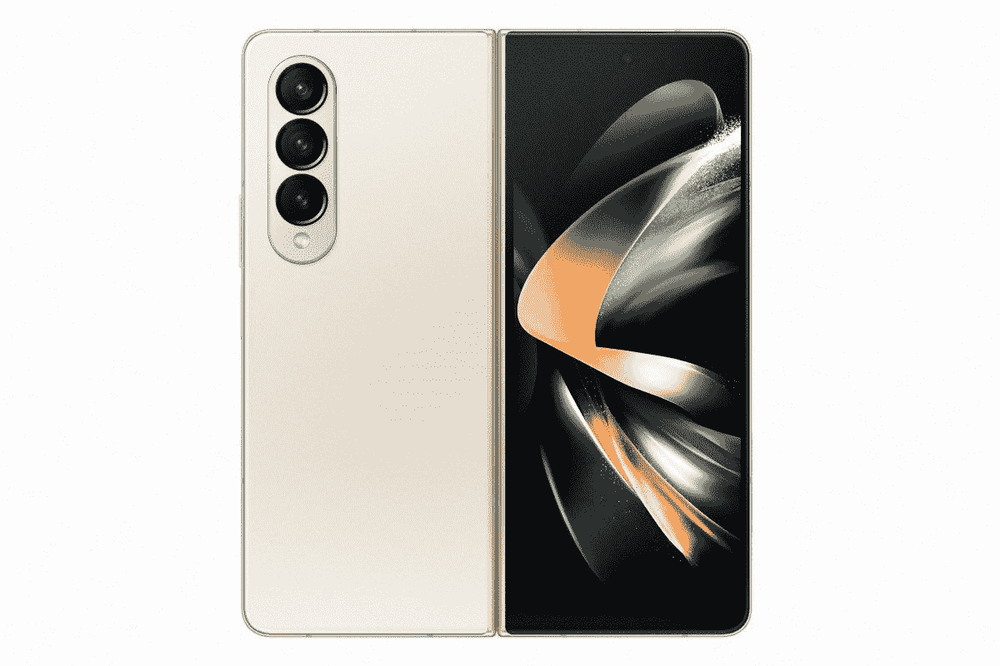

# 三星 Galaxy Z Fold 4 和 Galaxy Z Flip 4 内核源代码现已向开发者开放

> 原文：<https://www.xda-developers.com/samsung-galaxy-z-fold-4-flip-4-kernel-sources/>

Android 是建立在 Linux 内核之上的，这意味着原始设备制造商有义务根据要求提供他们在销售的设备上分发的任何 Linux 内核二进制文件的源代码。一些公司比其他公司更快发布他们的变化，但在上市一个多月后，三星最新可折叠产品的内核源代码包——Galaxy Z Fold 4 和 T2 Galaxy Z Flip 4 终于上市了。

三星在其开源网站上发布了这两款设备的内核源代码。要下载带有源代码的 zip 文件，请前往三星开源发布中心，搜索 Galaxy Z Fold 4 的 **SM-F936** 和 Galaxy Z Flip 4 的 **SM-F721** 。

 <picture></picture> 

Samsung Galaxy Z Fold 4

Galaxy Z Fold 4 是三星最新的可折叠旗舰产品，它比上一代产品有了大量改进。

当前版本对应于软件版本 **AVGA** ，用于美国运营商版本。请记住，在美国销售的三星 Galaxy 智能手机实际上没有一款可以解锁引导程序。与全球型号不同，这些设备完全锁定。虽然 GPLv2 许可证要求供应商发布他们的内核源代码，但缺乏可解锁的引导加载程序使得启动售后开发场景变得非常困难。

也就是说，鉴于全局模型上引导加载程序的可解锁性，对内核源代码的访问为高级用户提供了深入研究运行设备的代码的机会。调整源代码通常允许修改社区提出定制的内核，这些内核增加了在其他配置中没有提供的新功能。内核源代码版本还帮助开发人员为设备移植流行的定制 ROM(例如 LineageOS ),这反过来又有利于那些对现有 ROM 不满意的用户或那些即使在官方软件支持结束后仍想继续使用他们设备的用户。

 <picture></picture> 

Samsung Galaxy Z Flip 4

Galaxy Z Flip 4 是一款时尚的翻盖可折叠手机，提供华丽的屏幕，IPX8 防水，当然还有 5G。

如果你是一个开发人员，想要开始为设备二人组开发程序，那么就去三星的开源发布中心开始吧。然后，请务必访问我们的论坛，分享您所有新创建的开发工作。

**XDA 论坛:[三星 Galaxy Z Flip 4](https://forum.xda-developers.com/f/samsung-galaxy-z-flip-4.12655/) || [三星 Galaxy Z Fold 4](https://forum.xda-developers.com/f/samsung-galaxy-z-fold-4.12657/)**

* * *

**来源:** [三星开源发布中心](https://opensource.samsung.com/main)