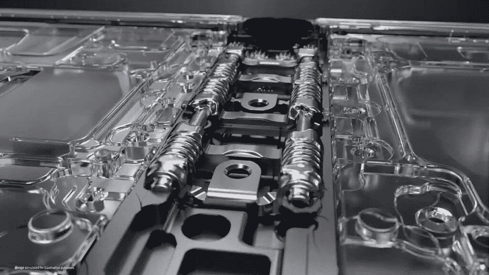

# 三星在 Galaxy Z Fold 4 中解开了一个新的改进铰链

> 原文：<https://www.xda-developers.com/samsung-galaxy-z-fold-4-new-hinge/>

三星刚刚举行了 Galaxy Unpacked 活动，展示了 [Galaxy Z Fold 4](https://www.xda-developers.com/samsung-galaxy-z-fold-4-hands-on/) 和 [Galaxy Z Flip 4](https://www.xda-developers.com/samsung-galaxy-z-flip-4-hands-on/) 。毫无疑问，这些设备将是今年最重要的发布，因为它们将推动可折叠智能手机的发展。虽然表面上有很多新的创新和设计改进，但 Galaxy Z Fold 4 内部有一个重要的升级。自 Galaxy Z Fold line 问世以来，该公司首次推出了一种新的铰链系统。

 <picture></picture> 

Samsung Galaxy Z Fold 3 Hinge Mechanism

当三星首次发布 Galaxy Fold 系列时，它具有创新性，但也存在问题。这款手机与众不同，需要复杂的移动部件，增加了故障几率。尽管该公司注重细节，但问题还是不可避免地出现了，需要他们重新开始，为现实世界创造新的解决方案。[经过四次迭代](https://www.xda-developers.com/samsung-galaxy-z-fold-1-to-4-evolution/)，三星已经到了一个可以轻松自信地进一步推进技术的地方。

 <picture></picture> 

Samsung Galaxy Z Fold 4 Hinge Mechanism

Galaxy Z Fold 的前三代产品采用了基于齿轮的铰链结构。但由于这种齿轮系统，手机的铰链仍然是必不可少的，但体积庞大。对于 Galaxy Z Fold 4，三星已经更换了新的铰链系统。三星的新铰链设计不是利用带互锁齿的齿轮，而是利用线性运动带来“旋转”效果。这使得它更加紧凑和轻便。尽管设计更加紧凑，但三星没有在耐用性上妥协，新的铰链系统和旧的一样坚固。你可以在公告中看到更详细的解释，时间标记如下。

铰链是 Galaxy Z Fold 智能手机最重要的部分之一，允许手机每天折叠和展开数百次。三星自己的测试将铰链的折叠次数定为 20 万次，而真实世界的测试发现，它可以远远超过这个数字，轻松完成 40 万次折叠。让我们希望新的机制没有问题，它只会增加银河折线的遗产。

 <picture></picture> 

Samsung Galaxy Z Fold 4

三星 Galaxy Z Fold 4 是终极生产力发电站，为高级用户提供更全面的体验。

我们已经联系了三星，要求澄清这种新铰链是否也存在于 Galaxy Z Flip 4 上。发布公告也提到了这款设备上的一个更小的铰链，但没有解释这种尺寸的减小是如何实现的。所以我们不确定这一代的两个可折叠手机是否共享相同的铰链内部结构。值得一提的是，Galaxy Z Fold 3 和 Galaxy Z Flip 3 都分享了它们的铰链机制。