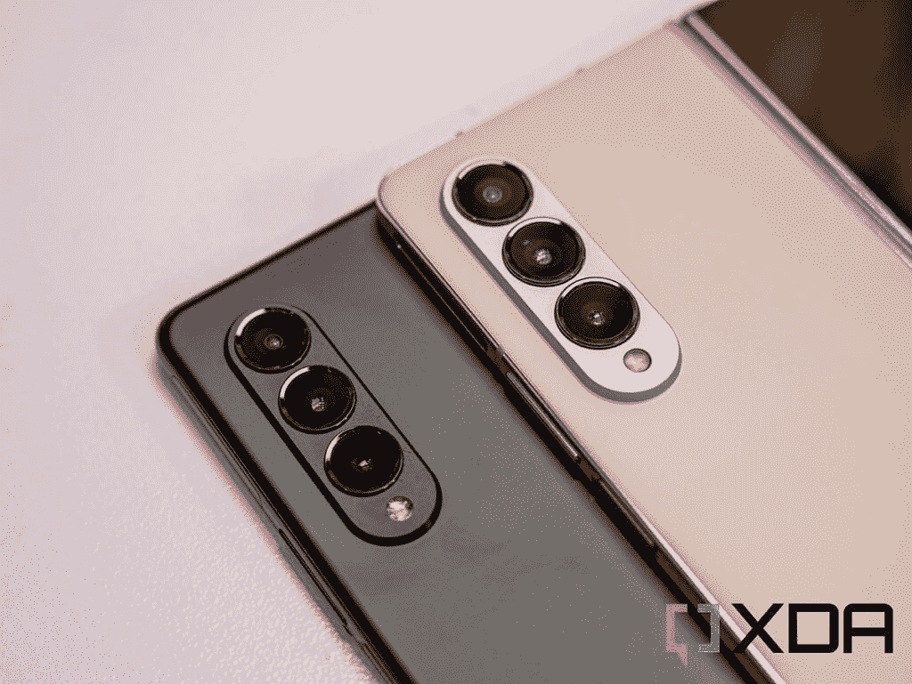

# 三星 Galaxy Z Fold 4 评论:一个翻转神奇的可折叠的每个人

> 原文：<https://www.xda-developers.com/samsung-galaxy-z-fold-4-review/>

在过去的四年里，由于 Galaxy Fold 的最初推出，可折叠智能手机市场已经从几乎一片死寂发展到吸引了全球数百万客户的想象力。三星在这方面处于领先地位，结合其品牌吸引力和巨额营销预算，推动 Galaxy Z 系列走出阴影，牢牢占据聚光灯下。

可折叠手机花了三年时间才最终被认为足够主流，足以吸引数百万人，即使在那时，也是去年的 Galaxy Z Flip 3 实现了这一点。Galaxy Z Fold 3 几乎是一款很棒的设备，很容易推荐给任何寻求旗舰产品的人，但在一些领域存在不足。Galaxy Z Fold 4 在这些方面进行了小的改进，反过来，也表明了小的改进可以产生巨大的影响。

宽度和长宽比的细微变化，最新骁龙处理器的性能增强，从 [Galaxy S22](https://www.xda-developers.com/samsung-galaxy-s22-review/) 系列借来的令人难以置信的摄像头阵列，以及通过最新 One UI 提高的生产力，首次创造了可以广泛推荐的体验。是的，这是市场上最贵的手机，但 [Galaxy Z Fold 4 优惠](https://www.xda-developers.com/best-samsung-galaxy-z-fold-4-deals/)非常棒，很容易推荐给大多数人。简单来说就是太好了，大家都应该买。

 <picture></picture> 

Samsung Galaxy Z Fold 4

Galaxy Z Fold 4 的妥协更少，更耐用，总体而言是一款比其前辈好得多的智能手机。电池可能无法持续一整天，充电速度也很慢，但这是你今天能买到的最好的手机之一，也是我向所有人推荐的手机之一。

## 三星 Galaxy Z Fold 4 价格:通过最后机会预购优惠节省大量费用

我非常喜欢 Galaxy Z Fold 4，所以我买了一台，但这其中的一个决定因素是难以置信的以旧换新交易。在 26 日正式发布之前，预购仍然开放，你可以在起价 1799.99 美元的基础上节省一大笔钱。

首先，你可以免费获得 512GB 的存储空间，而不是 256GB 的基本存储空间(为你节省 120 美元)，然后，如果你还购买了优秀的 Galaxy Watch 5(我评论过，真的很喜欢)，你可以获得高达 300 美元的预购信贷，最后，如果你以旧换新最近的手机，你可以获得高达 1000 美元的折扣。

是的，1799.99 美元的起价非常高，但三星扩大可折叠手机市场和知名度的秘密是它定期提供的优惠。我购买 Galaxy Z Fold 4 和 Galaxy Watch 5 的税前总支出刚刚超过 1000 美元，与其他旗舰产品的价格相同。

售价 1799.99 美元，很难推荐任何手机，但由于以旧换新，你应该买 Galaxy Z Fold 4。

## 三星 Galaxy Z Fold 4:规格

| 

规格

 | 

三星 Galaxy Z Fold 4

 |
| --- | --- |
| **建造** | 

*   装甲铝框架
*   康宁大猩猩玻璃 Victus+
*   IPX8 防水性

 |
| **尺寸&重量** | 

*   折叠后:67.1 x 155.1 x 14.2-15.8 毫米
*   展开后:130.1 x 155.1 x 6.3mm 毫米
*   263g

 |
| **显示** | 

*   封面:
    *   6.2 英寸高清+动态 AMOLED 2X
    *   2316 x 904p 分辨率
    *   120 赫兹自适应刷新率(48-120 赫兹)

*   主要:
    *   7.6 英寸 QXGA+动态 AMOLED 2X
    *   2176 x 1812p 分辨率
    *   120 赫兹自适应刷新率(1-120 赫兹)

 |
| **SoC** | 高通骁龙 8 加第 1 代 |
| **内存&存储** | 

*   12GB 内存+ 256GB 存储空间
*   12GB + 512GB
*   12GB + 1TB

 |
| **电池&充电** | 

*   4400 毫安时
*   25W 有线快速充电(30 分钟可充电 50%)
*   无线充电支持
*   无线 PowerShare

 |
| **安全** | 侧装式指纹扫描仪 |
| **后置摄像头** | 

*   主要:5000 万像素 f/1.8，双像素自动对焦，OIS，1.0 米像素大小(分辨率比 Galaxy Z Fold 3 高 4 倍)
*   超宽:12MP f/2.2，1.12 m 像素大小，123 度 FoV
*   长焦:10MP f/2.4，OIS PDAF，1.0 m 像素大小，3 倍光学变焦，30 倍数码变焦

 |
| **前置摄像头** | 

*   覆盖屏幕:
    *   10MP f/2.2，1.22 m 像素大小，85 度 FoV

*   显示摄像头下方:
    *   400 万像素/1.8 英寸，2 米像素大小，80 度视野

 |
| **端口** | USB 类型-C |
| **音频** | 立体声扬声器 |
| **连通性** | 

*   5G
*   4G LTE
*   802.11 无线网络
*   蓝牙 5.2
*   国家足球联盟

 |
| **软件** | 一个基于 Android 12L 的 UI 4.1.1 |
| **其他特征** | 主显示屏支持 S-Pen |
| **颜色** | 

*   幻影黑
*   灰绿色
*   米黄色
*   勃艮第(Samsung.com 独家)

 |

***关于本次评测:**三星美国给我们发了一个 Galaxy Z Fold 4 进行评测。这篇评论是在使用该设备超过两周之后撰写的。三星没有参与此次审查的内容。*

* * *

## 设计调整如何创造出近乎完美的外形

如果你以前从未使用过 Galaxy Z Fold，你不会注意到设计调整的变化。但如果你用过去年的型号，你会立即注意到它是如何巧妙地变得更短更宽。确切的变化是微小的，但大的改进来自小的迭代。每一款 Galaxy Fold 都比前一款略短，屏幕更宽，因为三星继续做出改变，以找到适合每个人的完美尺寸。

Galaxy Z Fold 4 证明了小变化可以产生大影响

Galaxy Z Fold 4 可能就是实现这一目标的设备。对于许多人来说，之前的产品太高了，而 [Oppo Find N](https://www.xda-developers.com/oppo-find-n-review/) 很受欢迎，因为它短得多，几乎类似于一本书。对我来说，Oppo Find N 太短了，日常使用不舒服，但 Galaxy Z Fold 4 在正确的方向上迈出了一大步。

整个手机短了 2 毫米，略轻，但实际宽度没有太大变化。相反，三星进一步缩小了边框，导致主屏幕宽了 2.8 毫米，而覆盖屏幕边框也略小。结果是在主屏幕上单手使用更加舒适，而主屏幕更加身临其境。

尽管摄像头凸起更突出，但更薄的铰链意味着整个手机重量减轻了 8 克，在日常使用中令人惊讶地引人注目。回到 Galaxy Z Fold 3 一天后，它感觉明显更重了，尽管这也可能是由于其他设计的变化。

除了这些变化，Galaxy Z Fold 4 保留了 Galaxy Z Fold 3 中使用的成功设计语言。覆盖屏幕的大小适合单手使用，与 Galaxy S22 Plus 的大小非常相似。主屏幕很华丽，摄像头凸起不太笨重，侧面指纹传感器很出色。

* * *

## Galaxy Z Fold 4 的显示屏甚至比以前更好

Galaxy Z Fold 4 上的两个显示屏今年也略有改进。虽然它们拥有与去年相同的技术规格，但每个都有细微的改进，使它们变得更好，尽管有一些意想不到的后果。

Galaxy Z Fold 4 显示屏更好、更亮、更出色

由于更薄的转轴和尺寸的细微变化，主显示屏现在宽了 3 毫米，尽管屏幕尺寸保持在 7.6 英寸，整体尺寸几乎相同。这产生了从 25:9 到 21.6:18 的纵横比变化，这是为了减少信箱区。总的来说，这一变化通常有助于更好地进行多任务处理，因为并排应用程序具有更好的纵横比，但奇怪的分辨率确实意味着在显示媒体时有很多信箱，一些应用程序和游戏不能很好地全屏显示。

封面屏幕也被调整了；它比 Galaxy Z Fold 3 宽 2.8 毫米，略短，这意味着单手使用要舒服得多。Galaxy Z Fold 3 在翻盖屏幕上打字时略显局促，但在 Galaxy Z Fold 4 上单手打字却非常出色。更宽的显示屏意味着屏幕键盘的按键略宽，这反过来使打字更加舒适。宽高比现在是 23.1:9，但是对于覆盖屏幕来说，信箱模式不再是一个问题。

两个显示屏也稍微亮一些，更有活力，主屏幕上的折痕不是问题。多亏了大猩猩玻璃 Victus Plus，这两款手机都比去年耐用得多，主屏幕比 Galaxy Z Fold 3 耐用 45%，这让你在移动中使用它时更加放心。

* * *

## Galaxy Z Fold 4 电池可以很棒，但是不一致

Galaxy Z Flip 4 的电池尺寸有所增加，但 Galaxy Z Fold 4 的电池容量与 Galaxy Z Fold 3 相同。4400 毫安时的电池容量是可以接受的，但在使用了两周之后，我认为它需要一个稍微大一点的电池。三星正在依靠处理器和软件优化来使电池寿命比去年更好，但这些只能到此为止。

Galaxy Z Fold 3 的电池续航时间非常长，尽管唯一的警告是，你可能不想经常使用相机。Galaxy Z Fold 4 的电池寿命也很长，但我注意到广泛使用相机会产生实质性影响。

平均而言，Galaxy Z Fold 4 在充满电的情况下可以持续 24 小时以上，其中大约有 5-7 小时的屏幕时间，主屏和覆盖屏之间可以混合使用。优先考虑主屏幕可以将电池寿命减少到 4 小时屏幕时间，而仅使用覆盖屏幕会导致我们的研究结果的上限。在我频繁使用相机的一天，电池电量下降到大约 3.5 小时，如果我使用主屏幕，电池电量可能会更低。

在我使用 Galaxy Z Fold 4 的整个过程中，我一直使用两个 SIM 卡，尤其是在旅行时，漫游 SIM 卡上的网络连接是有问题的。因此，我认为其中一些与手机无关，因为这是我的具体使用示例。类似地，我也遇到过某些应用程序由于优化不当而耗尽电池的情况，根据我在其他地方看到的结果，电池寿命可能非常长。最终，像任何手机一样，电池寿命将在很大程度上取决于你自己的使用情况。主要使用它的覆盖屏幕，你会得到惊人的电池寿命。但是只在主屏幕上使用它，你可能会很吃力。将这两者结合起来，你会介于两者之间，你是否经常玩游戏或使用相机也会产生影响。

也就是说，我们都有电力银行，我们中的许多人花足够的时间靠近墙壁来快速充电。这里没有疯狂的快速充电速度，充满电需要大约 90 分钟，尽管它可以在大约 30 分钟内充电到 45%。这是我们需要改进的一个方面。在我看来，25W 并不是快速充电，鉴于[一加 10T](https://www.xda-developers.com/oneplus-10t-first-impressions/) 可以在 22 分钟内充满电，而且价格仅为 600 美元，三星没有升级充电体验，特别是在一部售价 1799.99 美元的手机上。还有快速无线充电，尽管这不会像有线充电那样快(有线充电已经够慢了)。另外，请注意包装盒内没有充电器，因此您需要[单独购买一个充电适配器](https://www.xda-developers.com/best-samsung-galaxy-z-fold-4-chargers/)。

总的来说，电池寿命是可以接受的，但不是市场上最好的，我认为稍微大一点的电池容量将有助于下一代产品持续提供更长的电池寿命！

* * *

## 高价的优质硬件

与任何旗舰产品一样，Galaxy Z Fold 4 配备了优质硬件，并拥有几乎所有你可以期待的功能。鉴于它的价格为 1799.99 美元，我们也希望看到一些方面的改进，但最终，它拥有任何顶级智能手机都会有的旗舰规格表。

Galaxy Z Fold 4 采用最新的骁龙 8 Plus 第 1 代处理器，配备 12GB 内存，并有 256GB、512GB 或 1TB 内部存储可供选择。1TB 存储选项是 Galaxy Z Fold 4 的新功能(上一代产品仅提供前两种存储选项)，将满足所有需要大量存储媒体或拍摄大量照片的人。

像去年的模型一样，还有许多其他值得注意的规格。Galaxy Z Fold 4 的耐用性增加了 IPX8 防尘和防水性能，同时它运行的 Android 12L 在设计上考虑了可折叠的外形。有一系列传感器，包括侧面安装的指纹传感器——我绝对喜欢 Galaxy Z Fold 3 上的指纹传感器——你应该能够向下滑动以显示你的通知。

## Galaxy Z Fold 4 终于提供了一款旗舰相机

 <picture></picture> 

The Z Fold 4's triple-lens array (gold) vs last year's Galaxy Z Fold 3

Galaxy Z Fold 4 终于解决了我对每一款 Galaxy Fold 最大的困扰之一:摄像头。此前，相机只是可折叠相机的一个补充，但今年三星终于认真对待 Galaxy Z Fold 4 的成像体验。借用与 [Galaxy S22 Plus](https://www.xda-developers.com/samsung-galaxy-s22-plus-review/) 相同的相机系统，Galaxy Z Fold 4 最终提供了在任何场景下都能提供的成像体验。

主摄像头是 Galaxy S22 Plus 的 50MP 传感器，远优于 Galaxy Z Fold 3 的 12MP 传感器。它的分辨率是 Galaxy Z Fold 3 的 4 倍，f/1.8 光圈让光线增加 23%，从而获得更好的整体照片。主摄像头中有像素宁滨，这意味着你可以获得 2.4 米像素大小的 1250 万像素照片(全分辨率下的像素大小为 1.0 米)，OIS 可以带来整体流畅的体验。

我最喜欢的是 10MP 长焦镜头，它提供了高达 3 倍的光学变焦和 30 倍的空间变焦。作为 Galaxy S22 Ultra 的用户，我习惯于在口袋里放一个功能强大的变焦镜头，虽然 Galaxy Z Fold 4 没有达到那些崇高的高度，但它最终还是提供了一种功能强大的体验。在下面的图片中，你可以看到相机如何从超宽到宽，再到 3 倍到 30 倍的空间变焦。

我发现自己经常拍摄 3 倍变焦的照片，这款相机证明了自己的可靠性。30 倍空间变焦可能需要几秒钟才能稳定下来，但 3 倍光学变焦对于大多数使用情况来说是完美的，主相机可以拍摄出精彩、生动和详细的照片。

超宽摄像头与我们从其他三星手机中了解到的 12MP 传感器相同。这是一个 12MP 的传感器，具有 f/2.2 的光圈，123°的视场，1.12 m 的像素大小。像每个三星相机一样，它产生的图像是饱和的，视觉上非常有吸引力，我喜欢用它拍摄。它拍出了你会喜欢分享的非常有能力的照片。

我非常喜欢三星手机的另一个拍照功能:人像模式。三星一直在慢慢改进其肖像模式，结果是一个在技术上和艺术上使用的乐趣。像 Galaxy S22 系列一样，三星已经真正确定了如何从背景中提取一个人或其他对象，这意味着一切，甚至一缕头发，都保持在焦点上，而背景中的一切都消失了或可以调整。

这意味着你可以非常艺术地拍摄肖像。任何看过我对三星手机的评论的人都知道，我喜欢使用色点模式，这种模式可以保持前景的彩色，同时使背景完全变成灰度。这里的可能性是巨大的，它可以让你拍下你想要分享的令人惊叹的照片。

除此之外，您可能还会发现背景功能非常有用。这允许您用纯色替换背景，就像使用绿屏一样。我个人更倾向于用色点或虚化，但这取决于你的艺术倾向。其他模式——模糊、工作室照明、低调和高调单声道——都有不同的用途，尽管我不怎么用它们。三星的与众不同之处在于它能够以一种模式拍摄这些照片，然后完全改变效果并再次保存，这意味着你只需以一种肖像模式拍摄，然后你可以改变它们，直到你以后满意为止。

覆盖屏幕上的前置摄像头仍然是一个 10MP 传感器，但它是一个更新，更好的传感器。在最佳条件下，Galaxy Z Fold 4 可以拍摄出出色的照片，而 Galaxy Z Fold 3 则相当黯淡，在晚上，Galaxy Z Fold 4 要比它的前辈领先几英里。现在，它需要有用的和令人愉快的照片，而不是你会删除或在其余时间忽略的东西。

Galaxy S22 Ultra 可以说是一款可以取代专业数码相机的手机，但 Galaxy Z Fold 4 不是这样。如果你打算用 Galaxy Z Fold 4 拍照，然后打印，你可能会感到失望。然而，对于大多数人来说，这是一款能够在任何显示器上拍摄出精美照片的相机，并且您会希望与朋友和家人分享。

* * *

## 三星通过 Galaxy Z Fold 4 上的一个用户界面变得智能

我是 Galaxy Z Fold 系列的超级粉丝，因为它让我可以在旅途中高效工作，但另一个原因是三星终于展示了它的软件实力。备受指责的 TouchWiz 在五年前被 One UI 取代，三星一直在提供新的软件体验，以利用其智能手机提供的独特外形。

Galaxy Z Fold 4 就是一个很好的例子。该软件最大的增加是新的任务栏，我每次使用主屏幕时都会用到它。像 PC 或 Mac 一样，任务栏是一个永久(或半永久，取决于你的选择)的栏，位于主屏幕的底部，让你可以访问多达八个应用程序。

一个用户界面充满了小技巧，使 Galaxy Z Fold 4 成为一种使用乐趣，但其中一些有影响其他领域的意想不到的后果。例如，使用主屏幕的绝对最佳方式是打开镜像，这将把你的前两个主屏幕放在封面显示器上，并缩小所有内容以并排显示它们。这种模式很棒，也是利用所有屏幕空间的最佳方式，但它对任务栏有意想不到的影响。

任务栏上显示的应用不能独立设置。默认情况下，它会在你的主屏幕上显示前五个应用程序——如果你在镜像，这基本上意味着主屏幕上的前五个应用程序——然后是主屏幕上的后三个应用程序或你最近的三个应用程序。这两个都不是完美的实现，因为你可能希望在主屏幕上访问你的拨号器和其他应用程序，而你永远不会在主屏幕上使用它们，至少这是我的用例。我真的希望三星让我们尽快独立设置这些，因为这将使任务栏成为主屏幕上的一个转换功能。

然而，Galaxy Z Fold 4 真正闪光的地方是生产力。我对每一代人都这么说，但从 Galaxy Note 的早期开始，我就想知道三星对多任务处理的长期计划是什么。是的，Galaxy Note 系列有一个相当大的屏幕，但它不是一种变革性的体验。是的，它也来到了 Galaxy Tab 系列，这有助于在更大的显示器上获得良好的体验，但三星最大的优势没有在其旗舰手机上得到适当的利用。

Galaxy Z Fold 4 是多年来完善移动生产力的巅峰之作

Fold 4 及其之前的折叠是十多年来完善移动生产力的巅峰之作。在移动设备的多任务处理方面，三星已经远远领先于任何竞争对手，Galaxy Z Fold 4 的硬件可以充分利用这一优势。

多窗口体验的关键部分是并排运行三个应用程序的能力，其中一个主应用程序占据半个屏幕，其他两个应用程序各占据四分之一的屏幕。并排使用两个应用程序是我的常态，每个应用程序占用普通智能手机屏幕的平均空间，但我也会经常运行第三个应用程序。你还可以运行更多的应用程序，这些应用程序以弹出窗口的形式出现，然后消失在聊天头像一样的图标中，这些图标在所有其他应用程序上方可见，但可以在屏幕上移动。说到移动工作，没有比这更好的手机了。

去年的 Galaxy Z Fold 3 买了很多改进，但最大的一个增加是对 S Pen 的支持。今年的 [Galaxy S22 Ultra](https://www.xda-developers.com/samsung-galaxy-s22-ultra-review/) 买了嵌入式 S Pen 槽，但是 Fold 4 还是依靠外接 S Pen。凭借一点运气和工程奇迹，我们有望在未来的折叠中拥有嵌入式 Galaxy S Pen。但除此之外，Galaxy Z Fold 4 对于 S Pen 来说几乎是完美的。

像任何支持 S Pen 的设备一样，Galaxy Z Fold 4 支持多个窗口之间的拖放、手写输入和所有我们已经知道并喜欢的 Air Actions 功能。去年，三星创造了一种将 S 笔笨拙地存放在铰链中的保护套，但今年官方的 [Galaxy Z Fold 4 保护套](https://www.xda-developers.com/best-samsung-galaxy-z-fold-4-cases/)仍然增加了体积，但让你可以将 S 笔筒换成支架。它不像嵌入式 S Pen 那样优雅，但这是朝着正确方向迈出的一步。

然而事实是，你可能不会经常使用 S 笔。一旦在 Galaxy Z Fold 3 上使用 S Pen 的新鲜感消退——我也有点厌倦了在主屏幕上使用 S Pen 的减速带效果——我就从来没有真正携带过 S Pen。是的，有很多次我想念 S Pen，因为我需要签署一份文件，但这些不足以让我想整天带着它。不过，如果你更热衷于 S Pen 用户，Fold 4 既支持 S Pen Pro，也支持 S Pen Fold Edition，后者更精简，设计时考虑了 Fold 3 和 Fold 4。

最终，Galaxy Z Fold 4 是生产力之王，相机的改进意味着它将留在我的口袋里。

在过去的两周里，我一直在计划两件没有 Galaxy Z Fold 4 会变得相当困难的事情。两者最重要的主题是同时处理 Google Sheets 和其他几个应用程序。首先，我一直在努力赶在东海岸严寒的冬天到来之前进行一次跨洲的搬家。这就是 Fold 4 的大屏幕发挥作用的地方。

Galaxy Z Fold 4 让复杂的事情变得简单，例如在旅途中穿越国家

我刚从西海岸旅行回来，看了 14 套潜在的公寓，一离开看房，我就启动我的运行表来更新各种东西，如成本、功能和其他相关信息。我没有在笔记本电脑上设置这个表格并在旅途中访问它，而是在 Galaxy Z Fold 4 上启动它并进行所有格式化，这表明如果你花大量时间在电子表格上，它是一个非常强大的便携式替代品。

另一件大事是一个为期一个月的年终假期，在六个城市和四个国家举行。这也需要一个电子表格，但也需要在各种应用程序之间进行大量的交叉检查，以检查航班、评论、位置和价格。在我的笔记本电脑上，我会并排运行三到四个应用程序，在任何普通手机上，这将是一次一个应用程序的体验，但 Galaxy Z Fold 4 带来了类似笔记本电脑的移动体验。

作为一部智能手机，重要的是当你在飞机上起飞时，它不必放在一边，当你在停机坪上被延误时，这就派上了用场，就像我昨天被延误了几个小时一样。几个正在工作的人已经把他们的笔记本电脑放好了，但是我可以继续做我想做的事情，直到延迟解决。

* * *

## 该不该买 Galaxy Z Fold 4？

我强烈推荐 Galaxy Z Fold 4。它采用了去年的一款非常好的智能手机，并进行了正确的改进，创造出比这些改进的总和更大的东西。最终，如果你能承受这个价格，你可以向任何人推荐这款手机。

新相机比 Galaxy Z Fold 3 有了很大的改进，如果你对 Galaxy Z Fold 3 相机感到失望，我建议升级到 Z Fold 4。我个人认为额外的费用是值得的，尤其是如果你打算保留两年或更长时间。

Galaxy Z Fold 4 也是在旅途中完成工作的最佳手机。当我在出租车上、沙发上、火车上甚至走在街上时，我总是打开主屏幕记下一些东西，一边看东西一边发推特，甚至作为 Kindle 阅读器。

这不是一款完美的设备，但 Galaxy Z Fold 4 做出的权衡还不足以影响整体体验。如果你想要一部似乎可以做到这一切的智能手机，Galaxy Z Fold 4 就是你的手机。

 <picture></picture> 

Samsung Galaxy Z Fold 4

Galaxy Z Fold 4 是市场上最具生产力的智能手机，并使其更加出色。尺寸和重量的细微变化意味着用在手中更舒适，而相机得到了巨大的改进，这意味着它们终于和 Galaxy S22 系列一样好了。这些变化并不便宜，但它们让一部非常好的智能手机变得非常棒！这是你今天能买到的最好的手机之一，也是我向所有人推荐的一款手机。