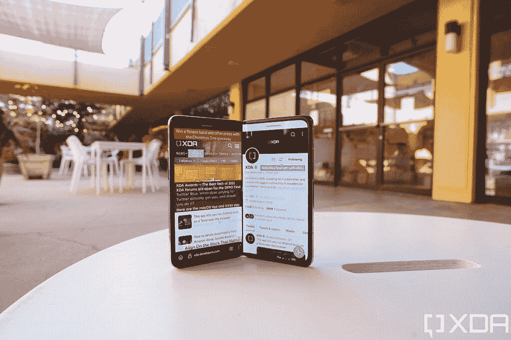

# Galaxy Z Fold 4 vs Oppo Find N:三星改进的可折叠票价如何对抗 2021 最好的可折叠硬件？

> 原文：<https://www.xda-developers.com/samsung-galaxy-z-fold-4-vs-oppo-find-n/>

对于世界上大多数人来说，如果他们想要一部可折叠手机，那就是三星或什么都不要。但是如果你住在中国，或者你是一个热衷于进口的人，那么你有其他的选择。

这些选项不是失败者。可以说，他们一直在以比三星 Fold 系列更快的速度推动可折叠创新。让我们来看看三星最新的 [Galaxy Z Fold 4](https://www.xda-developers.com/samsung-galaxy-z-fold-4-hands-on/) 如何与 2021 年的[最佳可折叠硬件](https://www.xda-developers.com/best-foldable-phones/)、 [Oppo Find N](https://www.xda-developers.com/oppo-find-n-review/) 相比较。

 <picture></picture> 

Samsung Galaxy Z Fold 4

三星 Galaxy Z Fold 4 是终极生产力发电站，为高级用户提供更全面的体验。

* * *

## 三星 Galaxy Z Fold 4 和 Oppo Find N:规格

|  | 

三星 Galaxy Z Fold 4

 | 

Oppo Find N

 |
| --- | --- | --- |
| 

中央处理器

 | 骁龙 8 加第 1 代 | 骁龙 888 |
| 

尺寸和重量

 | 

*   折叠后:67.1 x 155.1 x 14.2-15.8 毫米
*   展开后:130.1 x 155.1 x 6.3mm 毫米
*   263g

 | 

*   折叠后:132.6 x 73 x 15.9 毫米
*   展开时:132.6 x 140.2 x 8.0 毫米
*   275 克

 |
| 

显示

 | 内部显示屏:

*   7.6 英寸 QXGA+ Dynamic -AMOLED 2X 显示屏
*   22.5:18 宽高比
*   2208 x 1768
*   120 赫兹

封面展示:

*   6.2 英寸高清+动态 AMOLED 2X 显示屏
*   24.5:9 宽高比
*   2268 x 832
*   120 赫兹

 | 内部显示屏:

*   7.1 英寸带 UTG 的灵活有机发光二极管
*   1792 x 1920
*   120 赫兹刷新率

封面显示:

*   988 x 1972
*   60Hz 刷新率
*   18:9 宽高比

 |
| 

照相机

 | 

*   12MP 超宽，f/2.2 超宽，FoV 123 度
*   50MP 宽，f/1.8，双像素自动对焦，OIS
*   10MP 长焦，3 倍光学变焦
*   10MP 前置自拍相机
*   400 万像素前置屏下自拍相机

 | 

*   50 毫米宽，1.8 英寸高，24 毫米宽，1/1.56 英寸高
*   16 MP 超宽 f/2.2，14 毫米(超宽)，123 英寸
*   1300 万像素，2 倍远摄 f/2.4，52 毫米(远摄)，1/3.4 英寸

 |
| 

记忆

 | 12GB 内存、256GB/512GB UFS 3.1 存储 | 12GB 内存、256GB/512GB UFS 3.1 存储 |
| 

电池

 | 4400 毫安时双电池 | 4500 毫安时 |
| 

网络

 | LTE:增强型 4X4 MIMO，7CA，LAA，LTE Cat。205 克 |
| 

抗水性

 | IPX8 | 没有人 |
| 

传感器

 | 电容式指纹传感器(侧面)、加速度计、气压计、陀螺仪传感器、地磁传感器、霍尔传感器(模拟)、接近传感器、光传感器、用于手写笔输入的 Wacom 层 | 电容式指纹传感器(侧面)、加速度计、气压计、陀螺仪传感器、地磁传感器 |
| 

操作系统（Operating System）

 | 顶部有一个用户界面的 Android 12L | 顶配 ColorOS 的 Android 12 |
| 

颜色；色彩；色调

 | 蓝色、银色、黑色 | 蓝色、灰色(纯素皮革) |
| 

价格

 | 起价 1799 美元 | 起价 8，201 元人民币(约 1，200 美元) |

**注:**所有并排显示两款手机的照片都是 Oppo Find N 和 Galaxy Z Fold 3。由于我目前在路上，我无法同时使用这两种设备。但是考虑到 Fold 3 和 Fold 4 看起来几乎一样，除了几毫米的高度和宽度，这些照片仍然会给你一个很好的比例概念。任何显示三星可折叠的照片都是 Galaxy Z Fold 4。

* * *

## 三星 Galaxy Z Fold 4 vs Oppo Find N:设计和硬件

这两款设备都是内部折叠设备，这是三星首创的设计。Galaxy Z Fold 4 要高得多，与 Find N 的 7.1 英寸、8.4:9 纵横比主屏幕相比，它的主显示屏为 7.6 英寸、10.8:9 纵横比。

 <picture></picture> 

The Galaxy Z Fold 4.

这些长宽比意味着 Fold 4 的主屏幕是一个直立的矩形，而 Find N 的屏幕是一个侧面的矩形。Oppo 认为其更宽的横向风格主屏幕更适合观看视频，但大多数 Android 应用程序在纵向方向上显示更好，因此它们往往更适合三星的直立矩形形状。

 <picture></picture> 

The Oppo Find N.

折叠后，Find N 非常紧凑，屏幕为 5.5 英寸，18:9，而 Fold 4 的屏幕为 6.2 英寸，23.1:9。Oppo 的长宽比更接近典型的智能手机，所以当谈到外部显示器时，Find N 将更合适地显示应用程序。下面的照片显示的不是最新的 Z Fold 4，而是 Z Fold 3 旁边的 Find N。Galaxy Z Fold 4 略短且略宽，但在大多数情况下，Z Fold 4 仍会像这样高出 Find N。

 <picture></picture> 

Find N and Z Fold 3.

每一次手机交易都涉及到其他硬件。Galaxy Z Fold 4 支持官方 IPX8 防水等级(意味着它可以沉入水中并存活)，而 Find N 没有这样的官方等级。Z Fold 4 还支持 S-Pen 手写笔，不过这需要额外购买。

然而，Find N 可以完全折叠，不会像三星的可折叠手机那样在折叠点留下缝隙。Find N 的主屏幕没有坚硬的折痕，这要归功于“水滴”铰链设计，允许屏幕以不太苛刻的角度折叠。Find N 屏幕上仍然有轻微的折痕，只是比 Galaxy Z Fold 4 上的严重折痕不太明显。

 <picture></picture> 

Oppo's screen crease is very hard to see and feel, while Samsung's screen crease is quite noticeable.

两个铰链都可以对折，让手机可以像迷你笔记本电脑一样工作。这个别出心裁的功能是三星首创的，所以值得称赞。这个功能对我来说是一个绝对的游戏改变者，因为我经常使用这些可折叠的东西来进行免提视频通话或自拍。

### SoC、内存和电池

自 Find N 去年问世以来，它运行在较旧的骁龙 888 上，而 Galaxy Z Fold 4 运行的是骁龙 8 加 Gen 1。新的芯片显然更好，但具体多少取决于您的使用情况。需要注意的最重要的一点是，骁龙 8 Plus Gen 1 更节能，因此理论上它应该比 Find N 的电池续航时间更长，考虑到两款手机的电池尺寸相似。

然而，我自己对 Find N 的测试显示电池续航时间非常长，我还没有机会对 Fold 4 进行同样的测试。两款手机都运行在 12GB 的内存上，并配有 256GB 或 512GB 的存储空间。

### 摄像机

Galaxy Z Fold 4 和 Find N pack 都有一个三镜头主系统，由一个 50MP 主摄像头和一个 1/1.55 英寸的图像传感器组成。然而，它们是不同的传感器，Find N 使用索尼的 IMX766，Fold 4 使用三星自己的 GN5。然而，这两个传感器之间的性能非常相似，因为它们是直接的竞争对手，都捕捉像素仓 1250 万像素的照片。两者的主摄像头拍摄的照片都将充满活力，细节丰富，如果你足够靠近某个主题，甚至会有一点自然的散景。这些不是顶级旗舰传感器，但无论如何都是非常好的传感器。

对于超宽，Fold 4 使用 12MP f/2.2 射手，而 Find N 的 16MP 也是 f/2.2 超宽。三星在变焦摄影方面处于领先地位，与 Find N 的 13MP 2X 倍长焦相比，10MP f.2.4 长焦可以产生 3 倍的光学变焦。在这个时代，平板手机可以产生清晰的 5X 甚至 10 倍变焦的照片，专用于 2 倍变焦的镜头似乎很弱。

 <picture></picture> 

The Z Fold 4's triple lens array.

自拍前置偏向 Oppo:Find N 每个屏幕都包了一对 32MP 自拍器，而且都是不错的前置摄像头。与此同时，Fold 4 在外侧屏幕上使用了一个刚刚好的 100 万像素自拍相机，在主屏幕上使用了一个 400 万像素的“显示不足”自拍相机，由于它被放置在 OLED 面板下面，所以可以产生非常柔和的图像质量。然而，有些人可能更喜欢这样，因为它给 Fold 4 的主屏幕带来了更不间断的外观。

* * *

## 三星 Galaxy Z Fold 4 vs Oppo Find N:软件

Galaxy Z Fold 4 和 Oppo Find N 都运行在 Android 12 上，但三星的 foldable 是运行在 Android 12L 上的[，这是一个针对更大屏幕优化的 Android 版本。这使得 Galaxy Z Fold 4 的 Android 版本更适合处理可折叠手机的奇数纵横比。事实上，即使在 Android 12L 之前，三星的 OneUI 在应对屏幕尺寸变化方面已经比 Oppo 的 ColorOS 做得更好。考虑到三星现在已经生产了八款可折叠手机，而 Oppo 只有一款，这不应该是一个惊喜。](https://www.xda-developers.com/samsung-galaxy-z-fold-4-android-12l-one-ui-4-1-1/)

作为首次推出的可折叠产品，Find N 的软件一点也不差——只是没有三星的那么完美。Oppo 确实推出了一些直观的手势，比如在应用程序中间向下滑动以触发分屏模式，或者将应用程序向上滑动到比平时更高的位置以将其启动到一个小的浮动窗口中。在 Z Fold 4 上用一个应用程序做同样的窗口模式需要两次点击和一次长按。

Oppo 的 ColorOS 也比三星的 OneUI 有更简洁的动画。尽管两款手机都有 120Hz 的主屏，但在 Oppo Find N 上动画感觉更快更流畅。但这种好处纯粹是审美上的。底线是 Fold 4 可以做更多的事情，例如同时打开三个应用程序，而 Find N 不能，并将桌面窗口设置输出到外部显示器(三星称之为 DeX 模式)。

* * *

## 三星 Galaxy Z Fold 4 vs Oppo Find N:性能

即使在今天，Oppo Find N 也是一个绝对优秀的表现者，但正如已经提到的，骁龙 8 Plus Gen 1 是一个明显优于以前高通 SOC 的芯片，所以 Galaxy Z Fold 4 只是更有能力。电池续航时间应该会更长一些，任何密集型任务，如渲染视频或玩图形密集型游戏，在 Fold 4 上都比 Find N 运行得更好。Fold 4 的软件也更适合多任务处理，应用程序扩展问题更少。

但是，请注意，以上所有内容都是更高级的用户需求。如果你的手机使用更加基本，比如只是在网站上阅读文字，在 Instagram 上滚动，偶尔自拍和基本的室内照片，你就不会错过 Fold 4 提供的额外功能。我想说明的是，Find N 的电池续航时间也不差——对我来说，这款手机可以轻松地一天工作整整 13 个小时，这是旧款 Galaxy Z Fold 3 无法做到的。然而，鉴于骁龙 8 Plus Gen 1 在我迄今为止测试的其他设备中令人印象深刻的电池寿命，Galaxy Z Fold 4 应该能够超过这一点。

作为一款媒体消费设备，Find N 更宽的宽高比显示电影和大多数视频，比三星的 Fold 4 更少信箱，但前者有两个底部发射扬声器，而后者在顶部和底部有更多对称的扬声器，以获得更完整的音频。

* * *

## 三星 Galaxy Z Fold 4 vs Oppo Find N:哪个可折叠更让人印象深刻？

这些比较文章的最后一节通常题为“你应该购买哪一款”，但在这种情况下，这一点没有意义，因为大多数人应该只购买 Galaxy Z Fold 4，因为它的可用性更广。你将享受到 Find N 可能享受不到的保修和售后服务(除非你在中国)。此外，三星现在有一些非常诱人的 4 折交易。

如果你确实想进口 Oppo Find N，好消息是这款手机在几个月前推出时价格就很合理(从最初的 9999 元人民币换算后约为 1200 美元)，此后价格有所下降。这意味着，即使你支付通常的进口加价，这款手机也应该能以低于 1500 美元的价格买到，仍然低于三星 Fold 4 的价格。

但你应该只买 Fold 4，因为前面提到的原因和更新的芯片组。Oppo Find N 是一款非常有趣的设备，在发布时，它绝对提供了比 Galaxy Z Fold 3 更令人印象深刻的硬件。但三星后来对 Fold 4 进行了改进，所以现在两者之间的差距已经不远了。

 <picture></picture> 

Samsung Galaxy Z Fold 4

三星 Galaxy Z Fold 4 是终极生产力发电站，为高级用户提供更全面的体验。