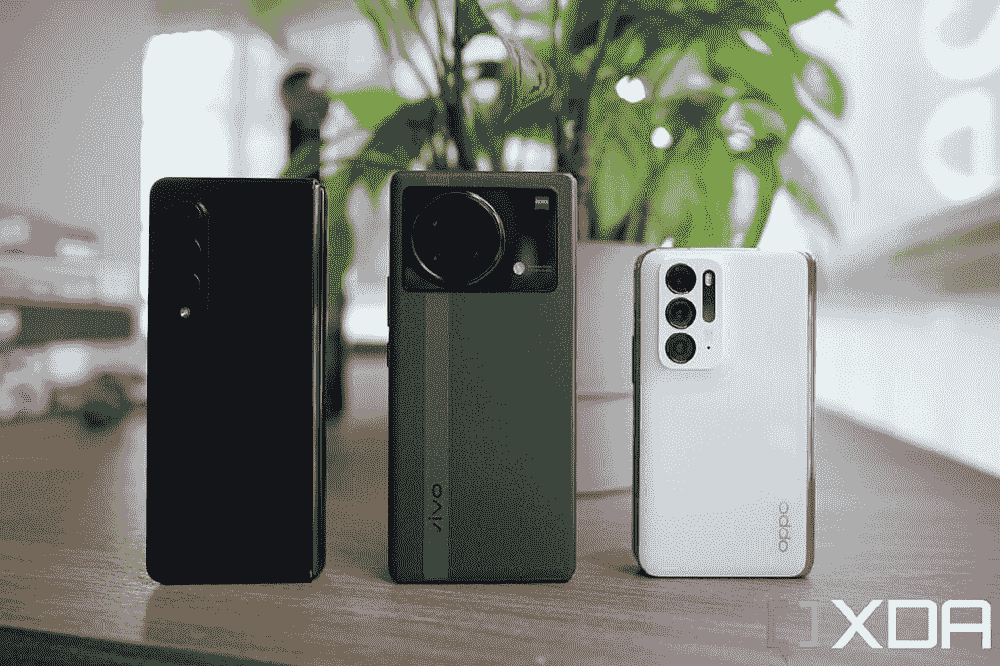
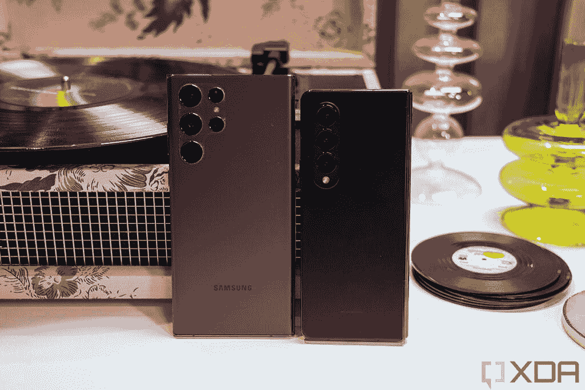

# 三星，请做一个真正的旗舰相机系统的 Galaxy Z Fold Ultra

> 原文：<https://www.xda-developers.com/samsung-galaxy-z-fold-ultra-editorial/>

三星是可折叠手机的先驱，其内部的折叠设计语言为所有其他中国可折叠手机的发展铺平了道路。但有一个很好的例子可以证明，在过去几年中，华为、Oppo 和 Vivo 等品牌的可折叠手机在纯硬件实力上已经超过了 Galaxy Z Fold 系列。例如，三星今年对 [Galaxy Z Fold 4](https://www.xda-developers.com/samsung-galaxy-z-fold-4-hands-on/) 最突出的设计改进是改进了铰链，折叠时不再从侧面伸出那么多。这极大地改善了手感，因为折叠的折叠部 4 现在在手中感觉更加对称，而没有像过去几年那样明显笨重的左侧。

但这种更扁平的铰链结构并不新鲜。它首先出现在 17 个月大的[华为 Mate X2](https://www.xda-developers.com/huawei-mate-x2-review/) ，以及 [Oppo Find N](https://www.xda-developers.com/oppo-find-n-review/?fbclid=IwAR3HzUvclh2MSwwf8CB1rpFJVsZDr_QXPohGkF3rmbvqX7G-_PX7L1Ie3Tg) 、 [Honor Magic V](https://www.xda-developers.com/honor-magic-v-hands-on/) 和 Vivo X Fold，此后都以类似的铰链上市。Galaxy Z Fold 4 只是在这一特定领域迎头赶上。

 <picture></picture> 

The Galaxy Z Fold 2's hinge (right) protrudes from the side significantly compared to the Huawei Mate X2's hinge (left). Samsung wouldn't reduce hinge bulkiness until this year's Z Fold 4.

虽然三星去年在可折叠技术方面推出了真正的硬件突破，如官方 IP 防水等级和手写笔支持，但该公司也没有解决一些引人注目的硬件缺陷，这些缺陷一直是人们的笑柄，如硬屏折痕和折叠仍然不能完全折叠的事实。这些问题在中国可折叠空间早已解决。

 <picture></picture> 

Samsung's Fold series all leave a gap when folded (left), while the Huawei Mate X2 can fold completely flat (right).

三星粉丝可以争辩说 Z Fold 系列仍然是最好的整体可折叠产品，拥有最完美的软件(我同意你的观点！).但客观地说，一个折痕粗糙的 Galaxy Z Fold 屏幕看起来不如最近的中国可折叠屏幕好看。

 <picture></picture> 

The crease in Chinese foldables like the Oppo Find N (left) is a lot harder to find than in Samsung's Z Fold series (right).

然后是 Z Fold 相机系统:前三款 Galaxy Z Fold 手机的相机硬件一般，比三星 Ultra 手机中实际最好的相机产品低几级。没有高百万像素，没有大传感器，只有一个普通的 2 倍变焦镜头。Z Fold 4 通过升级到 [Galaxy S22](https://www.xda-developers.com/samsung-galaxy-s22-review/) 的相机系统来改善这种情况，它有一个 50MP 的主相机，带有一个更大的 1/1.56 英寸图像传感器，以及一个功能性的 3 倍远摄变焦镜头。

不过这套系统还是比 [Galaxy S22 Ultra](https://www.xda-developers.com/samsung-galaxy-s22-ultra-review/) 相机系统低一个级别；它也仍然落后于华为 Mate X2 或 Vivo X Fold 的光学系统，后者装有潜望镜变焦镜头和主摄像头，与当时每个品牌的[最佳相机硬件](https://www.xda-developers.com/best-smartphone-cameras/)不相上下。有时间的话可以看看我的 [Vivo X Fold 评测](https://www.xda-developers.com/vivo-x-fold-hands-on/)看看照片样张 vs Galaxy Z Fold 3，Vivo 的拍照系统客观上更胜一筹。

 <picture></picture> 

The Vivo X Fold (middle) with the Galaxy Z Fold 3 (left) and OPPO Find N (right).

但问题是:我不认为 Galaxy Z Fold 系列的硬件更适中是因为三星缺乏技术能力。如果 Vivo 的工程师可以将潜望镜变焦镜头和显示指纹读取器塞进一个可折叠的盒子里，那么三星的工程师肯定也可以。

反而我觉得三星是*选择不追求*那些东西，因为它宁愿把 Fold 系列做得更轻更实惠。

两年前，三星确认了这一方向，当时公司代表告诉韩国新闻媒体 *[The Elec](http://www.thelec.net/news/articleView.html?idxno=1948)* 其目标是通过变得“更轻更薄”来使可折叠手机“更主流”三星正在实现这一目标，Galaxy Z Fold 3 比 Fold 2 更薄更轻，Fold 4 进一步减轻了 Fold 3 的重量。过去两年，三星还设法降低了 Fold 系列的零售价格。尽管今年价格没有变化，但要明白全球经济和生产要素与去年不同，因此静态价格很可能会转化为降低的净利润。

大多数消费者不需要 10 倍变焦的相机。他们宁愿要一部更轻更便宜的手机

对三星来说，专注于走向主流是非常明智的商业举措。虽然像我这样的手机爱好者可能会对新硬件的缺乏感到失望，但现实是我是少数。大多数消费者不需要 10 倍变焦的相机。他们宁愿要一部更轻更便宜的手机。

如果三星将 Ultra camera 系统放入 Fold 4，并寻求其他突破，如显示指纹识别器和无褶皱屏幕，它肯定会推高价格和重量。为了追求主流消费者，三星决定不这么做。它很可能会成功，有这么多 Z Fold 4 的好交易，这款手机应该会卖得很好。

然而，一旦三星成功地让可折叠手机变得更加主流(它正在顺利发展:我看到*在 2022 年比以往任何时候都更容易折叠和翻转)，三星应该考虑制造一个超级版本的 Fold，一个对像我这样想要绝对最好的发烧友有吸引力的版本。这与其目前的旗舰平板手机战略没有任何区别:三星每年生产三款 Galaxy 手机，Ultra 型号显然针对高级用户和发烧友，而非 Ultra 型号则针对更普通的消费者。*

三星可能会在明年发布一款延续当前趋势的 Galaxy Z Fold 5，但也会给我们一款拥有所有最新尖端技术的 Galaxy Z Fold 5 Ultra

为什么不这样做呢？三星可能会在明年发布 Galaxy Z Fold 5，继续目前专注于减轻重量和尺寸的方向。也许三星甚至可以考虑使用较低端的骁龙 7 系列 SoC，将价格再降低几百美元。

 <picture></picture> 

The Galaxy Z Fold 4 (left) brings an improved camera system, but it's still no match for the Galaxy S22 Ultra's epic optics (left).

与此同时，三星可以推进 Galaxy Z Fold 5 Ultra，这是一款拥有三星可能最好的相机系统的手机，具有内置扫描仪的无褶皱显示屏，以及三星可能正在努力实现的任何突破。见鬼，把一个集成的 S-Pen 塞进去。当然，这款手机可能售价 2500 美元，重量超过 280 克，但发烧友会购买。我知道我会的。

当然，标准折叠机型的销量会远远超过 Ultra 机型，但这已经是大多数旗舰智能手机系列的通常情况。iPhone 13 的销量远远超过了 iPhone 13 Pro Max，Galaxy S21 的销量超过了 Galaxy S21 Ultra。这就是定价经济学通常的运行方式，公司完全了解这些动态。

唯一的例外？今年的 Galaxy S22 Ultra 成为近年来唯一一款销量超过低端机型的顶级旗舰手机。也许这对三星来说是一个信号，它的粉丝想要一部拥有所有最新技术突破的 Ultra 手机。目前，三星的 Galaxy Z Fold 4 看起来像是一款真正吸引大众的主流可折叠手机。

 <picture></picture> 

Samsung Galaxy Z Fold 4

三星的第四代旗舰折叠手机 Galaxy Z Fold 4 带来了微妙的改进，这些改进使其成为更加精致的可折叠手机。