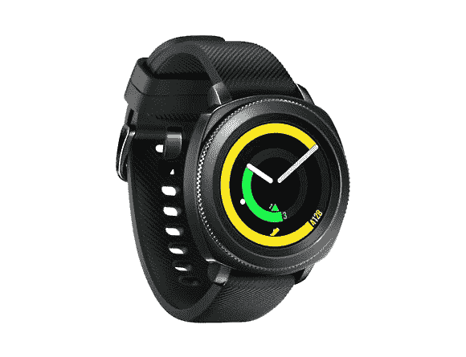

# 仅今天，购买三星 Gear Sport 智能手表即可节省 50 多美元

> 原文：<https://www.xda-developers.com/samsung-gear-sport-smartwatch-woot-deal/>

智能手表的世界可能很难驾驭。你是在寻找功能还是风格？跟踪健身或通知？想要智能手表做任何事情？根据你要找的东西，你需要看不同的手表品牌和型号，这可能会很累。但是，如果你正在寻找一个健身智能手表，你不需要做大量的研究-今天在 Woot！，你可以只花 146 美元买到[三星 Gear Sport 智能手表](https://sellout.woot.com/offers/samsung-gear-sport-smartwatch)，比建议零售价低 50 多美元。

和大多数 Woot 一样！交易，这个交易只在当天结束前有效，或者直到卖完为止。这个价位，你肯定会想早抢早不抢！此外，只有黑色智能手表在打折，所以如果你想要蓝色的，你就不走运了。但是，既然你可以在其他地方买到一些[三星 Gear Sport bands](https://www.amazon.com/s?k=samsung+gear+sport+smartwatch+band&tag=xda-12iacus-20&ascsubtag=UUxdaUeUpU30275&asc_refurl=https%3A%2F%2Fwww.xda-developers.com%2Fsamsung-gear-sport-smartwatch-woot-deal%2F&asc_campaign=Short-Term) ，为什么仅仅因为颜色的选择就错过了很多呢？

三星 Gear Sport 是一款非常棒的健身智能手表，能够自动跟踪一系列锻炼，并且可以游泳(最远 50 米)。您还可以轻松跟踪卡路里，并获得个人教练和训练技巧！当然，Gear Sport 还能够提醒你智能手机上的通知，它也兼容 Samsung Pay，所以你只需轻轻一点手腕就可以支付。

你的兴趣被激起了吗？应该是！如果你只是需要一点额外的动力，在 Woot 航运！如果你是亚马逊 Prime 会员，是免费的。由于 Prime Day 刚刚过去，很可能您仍然有 30 天的免费试用激活，所以请确保使用它！

 <picture></picture> 

Samsung Gear Sport Smartwatch, $50 Off!

##### 三星 Gear Sport 智能手表

别再找你的健身手表了！三星 Gear Sport 在 Woot 只要 146 美元！，比建议零售价低 50 多美元。不过，这种交易只在今天才有，所以赶快行动，在它们卖光之前买一个吧！

如果你错过了 Woot！交易，你可以在亚马逊以 162 美元买到黑色[三星 Gear Sport 智能手表。](https://www.amazon.com/Samsung-Sport-Smartwatch-Bluetooth-SM-R600NZKAXAR/dp/B075X35D8M?tag=xda-12iacus-20&ascsubtag=UUxdaUeUpU30275&asc_refurl=https%3A%2F%2Fwww.xda-developers.com%2Fsamsung-gear-sport-smartwatch-woot-deal%2F&asc_campaign=Short-Term)