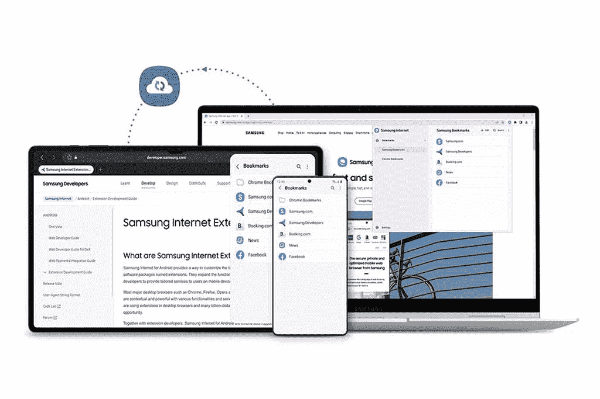
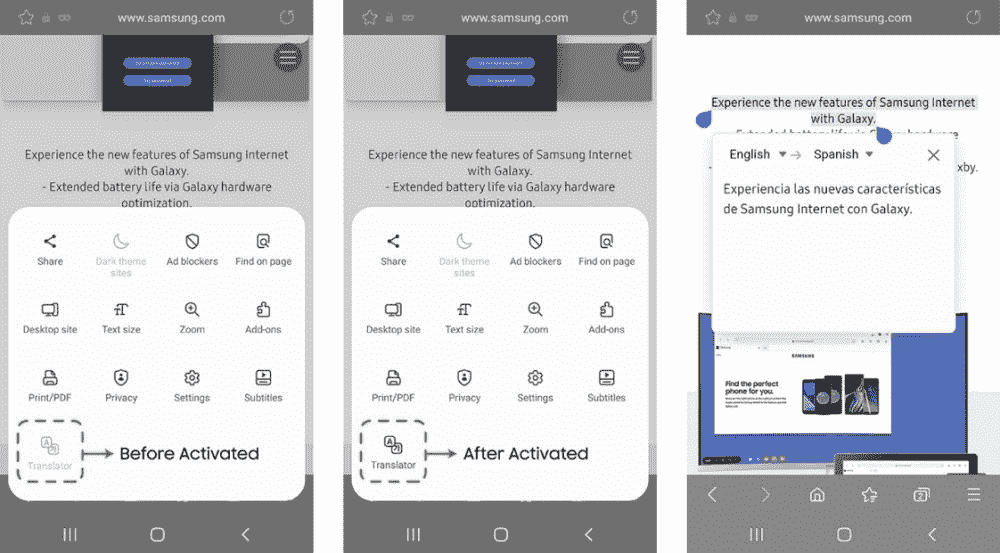

# 最新的三星互联网测试版支持 Chrome 书签同步

> 原文：<https://www.xda-developers.com/samsung-internet-sync-bookmarks-chrome/>

# 最新的三星互联网测试版支持 Chrome 书签同步

三星推出了全新的三星互联网测试版更新，支持 Chrome 书签同步，改进了隐私浏览功能等。

三星 Galaxy 设备上的默认浏览器应用 Samsung Internet 是 Android 上的最佳浏览器应用之一。它提供了一系列像 Chrome 这样的主流浏览器应用所没有的隐私功能，这使得它成为三星和非三星用户的首选。然而，它仍然缺少一些功能，这些功能阻止了热心的 Chrome 用户将其作为浏览器的选择。例如，它不允许你从桌面版本的谷歌 Chrome 同步书签。但三星正在通过最新的三星互联网测试版更新解决这一痛点。

三星今天发布了三星互联网的新测试版更新(通过 *Sammobile* )，支持桌面版 Chrome 书签同步。该功能利用了新的三星互联网 Chrome 扩展，并且可以在 Chrome 网上商店下载。您可以在 PC 上添加谷歌 Chrome 的扩展，并使用它将您的书签从 Chrome 同步到三星互联网，反之亦然。三星会将您同步的书签存储在安全的三星云存储中。

 <picture></picture> 

Google Chrome bookmark syncing.

除了 Chrome 书签同步支持，三星互联网 19.0 测试版还带来了改进的隐私浏览功能，包括智能反跟踪和增强的网络钓鱼检测，新的隐私信息功能可帮助用户快速检查他们的跟踪保护，新的广告拦截器图表可帮助用户直观显示上周每天被拦截的广告数量。此外，最新的测试版带来了秘密模式下的附加支持。这意味着用户现在应该能够在秘密模式下浏览时使用他们所有的插件。

 <picture></picture> 

Add-ons support in Secret mode.

三星互联网 19.0 测试版正在通过 Play 商店和 Galaxy 商店向用户推出。您可以通过下面提供的链接下载它。三星表示，更新应该会在 2022 年第四季度的某个时候进入稳定渠道。

* * *

**来源:** [三星编辑部](https://news.samsung.com/global/samsung-internet-19-0-beta-is-now-available)

**Via:**[Sammobile](https://www.sammobile.com/news/samsung-internet-19-0-beta-finally-brings-chrome-bookmark-syncing/)