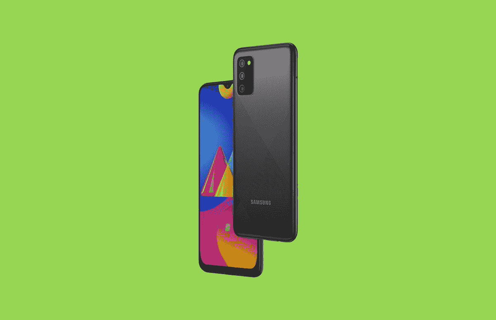

# 三星在印度推出 Galaxy M02s 经济型智能手机

> 原文：<https://www.xda-developers.com/samsung-launches-galaxy-m02s-budget-smartphone-india/>

仅仅一周后，三星将举办其 2021 年的[首次 Galaxy Unpacked 活动，并推出全新的](https://www.xda-developers.com/samsung-galaxy-s21-launch-release-date/) [Galaxy S21 系列](https://www.xda-developers.com/samsung-galaxy-s21/)。但下一代旗舰不会是这家韩国制造商今年推出的第一批设备。这是一项为处于光谱另一端的设备保留的荣誉 Galaxy M02s。

## 三星 Galaxy M02s:规格

| 

规格

 | 

三星 Galaxy M02s

 |
| --- | --- |
| **显示** | 

*   6.5 英寸高清+液晶 Infinity-V 显示屏
*   1560 x 720 像素

 |
| **SoC** |  |
| **内存&存储** | 

*   3GB/4GB 内存
*   32GB/64GB 存储
*   microSD 卡扩展槽(最高 512GB)

 |
| **电池&充电** | 

*   5000 毫安时
*   15W 快速充电

 |
| **后置摄像头** | 

*   1300 万像素主摄像头
*   2MP 微距相机
*   2MP 深度传感器

 |
| **前置摄像头** |  |
| **端口** | 

*   3.5 毫米耳机插孔
*   微型 USB 端口

 |
| **软件** | 一个基于 Android 10 的 UI |

新款三星 Galaxy M02s 是去年推出的 Galaxy M01s 的继任者，它采用了更新的设计，与最近推出的其他 Galaxy M 系列设备保持一致。它提供了适中的规格，包括骁龙 450 SoC，6.5 英寸高清+显示屏，带水滴风格的凹槽，高达 4GB 的 RAM，以及高达 64GB 的板载存储。

对于摄影，Galaxy Mo2s 在背面提供了一个三摄像头设置，包括一个 1300 万像素的主传感器，一个用于人像拍摄的 2MP 深度传感器和一个 2MP 宏观传感器。在正面，它有一个 500 万像素的自拍相机。为该设备供电的是一块 5000 毫安时的大电池，它支持 15W 快速充电。

与当今市场上的其他入门级智能手机一样，Galaxy M02s 配备了 3.5 毫米耳机插孔和微型 USB 端口。然而，与它的前辈不同，Galaxy M02s 没有指纹扫描仪。最后，在软件方面，Galaxy M02 运行三星基于 Android 10 的 One UI 皮肤。

## 定价和可用性

三星 Galaxy M02s 将在未来几天通过三星网站和亚马逊在印度销售。它将有三种颜色可供选择——黑色、蓝色和红色——3gb/32gb 版本的起价为₹8,999。4GB/64GB 型号将在₹9,999.上市

 <picture></picture> 

Samsung Galaxy M02s

##### 三星 Galaxy M02s

三星 Galaxy M02s 是一款出色的入门级智能手机，采用高通的骁龙 450 SoC，内存高达 4GB，存储容量高达 64GB。它还配备了一块 5000 毫安时的大电池和一个 6.5 英寸的高清液晶显示屏。