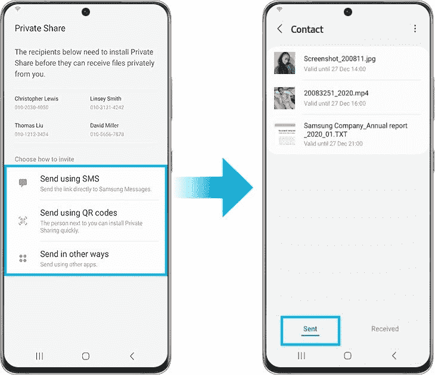

# Samsung 使使用私人共享更容易共享文件

> 原文：<https://www.xda-developers.com/samsung-makes-it-easier-to-share-files-using-private-share/>

# Samsung 使使用私人共享更容易共享文件

三星正在通过 Private Share 让分享文件变得更容易，这款应用程序在谷歌 Play 商店和 Galaxy Store 上都有。

Galaxy 生态系统通过 Galaxy 设备实现了更轻松、更舒适的工作流程，其功能包括 Buds 自动切换、应用程序连续性、键盘共享等等。其中一个功能是私人分享，在三星 Galaxy 商店和谷歌 Play 商店都有。在最新的更新(版本 1.1.20.21)中，三星为该应用程序引入了新功能，使其更容易共享文件。

Private Share 是一个隐私优先的区块链应用程序，首次与三星 Galaxy S10 上的三星区块链钱包一起推出。此次更新增加了同时共享多达 20 个文件的能力，总大小从之前的 10 个文件增加到不到 100MB，大小限制为 20MB。该更新还使从联系人应用程序中选择收件人变得更容易，并包括在共享文件时编辑文件名和编辑收件人列表。

该应用已经拥有的其他功能包括只读共享、不转发和不截图政策。私人共享应用程序可以通过短信、链接或二维码使用 Galaxy 智能手机与朋友和家人共享多个文件。最后，它还支持共享有截止日期的文件，这样收件人只能在某个日期之前访问这些文件。

[caption align="aligncenter" width="730"] Samsung Private Share[/caption]

与之前发布的三星 Quick Share 类似，该应用程序只能在 Galaxy 手机上运行，并且需要发送者和接收者都设置私人共享应用程序。在您支持的 Samsung 手机的生物识别和安全部分的高级安全功能中启用后，发送者可以请求传输文件，一旦接收者接受传输请求，将会创建一个私人通道，并以只读模式共享文件。

该更新目前正在推出，可以通过[三星 Galaxy 商店](https://galaxystore.samsung.com/prepost/000005233045?langCd=en)或谷歌 Play 商店安装在所有兼容的 Galaxy 手机上。

* * *

**Via:[SamMobile](https://www.sammobile.com/news/samsung-private-share-update-20-files/)**