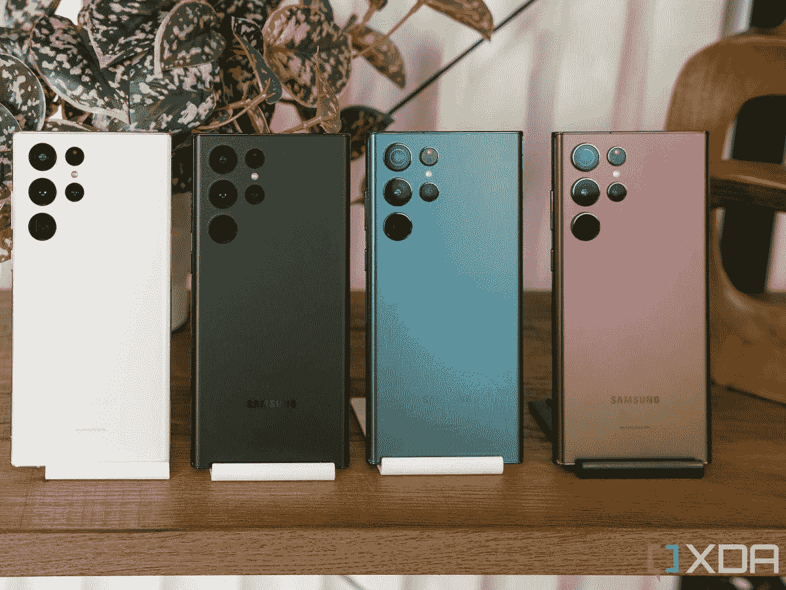
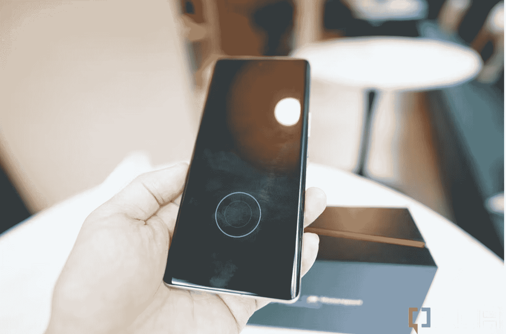

# 三星移动将无法逃脱巡航控制很长时间

> 原文：<https://www.xda-developers.com/samsung-mobile-cruise-control-competition/>

你如何看待三星作为一家手机制造商，可能取决于你是否关注美国以外的智能手机市场。如果你只关注北美，你可能不会意识到，与中国、印度、甚至英国和德国的市场相比，这个市场是非常有限的。

北美手机市场缺少什么？几乎所有的中国顶级手机品牌，如小米、Honor、Vivo 和 Oppo(尽管后者的子品牌一加在北美销售)。当涉及到使用最新的移动硬件组件时，这些品牌也恰好是挑战极限的品牌。近年来，如果你想要一部拥有最大图像传感器、最快充电速度、最新内存标准或最新有机发光二极管显示屏的[旗舰手机](https://www.xda-developers.com/best-android-phones/)，你很可能会首先在中国手机上找到它们，比它们进入三星旗舰手机早几个月甚至几年。

 <picture></picture> 

Other than the 10x zoom lens, the Galaxy S22 Ultra loses to the Vivo X90 Pro Plus in almost every hardware component that matters. 

但是因为这些中国手机没有在北美出现，普通消费者不知道像 [Vivo X90 Pro Plus](https://www.xda-developers.com/vivo-x90-pro-plus-review/) 这样的手机比 [Galaxy S22 Ultra](https://www.xda-developers.com/samsung-galaxy-s22-ultra-review/) 有更好的显示屏、摄像头和内存标准，或者最近的[中国可折叠手机](https://www.xda-developers.com/best-foldable-phones/)比[三星的 Galaxy Z Fold 4 更轻、更薄、图像传感器更大、屏幕褶皱不那么明显。](https://www.xda-developers.com/samsung-galaxy-z-fold-4-review/)

换句话说，如果你只关注北美的手机市场，你可能仍然会认为三星设备是曾经的硬件野兽。但是，如果你关注整个智能手机市场，尤其是如果你有机会接触中国的旗舰手机，那么你就会知道，如今最好的移动硬件通常出现在小米或 Vivo 设备中。

这是最致命的部分:三星手机硬件低劣几乎肯定是一个商业决定，而不是缺乏技术能力或渠道。

## 为什么三星缺乏？

 <picture></picture> 

The Xiaomi Mix Fold 2 (right) is so, so much thinner than the Galaxy Z Fold 4. 

Galaxy Z Fold 4(左)和小米 Mix Fold 2(右)。

我相信这是因为两个原因。据韩国新闻媒体 *[Hankyung](https://www.hankyung.com/it/article/2022121591901) 报道，三星在上个月的一次内部会议上几乎证实了这一点。*据报道，该公司首席执行官韩正熙告诉其移动团队要更具竞争力，并且“不要陷入成本削减之中。”

我知道这一点的第二个原因是，小米和 Vivo 手机使用的那些前沿组件，很多都直接来自三星。例如，Vivo X90 Pro Plus 使用了来自三星显示器的最新 2K E6 AMOLED 显示器和三星半导体制造的 UFS 4.0 存储。

虽然即将推出的 Galaxy S23 系列可能会采用 UFS 4.0，但即使是最高端的型号也不会使用三星自己的 E6 面板，至少根据 Twitter 上知名泄密者 Ice Universe 的说法。

请记住:三星的移动部门不会使用另一个三星部门制造的最好的移动显示技术，可能是出于成本考虑。这不是唯一的例子。三星还选择使用高通较老的超声波技术，而不是高级的 3D Sonic Max 解决方案(高通自称是其“最好和最大的指纹扫描仪”))自 2021 年以来，我一直在 Vivo 设备上使用 3D Sonic Max 扫描仪，它们比典型的高通超声波扫描仪快得多，扫描范围更广。

## 这就是为什么竞争是好事，垄断是坏事

​​​​​​

 <picture></picture> 

Qualcomm's 3D Sonic Max fingerprint scanner (seen here in the iQoo 9 Pro) is faster and has a larger scanning area than Qualcomm's regular ultrasonic scanner, which can be seen in Samsung's flagship phones. 

那么，为什么三星的移动部门一直在巡航控制上运营呢？我有根据的猜测是，三星在其最大的两个市场(北美和韩国)没有(或曾经没有)有意义的安卓竞争。我还认为，美国的制裁削弱了华为快速增长的移动业务(据报道，华为正在整个欧洲蚕食三星的馅饼，并有望超越三星成为市场份额全球第一的手机品牌)，这给了三星一种安全感，并让它得以自满。

 <picture></picture> 

A Samsung foldable display crease (right) next to a Chinese foldable with a far less prominent crease. 

在可折叠空间中，这一点似乎尤其正确。令我完全困惑的是，即使是四代产品，三星的可折叠产品仍然无法折叠平整而不留下缺口或深深的折痕，而中国的可折叠产品在三年前就解决了这个问题。这是因为能力不足还是尝试不够？

## 三星不应该把它的主导地位视为理所当然

对消费者来说，有好消息传来，即使是那些不太活跃的北美手机市场。我相信可信的竞争即将到来，三星知道这一点，因此将把脚放回油门踏板。

根据最近的一份美国智能手机报告，包括销售数据和研究公司 Wave7 发布的运营商调查，[谷歌 Pixel 7](https://www.xda-developers.com/google-pixel-7-review/) 系列的需求比前一年更高。有趣的是，在过去的几个月里，我在现实世界中看到的 Pixel 手机比过去几年的总和还要多。显然，增加营销预算和硬件飞跃对谷歌来说是有回报的。当然，Pixel 的整体市场份额在赶上三星之前还有很长的路要走，但谷歌是一个无处不在的美国科技巨头——如果 Pixel 在北美市场成为一个突出的主流玩家，这几乎是时*的问题，而不是*的问题。**

三星最好小心点，因为它在移动领域，甚至是安卓领域的头把交椅已经不像几年前那么稳固了。

在北美以外，特别是在亚洲，Android 手机市场一如既往地火爆，小米和 Vivo 不断挑战硬件极限，这一点没有被手机粉丝们忽视。无论是 XDA 的流量、我在 Twitter 上的参与度，还是 YouTube 上的视频浏览量，我都看到人们对小米或 Vivo 最新旗舰手机的兴趣明显上升。然后，房间里有一头最大的大象:苹果正在逐渐赢得安卓用户。原因有很多，可以讨论，但那是另一天的社论。

因此，如果你一直保持得分，这意味着三星的手机将在北美面临来自谷歌像素的日益激烈的竞争，以及来自其他地方的中国品牌的竞争。然后，苹果笼罩着一切，通过精心设计的锁定方法(如 iMessage)或有效的营销活动(如“救命”苹果手表)赢得了普通消费者的支持。

无论如何，三星最好小心点，因为它在移动领域、[可折叠领域、](https://www.xda-developers.com/samsung-needs-global-foldable-competition-editorial/)甚至安卓领域的头把交椅已经不像几年前那么稳固了。

三星 Galaxy S22 Ultra 是 2022 年市场上最完整的安卓智能手机之一，提供了最好的屏幕，最多功能的相机系统，安卓中最好的 SoC，以及手写笔。

 <picture></picture> 

Google Pixel 7 Pro

Pixel 7 Pro 是谷歌有史以来最好的手机，拥有精致、优质的设计和谷歌第二代硅芯片，以及一如既往的出色摄像头。