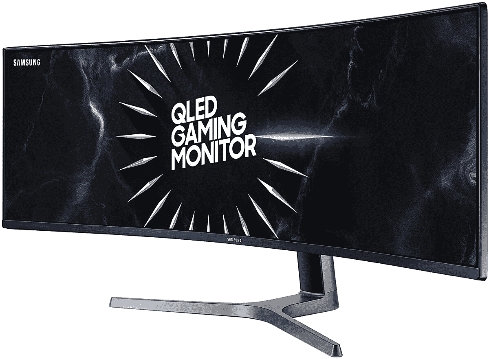

# 呜！三星显示器大减价让你在超宽显示器上省下一大笔钱

> 原文：<https://www.xda-developers.com/samsung-monitor-refurbished-woot/>

寻找新显示器？不要等到黑色星期五，因为这个普通的星期五，你可以去 Woot！为了他们的三星显示器销售。直到一天结束，你可以选择各种翻新显示器来装饰你的电脑。

你可能会拒绝翻新显示器的想法，但不要！这些显示器保证工作正常，几乎像新的一样。他们也是要么 Woot 撑腰！90 天保修或制造商保修，所以如果你碰巧得到一台显示器，几个星期后就坏了，你可以更换它或获得退款，没有痛苦。

销售中真正突出的是 49 英寸 [CRG9 超宽曲面显示器](https://www.anrdoezrs.net/links/100122946/type/dlg/sid/UUxdaUeUpU30352/https://www.woot.com/offers/samsung-49-crg9-series-gaming-monitor-1)，售价 900 美元。这款显示器采用 AMD 的镭龙自由同步技术，具有流畅游戏体验所需的 120Hz 刷新率。这不是 4K 显示器，但有了三星的 QHD 显示器，你不会介意。

也有更便宜的选择。[三星的 24 英寸曲面 LED 游戏显示器](https://www.anrdoezrs.net/links/100122946/type/dlg/sid/UUxdaUeUpU30352/https://www.woot.com/offers/samsung-24-curved-led-gaming-monitor-1)售价仅为 100 美元，在保持曲面和良好规格的同时，提供了更标准的体验。这真的取决于你在寻找什么，所以一定要看看所有在售的产品！

一如既往，如果你是亚马逊的 Prime 客户，你将获得 Woot 的免费送货服务！

 <picture></picture> 

Samsung Monitor Sale, Today Only

##### 三星奥德赛 G7

今天，Woot！正在对翻新的三星显示器进行大减价。从像 Odyssey G7 这样的简单显示器到 49 英寸 CRG9 超宽曲面显示器，这里有适合每个人的东西。

这次销售只持续到今天结束，或者直到显示器卖完为止。如果看到喜欢的东西，一定要趁早买下来！