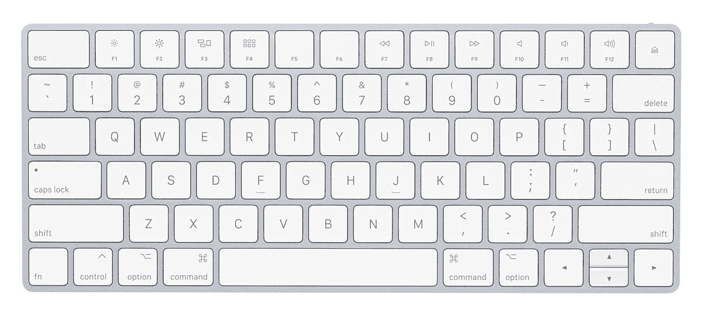
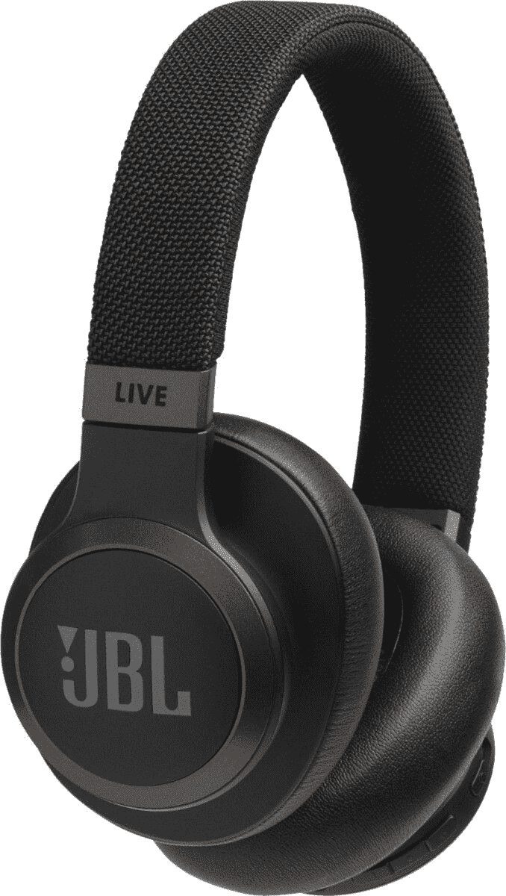

# Woot 的每日交易是你不想错过的三星显示器折扣

> 原文：<https://www.xda-developers.com/samsung-monitor-woot/>

呜！有时会有大减价。当然，并不是每个清单都是赢家，但当他们有值得挑选的东西时，你知道你得到了好东西。一个 Woot！的每日交易是相当不错的今天与一个强大的三星显示器！我的意思是它不是[三星 Galaxy S21](https://www.xda-developers.com/samsung-galaxy-s21/) ，但事实证明，[也有三星最新旗舰](https://www.xda-developers.com/samsung-galazy-s21-flat-deal/)的销售。

啰嗦的三星 SD850 32 英寸 WQHD (2560x1440) 16:9 纵横比的 LED-LitMonitor 是 Woot 的日常交易之一，只需 216 美元，你就可以买到这款翻新的三星显示器。这是*而不是*4K 显示器，但是除非你有一台可以正常运行 4K 的游戏台式机，否则你不需要一台昂贵的 4K 显示器。相反，您可以选择 SD580，它在 WQHD 方面表现出色。这款三星显示器符合 sRGB 色彩标准，因此内容创建者可以在工作时确保其色彩准确无误！

此外，SD850 专为多屏幕和画中画功能而设计，因此也非常适合多任务处理。基本上，这是一个非常非常好的非 4K 方面的显示器。亚马逊 Prime 提供免费送货和 90 天保修，涵盖任何问题，这是一个伟大的购买！不过，你得抓紧时间，因为只有今天才有！

 <picture></picture> 

Samsung SD850 32-inch WQHD monitor

##### 三星 SD850 32 英寸 WQHD 显示器

如果你的电脑不支持，为什么要放弃数百台 4K 显示器？选择 SD850，您将获得符合 sRGB 标准的高质量高清图像。

当然，Woot！不仅仅是日常交易。还有一些不错的为期一周的交易，你也会想看看的！它们可能不是三星显示器，但它们相当不错。

就拿苹果魔法键盘来说吧！这是苹果产品，所以它们很贵。但是如果你对翻新的型号没问题，你可以花 50 美元买一个。或者，你可以选择 JBL Live 650BTNC 耳机，它在亚马逊上有一些很好的评论。这也是 JBL，所以你知道你会得到质量。它们只需 120 美元，比你在百思买[能买到的还要多 10 美元。](https://shop-links.co/1733044493429677497?u1=7a1b1c8b-9b24-4e98-9183-6b41b98b1a0c)

 <picture></picture> 

Apple Magic Keyboard

 <picture></picture> 

JBL Live 650BTNC Headphones

 <picture></picture> 

Refurbished Apple MacBook Sale

##### 三星 SD850 32 英寸 WQHD 显示器

你从 Woot 那里得到了什么！你喜欢的？请在评论中告诉我们！