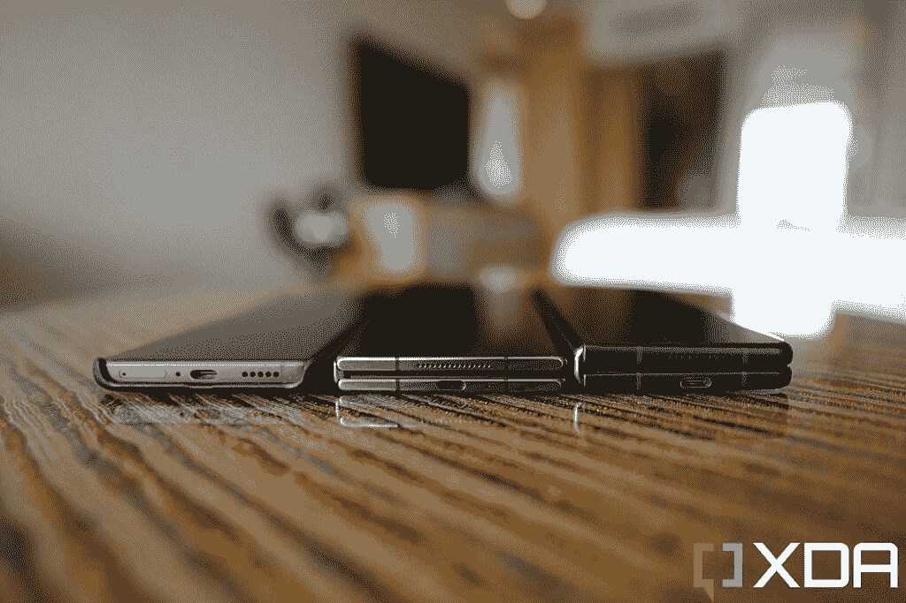
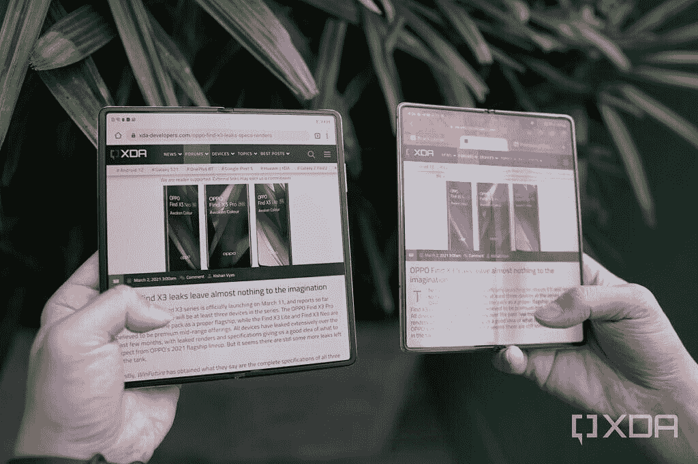
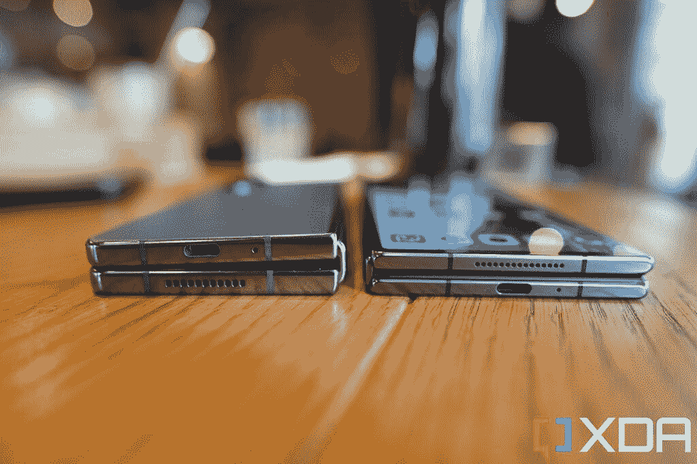

# 为了消费者的利益，三星需要可折叠领域的全球竞争

> 原文：<https://www.xda-developers.com/samsung-needs-global-foldable-competition-editorial/>

三星 Galaxy Z Fold 4 是一款出色的新型可折叠手机，它提供了三星承诺的可折叠手机所能提供的一切:它可以在飞行中从手机转变为迷你平板电脑，让用户可以做和看更多的事情。对于像我这样总是在旅途中工作的人来说，拥有一个更大的屏幕来阅读新闻稿，或者由于更大的键盘而更舒适更快速地打字，这是改变游戏规则的能力。Galaxy Z Fold 4 让我的工作生活变得更加轻松。

但我可以说，关于 Galaxy Z Fold 2 和 Fold 3 也是如此；Fold 4 并没有提升多少体验。这并不是说 Fold 4 没有 Fold 3 好。你得到了一年一度的高通处理器提升。三星将 Fold 3 笨重的铰链削去了几毫米，并将那部分空间留给了翻盖显示屏，所以你可以在略大的屏幕上获得更舒适的手感。Fold 4 的相机得到了升级，但它们仍然没有达到任何顶级旗舰相机系统在任何[最佳智能手机相机中的水平。](https://www.xda-developers.com/best-smartphone-cameras/)

 <picture></picture> 

The Galaxy Z Fold 1 to 4, from left to right.

与此同时，我们大多数人对最初的 Galaxy Fold 感到惋惜的缺点，例如通过触摸可以很容易地看到和感觉到的粗糙的显示屏折痕，或者手机无法完全折叠，使设备变得不必要的厚，在最新的 Galaxy Z Fold 4 中仍然存在。事实上，我认为大多数普通消费者甚至无法区分 Fold 3 和 Fold 4，如果他们并排看到它们的话——这就是事情有多么小的变化。

对于更随意的智能手机粉丝来说，可能很自然地认为可折叠手机的创新已经像平板手机一样停滞不前了。但事实并非如此，因为在可折叠空间竞争激烈的中国，每一款新的可折叠产品都至少引入了一项以前从未见过的硬件改进。摩托罗拉在 2020 年发布的 Razr 已经解决了显示屏折痕问题和折叠间隙问题。华为设法在[华为 Mate X2](https://www.xda-developers.com/huawei-mate-x2-review/) 中塞进了一个旗舰相机系统，配有一个大型传感器主相机和一个 10 倍潜望镜变焦镜头。Vivo 的 X Fold 还配备了一个潜望镜变焦镜头，以及不是一个而是两个显示指纹传感器。小米的[刚刚推出的 Mix Fold 2](https://www.xda-developers.com/xiaomi-mix-fold-2-hands-on/) 将设备的整体厚度缩小到了未知的领域。这是目前市场上最薄最轻的大型可折叠手机。

 <picture></picture> 

The Xiaomi Mix Fold 2 (middle) is over 4mm thinner than Samsung's Galaxy Z Fold 3 or 4 (right).

没有糖衣:如果你纯粹从硬件的角度来看，Galaxy Z Fold 4 与市场上其他类似的大型可折叠手机相比，看起来和感觉上都有点过时。这些其他可折叠产品在中国的零售价格也比三星的 Fold 系列低得多。

 <picture></picture> 

The Galaxy Z Fold series' crease is very visible as soon as you look at the screen at an off-angle.

但问题是:这些可折叠产品在中国以外几乎都没有(华为 Mate Xs 2 在技术上是有，但没有谷歌移动服务，很难销售)。除了一个国家，三星基本上垄断了全球的可折叠市场。

当品牌竞争时，我们作为消费者是赢家

这对三星来说显然是个好消息，但对消费者和可折叠发烧友来说却是个坏消息。当品牌竞争时，我们消费者是赢家。现在，不管出于什么原因，这些制造可折叠硬件的中国品牌都没有试图在全球范围内与三星竞争。

 <picture></picture> 

Xiaomi's Mix Fold 2 is much thinner and folds completely flat compared to the Z Fold 4.

想象一下，如果疯狂轻薄的小米 Mix Fold 2，或带有实际旗舰相机系统的 Vivo X Fold 在亚洲和欧洲都可以买到？想象一下，如果美国、英国、欧盟、印度和韩国的消费者走进一家手机商店，在一款有明显折痕的 Galaxy Z Fold 4 旁边看到 Oppo Find N 几乎没有折痕的显示屏，会是什么样子？这将给三星带来压力，要么解决那些显然可以解决的工程问题，要么至少降低其可折叠手机的价格。它们会导致公司做出反应，让其产品重新回到首位，无论是以更好的产品还是更好的价值主张的形式。

 <picture></picture> 

Oppo's display crease is very faint and hard to see and feel. Samsung's crease can be easily visible at any off-angle, and can be felt at all times.

需要明确的是，Galaxy Z Fold 4 仍然是[整体上最好的大屏幕可折叠产品](https://www.xda-developers.com/best-foldable-phones/)，这是因为一些小东西，如软件，可以更好地优化屏幕尺寸，或者有一个官方的防水评级，可以让你放心。我相信一些读者也会指出 S-Pen 支持(尽管我个人并不关心它，因为它需要单独购买，并且不能存储在手机内)。

三星可以承担得起可折叠硬件创新的一点费用，因为它知道世界上大多数人没有其他可折叠选项

但很明显，在 Galaxy Z Fold 3 和 Galaxy Z Fold 4 上，三星没有尽可能地推动创新。如果摩托罗拉可以在 2020 年解决压痕问题，如果华为在 18 个月前成功地将 10 倍潜望镜变焦镜头放入可折叠手机，如果 Vivo 可以在可折叠手机中使用两个超声波显示指纹扫描仪，那么三星工程师不可能做不到这些事情。他们选择不这样做。我猜，原因是因为三星希望增加其可折叠产品的主流吸引力，这要求 Fold 系列减轻重量，并满足更低的价位。正如我在[的另一篇社论](https://www.xda-developers.com/samsung-galaxy-z-fold-ultra-editorial/)中所写的，对三星来说，这是一个明智的商业举措——一个更轻、价格更低的可折叠手机比一个采用最新尖端技术的超级强大的手机更具主流吸引力。三星可以优先吸引大众，而不是追逐创新，因为它知道世界上大多数人没有其他可折叠的选择。

垄断主导的市场对消费者来说不是一个好市场——所以对于我们这些可折叠粉丝和技术极客来说，我们只能希望谷歌和苹果早点推出他们的可折叠产品，或者小米、Oppo、Vivo 和 Honor 等中国品牌最终不仅仅局限于他们的祖国。也许当这种情况最终发生时，当 Galaxy Z Fold 系列与更引人注目的硬件竞争时，三星终于不会退缩，给我们一些人一直渴望的 Galaxy Z Fold Ultra。

 <picture></picture> 

Samsung Galaxy Z Flip 4

三星 Galaxy Z Flip 4 相对实惠，但它的功能不如 Galaxy Z Fold 4 丰富。

 <picture></picture> 

Samsung Galaxy Z Fold 4

三星 Galaxy Z Fold 4 是终极生产力发电站，为高级用户提供更全面的体验。