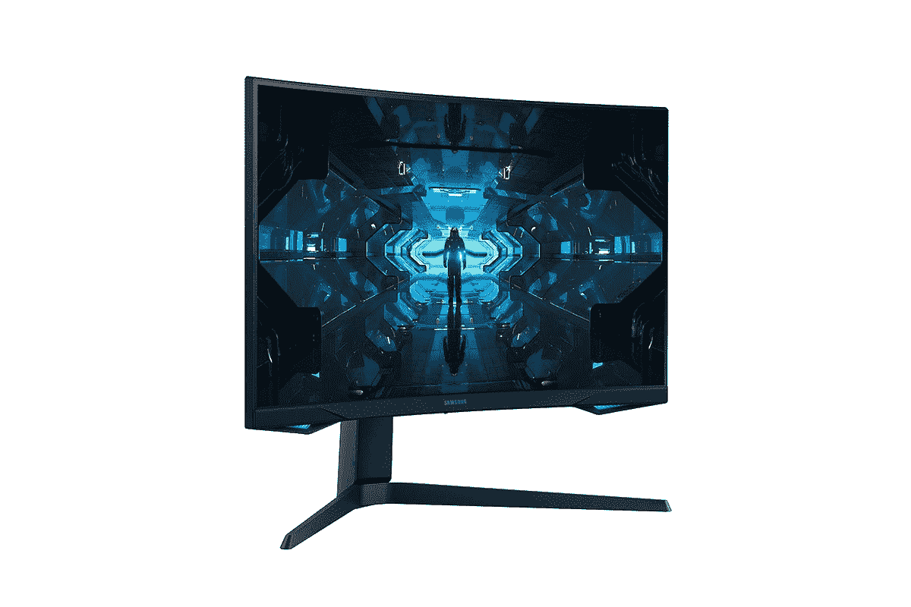

# 三星 Odyssey G7、G5、G3 高刷新率游戏显示器上市

> 原文：<https://www.xda-developers.com/samsung-odyssey-g7-g5-g3-2021-launch/>

三星的 Odyssey 显示器系列广受好评，其选项被推荐为[最佳显示器](https://www.xda-developers.com/best-monitors/)。2020 年，三星的 Odyssey G7 和 G9 凭借其曲面显示屏和其他功能抢尽了风头。对于 2021 年的更新，三星正在通过新的奥德赛 G7、奥德赛 G5 和奥德赛 G3 来拉平曲线。

## 三星奥德赛 2021 显示器:规格

| 

规格

 | 

G30A

 | 

G50A

 | 

G70A

 |
| --- | --- | --- | --- |
| 屏幕大小 |  | 27" | 28" |
| 亮度(典型) | 250 cd/sq。m | 350 cd/sq。m | 300 cd/sq。m |
| 直接热轧制 | - | HDR10 | VESA 显示器 HDR 400 |
| 解决 | 1920 x 1080 | 2560 x 1440 | 3840 x 2160 |
| 响应时间 | 1 毫秒(MPRT) | 1 毫秒(GTG) | 1 毫秒(GTG) |
| 帧频 | 144 赫兹 | 165 赫兹 | 144 赫兹 |
| 和睦相处 | 免费同步高级版 |  | 

*   免费同步高级专业版
*   g 同步

 |
| 其他功能 | 

*   护眼模式
*   无闪烁
*   黑色均衡器
*   刷新率优化器

 | 

*   护眼模式
*   无闪烁
*   黑色均衡器
*   刷新率优化器
*   低输入延迟模式
*   UX 超级竞技场博彩公司
*   超宽游戏视图
*   CoreSync 照明

 | 

*   护眼模式
*   无闪烁
*   黑色均衡器
*   刷新率优化器
*   低输入延迟模式
*   UX 超级竞技场博彩公司
*   超宽游戏视图
*   CoreSync 照明
*   自动源开关+

 |
| 港口 | 

*   显示端口 1.2
*   HDMI 1.4

 | 

*   显示端口 1.2
*   HDMI 2.0

 | 

*   显示端口 1.4
*   HDMI 2.1
*   USB 3.0

 |
| 壁挂支架 | 

*   高度可调支架
*   100 x 100 壁挂支架

 | 

*   高度可调支架
*   100 x 100 壁挂支架

 | 

*   高度可调支架
*   100 x 100 壁挂支架

 |

### 奥德赛 G7 28”(型号:G70A)

奥德赛 G7 是一款 4K 显示器，拥有良好的 144Hz 刷新率。2021 年的 G7 采用平板 IPS 显示屏，而不是我们去年看到的曲面 QLED。其他亮点功能包括 178 度视角、HDR 400、1 毫秒响应时间、NVIDIA G-Sync 和 AMD FreeSync Premium Pro 兼容性等。板载 HDMI 2.1，使这款显示器成为 Xbox Series X 和 PlayStation 5 进行 4K120 游戏的绝佳选择。

显示器还具有 Auto Source Switch+等功能，可以更轻松、更快速地识别和切换活动输入。为了使多任务处理更容易，G7 还提供了像逐画(PBP)和画中画(PIP)这样的工具。简单的设置框允许通过优化的窗口分配来管理多个屏幕，以实现更好的多任务处理。

该显示器还有一个高度可调的支架，允许用户倾斜、旋转和转动显示器。

### 奥德赛 G5 27”(型号:G50A)

奥德赛 G5 将分辨率降至 QHD，但将刷新率提升至 165 赫兹。承诺 1 毫秒的响应时间，以及 HDR 10，G-Sync 和 FreeSync 高级兼容性。该显示器还有一个高度可调的支架，允许用户倾斜、旋转和转动显示器。这款机型还拥有 G9 2021 拥有的多任务处理功能。

### 奥德赛 G3 27 英寸和 24 英寸(型号:G30A)

Odyssey G3 是该系列中的经济型显示器，具有 FHD 分辨率，但具有 144Hz 的刷新率和 1 毫秒的响应时间。该显示器具有 AMD FreeSync Premium 兼容性，还配有高度可调的支架，可倾斜、侧转和旋转。

## 定价和可用性

三星[尚未透露](https://news.samsung.com/global/samsung-unveils-its-expanded-2021-odyssey-gaming-monitor-lineup)这款显示器的国际定价和供货情况。但是人们可以预期这些显示器将会进入以前的市场。

同时，你也可以考虑选择 2020 年的老款。

 <picture></picture> 

Samsung Odyssey G7 27 (2020)

##### 三星奥德赛 G7

三星 Odyssey G7 27 英寸显示器是寻求可靠一体化解决方案的客户的推荐游戏显示器。