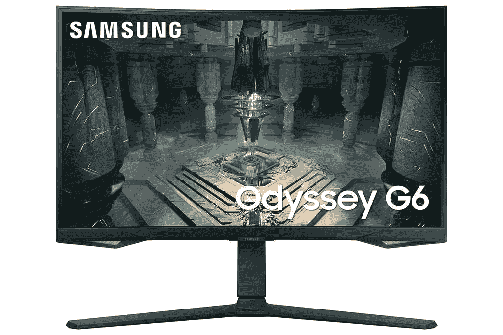
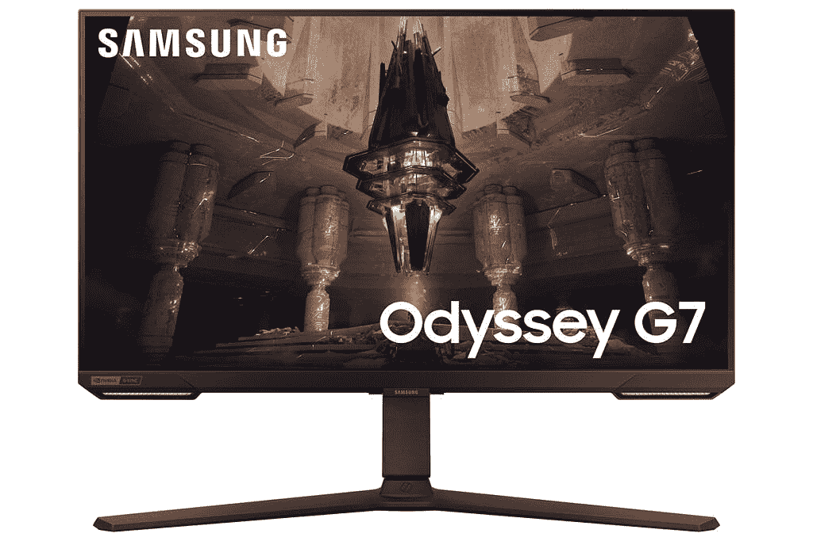

# 三星在 Gamescom 展示奥德赛 G70B 和奥德赛 G65B

> 原文：<https://www.xda-developers.com/samsung-odyssey-g70b-g65b-announced/>

在今年早些时候的 CES 上展示了旗舰产品 Odyssey Ark 游戏显示器之后，三星[最近开放了 55 英寸 Quantum Matrix 迷你 LED 显示器的预购](https://www.xda-developers.com/samsung-odyssey-ark-pre-order/)。虽然 4K 165Hz 游戏显示器尚未上市，但三星已经在 Gamescom 2022 上展示了两款新的奥德赛显示器，奥德赛 G70B 和奥德赛 G65B。

像旗舰奥德赛方舟一样，新的奥德赛 G70B 和奥德赛 G65B 支持三星游戏中心。通过 Samsung Gaming Hub，用户可以访问多种游戏流媒体服务，包括 Xbox Cloud Gaming、Nvidia GeForce Now、Google Stadia、Amazon Luna 等。

这些显示器还支持三星的智能平台，这使它们成为 Odyssey 系列中第一个同时采用三星智能平台和嵌入式三星游戏中心的型号。得益于智能平台支持，Odyssey G70B 和 Odyssey G65B 都提供了智能功能，包括无需电脑即可创建家庭办公环境的能力。

 <picture></picture> 

Samsung Odyssey G65B

这些显示器还提供与 Windows PCs 和 MAC 的无线连接，三星 DeX 支持，镜像智能手机屏幕的能力，以及访问微软 365 云服务。此外，用户还可以在显示器上观看他们喜欢的网飞、亚马逊 Prime 和其他 OTT 服务提供商的节目。但这还不是全部。奥德赛 G70B 和奥德赛 G65B 甚至包括一些像奥德赛方舟一样的物联网功能，具有高灵敏度远场麦克风，可以帮助用户使用 Bixby 和 Alexa 控制他们的设备。

 <picture></picture> 

Samsung Odyssey G70B

除了智能功能，奥德赛 G70B 将有两种屏幕尺寸——28 英寸和 32 英寸。这两种型号都将采用平板 UHD IPS 面板，峰值刷新率为 144Hz，GtG 响应时间为 1 毫秒，同时支持 Nvidia G-Sync 和 AMD FreeSync Premium Pro。另一方面，奥德赛 G65B 将有 27 英寸和 32 英寸两种型号，配备 QHD 1000R 曲面显示器，240Hz 刷新率，1 毫秒 GtG 响应时间，并支持 AMD FreeSync Premium Pro。

奥德赛 G70B 和奥德赛 G65B 将于 2022 年第四季度开始在全球销售。三星将在发布时分享所有型号的定价细节。

* * *

**来源:** [三星编辑部](https://news.samsung.com/global/samsung-electronics-showcases-odyssey-lineup-at-gamescom-2022-offering-ultimate-entertainment-experiences?utm_source=feedly&utm_medium=direct)