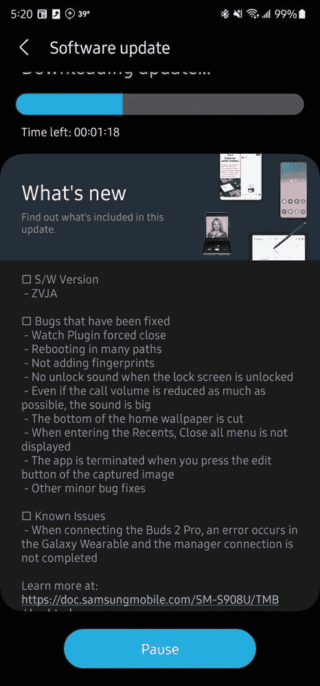

# Galaxy Z Fold 4 和 Galaxy Z Flip 4 现在可以使用一个 UI 5 测试版

> 原文：<https://www.xda-developers.com/samsung-one-ui-5-beta-galaxy-z-fold-4-galaxy-z-flip-4/>

在向一系列 Galaxy S、Note 和 A 系列设备发布 One UI 5 beta 版本后，三星上周将 One UI 5 beta 计划扩展到了其可折叠产品。该公司从去年的 [Galaxy Z Fold 3](https://www.xda-developers.com/galaxy-z-fold-3-one-ui-5-beta/) 和 [Galaxy Z Flip 3](https://www.xda-developers.com/one-ui-5-beta-galaxy-z-flip-3-note-20-series/) 开始，现在它正在将该计划扩展到其最新的旗舰可折叠产品——[Galaxy Z Fold 4](https://www.xda-developers.com/samsung-galaxy-z-fold-4-review/)和 [Galaxy Z Flip 4](https://www.xda-developers.com/samsung-galaxy-z-flip-4-review/) 。

根据三星社区论坛上最近的帖子，Galaxy Z Fold 4 和 Galaxy Z Flip 4 的 One UI 5 测试版计划正在韩国和欧洲推出，第一次测试版更新已经向用户推出。如果你想尝试一下，你可以通过进入设备上的三星成员应用程序，点击 One UI 5 测试版公告横幅，并填写应用程序来注册测试计划。一旦三星批准你的申请，你应该会通过 OTA 更新收到第一个 UI 5 测试版。

 <picture></picture> 

Credit: u/cooldude9112001 on Reddit

除了 Galaxy Z Fold 4 和 Galaxy Z Flip 4 的第一个 UI 5 测试版，三星还推出了 Galaxy S22 系列的第五个测试版。此次更新(固件版本 **ZVJA** )为该设备带来了几个 bug 修复。查看下面附上的截图，了解所有的变化。

 <picture></picture> 

Credit: Ryan891 on the Samsung Community forums

有关 One UI 5 及其带来的所有新功能的更多信息，请前往我们的 Galaxy S22 系列第一个 One UI 5 测试版的动手预览。此外，请查看三星在 SDC 2022 上强调的软件更新中一些最值得注意的变化。

*你的 Galaxy Z Fold 4 或 Galaxy Z Flip 4 收到第一个 UI 5 beta build 了吗？您喜欢或不喜欢更新的哪些方面？请在下面的评论区告诉我们。*

* * *

**来源:**三星社区论坛( [1](https://r1.community.samsung.com/t5/%EA%B0%A4%EB%9F%AD%EC%8B%9C-%ED%8F%B4%EB%8D%94%EB%B8%94/%EA%B0%A4%EB%9F%AD%EC%8B%9C-z-fold4-one-ui-5-%EB%B2%A0%ED%83%80-%ED%94%84%EB%A1%9C%EA%B7%B8%EB%9E%A8-%EC%98%A4%ED%94%88/td-p/19176582) 、 [2](https://r1.community.samsung.com/t5/%EA%B0%A4%EB%9F%AD%EC%8B%9C-%ED%8F%B4%EB%8D%94%EB%B8%94/%EA%B0%A4%EB%9F%AD%EC%8B%9C-z-flip4-one-ui-5-%EB%B2%A0%ED%83%80-%ED%94%84%EB%A1%9C%EA%B7%B8%EB%9E%A8-%EC%98%A4%ED%94%88/td-p/19176574) 、 [3](https://eu.community.samsung.com/t5/galaxy-z-fold-z-flip/beta/m-p/6236413) 、 [4](https://us.community.samsung.com/t5/Discussions/Beta-5-is-here/td-p/2414020) )

**Via:** [Reddit](https://www.reddit.com/r/GalaxyFold/comments/y71z92/z_fold_4_beta_out_now/) ， [XDA 论坛](https://forum.xda-developers.com/t/beta-one-ui-5-enrolling-now-uk.4507193/post-87592225)