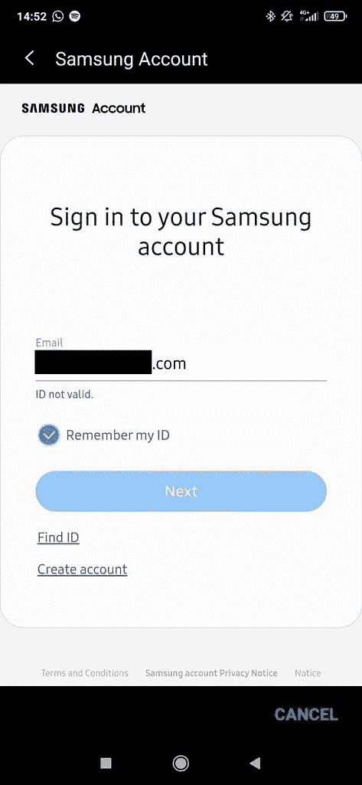

# Samsung Pay 不再适用于非三星手机

> 原文：<https://www.xda-developers.com/samsung-pay-not-working-non-samsung-phones/>

最近来自 Samsung Pay 用户的报告显示，该应用程序不再适用于非三星设备。不满的用户声称，直到几周前，该应用程序在非三星设备上运行良好，但现在在非三星设备上登录时显示“ID 无效”错误。

虽然三星有限制其设备某些功能的历史，但 Samsung Pay 是少数例外之一。支付应用程序支持非三星设备，它甚至允许 Galaxy Watch 4 用户在连接到非三星手机时进行支付。遗憾的是，情况似乎不再是这样了。

根据最近在 *Reddit* 和*三星社区*论坛(通过 *SamMobile* )上的报道，无法使用 Galaxy 智能手机的 Samsung Pay 用户不能再登录该应用程序。受影响的用户表示，该应用程序现在会返回前面提到的“ID 无效”错误。据报道，三星的客户支持部门在回应询问时指出，Samsung Pay 将不再适用于非三星设备。但这似乎不太可能，因为三星会在做出如此巨大的改变之前发布公告。

 <picture></picture> 

Screenshot: [Fatih](https://eu.community.samsung.com/t5/user/viewprofilepage/user-id/29067366) on Samsung Community

有趣的是，尽管受影响的用户不再能够登录 Samsung Pay，但他们仍然可以使用相同的 ID 登录他们的 Samsung 帐户。这让我们相信这种变化可能是一个错误的结果，但是我们没有任何证据来支持这种说法。我们预计三星将在未来几天就此问题发表声明，我们会尽快通知您。

这一变化可能是最近推出的三星钱包的结果，这是一款全面的数字钱包应用程序，让 Galaxy 用户可以在一个地方访问 Samsung Pay 和 Samsung Pass 功能。与 Samsung Pay 不同，三星钱包应用程序只适用于 Galaxy 智能手机。

*您能否在非三星智能手机上登录 Samsung Pay 帐户？这款应用能让你使用连接的 Galaxy Watch 4 进行支付吗？请在下面的评论区告诉我们。*

* * *

**来源:** [Reddit](https://www.reddit.com/r/SamsungPay/comments/v95jrs/id_not_valid_on_galaxy_watch_active_plugin/) ，[三星社区](https://eu.community.samsung.com/t5/wearables/samsung-pay-says-my-id-is-invalid-but-when-i-login-into-samsung/td-p/5527802/page/10?awc=8330_1655710373_2a02aece5e297e90e5405206f4b85458&cid=nl_pd_affiliate_awin_MPN_none_awin_multiple_none_digidip%20EU%20-%20Content%20and%20Incentivized_269979&dclid=CKqP1-XBu_gCFenUcwEd4gQOgA)

**Via:**[SamMobile](https://www.sammobile.com/news/samsung-pay-stops-working-non-samsung-phones/)