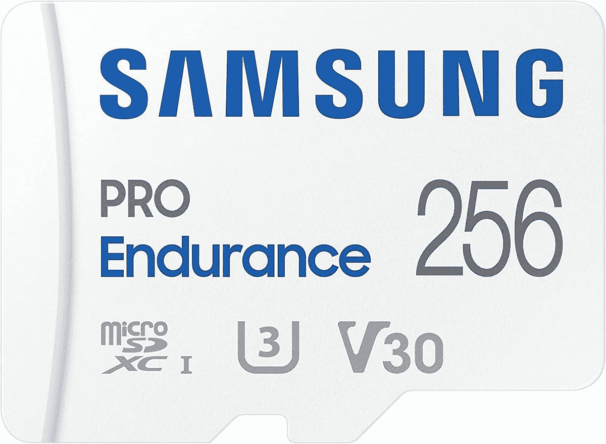

# 三星推出寿命长达 16 年的 Pro Endurance microSD 卡

> 原文：<https://www.xda-developers.com/samsung-pro-endurance-microsd-card-last-16-years/>

三星今天将推出一款新的 microSD 卡，即三星 Pro Endurance。顾名思义，这种新的 microSD 卡完全是关于耐用性和可靠性的，它的目标是经常使用的用例，如安全摄像头。这是继上周发布的 T7 Shield SSD 之后，三星最近推出的第二款注重耐用性的笔记本电脑。

因为像安全摄像头这样的设备会不断地向卡中写入数据，所以拥有一个耐用的卡非常重要，这样你就不必每隔几年就更换它。三星声称，Pro Endurance microSD 卡可以承受长达 16 年的连续录制时间，因此您永远不必担心丢失相机中的镜头。加起来大约是 140，160 个小时，这是一个很大的数字。相比之下，上一代产品的寿命高达 43，480 小时，相当于 5 年左右。

当涉及到外部因素时，它也很耐用。三星正在宣传“六防”耐用性——除了防水、防磁铁、防 X 射线和防极端温度之外，新的三星 Pro Endurance microSD 卡还可以抗磨损和跌落，因此它应该能够在几乎任何你合理希望使用它的条件下生存。

虽然速度不是这张卡的重点，但它也包括一些在这方面的改进。新型号的写入速度更快，从上一代的 30MB/s 提高到 40MB/s。这也意味着它拥有 10 级评级，以及 UHS-III 和 V30 视频速度分类，它可以处理全高清或 4K 视频录制。这一代产品的另一个改进是增加了容量，现在高达 256GB，减少了频繁卸载或删除卡上数据的需要。

三星 Pro Endurance microSD 卡今天上市，32GB 型号的起价为 10.99 美元，256GB 版本的价格将升至 54.99 美元。奇怪的是，它似乎还不能直接从三星获得，但最大的型号可以从下面的亚马逊获得。

 <picture></picture> 

Samsung Pro Endurance microSD card

##### 三星 Pro 耐力 microSD 卡

三星 Pro Endurance microSD 卡在安全摄像头中的寿命长达 16 年，与上一代产品相比，它提供了更高的速度和更多的存储空间。