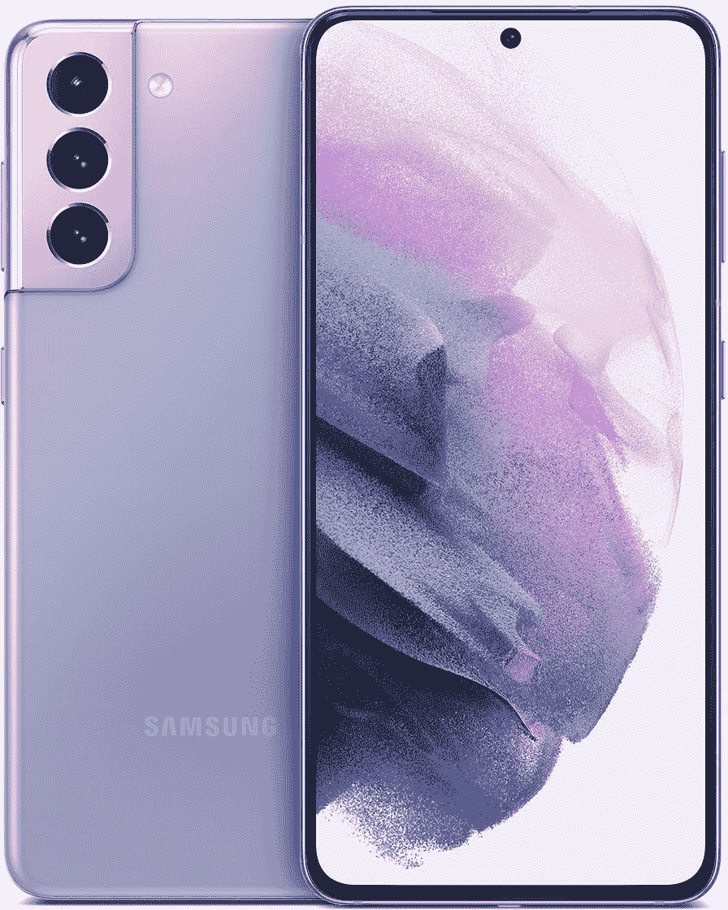

# 三星现在以更低的价格出售翻新的 Galaxy S21 手机

> 原文：<https://www.xda-developers.com/samsung-renewed-galaxy-s21/>

三星去年发布了 Galaxy S21、Galaxy S21 Plus 和 Galaxy S21 Ultra，这些产品继续成为该公司的旗舰设备，直到 2 月份的 [Galaxy S22 系列](https://www.xda-developers.com/samsung-galaxy-s22-vs-samsung-galaxy-s22-plus-vs-samsung-galaxy-s22-ultra/)问世。现在，该公司已经销售 S21 系列一年多了，并且可能有许多来自 S22 以旧换新的现货，三星已经开始以较低的价格销售翻新版本。

三星的“翻新”商店已经存在多年了，但从周五开始，该公司开放了 Galaxy S21 型号的预购——是的，是一年前的手机预购。128GB 存储的 Galaxy S21 基本款售价 675 美元(比新的建议零售价低 124 美元)，128GB 存储的 Galaxy S21 Plus 售价 850 美元(比建议零售价低 149 美元)，Galaxy S21 Ultra 128GB 售价 1000 美元(比建议零售价低 200 美元)。值得注意的是，Galaxy S21 FE(“粉丝版”)尚未上市。

 <picture></picture> 

Samsung Galaxy S21

三星现在出售翻新的 Galaxy S21 手机，起价 675 美元。

“翻新”计划比大多数翻新手机更接近新的智能手机体验。设备获得全新的电池和 IMEI 号码，预装最新的软件更新，以及“三星工厂工程师的 132 点质量检查”新设备也享有与新设备相同的 1 年保修期。

翻新设备通常是*节省购买智能手机资金的一个好方法，但也许由于彻底的维修和检查过程，翻新的 Galaxy S21 系列非常接近你会为一部全新的 Galaxy S22 手机支付的费用。例如，入门级的 Galaxy S22 现在是[700 美元](https://www.amazon.com/SAMSUNG-Smartphone-Unlocked-Brightest-Processor/dp/B09MVZSBB7?tag=xda-57kbmar-20&ascsubtag=UUxdaUeUpU40969&asc_refurl=https%3A%2F%2Fwww.xda-developers.com%2Fsamsung-renewed-galaxy-s21%2F&asc_campaign=Short-Term)，只比翻新的 Galaxy S21 贵 25 美元。*

不过，三星将在几天内加大优惠力度——从现在起到 4 月 21 日，如果你在任何时候购买一台手机，你将获得 100 美元的三星商店积分。在三星的网站上还有一些 Galaxy S21 系列的外壳和配件库存,你可以使用这些信用，或者可以用于 Galaxy Buds 或其他设备。