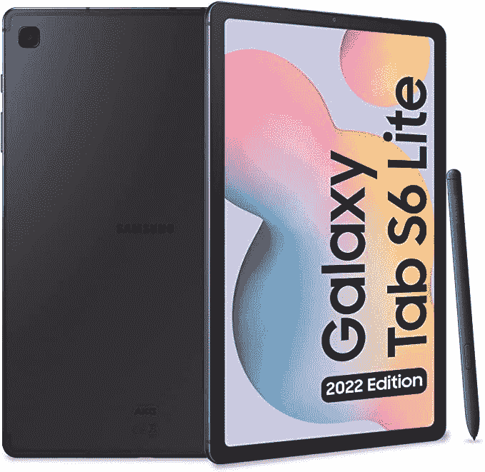

# 三星在一些市场推出了经过改进的 Galaxy Tab S6 Lite

> 原文：<https://www.xda-developers.com/samsung-revamped-galaxy-tab-s6-lite-2022-launched/>

# 三星在一些市场推出了经过改进的 Galaxy Tab S6 Lite

三星推出了一款经过改进的 Galaxy Tab S6 Lite 2022，采用高通的骁龙 720G SoC 和一款基于 Android 12 的 UI 4。

三星在一些市场推出了价格实惠的 Galaxy Tab S6 Lite 的改进版。新的 Galaxy Tab S6 Lite (2022)本质上是相同的设备，具有新的 SoC、额外的 RAM/存储变体和更新的软件。根据亚马逊意大利的官方产品清单，Galaxy Tab S6 Lite (2022)封装了高通的骁龙 720G 芯片，而不是三星的内部 Exynos 9611。因此，购买者应该期待新版本的性能稍有提高。

## 三星 Galaxy Tab S6 Lite (2022):规格

| 

规格

 | 

此处为设备全名

 |
| --- | --- |
| **尺寸&重量** | 

*   244.5 x 154.3 x 7.0 毫米
*   467 克

 |
| **显示** | 

*   10.4 英寸 TFT 液晶显示器
*   2000 x 1200

 |
| **SoC** | 高通骁龙 720G |
| **风筒&储存** | 

*   4GB 内存+ 64GB 存储
*   4GB + 128GB

 |
| **电池** | 7040 毫安时 |
| **后置摄像头** | 800 万像素 |
| **前置摄像头** | 5MP |
| **端口** |  |
| **连通性** | 

*   无线保真
*   蓝牙
*   LTE(可选)

 |
| **软件** | 一个基于 Android 12 的 UI 4 |
| **其他特征** | 包括钢笔 |

* * *

和它的前辈一样，更新的 Galaxy Tab S6 Lite (2022)有 4GB 内存和 64GB 存储基础版本，在€的售价为 399.90 英镑。此外，三星还以€50 英镑的溢价提供 128GB 的版本。这些价格仅适用于 Wi-Fi 机型。LTE 版本目前仅在€459.90 的基本 RAM/存储配置中可用。

 <picture></picture> 

Samsung Galaxy Tab S6 Lite (2022)

三星 Galaxy Tab S6 Lite (2022)自带三星基于 [Android 12](https://www.xda-developers.com/android-12/) 的 One UI 皮肤。相比之下，基于 Android 10 推出了 One UI 2.0 的老款机型。光是更新的软件就让它非常划算，因为这个价格段的大多数其他平板电脑都配有旧版本的安卓系统。

## 定价和可用性

目前，三星尚未分享 Galaxy Tab S6 Lite (2022)在所有地区的定价和可用性细节。这款平板电脑目前已在亚马逊意大利网站上接受预购，不久将在更多市场上市。如果你一直在考虑为自己或朋友买一台价格实惠的 Android 平板电脑，你可以通过下面提供的链接订购 Galaxy Tab S6 Lite (2022)。这款平板电脑有一种牛津灰色配色，盒子里还有一支 S 笔。

 <picture></picture> 

Samsung Galaxy Tab S6 Lite (2022)

##### 三星 Galaxy Tab S6 Lite

三星 Galaxy Tab S6 Lite (2022)本质上是同一款平板电脑，采用了新的骁龙 SoC 和更新的软件。