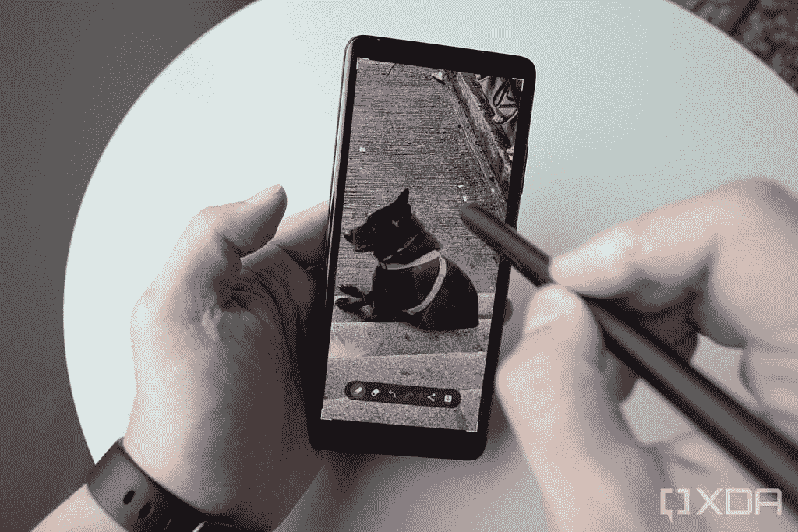
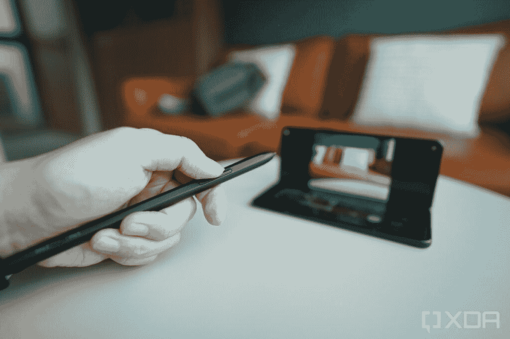

# 三星的笔临审查:一个手写笔统治星系

> 原文：<https://www.xda-developers.com/samsung-s-pen-pro-review/>

三星 Galaxy Z Fold 3 继承了已经非常优秀的 Fold 2，并增加了一些改进和完善，包括更坚固的材料、防水和手写笔输入支持。在你开始使用 Galaxy Z Fold 3 的那一刻，前两次升级会立即显而易见。但是使用手写笔——更好的说法是“S 笔”——需要单独购买。

三星在 Galaxy Z Fold 3 的同时发布了两款手写笔——S Pen Fold Edition 和 [S Pen Pro](https://www.xda-developers.com/samsung-s-pen-pro/) 。Fold Edition 是一个“哑”手写笔，这意味着它除了手写笔输入之外没有提供其他功能，而且它只适用于 Galaxy Z Fold 3。与此同时，S Pen Pro 可以与 Galaxy Z Fold 3 以及三星现有的所有支持触控笔的产品配合使用。换句话说，S Pen Pro 就是通用的三星 S Pen。

S Pen Pro 搭配 Galaxy Z Fold 3 和 Galaxy S21 Ultra 表现如何？

 <picture></picture> 

Galaxy S21 Ultra (left); S Pen Pro; and Galaxy Z Fold 3 (right).

### 与 S Pen Pro 兼容的三星设备列表。单击以展开

以下是兼容设备的列表:

*   银河 Z 折 3
*   银河 S21 Ultra
*   银河笔记系列
*   Galaxy Tab S7 FE
*   Galaxy Tab S7/7+版本
*   Galaxy Tab S6 Lite
*   银河平板 S6
*   银河标签 S4
*   银河标签 S3
*   Galaxy Tab Active Pro
*   Galaxy Tab Active 3
*   Galaxy Tab Active 2
*   银河标签激活
*   Galaxy Tab A 8.0 2019 带 S Pen
*   Galaxy Tab A 10.1 2016 带 S Pen
*   Galaxy Tab A 9.7 带 S Pen
*   Galaxy Tab A 8.0 2015 带 S Pen
*   银河笔记 Pro - 12.2
*   Galaxy Note 8.0
*   Galaxy Note 10.1 2012/2014
*   Galaxy Book Pro 360
*   Galaxy Book Flex 2
*   Galaxy Book Flex S Pen
*   Galaxy Book 柔性 5G
*   Galaxy Book Flex α S 笔
*   银河之书 10.6
*   银河之书 12.0
*   Chromebook 加 V2
*   Chromebook Pro
*   笔记本 7 旋转
*   笔记本 S51 笔
*   笔记本 9 支笔
*   笔记本 9 专业版

## S Pen Pro:设计

S Pen Pro 明显比以前的 S Pen 厚——不仅是以前的 Note 手机附带的 petite S Pens，而且 S Pen Pro 比同样为 Galaxy S21 Ultra 和 Galaxy Tab S7 设计的 S Pen 更厚。不过，14g 的重量足够轻，使用起来没有问题。它肯定比 Galaxy Note 手机自带的微型超薄 S 笔更容易握持和使用。

触控笔由塑料制成，但有一层柔软的哑光涂层，让它有点握感。它大多是圆形的，一边是平的，以防止它从桌子上滚下来。在平坦的侧面旁边是两个移动部件——一个用于在“Z 折叠”或“S 笔”模式之间切换的拨动开关(稍后将详细介绍),以及一个带有两个可点击部件的单个按钮，用于蓝牙控制。底端是可伸缩的橡胶尖(如果压得太用力)，以防止损坏 Galaxy Z Fold 3 的可折叠屏幕。

在 S Pen Pro 的顶端是一个可移动的尖端，露出一个 USB-C 端口用于充电。这就是这款手写笔与其他 S Pens 的区别——它有自己的电池和内存，因此它支持三星在每台支持它的设备上的“Air Actions”蓝牙手势(如 Galaxy Note 20 Ultra、Galaxy Tab S7 等)，它甚至可以将内容从一台设备复制并粘贴到另一台设备上。S Pen Pro 充满电需要 50 分钟，之后手写笔可以使用 16 天左右。注意，S Pen Pro 没有 USB 线，所以如果你身边没有 USB 线，请确保你也有一根 USB C 线。

零售包装中包括一个人造革套和三个额外的橡胶头。这种套管感觉很好，可以防止软橡胶尖，但需要它的原因是 S Pen Pro 有一个缺陷——它不能磁性附着或放置在任何现有的三星设备中。例如，Galaxy Z Fold 3 没有空间容纳 S Pen Pro 而且以前的 Galaxy Note 手机中的 S Pen 插槽显然对这种触控笔来说太小了。

## 在 Galaxy Z Fold 3 和 Galaxy S21 Ultra 上注册输入

那么 S Pen Pro 在 Galaxy Z Fold 3 上的表现如何呢？几年前，可折叠手机屏幕被认为非常脆弱，可能会被指甲划伤，这比我们任何人想象的都要好。三星在 Galaxy Z Fold 3 的屏幕上应用了新的“可拉伸 PET”(聚对苯二甲酸乙二醇酯)薄膜材料，与之前的任何可折叠材料相比，感觉更少塑性，更接近玻璃，因此，S Pen Pro 的尖端可以平滑地滑动。延迟足够低，所以不成问题，经过近一周的测试，我的 Fold 3 屏幕仍然完好无损，没有一丝划痕。

 <picture></picture> 

Sketching on the Galaxy Z Fold 3 with the S Pen Pro.

然而，这种体验仍然比不上在 Galaxy Tab S7 上使用 S Pen。我的抱怨主要是折痕。我不仅能感觉到笔尖划过锯齿状凹槽时水平笔画的轻微中断，而且在凹槽周围输入有时也不会正确记录。这是因为三星不得不围绕屏幕的折叠部分开展工作。

据 *[The Verge](https://www.theverge.com/22619139/samsung-galaxy-z-fold-3-flip-screen-durability-waterproof-aluminum)* 报道，Galaxy Z Fold 3 的显示面板下面的 Wacom 数字化仪实际上是两个独立的部分，并没有覆盖实际的折痕。相反，三星使用软件智能来猜测和预测 S Pen Pro(或 S Pen Fold Edition)在跨越这一差距时正在做什么。这就解释了当我试图画出折痕时偶尔会打嗝的原因。

屏幕的折叠特性为传统的 S Pen 体验增添了另一个亮点。由于 Galaxy Z Fold 3 屏幕的独特性质，三星无法使用它以前在所有非折叠设备上使用的相同数字化仪。这解释了为什么 S Pen Pro 有前面提到的拨动开关。为了与 Galaxy Z Fold 3 配合使用，S Pen Pro 需要处于“Z Fold”模式。对于任何其他支持 S Pen 的三星设备，手写笔都必须切换到“S Pen”模式。

事实上，每次我把 S Pen 从 Galaxy Z Fold 3 屏幕带到 Galaxy S21 Ultra 屏幕时，我都需要切换开关，这感觉有点笨拙。我不禁想到，如果苹果生产了 S Pen Pro，它可能会找到一种自动切换模式的方法，或者切换的动作可能会更直观，比如双击手写笔的下尖。

 <picture></picture> 

S Pen Pro with a Galaxy S21 Ultra.

将 S Pen Pro 与 Galaxy S21 Ultra 配合使用是一种无缝体验

但无论如何，将 S Pen Pro 与 Galaxy S21 Ultra 配合使用是一种无缝体验，感觉很像以前 Galaxy Note 手机上的 S Pen 体验。前面提到的在屏幕不平坦的地方奔跑的问题在 Galaxy S21 Ultra 上显然不是问题。

## Galaxy Z Fold 3 和 Galaxy S21 Ultra 的软件功能

由于 S Pen Pro 并不像 Galaxy Note 20 的笔那样专门与一台设备关联，因此需要一个设置过程。当我第一次启动 S Pen Pro 时，Galaxy Z Fold 3 显示了一个屏幕提示让我连接。这是一个一次性的过程，但如果我将 S Pen Pro 带到另一台设备上，并将其带回 Fold 3，我经常需要点击一次蓝牙配对按钮来触发配对。如果我在 Galaxy S21 Ultra 上使用 S Pen Pro，也需要同样的操作。

Galaxy Note 9 最早推出的各种空中动作和蓝牙遥控手势都在这里。例如，在相册中，我可以按下 S Pen Pro 的蓝牙按钮，并向左或向右滑动手写笔来循环浏览相册。在相机应用程序中，我可以使用 S Pen 远程切换拍摄模式和相机。

 <picture></picture> 

Controlling the Galaxy Z Fold 3's cameras with the S Pen Pro.

这些远程相机控制，以及 Galaxy Z Fold 3 由于后置相机的“灵活模式”而可以充当自己的三脚架，使 Galaxy Z Fold 3 成为一种非常容易的设备，可以在与朋友或家人聚会时拍摄集体照片。

Galaxy Note 的笔专用 UX 在 Galaxy Z Fold 3 和 Galaxy S21 Ultra 上都有。将 S Pen Pro 悬停在照片库中的视频缩略图上，视频会弹出并自动播放。抓取具有独特形状的屏幕截图就像手腕轻弹一样简单。

三星的文字转文本算法非常有效。即使我的笔迹很乱，Galaxy Z Fold 3 和 Galaxy S21 Ultra 也可以将我的笔迹转化为文本，我估计准确率为 85%。然而，我几乎没有使用这个功能，因为我的打字速度比我用铅笔写单词的速度要快得多。但它是为那些仍然认为笔更强大的人准备的。

一个失去了一些可用性的功能是“屏幕关闭备忘录”在 Galaxy Note 手机上，如果我在手机锁定时拔出 S Pen，黑屏会立即变成一个数字记事本，我在上面记下的任何笔记都会保存到三星的 notes 应用程序中，甚至可以被钉在永远打开的显示屏上。当我需要快速提醒自己，比如说，一小时后去取要洗的衣服，或者记得在回家的路上买鸡蛋时，这非常有用。

但是在 Galaxy Z Fold 3 上，S Pen 只在内部大显示屏上起作用，**在外盖显示屏上不起作用。这意味着你必须打开 Galaxy Z Fold 3 才能访问屏幕关闭备忘录，由于打开手机是双手操作，这使得整个过程不那么快速和容易访问。**

## 如果你沉浸在三星的生态系统中，S Pen Pro 是一个很好的选择

由于 Galaxy Z Fold 3 没有地方存放 S Pen Pro，我发现自己经常把它留在家里，因为当我外出时，不值得麻烦地携带一个单独的项目。如果我回到家，想要画草图或记笔记，我有更大屏幕的平板电脑，可以提供更好的画布。换句话说，我对 Z Fold 3 的 S Pen Pro 并没有太大的用处。然而，这并不是说我发现新的 S 笔支持是一个噱头。我为三星在 Galaxy Z Fold 3 中加入这一功能而鼓掌，因为它只是为一款昂贵的设备增加了更多的多功能性和用例。

对于那些沉浸在三星生态系统中的人来说，S Pen Pro 是一个值得购买的产品

S Pen Pro 是一个值得购买的产品，尤其是对于那些沉浸在三星生态系统中的人来说，因为能够在 Galaxy Book Pro、Galaxy Z Fold 3 以及未来的三星智能手机(如下一款顶级 Galaxy S22 设备)上使用一支手写笔是真正有用的。我希望我可以在 iPad、iPhone 和 MacBook 上使用 Apple Pencil。

如果你没有三星平板电脑或笔记本电脑，并计划只使用触控笔来操作 Galaxy Z Fold 3，那么我认为更小更便宜的 S Pen Fold Edition 是一个更好的选择——除非你真的需要蓝牙遥控器。

 <picture></picture> 

Samsung S Pen Pro

##### 三星 S Pen Pro

S Pen Pro 是三星的一款优质手写笔，可以与 Galaxy Z Fold 3 和其他几款三星平板电脑和笔记本电脑配合使用。

 <picture></picture> 

Samsung Galaxy Z Fold 3

##### 三星 Galaxy Z Fold 3

Galaxy Z Fold 3 是三星最新的可折叠手机，支持 S Pen。