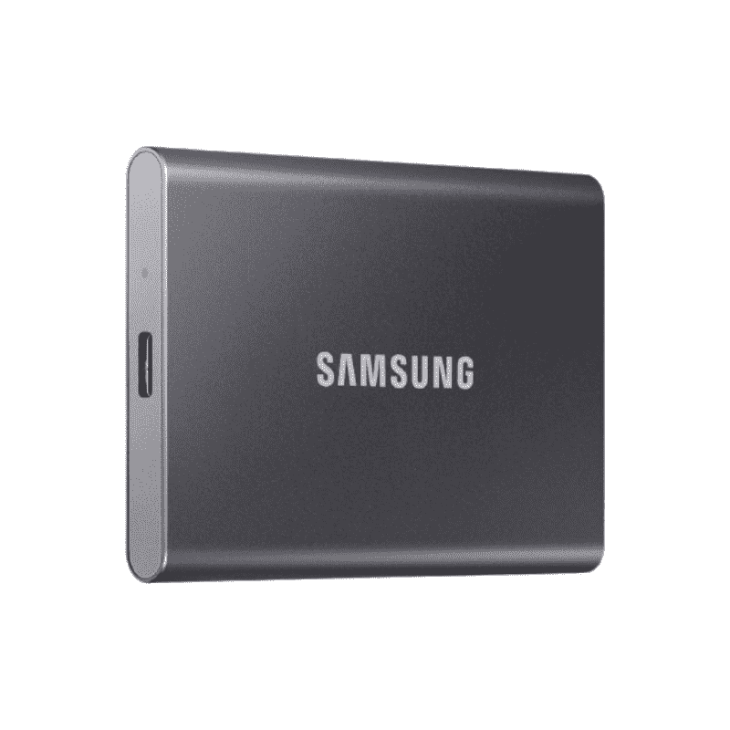

# 三星的紧凑型 T7 2TB 外置固态硬盘现在限时 35 折

> 原文：<https://www.xda-developers.com/samsung-t7-external-ssd-discount/>

 <picture></picture> 

Samsung T7 1TB SSD

##### 三星 T7

如果你正在寻找一个紧凑的 SSD 驱动器，三星 T7 是一个非常可靠的选择，具有良好的读写速度。

如果你一直在寻找一个外部存储选项，不用再找了，因为三星的 T7 外部固态硬盘是可用的[最佳选项](https://www.xda-developers.com/best-portable-ssd/)之一。这款硬盘外形小巧、时尚，其性能数据足以支撑其较高的价格。令人欣慰的是，这款硬盘现在正在三星的假期促销活动中出售，限时降价 35%。

三星 T7 drive 采用坚固的铝制一体式外壳，可以抵抗碰撞和跌落，甚至可以承受从高达 6 英尺的高度跌落。该外壳还具有先进的散热解决方案，使用三星的动态热防护装置，保持冷却以实现最佳性能。说到数据，我们看到的是每秒 1，050 MBs 的读取速度，每秒 1，000 MBs 的写入速度。

在很大程度上，这是一个非常好的驱动器，它很苗条，但是有很多性能和功能。T7 驱动器有三种大小:500GB、1TB 和 2TB。2TB 型号目前降价 35%，降至 150 美元。1TB 的型号也以 100 美元的价格出售，而 500GB 的型号仅售 75 美元。您可以为每个选项选择多种颜色，驱动器有金属红、靛蓝色和泰坦灰。

T7 驱动器有三年的有限保修，但三星没有列出其驱动器的平均故障时间(MTTF)。但是，作为一家大型存储制造商，T7 应该相当可靠。如果有兴趣，你可以直接从三星那里购买，但一定要快，因为销售时间有限。