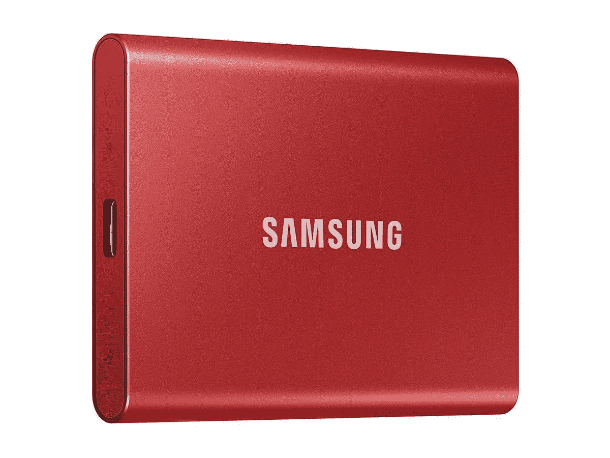

# 立即购买 2TB 三星 T7 外置固态硬盘，仅需 176 美元

> 原文：<https://www.xda-developers.com/samsung-t7-ssd-2tb-deal-march-2022/>

无论您身在何处，外置硬盘都是使用较大(或更多)文件的绝佳方式，尤其是速度更快的固态外置硬盘。无论您是否耗尽了笔记本电脑的存储空间，您是否需要一种方法将大文件从一个设备快速移动到另一个设备，或者出于其他原因，2TB 三星 T7 便携式固态硬盘可能正是您所需要的。这款硬盘现在以 176 美元的价格出售，比通常的价格节省了 44 美元，比最初的建议零售价节省了 154 美元。

三星 T7 便携式固态硬盘是一款紧凑型外置固态硬盘，有多种容量可供选择，但 2TB 硬盘似乎是目前唯一一款在售的硬盘。它有一个用于连接的 UBS 3.2 Gen2 Type-C 端口，三星在盒子中包括用于连接其他 Type-C 设备(现代笔记本电脑、Android 平板电脑等)的电缆。)或标准 USB 型端口。

这款硬盘的性能远远高于普通闪存驱动器，三星广告的读取速度高达 1，050 MB/s，写入速度高达 1，000 MB/s。大多数评论称实际速度略低——[*PCMag*报告的读取速度约为 958MB/s，写入速度约为 921 MB/s](https://www.pcmag.com/reviews/samsung-portable-ssd-t7)——但这仍然比普通 USB 驱动器或 SATA 3 内置 SSD 快得多。除非您正在处理大量的视频文件或其他需要尽可能多的数据带宽的东西，否则在这里应该没问题。

 <picture></picture> 

Samsung T7 SSD (2TB)

##### 三星 T7 便携式固态硬盘

当你在收银台输入代码 **EMCBQ2438** 时，这款紧凑的 2TB 外置固态硬盘在新蛋的价格降至 176 美元。您可能需要创建一个(免费的)新蛋帐户来使用代码。

除了数据传输速度之外，这款硬盘体积小巧，可以轻松放入口袋或小包里，而且没有外置机械硬盘那么重。三星还表示，这款硬盘可以轻松承受 6 英尺高的跌落，并享有三年有限保修。

如果你正在寻找内部固态硬盘而不是外部驱动器，请查看我们的[最佳固态硬盘](https://www.xda-developers.com/best-ssds-sata-nvme/)综述。