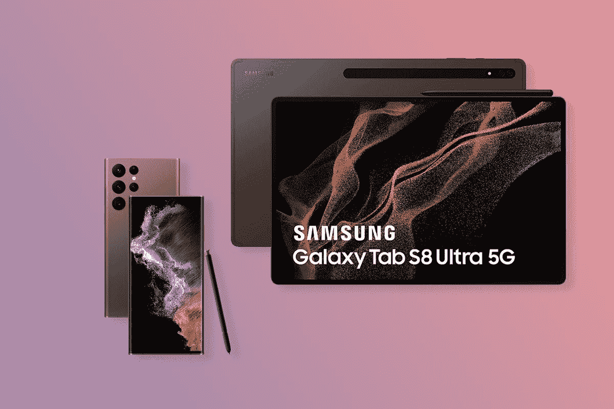

# Galaxy Unpacked 2022:如何观看 Galaxy S22 系列和 Galaxy Tab S8 系列发布会

> 原文：<https://www.xda-developers.com/samsung-unpacked-galaxy-s22-series-galaxy-tab-s8-series-launch-event/>

三星将于 2 月 9 日，即今天，举办 2022 年的首次大型 Galaxy Unpacked 活动。在此次活动中，该公司将推出其下一代旗舰产品 [Galaxy S22 系列](https://www.xda-developers.com/samsung-galaxy-s22/)和 Galaxy Tab S8 系列。在过去的几个月里，我们已经看到了不少关于即将到来的设备的泄露和传言，这些消息已经证实三星将在即将到来的活动中推出总共六款设备，包括三款 Galaxy S22 系列智能手机和三款 Galaxy Tab S8 系列平板电脑。由于这些泄露，我们已经对所有即将到来的设备有了相当多的了解。然而，可能还有很多东西有待发现。这就是我们非常期待观看发布会现场直播的原因。如果你也对即将到来的 Galaxy Unpacked 活动感到兴奋，以下是你可以现场观看的方式。

## 即将到来的 Galaxy Unpacked 活动何时开始？

三星将于 2022 年 2 月 9 日(周三)直播即将举行的 Galaxy Unpacked 活动。活动将于以下时间开始:

*   西海岸:太平洋时间早上 7 点
*   东海岸:东部时间上午 10:00
*   英国:英国标准时间下午 3 点
*   印度:印度标准时间晚上 8:30
*   中国:中国标准时间晚上 11:00

为了确保您不会错过此次活动，请点击下方嵌入的视频，然后点击*设置提醒*按钮。然后，您应该会在事件即将开始之前收到通知。或者，您可以前往三星的[网站](https://shop-links.co/1765873233562018722?u1=0d033f5d-3a7b-44bb-9921-764bba73c132)，点击横幅中的 [*立即预订*](https://shop-links.co/1765873233562018722?u1=0d033f5d-3a7b-44bb-9921-764bba73c132) 按钮，成为首批获得新款 Galaxy S22 系列和 Galaxy Tab S8 系列设备之一的用户。

## 2022 年 2 月的 Galaxy Unpacked 有什么值得期待的？

如前所述，我们预计三星将在即将举行的 Galaxy Unpacked 活动中推出 Galaxy S22 系列和 Galaxy Tab S8 系列。最近的消息显示，该公司将推出三款新设备作为 Galaxy S22 系列的一部分——普通 Galaxy S22、Galaxy S22 Plus 和全新的 Galaxy S22 Ultra。该公司还将在活动中推出三款旗舰平板电脑，即 Galaxy Tab S8、Galaxy Tab S8 Plus 和 Galaxy Tab S8 Ultra。三星可能会给我们带来一些额外的惊喜，所以请务必收听直播。

 <picture></picture> 

Reserve the upcoming Galaxy S22 and Galaxy Tab S8 series devices

在观看发布会直播的同时，预订即将推出的 Galaxy S22 系列和 Galaxy Tab S8 系列设备，并解锁一些独家优惠。

## Galaxy S22 系列和 Galaxy Tab S8 系列发布会在哪里观看？

三星将在其网站上直播 Galaxy S22 系列和 Galaxy Tab S8 系列发布会。你可以点击[这个链接](https://shop-links.co/1765478042394169573?u1=db49b465-d4be-42ac-bc42-661fdfd6e34d)观看赛事直播。此外，该公司还将在其[官方 YouTube 频道](https://www.youtube.com/c/Samsung/videos)上直播该活动。您可以点击下面嵌入的视频来设置提醒，并在直播开始前收到通知。